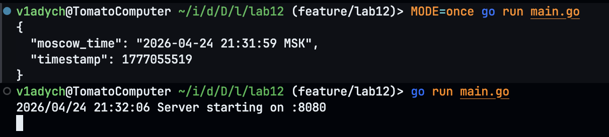
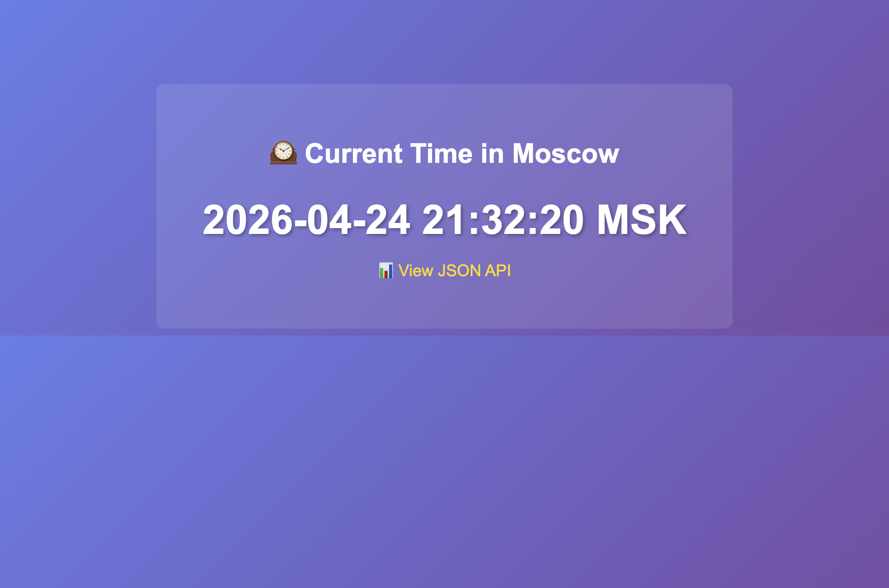
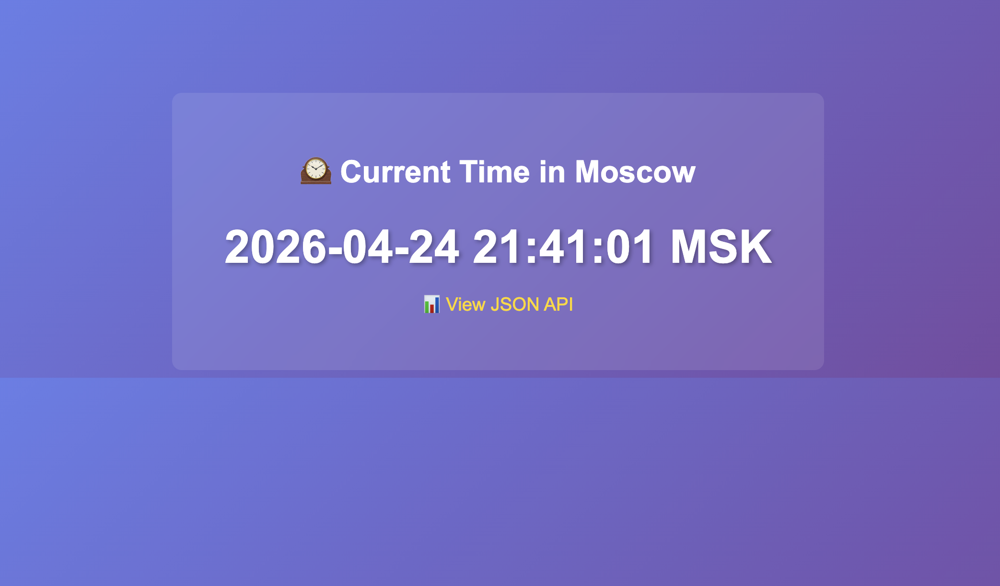

### Task 1


#### CLI mode

`MODE=once` runs the application in one-shot mode: it prints JSON once and exits.



#### Server mode

Without `MODE=once`, the same `main.go` starts a regular HTTP server on port `8080`.



#### How the same `main.go` works in three contexts

- **CLI mode**: if `MODE=once` is set, the program prints JSON once and exits
- **Traditional server mode**: if it is not in CLI or WAGI mode, it runs `net/http`
- **WAGI mode**: it detects CGI-style environment variables and writes the HTTP response to `STDOUT`

So the same source file can be used for normal Go server execution, one-shot benchmarking mode, and WASM/WAGI execution.

### Task 2

#### Build and test traditional container

```bash
$ docker build -t moscow-time-traditional -f Dockerfile .
[+] Building 11.9s (11/11) FINISHED
...
```

```bash
$ docker run --rm -e MODE=once moscow-time-traditional
{
  "moscow_time": "2026-04-24 21:34:28 MSK",
  "timestamp": 1777055668
}
```

```bash
$ docker run --rm -p 8080:8080 moscow-time-traditional
2026/04/24 18:34:33 Server starting on :8080
```

Browser screenshot:



#### Binary size

```bash
$ ls -lh moscow-time-traditional
-rwxr-xr-x@ 1 v1adych  staff   4.4M Apr 24 21:34 moscow-time-traditional
```

#### Image size

```bash
$ docker images moscow-time-traditional
REPOSITORY                TAG       IMAGE ID       CREATED          SIZE
moscow-time-traditional   latest    63bfe6c89e4f   56 seconds ago   6.52MB
```

```bash
$ docker image inspect moscow-time-traditional --format '{{.Size}}'
1911870
```

```bash
$ docker image inspect moscow-time-traditional --format '{{.Size}}' | awk '{print $1/1024/1024 " MB"}'
1.8233 MB
```

#### Startup benchmark

```bash
$ bash ../script.sh
Average: 0.178521 seconds
```

#### Memory usage

```bash
$ docker stats test-traditional --no-stream
CONTAINER ID   NAME               CPU %     MEM USAGE / LIMIT     MEM %     NET I/O         BLOCK I/O   PIDS
e0fa54a29060   test-traditional   0.00%     2.879MiB / 7.654GiB   0.04%     1.17kB / 126B   0B / 0B     5
```

### Current summary

- Binary size: `4.4M`
- Image size from `docker images`: `6.52MB`
- Image size from `docker image inspect`: `1911870` bytes (`1.8233 MB`)
- Average startup time across 5 runs: `0.178521 seconds`
- Memory usage: `2.879MiB / 7.654GiB`

### Task 3

#### TinyGo version

```bash
$ docker run --rm tinygo/tinygo:0.39.0 tinygo version
tinygo version 0.39.0 linux/arm64 (using go version go1.25.0 and LLVM version 19.1.2)
```

#### Build WASM binary

```bash
$ docker run --rm \
  -v "$(pwd):/src" \
  -w /src \
  tinygo/tinygo:0.39.0 \
  tinygo build -o main.wasm -target=wasi main.go
```

```bash
$ ls -lh main.wasm
-rwxr-xr-x  1 v1adych  staff   2.3M Apr 24 21:51 main.wasm

$ file main.wasm
main.wasm: WebAssembly (wasm) binary module version 0x1 (MVP)
```

#### Build WASM OCI image

```bash
$ docker buildx build \
  --platform=wasi/wasm \
  -t moscow-time-wasm:latest \
  -f Dockerfile.wasm \
  --output=type=oci,dest=moscow-time-wasm.oci,annotation=index:org.opencontainers.image.ref.name=moscow-time-wasm:latest \
  .
[+] Building 0.1s (5/5) FINISHED
...
```

```bash
$ ls -lh moscow-time-wasm.oci
-rw-r--r--@ 1 v1adych  staff   826K Apr 24 21:51 moscow-time-wasm.oci
```

#### ctr setup and import

```bash
$ ctr version
Client:
  Version:  2.2.1
  Revision:
  Go version: go1.24.4

Server:
  Version:  2.2.1
  Revision:
  UUID: 121bfdb2-7fb1-427a-95e5-f5b8bd74a33a
```

```bash
$ cargo build --release -p containerd-shim-wasmtime
...
Finished `release` profile [optimized] target(s) in 1m 46s

$ ls -la /usr/local/bin/containerd-shim-wasmtime-v1
-rwxr-xr-x 1 root root 26210704 Apr 24 21:55 /usr/local/bin/containerd-shim-wasmtime-v1
```

```bash
$ ctr images import \
  --platform=wasi/wasm \
  --index-name docker.io/library/moscow-time-wasm:latest \
  /work/moscow-time-wasm.oci
docker.io/library/moscow time wasm:lates        saved
application/vnd.oci.image.manifest.v1+json sha256:42dc10e176aa0b619a3e7eafdabdd3a0a7cf8d290a6c1c1523749f599bba5cc7
Importing       elapsed: 0.0 s  total:   0.0 B  (0.0 B/s)
```

```bash
$ ctr images ls | grep moscow-time-wasm
docker.io/library/moscow-time-wasm:latest application/vnd.oci.image.manifest.v1+json sha256:42dc10e176aa0b619a3e7eafdabdd3a0a7cf8d290a6c1c1523749f599bba5cc7 819.9 KiB wasi/wasm -
```

#### ctr run result

```bash
$ ctr run --rm \
  --runtime io.containerd.wasmtime.v1 \
  --platform wasi/wasm \
  --env MODE=once \
  docker.io/library/moscow-time-wasm:latest wasi-once
ctr: failed to create shim task: Other: mount process exit unexpectedly, exit code: EINVAL: Invalid argument
```

```bash
$ ctr run --rm \
  --snapshotter native \
  --runtime io.containerd.wasmtime.v1 \
  --platform wasi/wasm \
  --env MODE=once \
  docker.io/library/moscow-time-wasm:latest wasi-once
ctr: failed to create shim task: failed to create container: intermediate process error cgroup error: io error: failed to write +io to /sys/fs/cgroup/cgroup.subtree_control: Operation not supported (os error 95)
```

```bash
$ ctr --debug run --rm \
  --snapshotter native \
  --runtime io.containerd.wasmtime.v1 \
  --platform wasi/wasm \
  --env MODE=once \
  docker.io/library/moscow-time-wasm:latest wasi-once
DEBU[0000] remote introspection plugin filters           filters="[type==io.containerd.snapshotter.v1, id==native]"
ctr: failed to create shim task: failed to create container: intermediate process error cgroup error: io error: failed to write +io to /sys/fs/cgroup/cgroup.subtree_control: Operation not supported (os error 95)
```

#### Current state for Task 3

- TinyGo version used: `0.39.0`
- WASM binary size: `2.3M`
- WASI OCI archive size: `826K`
- WASI image size from `ctr images ls`: `819.9 KiB`
- `ctr` image import worked
- `ctr run` did not work
- Startup benchmark: not available, because the container did not start properly
- Memory usage: `N/A`
- Same source code was used: `main.go`
- `ctr` was used for WASM execution attempts

### Task 4

#### Comparison table

| Metric | Traditional Container | WASM Container | Improvement | Notes |
| --- | --- | --- | --- | --- |
| **Binary Size** | `4.4M` | `2.3M` | `47.7% smaller` | From `ls -lh` |
| **Image Size** | `1.8233 MB` | `819.9 KiB` | `56.1% smaller` | Traditional from `docker image inspect`, WASM from `ctr images ls` |
| **Startup Time (CLI)** | `0.178521 s` | `N/A` | `N/A` | `ctr run` did not start properly |
| **Memory Usage** | `2.879MiB / 7.654GiB` | `N/A` | `N/A` | Not available |
| **Base Image** | `scratch` | `scratch` | Same | Both minimal |
| **Source Code** | `main.go` | `main.go` | Identical | Same file |
| **Server Mode** | `Works` | `Not demonstrated` | `N/A` | `ctr run` did not start properly |

#### Calculated improvement percentages

- Binary size reduction: `((4.4 - 2.3) / 4.4) × 100 = 47.7%`
- Image size reduction: `((1.8233 - 0.8007) / 1.8233) × 100 = 56.1%`
- Startup improvement: `N/A`
- Memory reduction: `N/A`

#### Analysis

**1. Binary Size Comparison**

The WASM binary is smaller than the traditional Go binary. TinyGo removes a lot of the normal Go runtime overhead and produces a more minimal output for WASI targets. I think this is the main reason for the size difference.

**2. Startup Performance**

For the traditional container, the measured average startup time in CLI mode was `0.178521 s`. For the WASM container, startup time could not be measured because `ctr run` did not start properly in my setup, so there is no reliable comparison value here.

**3. Use Case Decision Matrix**

I would choose WASM when smaller artifacts, portability, and sandboxed execution are more important than full Linux/container compatibility.

I would choose traditional containers when I need a more standard deployment model, full runtime compatibility, and fewer environment-specific issues.

#### Recommendations

- Use **traditional containers** for regular web services and when you want the most predictable behavior.
- Use **WASM** when you want smaller artifacts and are targeting an environment that supports WASM runtimes well.
- In this lab, both builds used the same `main.go`, which shows that the same source can target multiple execution environments.

