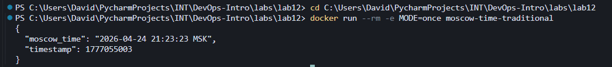
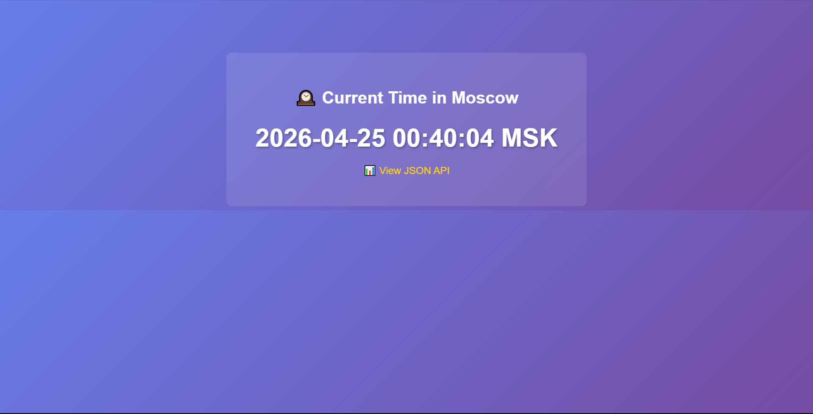
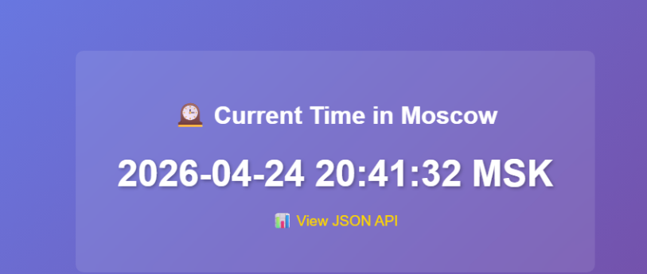

# Lab 12 Submission - WebAssembly Containers vs Traditional Containers

## Task 1 - Moscow Time Application

### Screenshot of CLI mode output (MODE=once)



### Screenshot of server mode running in browser



### Confirmation that work was done in labs/lab12/

All lab work was performed directly in the labs/lab12/ directory.

### Explanation of how one main.go works in three contexts

The same main.go detects its execution context at runtime:

- CLI mode: when MODE=once is set, the app prints one JSON response and exits.
- Traditional Docker server mode: when no special environment is set, the app starts a normal net/http server on port 8080.
- Spin/WAGI mode: when REQUEST_METHOD is present, the app handles one CGI-style request by writing HTTP headers and the response body to stdout.

The application uses time.FixedZone("MSK", 3*60*60), so it does not depend on an external timezone database.

## Task 2 - Traditional Docker Container

### Binary size from ls -lh moscow-time-traditional

```
4.5M moscow-time-traditional
```

### Image size from docker images and docker image inspect

```
docker images: moscow-time-traditional latest 6.79MB
docker image inspect: 2073216 bytes / 1.98 MiB
```

### Average startup time across 5 CLI mode runs

```
659.6 ms
```

### Memory usage from docker stats

```
3.098MiB / 7.36GiB
```

### Screenshot of application running in browser



## Task 3 - WASM Container

### TinyGo version used

```
tinygo version 0.39.0 linux/amd64 (using go version go1.25.0 and LLVM version 19.1.2)
```

### WASM binary size from ls -lh main.wasm

```
2.4M main.wasm
```

### WASI image size from ctr images ls

```
819.9 KiB
```

### Average startup time from ctr run benchmark

```
282.0 ms
```

### Why server mode does not work under ctr

Plain WASI Preview1 does not provide TCP socket support. When the WASM module runs through ctr without MODE=once, the Go net/http server tries to bind to port 8080, but the WASI runtime cannot provide a network device.

Observed output:

```
Server starting on :8080
Netdev not set
```

### Spin note

Server mode can be demonstrated with Spin using the same main.wasm. Spin provides the HTTP server layer and runs the module in WAGI mode through CGI-style environment variables and stdout.

### Memory usage reporting

Memory usage is N/A for the WASM container through ctr. The wasmtime runtime manages WASM memory differently from a traditional Linux container, so docker stats style memory reporting is not available.

### Same source code confirmation

The WASM build used the same labs/lab12/main.go source file as the traditional Docker build.

### ctr confirmation

The WASM image was imported and executed with containerd's ctr CLI using runtime io.containerd.wasmtime.v1.

## Task 4 - Performance Comparison and Analysis

### Complete comparison table

| Metric | Traditional Container | WASM Container | Improvement | Notes |
|---|---:|---:|---:|---|
| Binary Size | 4.48 MiB | 2.337 MiB | 47.8% smaller | Same main.go |
| Image Size | 1.98 MiB | 819.9 KiB | 59.5% smaller | Both use scratch |
| Startup Time (CLI) | 659.6 ms | 282.0 ms | 2.34x faster | Average of 5 runs |
| Memory Usage | 3.098 MiB | N/A | N/A | Not available through ctr |
| Base Image | scratch | scratch | Same | Both minimal |
| Source Code | main.go | main.go | Identical | Same file |
| Server Mode | Works with net/http | Not through plain ctr; works through Spin/WAGI | N/A | WASI Preview1 lacks sockets |

### Binary size comparison

The WASM binary is smaller because TinyGo targets constrained environments and includes a smaller runtime than the standard Go compiler. It removes unused runtime features and compiles only the subset needed by this application.

### Startup performance

WASM starts faster because it launches a small sandboxed module instead of starting a full traditional Linux container process. Traditional Docker startup includes container setup, filesystem setup, process isolation, and native Go runtime startup overhead.

### Recommendations

Choose WASM when fast startup, small artifacts, sandboxing, and short-lived event-driven execution are important. It is a good fit for CLI-style jobs, serverless handlers, edge workloads, and platforms such as Spin that provide an HTTP abstraction.

Choose traditional containers when the application needs long-running server processes, raw TCP/UDP networking, full operating system behavior, mature runtime metrics, or broad compatibility with existing production tooling.
