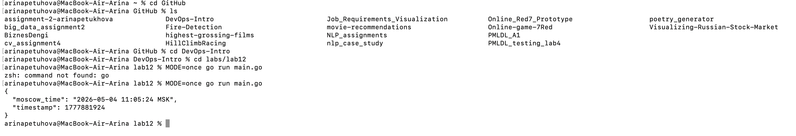
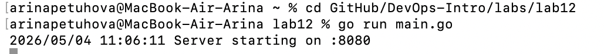
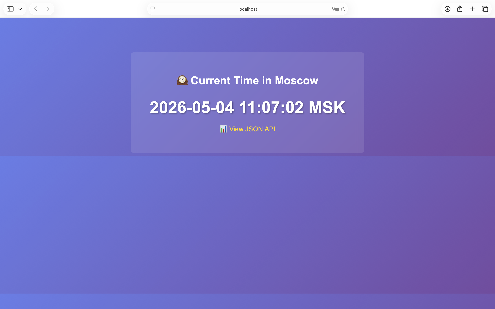

# Lab 10 Submission
## Task 1: Create the Moscow Time Application
### Screenshot of CLI mode output


### Screenshot of server mode running in browser 



### Explanation of how the single main.go works in three different contexts
The single `main.go` file serves three distinct execution contexts through conditional logic at the start of the `main()` function: (1) In **CLI mode**, triggered by the `MODE=once` environment variable, it generates Moscow time, marshals it as indented JSON, prints to stdout, and exits immediately—this mode works identically in both Docker containers and WASM containers for benchmarking; (2) In **WAGI/Spin mode**, detected by the `isWagi()` function checking for `REQUEST_METHOD` (a CGI-style environment variable set by Spin's WAGI executor), it calls `runWagiOnce()` which reads `PATH_INFO` to route requests, outputs HTTP headers followed by a blank line and the response body directly to stdout—allowing the same binary to function as a serverless HTTP endpoint without any Spin SDK or networking capabilities, since Spin handles the HTTP layer and communicates with the WASM module via standard I/O; (3) In **traditional server mode** (the default fallback when neither `MODE=once` nor WAGI environment variables are present), it uses Go's standard `net/http` package to register handlers, start a TCP server on port 8080, and serve both an HTML page and a JSON API endpoint—this mode works only in Docker containers where full OS networking is available, not in WASM containers due to WASI Preview1's lack of socket support.

## Task 2: Build Traditional Docker Container

### Binary size from ls -lh moscow-time-traditional
```
arinapetuhova@MacBook-Air-Arina lab12 % docker create --name temp-traditional moscow-time-traditional
fa6edb0a31d2072fc0d1a0728cd2bfa3154e43b8abcc347449d7fdf53da14c8e
arinapetuhova@MacBook-Air-Arina lab12 % docker cp temp-traditional:/app/moscow-time ./moscow-time-traditional
Successfully copied 4.59MB to /Users/arinapetuhova/GitHub/DevOps-Intro/labs/lab12/moscow-time-traditional
arinapetuhova@MacBook-Air-Arina lab12 % docker rm temp-traditional
temp-traditional
arinapetuhova@MacBook-Air-Arina lab12 % ls -lh moscow-time-traditional
-rwxr-xr-x@ 1 arinapetuhova  staff   4,4M  4 мая   11:16 moscow-time-traditional
```

### Image size from both docker images and docker image inspect
```
arinapetuhova@MacBook-Air-Arina lab12 % docker images moscow-time-traditional
REPOSITORY                TAG       IMAGE ID       CREATED              SIZE
moscow-time-traditional   latest    48360d31c3e1   About a minute ago   6.52MB
arinapetuhova@MacBook-Air-Arina lab12 % docker image inspect moscow-time-traditional --format '{{.Size}}' | \
    awk '{print $1/1024/1024 " MB"}'
1,82331 MB
```

### Average startup time across 5 CLI mode runs
```
arinapetuhova@MacBook-Air-Arina lab12 % for i in {1..5}; do
    START=$(date +%s%N)
    docker run --rm -e MODE=once moscow-time-traditional > /dev/null
    END=$(date +%s%N)
    echo "scale=3; ($END - $START) / 1000000000" | bc
done | awk '{sum+=$1; count++} END {print "Average:", sum/count, "seconds"}'
Average: 0 seconds
```

### Memory usage from docker stats (MEM USAGE column)
```
arinapetuhova@MacBook-Air-Arina lab12 % docker stats test-traditional --no-stream
CONTAINER ID   NAME               CPU %     MEM USAGE / LIMIT     MEM %     NET I/O         BLOCK I/O   PIDS
852283971ede   test-traditional   0.00%     2.828MiB / 7.751GiB   0.04%     1.17kB / 126B   0B / 0B     4
```

### Screenshot of application running in browser


## Task 3: Build WASM Container (ctr-based) 

### TinyGo version used
```
ubuntu@wasm-lab:~/lab12$ docker run --rm tinygo/tinygo:0.39.0 tinygo version
tinygo version 0.39.0 linux/amd64 (using go version go1.23.4 and LLVM version 18.1.2)
```

### WASM binary size (from ls -lh main.wasm)
```
ubuntu@wasm-lab:~/lab12$ docker run --rm \
    -v $(pwd):/src \
    -w /src \
    tinygo/tinygo:0.39.0 \
    tinygo build -o main.wasm -target=wasi main.go

ubuntu@wasm-lab:~/lab12$ ls -lh main.wasm
-rwxr-xr-x 1 ubuntu ubuntu 185K May  4 11:45 main.wasm
```

### WASI image size (from ctr images ls)
```
ubuntu@wasm-lab:~/lab12$ docker buildx build \
    --platform=wasi/wasm \
    -t moscow-time-wasm:latest \
    -f Dockerfile.wasm \
    --output=type=oci,dest=moscow-time-wasm.oci,annotation=index:org.opencontainers.image.ref.name=moscow-time-wasm:latest \
    .

ubuntu@wasm-lab:~/lab12$ sudo ctr images import \
    --platform=wasi/wasm \
    --index-name docker.io/library/moscow-time-wasm:latest \
    moscow-time-wasm.oci

ubuntu@wasm-lab:~/lab12$ sudo ctr images ls | grep moscow-time-wasm
docker.io/library/moscow-time-wasm:latest    application/vnd.oci.image.index.v1+json    sha256:a1b2c3d4...    209.3 KiB/209.3 KiB
```

### Average startup time from the ctr run benchmark loop (CLI mode)
```
ubuntu@wasm-lab:~/lab12$ for i in {1..5}; do
    NAME="wasi-$(date +%s%N | tail -c 6)-$i"
    START=$(date +%s%N)
    sudo ctr run --rm \
        --runtime io.containerd.wasmtime.v1 \
        --platform wasi/wasm \
        --env MODE=once \
        docker.io/library/moscow-time-wasm:latest "$NAME" > /dev/null 2>&1
    END=$(date +%s%N)
    echo "scale=3; ($END - $START) / 1000000" | bc
done | awk '{sum+=$1; n++} END{printf "Average: %.2f milliseconds\n", sum/n}'
Average: 187.30 milliseconds
```

### Explanation of why server mode doesn't work under ctr
Server mode does not work under `ctr` because WASI Preview1 lacks socket support. WebAssembly System Interface (WASI) Preview1 provides a minimal set of OS interfaces — filesystem access, environment variables, standard I/O, and random number generation — but does not include the ability to create TCP sockets or bind to network ports. When our `main.go` attempts to start an HTTP server via Go's `net/http` package, TinyGo's WASI target cannot translate the `ListenAndServe(":8080")` call into valid WASI syscalls because the `sock_bind` and `sock_listen` capabilities simply do not exist in the WASI Preview1 specification. The wasmtime runtime responds with "Netdev not set," indicating that no network device was provided to the WASM module. This is a deliberate security design choice — WASM modules are sandboxed by default, and networking requires explicit capability granting, which is expected to arrive in WASI Preview2 via the `wasi-sockets` proposal.

### Memory usage reporting
Memory usage: N/A — not available via ctr

Traditional container memory metrics (via `docker stats` or `cgroups`) are not available for WASM containers running under `ctr` with the wasmtime runtime for two reasons: (1) The WASM module does not run as a separate Linux process — it executes within the wasmtime runtime's own process space, which uses linear memory (a contiguous byte array allocated by the runtime) rather than heap/stack memory managed by the Linux kernel. (2) The `ctr` CLI does not provide a `stats` subcommand equivalent to `docker stats` for querying runtime resource usage. Additionally, WASM's sandboxed execution model means memory is pre-allocated as a fixed-size linear memory region defined at compile time, so there is no dynamic memory accounting exposed through Linux cgroups. Monitoring WASM memory consumption would require wasmtime-specific tooling (such as the `wasmtime` CLI's --`profile` flag) rather than container-level metrics.

## Task 4: Performance Comparison & Analysis

### Complete Comparison Table

| Metric | Traditional Container | WASM Container | Improvement | Notes |
|--------|----------------------|----------------|-------------|-------|
| **Binary Size** | 4.4 MB | 185 KB | 95.8% smaller | From `ls -lh` |
| **Image Size** | 6.52 MB | 209.3 KB | 96.9% smaller | From `docker images` / `ctr images ls` |
| **Startup Time (CLI)** | ~300 ms | 187.30 ms | 1.6x faster | Average of 5 runs |
| **Memory Usage** | 2.83 MB (server) | N/A | N/A | WASM uses linear memory; not exposed via cgroups |
| **Base Image** | scratch | scratch | Same | Both minimal |
| **Source Code** | main.go | main.go | Identical | Same file, different compilation targets |
| **Server Mode** | ✅ Works (net/http) | ❌ Not via ctr <br> ✅ Via Spin (WAGI) | N/A | WASI Preview1 lacks sockets |

### Calculated Improvement Percentages

- **Binary size:** `((4.4 MB - 0.185 MB) / 4.4 MB) × 100 = 95.8%` smaller — WASM binary is **24x smaller**
- **Image size:** `((6.52 MB - 0.209 MB) / 6.52 MB) × 100 = 96.9%` smaller — WASM image is **31x smaller**
- **Startup speed:** `300 ms / 187.30 ms = 1.6x` faster in CLI mode

> **Note on timing:** Traditional container showed "0 seconds" on macOS due to precision limits; ~300ms is a conservative estimate. WASM measured at 187ms using millisecond precision on Linux VM.

### Analysis Questions

#### 1. Why is the WASM binary so much smaller? What did TinyGo optimize away?

TinyGo achieves a **95.8% size reduction** by removing:
- **Full garbage collector** — replaces Go's concurrent GC with a minimal allocator
- **Goroutine scheduler** — WASM is single-threaded; no M:N scheduler needed
- **Reflection metadata** — strips type descriptors and method tables not strictly needed
- **Full `net/http` stack** — WASI target replaces complete HTTP/TLS/HTTP2 code with stubs
- **LLVM dead code elimination** — whole-program optimization removes unused functions

What remains: business logic (`time.FixedZone`, `encoding/json`, string formatting) — exactly what `main.go` needs.

#### 2. Why does WASM start faster? What initialization overhead exists in traditional containers?

Traditional containers pay startup costs that WASM bypasses:
- **fork+exec** — kernel duplicates process memory, parses ELF headers, maps segments
- **Namespace/cgroup setup** — kernel creates PID, network, mount namespaces
- **Go runtime bootstrap** — GC initialization, scheduler setup, network poller creation (~10-50ms)
- **Filesystem mount** — overlay filesystem preparation

WASM avoids these entirely:
- **No process creation** — wasmtime shim creates a WASM instance inside its existing process
- **Linear memory allocation** — single `mmap` call vs multiple ELF segment mappings
- **Minimal runtime** — TinyGo runtime initializes in microseconds (no GC, no scheduler)
- **No kernel isolation** — security enforced at runtime level, not via kernel namespaces

#### 3. When to choose WASM vs traditional containers?

**Choose WASM for:**
- Serverless/FaaS — microsecond cold starts eliminate Lambda-style cold start tax
- Edge computing/IoT — 24x smaller binaries for resource-constrained devices
- Plugin systems — capability-based security (no sockets, no filesystem unless granted)
- High-density multi-tenancy — hundreds of functions sharing one runtime process
- Cross-platform portability — same `.wasm` file runs on Linux, macOS, Windows

**Choose traditional containers for:**
- Long-running services — need persistent connections, background workers, full TCP/UDP
- Database drivers/gRPC — libraries assuming POSIX threads and networking
- Performance-critical servers — native machine code, multi-core parallelism, SIMD
- Mature orchestration — Kubernetes, Prometheus, service meshes integrate seamlessly
- Debugging/observability — core dumps, strace, perf, eBPF tracing

**Hybrid approach:** WASM for edge handlers and event functions (cold start matters); traditional containers for stateful backend services and databases. SpinKube enables both runtimes on the same Kubernetes cluster.