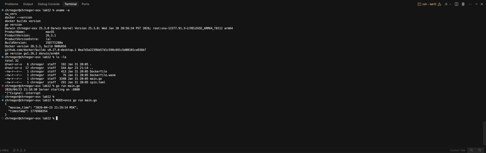
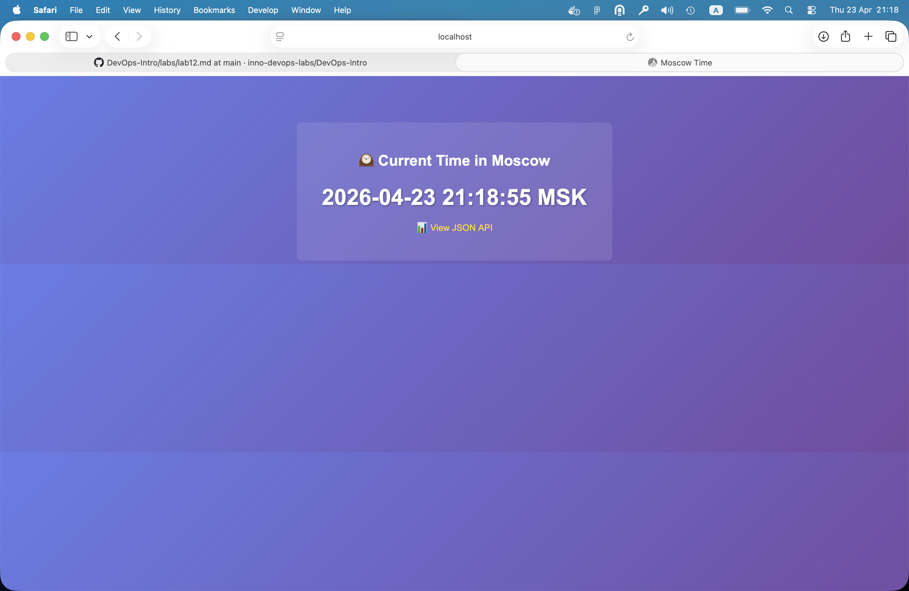
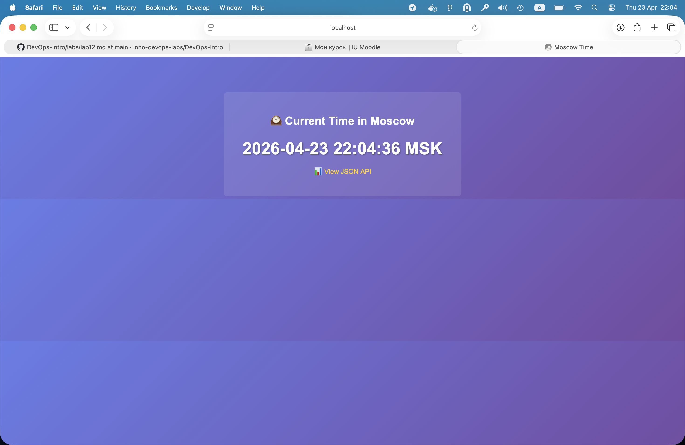

# Task 1

I worked directly in the `labs/lab12` directory.

Files in this directory:
```bash
ls -la
total 32
drwxr-xr-x   6 chrnegor  staff   192 Jan 31 20:05 .
drwxr-xr-x  17 chrnegor  staff   544 Apr 23 21:14 ..
-rw-r--r--   1 chrnegor  staff   413 Jan 31 20:05 Dockerfile
-rw-r--r--   1 chrnegor  staff    76 Jan 31 20:05 Dockerfile.wasm
-rw-r--r--   1 chrnegor  staff  3340 Jan 31 20:05 main.go
-rw-r--r--   1 chrnegor  staff   291 Jan 31 20:05 spin.toml
```

The application is implemented in a single file, `main.go`, but it can run in three different modes.

- In `MODE=once`, it prints the current Moscow time as JSON and exits.
- In normal mode, it starts a regular HTTP server using Go’s `net/http`.
- In WAGI mode, it detects CGI-style environment variables and writes the HTTP response to standard output. This allows the same program to run in Spin.

This was useful because I could test the same application in several environments without changing the code.

First, I ran it in server mode:

```bash
go run main.go

2026/04/23 21:18:30 Server starting on :8080
```

After that, I opened the application in the browser on http://localhost:8080.

Then I tested CLI mode:

```bash
MODE=once go run main.go

{
  "moscow_time": "2026-04-23 21:19:14 MSK",
  "timestamp": 1776968354
}
```

Screenshots:

- CLI mode output:  
  
- Browser screenshot:  
  

From this task I confirmed that the provided `main.go` already works correctly and supports multiple execution modes without changing the source code.

# Task 2

In this task I built a traditional Docker container from the same `main.go` source file.

First, I built the image:
```bash
docker build -t moscow-time-traditional -f Dockerfile .
```

The build completed successfully.

Then I tested CLI mode:

```bash
docker run --rm -e MODE=once moscow-time-traditional

{
  "moscow_time": "2026-04-23 22:04:19 MSK",
  "timestamp": 1776971059
}
```

After that, I tested server mode:

```bash
docker run --rm --name test-traditional -p 8080:8080 moscow-time-traditional

2026/04/23 19:04:26 Server starting on :8080
```

I opened http://localhost:8080 in the browser and confirmed that the application works correctly in server mode.



To measure the size of the compiled binary, I copied it from the container:

```
docker create --name temp-traditional moscow-time-traditional
docker cp temp-traditional:/app/moscow-time ./moscow-time-traditional
docker rm temp-traditional
ls -lh moscow-time-traditional

-rwxr-xr-x@ 1 chrnegor  staff   4.4M Apr 23 22:04 moscow-time-traditional
```

So the native Linux binary size is 4.4 MB.

**Image size**

I checked the Docker image size with these commands:

```bash
docker images moscow-time-traditional
docker image inspect moscow-time-traditional --format '{{.Size}}'

REPOSITORY                TAG       IMAGE ID       CREATED              SIZE
moscow-time-traditional   latest    0ded0d5e407f   About a minute ago   6.52MB
1911871
```

The docker images output reports the image as 6.52 MB. The exact size from docker image inspect is 1,911,871 bytes, which is about 1.82 MB.

**Startup time**

I measured startup time in CLI mode five times:

```bash
for i in {1..5}; do
  gtime -f "%e" docker run --rm -e MODE=once moscow-time-traditional 2>&1 | tail -n 1
done

0.21
0.17
0.19
0.17
0.17
```

**Average startup time:**

- Sum = 0.91 s
- Average = 0.91 / 5 = 0.182 s
- Average in milliseconds = 182 ms

**Memory usage**

I checked memory usage while the container was running in server mode:

```bash
docker stats test-traditional --no-stream

CONTAINER ID   NAME               CPU %     MEM USAGE / LIMIT     MEM %     NET I/O          BLOCK I/O   PIDS
bafd58cf3289   test-traditional   0.00%     2.875MiB / 7.654GiB   0.04%     12.4kB / 5.3kB   0B / 0B     4
```

The memory usage of the traditional container was 2.875 MiB.

**Notes**

The traditional container works in both modes:

- CLI mode works correctly and prints JSON once;
- Server mode works correctly with net/http.

This container uses the same main.go source file as in Task 1, but here it is compiled as a native Linux binary and packaged into a minimal Docker image based on scratch.


# Task 3

In this task I built a WASM container from the same `main.go` source file and ran it with `containerd` using `ctr`.
I used a Linux VM for this task, because the required runtime flow depends on `containerd`, `ctr`, and the `io.containerd.wasmtime.v1` runtime.
Before running my own image, I verified that the Wasmtime runtime worked by running the official `runwasi` demo image:

```bash
sudo ctr images pull ghcr.io/containerd/runwasi/wasi-demo-app:latest
sudo ctr run --rm --runtime io.containerd.wasmtime.v1 ghcr.io/containerd/runwasi/wasi-demo-app:latest testwasm
```

The demo image ran successfully, so the runtime setup was working.

Then I built the WASM binary using TinyGo:

```bash
sudo docker run --rm \
  -v "$(pwd)":/src \
  -w /src \
  tinygo/tinygo:0.39.0 \
  tinygo build -o main.wasm -target=wasi main.go
```

I checked the resulting file:

```bash
ls -lh main.wasm
file main.wasm
sudo docker run --rm tinygo/tinygo:0.39.0 tinygo version

-rwxr-xr-x 1 chrnegor chrnegor 2.4M Apr 24 18:34 main.wasm
main.wasm: WebAssembly (wasm) binary module version 0x1 (MVP)
tinygo version 0.39.0 linux/amd64 (using go version go1.25.0 and LLVM version 19.1.2)
```

So the WASM binary size is **2.4 MB**.

The `Dockerfile.wasm` used for the WASM image was:

```
FROM scratch
COPY main.wasm /main.wasm
EXPOSE 8080
ENTRYPOINT ["/main.wasm"]
```

After that, I built the OCI archive using Docker Buildx:

```bash
sudo docker buildx build \
  --builder lab12builder \
  --platform=wasi/wasm \
  -t moscow-time-wasm:latest \
  -f Dockerfile.wasm \
  --output=type=oci,dest=moscow-time-wasm.oci,annotation=index:org.opencontainers.image.ref.name=moscow-time-wasm:latest \
  .
```

The build completed successfully.

I checked the OCI archive size:

```bash
ls -lh moscow-time-wasm.oci
file moscow-time-wasm.oci

-rw-r--r-- 1 root root 826K Apr 24 18:37 moscow-time-wasm.oci
moscow-time-wasm.oci: POSIX tar archive
```

So the OCI archive size is 826 KB.

Then I imported the WASM image into containerd:

```bash
sudo ctr images import \
  --no-unpack \
  --all-platforms \
  --index-name docker.io/library/moscow-time-wasm:latest \
  moscow-time-wasm.oci

docker.io/library/moscow time wasm:lates	saved	
application/vnd.oci.image.manifest.v1+json sha256:315914e40cc31aa7f37134c4f81625c8e6cd157fc8f3c5188dfa5eae8b0324a4
Importing	elapsed: 0.1 s	total:   0.0 B	(0.0 B/s)
```

I checked the image in containerd:

```bash
sudo ctr images ls | grep -E 'moscow-time-wasm|wasi|wasm'

docker.io/library/moscow-time-wasm:latest       application/vnd.oci.image.manifest.v1+json sha256:315914e40cc31aa7f37134c4f81625c8e6cd157fc8f3c5188dfa5eae8b0324a4 819.9 KiB wasi/wasm   -
ghcr.io/containerd/runwasi/wasi-demo-app:latest application/vnd.oci.image.manifest.v1+json sha256:1a5ef678e7425a98de8166d9e289e09e21d8a82312ad7e5c8bf9b961bb1f2666 2.2 MiB   wasip1/wasm -
```

The WASM image size reported by ctr is 819.9 KiB. Then I ran the WASM container in CLI mode using ctr:

```bash
sudo ctr run --rm \
  --runtime io.containerd.wasmtime.v1 \
  --env MODE=once \
  docker.io/library/moscow-time-wasm:latest wasi-once

{
  "moscow_time": "2026-04-24 21:37:55 MSK",
  "timestamp": 1777055875
}
```

This confirmed that the WASM container runs correctly with ctr and uses the same `main.go` source code.

**Startup time**

I measured startup time in CLI mode five times:

```bash
for i in {1..5}; do
  NAME="wasi-$(date +%s%N | tail -c 6)-$i"
  /usr/bin/time -f "%e" sudo ctr run --rm \
    --runtime io.containerd.wasmtime.v1 \
    --env MODE=once \
    docker.io/library/moscow-time-wasm:latest "$NAME" 2>&1 | tail -n 1
done

15.64
15.49
15.48
15.68
15.64
```

**Average startup time:**

- Sum = 77.93 s;
- Average = 77.93 / 5 = 15.586 s;
- Average in milliseconds = 15586 ms.

**Server mode limitation**

The WASM container was tested in CLI mode with MODE=once.

Server mode does not work in this plain ctr + WASI setup because WASI Preview1 does not provide normal TCP socket support. The Go net/http server needs a TCP listener, but the WASI runtime does not provide that networking interface.

For server mode, a platform such as Spin can be used. Spin provides the HTTP server layer and runs the WASM module in WAGI mode. The same main.go supports this because it detects CGI-style environment variables and writes the HTTP response to standard output.

**Memory usage**

Memory usage for the WASM container was not measured with docker stats, because this container was executed through ctr with the Wasmtime runtime, not as a traditional Docker Linux container.

I report memory usage for WASM as N/A. The Wasmtime runtime manages WASM memory differently, and regular Docker memory metrics are not directly available in the same way as for the traditional container.


# Task 4

In this task I compared the traditional Docker container and the WASM container. Both builds used the same source file: `main.go`.

## Comparison table

| Metric | Traditional Container | WASM Container | Result | Notes |
|---|---:|---:|---:|---|
| Binary size | 4.4 MB | 2.4 MB | WASM is about 45.5% smaller | From `ls -lh` |
| Image size | 6.52 MB | 819.9 KiB | WASM is about 87.7% smaller | From `docker images` and `ctr images ls` |
| Startup time | 182 ms | 15586 ms | WASM was about 85.6x slower in my setup | Average of 5 CLI runs |
| Memory usage | 2.875 MiB | N/A | N/A | WASM memory was not available through `ctr` |
| Base image | `scratch` | `scratch` | Same | Both images use minimal base |
| Source code | `main.go` | `main.go` | Same | The same file was used |
| Server mode | Works with `net/http` | Does not work through plain `ctr` | N/A | WASI Preview1 does not provide TCP sockets |

## Calculations

**Binary size reduction:**

```text
((4.4 - 2.4) / 4.4) * 100 = 45.45%
```

So the WASM binary is about 45.5% smaller.

**Image size reduction:**

```
819.9 KiB = about 0.80 MiB
((6.52 - 0.80) / 6.52) * 100 = 87.73%
```

So the WASM image is about 87.7% smaller.

**Startup time comparison:**

```
Traditional average = 182 ms
WASM average = 15586 ms
15586 / 182 = 85.64
```

In my measurements, the WASM container was about 85.6x slower to start.

This is different from the expected result in the lab description. I think this happened because my WASM runtime setup used ctr, sudo, containerd, and a locally built Wasmtime shim. The measurement likely includes a lot of runtime and shim startup overhead. The result still shows that the WASM image is much smaller, but in this environment it did not start faster.

**Binary size comparison**

The WASM binary was smaller than the traditional Go binary. The traditional binary was built with the standard Go compiler. Even with optimization flags, it still includes more of the Go runtime and standard library support. The WASM binary was built with TinyGo. TinyGo is designed for smaller targets such as WebAssembly and embedded systems. It can remove more unused code and uses a smaller runtime. It also does not include everything that a normal Go Linux binary needs. TinyGo likely optimized away unused parts of the Go runtime and parts of the standard library that were not needed for this program.

**Startup performance**

In theory, WASM containers can start faster because they do not need a full Linux userspace. They run inside a lightweight sandboxed runtime. The image is also smaller, so there is less to load. Traditional containers usually have more initialization overhead. Docker has to create a Linux container, set up namespaces, cgroups, process isolation, and then start the native binary. However, my actual benchmark showed the opposite result. The traditional Docker container started in about 182 ms, while the WASM container through ctr took about 15586 ms on average. I think this result is caused by the specific runtime setup rather than the application itself. The WASM execution path used containerd, ctr, sudo, and the Wasmtime shim. This likely added overhead to each cold run.

So in this lab, WASM was better for size, but not better for startup time in my measured environment.

**When I would choose WASM**

I would choose WASM containers when:

- the application is small and stateless;
- fast deployment and small image size are important;
- strong sandboxing is useful;
- the app can run in CLI mode or through a platform that provides HTTP support, such as Spin;
- the app does not need direct access to TCP sockets, the full filesystem, or OS-specific features.

Good examples are small API handlers, edge functions, webhooks, and serverless workloads.

**When I would choose traditional containers**

I would choose traditional Docker containers when:

- the application needs normal networking with TCP sockets;
- the application runs a regular HTTP server with net/http;
- the application depends on full Linux system behavior;
- debugging and tooling support are important;
- the workload is long-running;
- the runtime environment must be predictable and easy to operate.

For this lab application, the traditional container is better for normal server mode because it can run the Go HTTP server directly.

**Final conclusion**

The main result of this lab is that the same main.go source file worked for both traditional Docker and WASM builds. The traditional container was larger, but it supported both CLI mode and HTTP server mode. It also started faster in my measurements. The WASM container was much smaller and ran successfully through ctr in CLI mode. However, server mode did not work through plain WASI because WASI Preview1 does not provide TCP socket support.

Overall, I would use WASM for small sandboxed workloads and serverless-style functions. I would use traditional Docker containers for normal web servers and applications that need full Linux networking.
