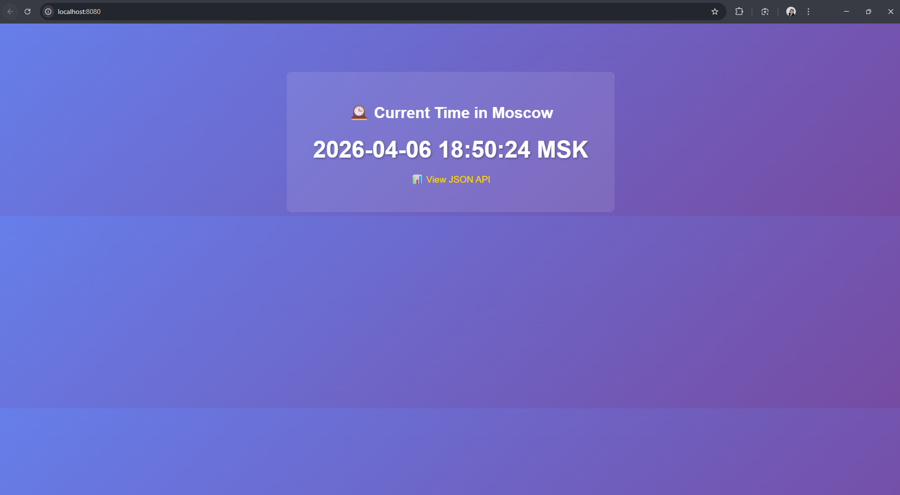
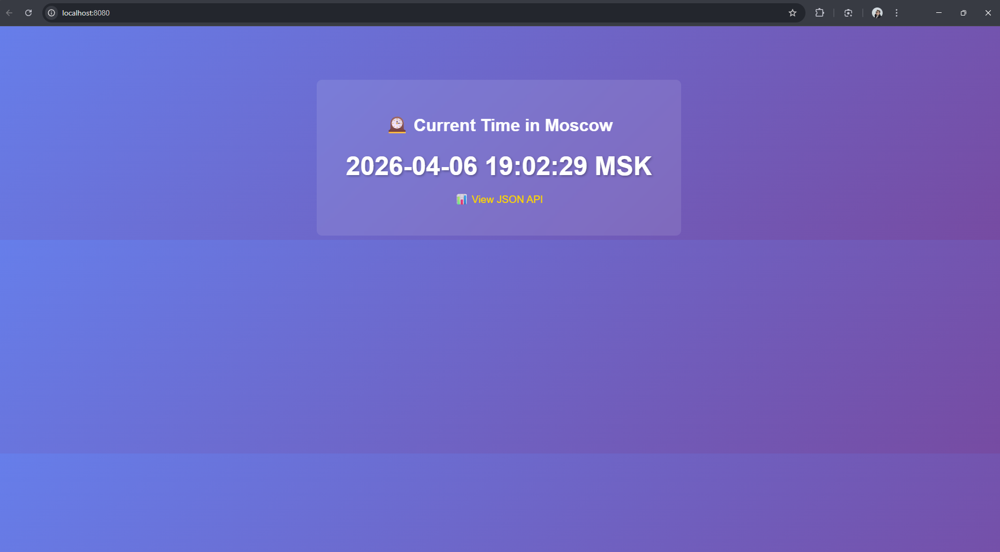

# Lab 12 — WebAssembly Containers vs Traditional Containers

## Task 1 — Create the Moscow Time Application

### Screenshot of CLI mode output (MODE=once)
```bash
pixel@pixelbook:~/DevOps-Intro/labs/lab12$ MODE=once go run main.go
{
  "moscow_time": "2026-04-06 18:48:44 MSK",
  "timestamp": 1775490524
}
```


### Screenshot of server mode running in browser (if tested)



### Confirmation that you're working directly in labs/lab12/ directory
Follows from first subtask.


### Explanation of how the single main.go works in three different contexts
`main.go` is a single binary with three execution modes. Which mode it uses depends entirely on the environment it starts in.

The three contexts are:
- CLI one-shot mode
- WAGI/Spin WebAssembly request mode
- Traditional long-running HTTP server mode

`main()` acts like a dispatcher, it checks the runtime environment in order:
- If MODE=once, run as a command-line program and exit.
- Else, if CGI/WAGI variables are present, handle exactly one HTTP request and exit.
- Else, assume a normal container or local process and start a persistent net/http server.

So the same source file can be built once and used in multiple deployment styles.


## Task 2 — Build Traditional Docker Container

### Binary size from `ls -lh moscow-time-traditional`
```bash
pixel@pixelbook:~/DevOps-Intro/labs/lab12$ ls -lh moscow-time-traditional

-rwxr-xr-x 1 pixel pixel 4.5M Apr  6 18:56 moscow-time-traditional
```

4.5MB


### Image size from both `docker images` and `docker image inspect`
```bash
pixel@pixelbook:~/DevOps-Intro/labs/lab12$ docker images moscow-time-traditional
                                                                                                                                                                                                                                                  i Info →   U  In Use
IMAGE                            ID             DISK USAGE   CONTENT SIZE   EXTRA
moscow-time-traditional:latest   d33676cabff1       6.79MB         2.07MB        

pixel@pixelbook:~/DevOps-Intro/labs/lab12$ docker image inspect moscow-time-traditional --format '{{.Size}}' | \
       awk '{print $1/1024/1024 " MB"}'
1.9772 MB
```

6.79MB, 1.9772MB


### Average startup time across 5 CLI mode runs
```bash
pixel@pixelbook:~/DevOps-Intro/labs/lab12$    for i in {1..5}; do
       /usr/bin/time -f "%e" docker run --rm -e MODE=once moscow-time-traditional 2>&1 | tail -n 1
   done | awk '{sum+=$1; count++} END {print "Average:", sum/count, "seconds"}'

Average: 0.828 seconds
```

Average time: 0.828 seconds


### Memory usage from `docker stats` (MEM USAGE column)
```bash
pixel@pixelbook:~/DevOps-Intro/labs/lab12$ docker stats test-traditional --no-stream
CONTAINER ID   NAME               CPU %     MEM USAGE / LIMIT     MEM %     NET I/O           BLOCK I/O   PIDS
5d2c8c95de3c   test-traditional   0.00%     1.641MiB / 7.357GiB   0.02%     20.7kB / 5.67kB   0B / 0B     5
```

MEM USAGE: 1.641MiB


### Screenshot of application running in browser (server mode)



## Task 3 — Build WASM Container (ctr-based)

### TinyGo version used
0.39.0


### WASM binary size (from `ls -lh main.wasm`)
```bash
pixel@pixelbook:~/DevOps-Intro/labs/lab12$ ls -lh main.wasm
-rwxr-xr-x 1 pixel pixel 2.4M Apr  6 19:17 main.wasm
```

2.4MB


### WASI image size (from `ctr images ls`)
```bash
pixel@pixelbook:~/DevOps-Intro/labs/lab12$ sudo ctr images ls | grep -E 'moscow-time-wasm|wasi|wasm'

docker.io/library/moscow-time-wasm:latest application/vnd.oci.image.manifest.v1+json sha256:e154259ad8eb75e916d27fbde2516d6f1fa9e8d35a0e9e6b8c8840985e198e71 820.0 KiB wasi/wasm -      
```

820.0 KiB


### Average startup time from the `ctr run` benchmark loop (CLI mode)
```bash
pixel@pixelbook:~/DevOps-Intro/labs/lab12$ 
   for i in {1..5}; do
       NAME="wasi-$(date +%s%N | tail -c 6)-$i"
       /usr/bin/time -f "%e" sudo ctr run --rm \
           --runtime io.containerd.wasmtime.v1 \
           --platform wasi/wasm \
           --env MODE=once \
           docker.io/library/moscow-time-wasm:latest "$NAME" 2>&1 | tail -n 1
   done | awk '{sum+=$1; n++} END{printf("Average: %.4f seconds\n", sum/n)}'

Average: 0.5860 seconds
```

Average time: 0.5860 seconds


### Explanation of why server mode doesn't work under `ctr` (WASI Preview1 lacks socket support)
- `ctr` can execute the Wasm module.
- Go binary in `wasip1` can print output and use basic WASI facilities.
- But `net/http `server mode depends on listening sockets.
- WASI Preview 1 does not provide that socket capability, so ListenAndServe(":8080") cannot function there.


### Memory usage reporting (likely "N/A" with explanation)
Memory usage is typically reported as N/A in this setup because `ctr run` with a Wasm workload does not expose Docker-style memory statistics by default.

Short-lived Wasm programs launched via `sudo ctr run --rm --runtime=io.containerd.wasmtime.v1 ...` usually start, execute, and exit almost immediately. By the time you try to inspect metrics, the task no longer exists.

Additionally, runwasi/Wasmtime integrations do not always publish detailed container metrics in the same way a normal OCI Linux container does. Depending on the `shim` version and `containerd` configuration, `ctr task metrics` may return no useful memory data or fail entirely.


### Confirmation that you used `ctr` (containerd CLI) for WASM execution
```bash
pixel@pixelbook:~/DevOps-Intro/labs/lab12$ sudo ctr images import \
      --platform=wasi/wasm \
      --index-name docker.io/library/moscow-time-wasm:latest \
      moscow-time-wasm.oci
docker.io/library/moscow time wasm:lates        saved
application/vnd.oci.image.manifest.v1+json sha256:e154259ad8eb75e916d27fbde2516d6f1fa9e8d35a0e9e6b8c8840985e198e71
Importing       elapsed: 0.2 s  total:   0.0 B  (0.0 B/s)


pixel@pixelbook:~/DevOps-Intro/labs/lab12$ sudo ctr images ls | grep -E 'moscow-time-wasm|wasi|wasm'

docker.io/library/moscow-time-wasm:latest application/vnd.oci.image.manifest.v1+json sha256:e154259ad8eb75e916d27fbde2516d6f1fa9e8d35a0e9e6b8c8840985e198e71 820.0 KiB wasi/wasm -    


pixel@pixelbook:~/DevOps-Intro/labs/lab12$ 
   sudo ctr run --rm \
      --runtime io.containerd.wasmtime.v1 \
      --platform wasi/wasm \
      --env MODE=once \
      docker.io/library/moscow-time-wasm:latest wasi-once

{
  "moscow_time": "2026-04-06 19:41:56 MSK",
  "timestamp": 1775493716
}
```

I used these commands for images importing and running. So I used `ctr`.


## Task 4 — Performance Comparison & Analysis
### Complete comparison table with all metrics
| Metric | Traditional Container | WASM Container | Improvement | Notes |
|--------|----------------------|----------------|-------------|-------|
| **Binary Size** | 4.5 MB | 2.4 MB | 46.67% smaller | From `ls -lh` |
| **Image Size** | 1.98 MB | 0.82 MB | 58.59% smaller | From `docker image inspect` |
| **Startup Time (CLI)** | 828 ms | 586 ms | 1.41x faster | Average of 5 runs |
| **Memory Usage** | 1.641 MB | N/A | N/A | From `docker stats` |
| **Base Image** | scratch | scratch | Same | Both minimal |
| **Source Code** | main.go | main.go | Identical | ✅ Same file! |
| **Server Mode** | ✅ Works (net/http) | ❌ Not via ctr <br> ✅ Via Spin (WAGI) | N/A | WASI Preview1 lacks sockets; <br> Spin provides HTTP abstraction |


### Calculated improvement percentages
- *Binary size*: 46.67% smaller
- *Image Size*: 58.59% smaller
- *Startup Time (CLI)*: 1.41x faster
- *Memory Usage*: N/A (because of WASM)


### Detailed answers to all questions
1. **Binary Size Comparison:**
   - Why is the WASM binary so much smaller than the traditional Go binary?
        - The Wasm binary is much smaller because TinyGo includes only a minimal subset of the Go runtime and standard library required by the program. A normal Go build includes the full runtime, scheduler, garbage collector, reflection support, panic/debug metadata, and more standard library code, even for a simple app.
   - What did TinyGo optimize away?
        - TinyGo optimized away:
            - most reflection support
            - large parts of the Go runtime
            - unused standard library code
            - debug symbols and stack traces
            - advanced garbage collection features
            - heavier goroutine scheduling logic
            - dead code through whole-program optimization

2. **Startup Performance:**
   - Why does WASM start faster?
        - WAWM starts faster because the runtime loads a compact WASM module directly into Wasmtime without creating a full Linux process environment.
   - What initialization overhead exists in traditional containers?
        - Traditional containers have more startup overhead because they must:
            - create namespaces and cgroups
            - mount the container filesystem
            - initialize the container image layers
            - start a Linux process
            - initialize the full Go runtime
            - potentially configure networking and logging

3. **Use Case Decision Matrix:**
   - When would you choose WASM over traditional containers?
        - Choose Wasm when:
            - startup speed matters
            - image size should be small
            - workloads are short-lived
            - want strong sandboxing
            - building CLI tools, serverless functions, edge workloads, plugins, or lightweight request handlers
            - the app does not need full Linux networking or background processes
   - When would you stick with traditional containers?
        - Use traditional containers when:
            - need full Linux compatibility
            - need sockets, net/http, or long-running servers
            - need mature monitoring and debugging tools
            - the app uses CGO or native libraries
            - need direct filesystem, process, or networking control
            - are running databases, background workers, or standard web servers


### Recommendations for when to use each approach
Use WASM when startup speed, small binaries, and lightweight execution matter more than full Linux compatibility. It works best for short-lived CLI tools, serverless functions, edge workloads, plugins, and simple request handlers.

Use traditional containers when the application needs full Linux features such as sockets, long-running servers, native libraries, background processes, or mature monitoring and debugging support. They are the better choice for standard web servers, databases, and more complex services.