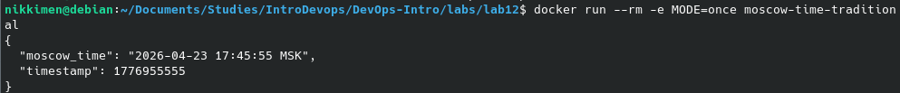
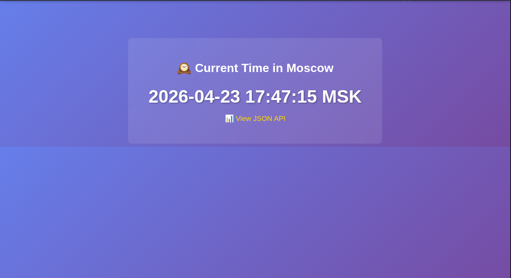
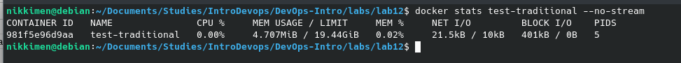
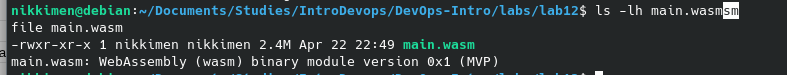
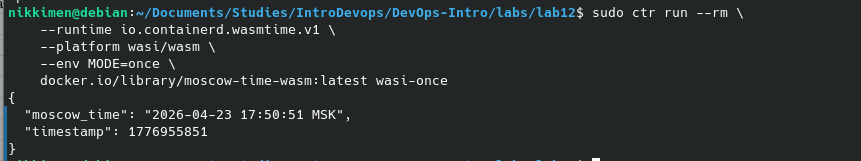
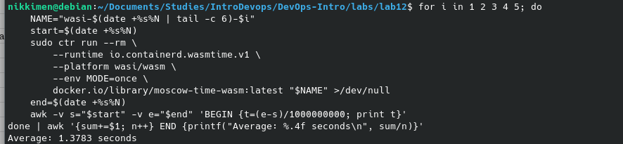

# Lab 12 Submission — WebAssembly Containers vs Traditional Containers

## Task 1 — Moscow Time Application

### 1.1 Lab Directory

All commands were run from the provided lab directory:

```bash
cd labs/lab12
```

Confirmation:

```text
Working directly in labs/lab12/
```

### 1.2 Application Code Review

The application is implemented in one source file:

```text
labs/lab12/main.go
```

The same `main.go` supports three execution contexts:

- CLI mode: if `MODE=once`, the program prints one JSON response and exits. This is used for reliable startup benchmarking in both Docker and WASM.
- Traditional server mode: if `MODE` is not set and the program is not running under WAGI, it starts a normal `net/http` server on port `8080`.
- Spin/WAGI mode: if `REQUEST_METHOD` is set, `isWagi()` detects the CGI/WAGI environment and `runWagiOnce()` writes HTTP headers and the response body to `STDOUT`.

The application uses `time.FixedZone("MSK", 3*60*60)` instead of loading timezone databases. This is useful for minimal environments, especially WASM/WASI, where the host timezone database may not exist.

### 1.3 CLI Mode Output

Command:

```bash
docker run --rm -e MODE=once moscow-time-traditional
```

Output:

```json
{
  "moscow_time": "2026-04-22 22:42:19 MSK",
  "timestamp": 1776886939
}
```

Screenshot:



### 1.4 Server Mode Output

Command:

```bash
docker run --rm --name test-traditional -p 8080:8080 moscow-time-traditional
```

Server log:

```text
2026/04/22 19:43:41 Server starting on :8080
```

Verification command:

```bash
curl -sS http://127.0.0.1:8080/api/time
```

Output:

```json
{"moscow_time":"2026-04-22 22:46:57 MSK","timestamp":1776887217}
```

Screenshot:



## Task 2 — Traditional Docker Container

### 2.1 Dockerfile Review

The provided traditional Dockerfile is:

```text
labs/lab12/Dockerfile
```

It uses a multi-stage build:

- Build stage: `golang:1.21-alpine`
- Compile flags: `-tags netgo -trimpath -ldflags="-s -w -extldflags=-static"`
- Runtime stage: `FROM scratch`
- Entrypoint: `/app/moscow-time`

This creates a static Linux binary with no runtime base image contents except the application itself.

### 2.2 Build Traditional Image

Command:

```bash
docker build -t moscow-time-traditional -f Dockerfile .
```

Output summary:

```text
#11 writing image sha256:bc82981799dc619cc27bb83ada05622c95b02a25acee25acea6fd046d4acb578 done
#11 naming to docker.io/library/moscow-time-traditional done
#11 DONE 0.1s
```

### 2.3 Binary Size

Commands:

```bash
docker create --name temp-traditional moscow-time-traditional
docker cp temp-traditional:/app/moscow-time ./moscow-time-traditional
docker rm temp-traditional
ls -lh moscow-time-traditional
```

Output:

```text
-rwxr-xr-x 1 nikkimen nikkimen 4.5M Apr 22 22:42 moscow-time-traditional
```

Precise size:

```text
4698112 bytes = 4.48 MiB
```

### 2.4 Image Size

Command:

```bash
docker images moscow-time-traditional
```

Output:

```text
IMAGE                            ID             DISK USAGE   CONTENT SIZE   EXTRA
moscow-time-traditional:latest   bc82981799dc        4.7MB             0B
WARNING: This output is designed for human readability. For machine-readable output, please use --format.
```

Command:

```bash
docker image inspect moscow-time-traditional --format '{{.Size}}'
```

Output:

```text
4698112
```

Result:

```text
Traditional image size: 4698112 bytes = 4.48 MiB
```

### 2.5 Startup Time Benchmark

The lab command used `/usr/bin/time`, but this host did not have `/usr/bin/time` installed. Elapsed time was measured with nanosecond timestamps from `date`.

Command:

```bash
for i in 1 2 3 4 5; do
    start=$(date +%s%N)
    docker run --rm -e MODE=once moscow-time-traditional >/dev/null
    end=$(date +%s%N)
    awk -v i="$i" -v s="$start" -v e="$end" 'BEGIN {t=(e-s)/1000000000; printf("Run %d: %.4f seconds\n", i, t)}'
done
```

Output:

```text
Run 1: 0.4776 seconds
Run 2: 0.7396 seconds
Run 3: 0.5730 seconds
Run 4: 0.5839 seconds
Run 5: 0.5598 seconds
```

Average:

```text
Average: 0.58678 seconds
```

### 2.6 Memory Usage

Command:

```bash
docker stats test-traditional --no-stream
```

Output:

```text
CONTAINER ID   NAME               CPU %     MEM USAGE / LIMIT     MEM %     NET I/O         BLOCK I/O   PIDS
1a1f55b3b3a5   test-traditional   0.00%     2.684MiB / 19.44GiB   0.01%     3.81kB / 126B   0B / 0B     5
```

Result:

```text
Traditional server memory usage: 2.684 MiB
```

Screenshot:



## Task 3 — WASM Container with TinyGo and containerd

### 3.1 TinyGo Version

Command:

```bash
docker run --rm tinygo/tinygo:0.39.0 tinygo version
```

Output:

```text
tinygo version 0.39.0 linux/amd64 (using go version go1.25.0 and LLVM version 19.1.2)
```

### 3.2 Build WASM Binary

Command:

```bash
docker run --rm \
    -v /home/nikkimen/Documents/Studies/IntroDevops/DevOps-Intro/labs/lab12:/src \
    -w /src \
    tinygo/tinygo:0.39.0 \
    tinygo build -o main.wasm -target=wasi main.go
```

Output:

```text
Command completed successfully.
```

Command:

```bash
ls -lh main.wasm
```

Output:

```text
-rwxr-xr-x 1 nikkimen nikkimen 2.4M Apr 22 22:49 main.wasm
```

Command:

```bash
file main.wasm
```

Output:

```text
main.wasm: WebAssembly (wasm) binary module version 0x1 (MVP)
```

Precise size:

```text
2450459 bytes = 2.34 MiB
```

Screenshot:



### 3.3 WASM Dockerfile Review

The provided WASM Dockerfile is:

```text
labs/lab12/Dockerfile.wasm
```

It uses:

```dockerfile
FROM scratch
COPY main.wasm /main.wasm
EXPOSE 8080
ENTRYPOINT ["/main.wasm"]
```

This OCI image contains only the WASM module plus image metadata. The `EXPOSE` line is informational; plain WASI Preview1 does not provide TCP sockets for this program under `ctr`.

### 3.4 Build WASM OCI Archive

The default Docker buildx driver could not export an OCI archive:

```text
ERROR: failed to build: OCI exporter is not supported for the docker driver.
Switch to a different driver, or turn on the containerd image store, and try again.
```

A `docker-container` buildx builder was created:

```bash
docker buildx create --name lab12-builder --driver docker-container --use
```

Output:

```text
lab12-builder
```

Command:

```bash
docker buildx build \
    --platform=wasi/wasm \
    -t moscow-time-wasm:latest \
    -f Dockerfile.wasm \
    --output=type=oci,dest=moscow-time-wasm.oci,annotation=index:org.opencontainers.image.ref.name=moscow-time-wasm:latest \
    .
```

Output summary:

```text
#6 exporting to oci image format
#6 exporting layers 0.2s done
#6 exporting manifest sha256:29b520ec4388dd3754d6eeea336342ef35a4bafdb0c147d0f7c567692b7e5ee9 done
#6 exporting config sha256:e6d81afa4c9b8a65737330dff990c1678a8d91ec66f1075c2a41c4cd9f1745e1 done
#6 sending tarball 0.0s done
#6 DONE 0.2s
```

Command:

```bash
ls -lh moscow-time-wasm.oci
```

Output:

```text
-rw-r--r-- 1 nikkimen nikkimen 826K Apr 22 22:50 moscow-time-wasm.oci
```

Precise size:

```text
845824 bytes = 0.81 MiB
```

### 3.5 Wasmtime Shim

Initial verification showed that the shim was not installed:

```bash
ls -la /usr/local/bin/containerd-shim-wasmtime-v1
```

Output:

```text
ls: cannot access '/usr/local/bin/containerd-shim-wasmtime-v1': No such file or directory
```

The shim was built from source using Docker:

```bash
docker run --rm \
    -v /home/nikkimen/Documents/Studies/IntroDevops/DevOps-Intro/labs/lab12:/out \
    -w /work \
    rust:slim-bookworm \
    bash -lc 'set -euo pipefail; export DEBIAN_FRONTEND=noninteractive; export PATH="/usr/local/cargo/bin:$PATH"; apt-get update; apt-get install -y git build-essential pkg-config libssl-dev libseccomp-dev protobuf-compiler clang make ca-certificates curl; rustc --version; cargo --version; rm -rf runwasi; git clone --depth 1 https://github.com/containerd/runwasi.git; cd runwasi; cargo build --release -p containerd-shim-wasmtime; install -m 0755 target/release/containerd-shim-wasmtime-v1 /out/'
```

Important output:

```text
rustc 1.95.0 (59807616e 2026-04-14)
cargo 1.95.0 (f2d3ce0bd 2026-03-21)
Cloning into 'runwasi'...
Finished `release` profile [optimized] target(s) in 13m 06s
```

Command:

```bash
ls -lh containerd-shim-wasmtime-v1
```

Output:

```text
-rwxr-xr-x 1 nobody nogroup 31M Apr 22 23:23 containerd-shim-wasmtime-v1
```

### 3.6 Run WASM Container with `ctr`

The final `ctr` steps were completed in a normal terminal with sudo access on the host.

Command:

```bash
sudo ctr run --rm \
    --runtime io.containerd.wasmtime.v1 \
    --platform wasi/wasm \
    --env MODE=once \
    docker.io/library/moscow-time-wasm:latest wasi-once
```

Output:

```json
{
  "moscow_time": "2026-04-23 17:50:51 MSK",
  "timestamp": 1776955851
}
```

Screenshot:



### 3.7 WASM Startup Benchmark

Command:

```bash
for i in 1 2 3 4 5; do
    NAME="wasi-$(date +%s%N | tail -c 6)-$i"
    start=$(date +%s%N)
    sudo ctr run --rm \
        --runtime io.containerd.wasmtime.v1 \
        --platform wasi/wasm \
        --env MODE=once \
        docker.io/library/moscow-time-wasm:latest "$NAME" >/dev/null
    end=$(date +%s%N)
    awk -v s="$start" -v e="$end" 'BEGIN {t=(e-s)/1000000000; print t}'
done | awk '{sum+=$1; n++} END {printf("Average: %.4f seconds\n", sum/n)}'
```

Output:

```text
Average: 1.3783 seconds
```

Screenshot:



### 3.8 WASM Server Mode Limitation

Plain WASI Preview1 modules do not support TCP sockets. Running the WASM image under `ctr` without `MODE=once` is expected not to provide a working HTTP server because `net/http` cannot bind to port `8080` in the WASI Preview1 execution model.

Server mode can still be demonstrated with Spin using the same `main.wasm`. Spin supplies the HTTP server layer and invokes the module through WAGI/CGI-style environment variables, which this application handles through `isWagi()` and `runWagiOnce()`.

### 3.9 WASM Memory Usage

WASM memory usage via `ctr` is documented as:

```text
N/A - not available via ctr in the same way as Docker container memory metrics.
```

The Wasmtime runtime manages WASM linear memory internally, and normal `docker stats` style container metrics do not directly apply to the WASM module execution model.

## Task 4 — Performance Comparison and Analysis

### 4.1 Comparison Table

| Metric | Traditional Container | WASM Container | Improvement | Notes |
|--------|----------------------:|---------------:|------------:|-------|
| Binary Size | 4.48 MiB | 2.34 MiB | 47.8% smaller | From `ls -lh` and precise byte counts |
| Image Size | 4.48 MiB inspect / 4.7MB Docker CLI | 0.81 MiB OCI archive | 82.0% smaller | Based on the exported WASM OCI archive |
| Startup Time (CLI) | 0.58678 s average | 1.3783 s average | WASM was 2.35x slower on this host | Average of measured Docker and `ctr` runs |
| Memory Usage | 2.684 MiB | N/A | N/A | WASM memory not reported via `ctr` like Docker stats |
| Base Image | scratch | scratch | Same | Both images use minimal empty base |
| Source Code | `main.go` | `main.go` | Identical | Same file compiled to different targets |
| Server Mode | Works through `net/http` | Not via plain `ctr`; works via Spin/WAGI | N/A | WASI Preview1 lacks sockets |

### 4.2 Binary Size Comparison

The WASM binary is smaller because TinyGo compiles a smaller subset of the Go runtime and performs aggressive dead-code elimination for the WASI target. The traditional Go binary includes the standard Go runtime, scheduler, garbage collector, and native Linux support needed by a normal statically linked executable.

TinyGo optimized away runtime functionality that the program does not need in CLI/WASI mode. In this application, the hot path is simple JSON formatting and time calculation, so TinyGo can keep the output smaller than the native Go binary.

### 4.3 Startup Performance

Traditional containers start a Linux process inside a container namespace and go through OCI runtime setup, filesystem setup, process startup, and native Go runtime initialization. Even with a scratch image, Docker still has normal container lifecycle overhead.

In theory, WASM containers can start faster because the runtime loads a sandboxed module directly and does not need a full Linux userspace inside the image. On this host, however, the measured result was the opposite: `ctr` + Wasmtime averaged `1.3783` seconds, while Docker averaged `0.58678` seconds. A likely explanation is that the local `ctr` + shim + Wasmtime stack adds enough runtime startup overhead on this machine to outweigh the smaller artifact size.

### 4.4 Use Case Decision Matrix

WASM containers are a good choice when the workload is small, sandboxed, startup-sensitive, and can fit WASI capabilities. Examples include edge functions, CLI-style jobs, request handlers behind a platform-provided HTTP layer, plugins, and untrusted code execution.

Traditional containers are a better choice when the application needs full Linux compatibility, normal TCP sockets, mature observability, existing Docker/Kubernetes workflows, native system libraries, or long-running server behavior without an additional WASM platform such as Spin.

### 4.5 Recommendation

For this Moscow Time app, the WASM target is a strong fit for small packaged artifacts and serverless-style Spin/WAGI hosting. On this specific machine, the traditional container had the better startup time and remains the better direct `docker run -p 8080:8080` option because it can run a normal `net/http` server without an external HTTP host.

## Screenshot Checklist

Use these screenshots in the final PR/submission evidence:

```text
1. `lab12/mode_once.png` - terminal showing MODE=once JSON output.
2. `lab12/page.png` - browser showing the traditional server page.
3. `lab12/mem_limit.png` - Docker memory usage.
4. `lab12/wasm_size.png` - WASM binary size and file type.
5. `lab12/ctr_mode_once.png` - successful `ctr` MODE=once output.
6. `lab12/average.png` - WASM startup benchmark result.
```
