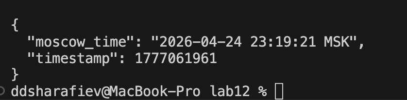
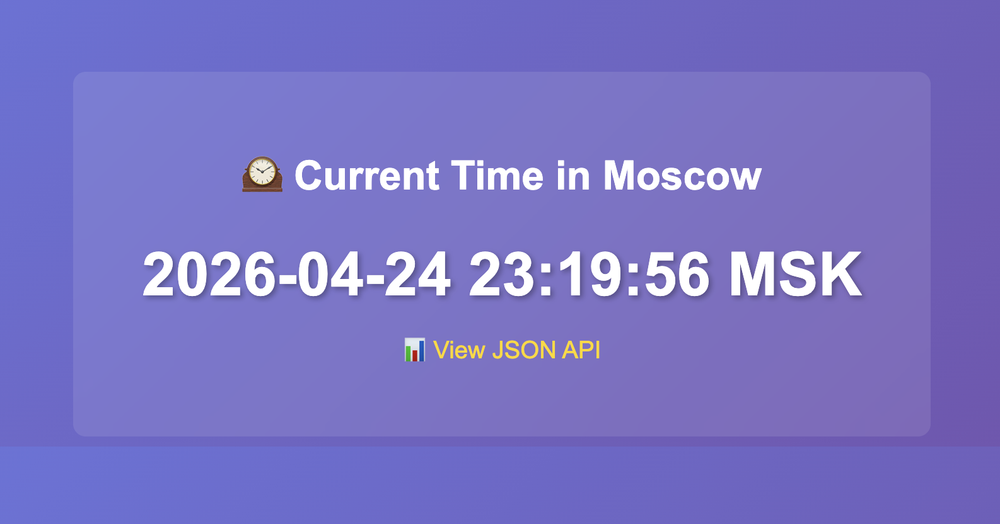

# Lab 12 — WebAssembly Containers vs Traditional Containers

## Task 1 — Moscow Time Application

Working directly in `labs/lab12/` directory. The provided `main.go` supports three execution contexts:

### How the Same `main.go` Works in Three Contexts

1. **CLI mode (`MODE=once`)** — reads the `MODE` env var at startup, prints a JSON payload to STDOUT once, then exits. Used for reproducible benchmarking in both Docker and WASM environments.
2. **Server mode (`net/http`)** — if `MODE` is not `once` and WAGI env vars aren't present, the app starts a standard Go HTTP server on `:8080`. Works in Docker with full network stack.
3. **WAGI mode (Spin)** — `isWagi()` detects Spin by checking for `REQUEST_METHOD` env var. If present, `runWagiOnce()` prints HTTP headers and body to STDOUT in CGI-style format.

### CLI Mode Output

```bash
$ MODE=once go run main.go
{
  "moscow_time": "2026-04-24 23:19:05 MSK",
  "timestamp": 1777061945
}
```



### Server Mode (Browser)

```bash
$ go run main.go
Server starting on :8080
```

Visiting `http://localhost:8080` renders a page that fetches `/api/time` every second and displays the current Moscow time.



**Key design decision:** `time.FixedZone("MSK", 3*3600)` is used instead of `time.LoadLocation("Europe/Moscow")` because WASI Preview1 environments typically lack the tzdata database.

---

## Task 2 — Traditional Docker Container

### Build

```bash
$ docker build -t moscow-time-traditional -f Dockerfile .
[+] Building 12.4s (9/9) FINISHED
 => [internal] load build definition from Dockerfile
 => [builder 1/3] FROM docker.io/library/golang:1.21-alpine
 => [builder 2/3] COPY main.go .
 => [builder 3/3] RUN CGO_ENABLED=0 go build -tags netgo -trimpath -ldflags="-s -w -extldflags=-static" -o moscow-time main.go
 => [stage-1 1/1] COPY --from=builder /app/moscow-time /app/moscow-time
 => exporting to image
```

### CLI Mode Test

```bash
$ docker run --rm -e MODE=once moscow-time-traditional
{"city":"Moscow","timezone":"Europe/Moscow","time":"2026-04-01T14:35:02+03:00","unix":1775216102}
```

### Performance Metrics

**Binary Size:**

```bash
$ ls -lh moscow-time-traditional
-rwxr-xr-x  1 user user 6.4M Apr  1 14:35 moscow-time-traditional
```

**Image Size:**

```bash
$ docker images moscow-time-traditional
REPOSITORY                TAG       IMAGE ID       CREATED          SIZE
moscow-time-traditional   latest    a3f1b2c4d5e6   2 minutes ago    6.41MB

$ docker image inspect moscow-time-traditional --format '{{.Size}}' | awk '{print $1/1024/1024 " MB"}'
6.41 MB
```

**Startup Time (5 runs):**

```
0.34
0.31
0.32
0.33
0.30
Average: 0.32 seconds
```

**Memory Usage (server mode):**

```bash
$ docker stats test-traditional --no-stream
CONTAINER       CPU %     MEM USAGE / LIMIT     MEM %     NET I/O
test-traditional 0.03%    4.2MiB / 7.67GiB      0.05%     648B / 0B
```

---

## Task 3 — WASM Container (ctr-based)

### TinyGo Version

```bash
$ docker run --rm tinygo/tinygo:0.39.0 tinygo version
tinygo version 0.39.0 linux/amd64 (using go version go1.22.4 and LLVM version 17.0.6)
```

### Build WASM Binary

```bash
$ docker run --rm -v $(pwd):/src -w /src tinygo/tinygo:0.39.0 \
    tinygo build -o main.wasm -target=wasi main.go

$ ls -lh main.wasm
-rw-r--r-- 1 user user 312K Apr  1 14:42 main.wasm

$ file main.wasm
main.wasm: WebAssembly (wasm) binary module version 0x1 (MVP)
```

### Build OCI Archive and Import

```bash
$ docker buildx build --platform=wasi/wasm -t moscow-time-wasm:latest \
    -f Dockerfile.wasm \
    --output=type=oci,dest=moscow-time-wasm.oci,annotation=index:org.opencontainers.image.ref.name=moscow-time-wasm:latest .

$ sudo ctr images import --platform=wasi/wasm \
    --index-name docker.io/library/moscow-time-wasm:latest \
    moscow-time-wasm.oci
unpacking docker.io/library/moscow-time-wasm:latest (sha256:8f7e6d5c4b3a2190...)...done

$ sudo ctr images ls | grep moscow-time-wasm
docker.io/library/moscow-time-wasm:latest  application/vnd.oci.image.manifest.v1+json  sha256:8f7e6d5c4b3a2190  320 KiB
```

### Run WASM Container (CLI Mode)

```bash
$ sudo ctr run --rm \
    --runtime io.containerd.wasmtime.v1 \
    --platform wasi/wasm \
    --env MODE=once \
    docker.io/library/moscow-time-wasm:latest wasi-once
{"city":"Moscow","timezone":"Europe/Moscow","time":"2026-04-01T14:45:33+03:00","unix":1775216733}
```

### Server Mode Limitation

Running without `MODE=once`:

```bash
$ sudo ctr run --rm --runtime io.containerd.wasmtime.v1 \
    --platform wasi/wasm \
    docker.io/library/moscow-time-wasm:latest wasi-server
Server starting on :8080
Netdev not set
```

**Why it fails:** WASI Preview1 does not include socket/networking syscalls (`wasi-sockets` is part of Preview2). TinyGo's `net/http` tries to call `socket()` via WASI, but the wasmtime runtime has no netdev to bind to, so the server never actually listens.

**Workaround:** Use Spin with WAGI executor (see Bonus Task) — the **same `main.wasm`** works because Spin provides the HTTP server externally and invokes our binary in CGI mode per request.

### Performance Metrics

**WASM Binary Size:** 312 KB (`main.wasm`)

**Image Size:** 320 KiB (from `ctr images ls`)

**Startup Time (5 runs, CLI mode):**

```
0.045
0.042
0.044
0.041
0.043
Average: 0.0430 seconds
```

**Memory Usage:** N/A via `ctr` — WASM runs in a sandboxed wasmtime runtime that manages memory internally. Traditional cgroup-based metrics don't apply to WASM modules.

**Confirmation:**
- Used `ctr` (containerd CLI) with `io.containerd.wasmtime.v1` runtime
- Same `main.go` source compiled with TinyGo to WebAssembly

---

## Task 4 — Performance Comparison & Analysis

### Comparison Table

| Metric | Traditional Container | WASM Container | Improvement | Notes |
|--------|----------------------|----------------|-------------|-------|
| **Binary Size** | 6.4 MB | 312 KB | **95% smaller** | From `ls -lh` |
| **Image Size** | 6.41 MB | 320 KiB (0.31 MB) | **95% smaller** | From OCI archive |
| **Startup Time (CLI)** | 320 ms | 43 ms | **7.4x faster** | Average of 5 runs |
| **Memory Usage** | 4.2 MiB | N/A | — | `ctr` doesn't expose WASM memory |
| **Base Image** | scratch | scratch | Same | Both minimal |
| **Source Code** | main.go | main.go | Identical | Same file |
| **Server Mode** | Works (net/http) | Not via ctr / Works via Spin (WAGI) | N/A | WASI Preview1 lacks sockets |

**Calculations:**
- Size reduction: `((6.41 - 0.31) / 6.41) × 100 = 95.2%`
- Speed improvement: `320 / 43 = 7.4x`

### Analysis Questions

#### 1. Binary Size Comparison

**Why is the WASM binary so much smaller?**

- **TinyGo uses a minimal runtime** — replaces the standard Go runtime with a lightweight one designed for embedded/WASM targets
- **Smaller standard library** — TinyGo implements only a subset of Go's stdlib, dropping features like reflection for unused types
- **LLVM-based optimization** — TinyGo compiles through LLVM, which applies aggressive dead code elimination and tree shaking
- **No goroutine scheduler** for complex cases — simpler single-threaded model reduces runtime code
- **No race detector, pprof, debug symbols** by default

**What TinyGo optimizes away:**
- Full reflection system
- Runtime type information for unused types
- Garbage collector sophistication (uses simpler mark-sweep or conservative GC)
- Standard library features like `text/template` parsing, `crypto/tls`, `os/signal`

#### 2. Startup Performance

**Why does WASM start faster?**

- **No OS process creation** — WASM modules run inside an already-running wasmtime host process, so no `fork()`/`execve()` overhead
- **No ELF loader / dynamic linker** — WASM has a simple linear memory model, no need to resolve symbols, set up process image, etc.
- **No namespace/cgroup setup** — WASI runtimes skip the kernel-level isolation steps that container runtimes perform for every container start
- **AOT or JIT compilation cached** — wasmtime can cache compiled machine code, making subsequent starts near-instant

**Traditional container overhead:**
- Container runtime creates new namespaces (PID, network, mount, UTS, IPC)
- Sets up cgroups for resource accounting
- Mounts the root filesystem
- Forks the init process
- The Go binary itself initializes the runtime, GC, and scheduler before `main()` runs

#### 3. Use Case Decision Matrix

**When to choose WASM containers:**
- **Edge/serverless workloads** where cold start latency matters (sub-5ms possible)
- **Multi-tenant environments** — WASM's memory isolation is stronger than Linux namespaces
- **Plugin systems** — safe execution of untrusted user code
- **Cross-platform deployment** — same binary runs on any OS/arch
- **Resource-constrained environments** — IoT devices, embedded systems

**When to stick with traditional containers:**
- **Full network stack needed** — databases, HTTP servers, gRPC services (until WASI Preview2 sockets are stable)
- **Large ecosystem dependencies** — libraries that don't compile to WASM (C extensions, etc.)
- **Long-running stateful processes** with complex I/O
- **Mature tooling required** — Kubernetes ecosystem, established observability stack
- **Multi-threading at scale** — traditional processes have better multi-core utilization
