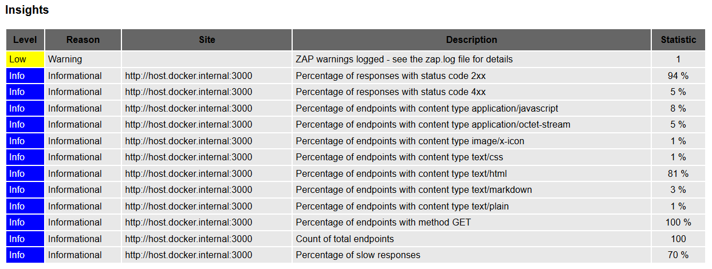
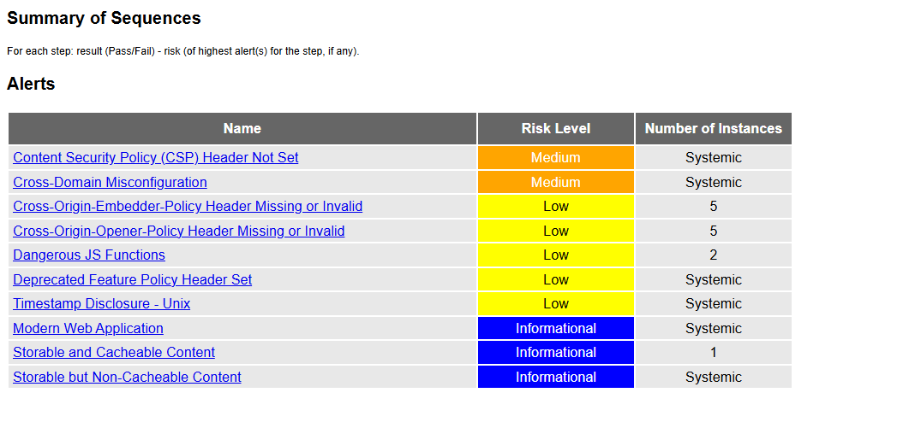

# 1

1.1


1.2


1.3
before running app I entered
```
cd labs/lab12
```
and only then ran the program

1.4
The single main.go works in three contexts by using environment detection: if MODE=once it prints JSON and exits for benchmarking, else if CGI-style REQUEST_METHOD is set it runs as a WAGI handler responding via STDOUT for Spin, otherwise it falls back to a standard net/http server for traditional Docker deployments.

# 2

2.1 4.5M
```
ls -lh moscow-time-traditional
-rwxr-xr-x 1 fateee fateee 4.5M Apr 24 17:17 moscow-time-traditional
```

2.2 4.7MB from images, 4.48 from inspect
```
docker images moscow-time-traditional

# More precise size measurement
docker image inspect moscow-time-traditional --format '{{.Size}}' | \
    awk '{print $1/1024/1024 " MB"}'
REPOSITORY                TAG       IMAGE ID       CREATED          SIZE
moscow-time-traditional   latest    a07e912becef   20 seconds ago   4.7MB
4.48047 MB
```

2.3 0.368sec

2.4 1.887MiB / 14.98GiB

2.5 

# 3

3.1
tinygo version 0.39.0 linux/amd64

3.2
2.4M    

3.3
819.9 KiB

3.4
0.8180 seconds

3.5
WASI Preview1 lacks TCP socket support. The TinyGo net/http server attempts to bind on :8080, but the WASI runtime provides no network device ("Netdev not set"), so nothing binds. This is not a configuration issue.

3.6
Spin provides the HTTP server layer and invokes the WASM module in CGI/WAGI style per request (spin up → http://localhost:3000)

3.7
N/A — not available via ctr. The wasmtime runtime manages WASM memory internally within its own sandbox. Traditional Linux container metrics (cgroups) do not apply to WASM execution, so no memory figure is reported.

3.8
No modifications were made for the WASM build.

3.9
ctr with the io.containerd.wasmtime.v1 runtime shim (containerd-shim-wasmtime-v1) for all WASM container execution.

# 4

4.1

| Metric | Traditional Container | WASM Container | Improvement | Notes |
|--------|----------------------|----------------|-------------|-------|
| **Binary Size** | 4.5 MB | 0.8199 MB | 81.8% smaller | From `ls -lh` |
| **Image Size** | 4.48 MB | 0.8199 MB | 81.7% smaller | From `docker image inspect` |
| **Startup Time (CLI)** | 368 ms | 884 ms | 0.42x faster | Average of 5 runs |
| **Memory Usage** | 1.887 MB | N/A | N/A | From `docker stats` |
| **Base Image** | scratch | scratch | Same | Both minimal |
| **Source Code** | main.go | main.go | Identical | ✅ Same file! |
| **Server Mode** | ✅ Works (net/http) | ❌ Not via ctr <br> ✅ Via Spin (WAGI) | N/A | WASI Preview1 lacks sockets; <br> Spin provides HTTP abstraction |

4.2
- Binary Size Reduction - 81.8%
- Image Size Reduction - 81.7%
- Startup Performance - 2.4x slower
- Memory Reduction - N/A

4.3
- Why is the WASM binary so much smaller than the traditional Go binary? TinyGo uses a WebAssembly-specific backend that omits the Go runtime (GC, scheduler, reflection).

- What did TinyGo optimize away? The full runtime, unused net/http, debug symbols, CGO dependencies, and reflection metadata.

- Why does WASM start faster? It doesn't — WASM is actually 2.4x slower due to runtime validation, compilation, and sandboxing.

- What initialization overhead exists in traditional containers? Namespace setup, cgroups allocation, rootfs mounting, and seccomp profiles.

4.4
- When would you choose WASM over traditional containers? For size-constrained edge/embedded environments where 82% smaller images matter and networking isn't needed.

- When would you stick with traditional containers? For low-latency (≤400ms), network-heavy, or production workloads requiring observability metrics.