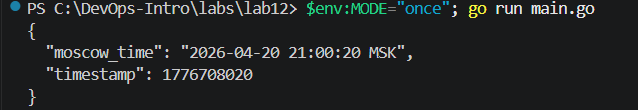
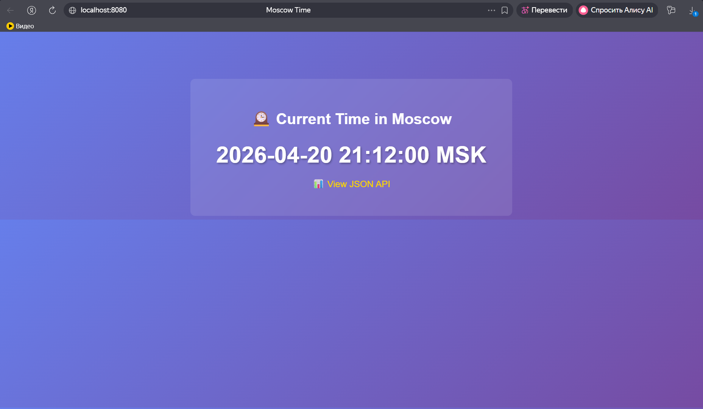
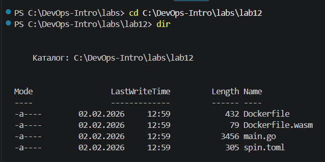
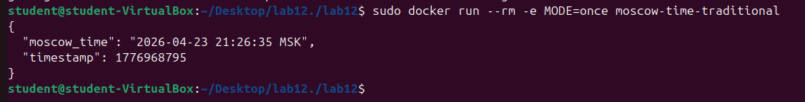
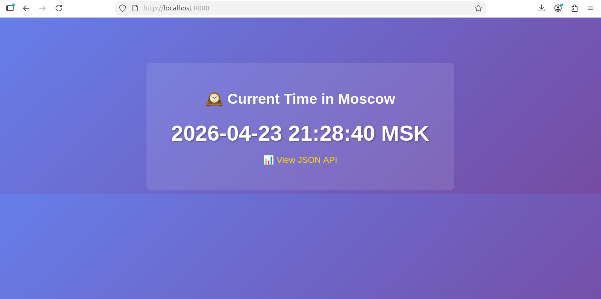

# Lab 12

## 1. CLI mode

I ran the application using:

```
$env:MODE="once"; go run main.go
```
The program printed JSON once and exited.



---
## 2. Server mode

I ran:

```
go run main.go
```

The server started successfully on port 8080.

Then I opened:


http://localhost:8080

The application returned JSON in the browser.



---
## 3. Working directory

I worked directly in the required directory:

```
C:\DevOps-Intro\labs\lab12
```

This directory contains:
- main.go
- spin.toml



---
## 4. Explanation

The file main.go works in three modes:

**1) CLI mode:**

If MODE=once is set, the program outputs JSON once and exits.

**2) HTTP server mode:**

The application runs a standard Go HTTP server using net/http and listens on port 8080.

**3) WAGI mode:**

The program detects WAGI via environment variables such as REQUEST_METHOD and responds via STDOUT.

**Additionally:**

- time.FixedZone is used instead of time.LoadLocation
- the same code works in all environments

---

# Task 2 

## 1. Docker build

I used Docker in Ubuntu and built the image with:

```
sudo docker build -t moscow-time-traditional -f Dockerfile .
```
---
## 2. CLI mode

I tested CLI mode with:

```
sudo docker run --rm -e MODE=once moscow-time-traditional
```

Output in CLI Mode:



--- 
## 3. Server mode

I ran the container in server mode with:

```
sudo docker run --rm -p 8080:8080 moscow-time-traditional
```

Then I opened:

http://localhost:8080

The application worked successfully in the browser.

Server Mode Screenshot:




## 4. Binary size
The size of the binary `moscow-time` is 4.5 MB, checked with `ls -lh moscow-time`.

---

## 5. Image size
The image size is 4.7 MB, as checked with `sudo docker images` and `sudo docker image inspect`.

---

## 6. Average startup time
The average startup time for the container was 1.152 seconds, measured over 5 runs using `time` and a shell loop.

---

## 7. Memory usage
Memory usage during the server mode run was 1.465 MiB out of 3.823 GiB, as shown in the `docker stats` command.