# Lab 12 Submission — WebAssembly Containers vs Traditional Containers

## Task 1 — Create the Moscow Time Application

### Working directory

All commands for this task were run directly in the course lab folder `labs/lab12/` (repository path `DevOps-Intro/labs/lab12`). The screenshot below shows `pwd` resolving to `/Users/nikita/University/DevOps/DevOps-Intro/labs/lab12` while starting the HTTP server and curling the home page.

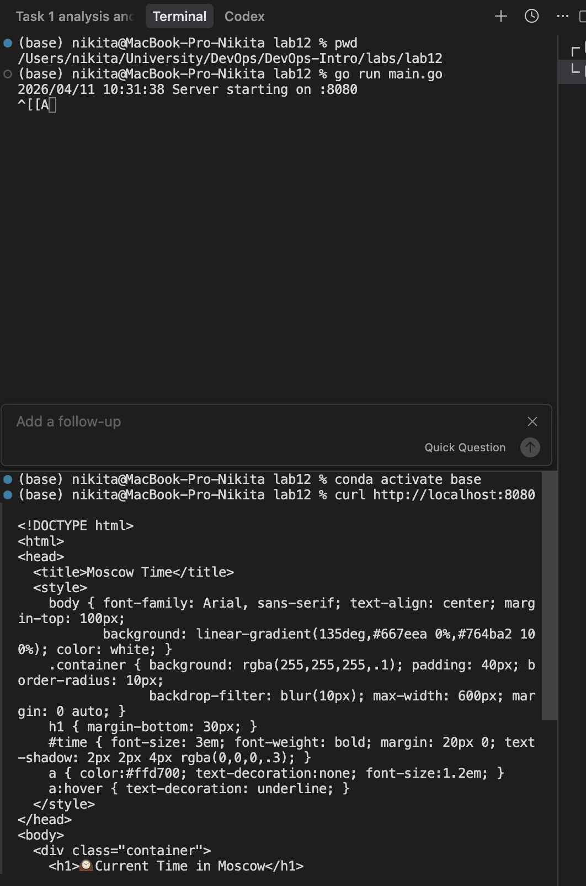

### CLI mode (`MODE=once`)

With `MODE=once`, the program prints Moscow time as indented JSON once and exits. This mode is used later for apples-to-apples startup benchmarks in Docker and WASM, because it does not require a listening socket.

The following screenshot shows `MODE=once go run main.go` in `labs/lab12` with JSON output containing `moscow_time` and `timestamp`.

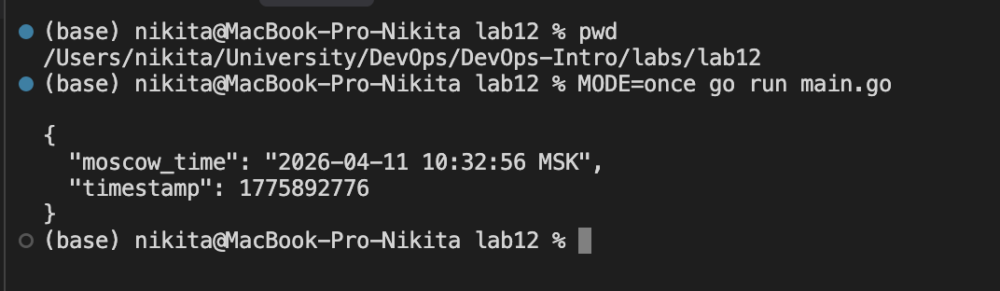

### Server mode in the browser

Server mode was tested locally with `go run main.go` (default path when `MODE` is not `once` and the process is not running under WAGI). The app serves the HTML dashboard on port **8080** and the JSON API at `/api/time`.

The browser screenshot below shows the live page with the current Moscow time and the link to the JSON API.

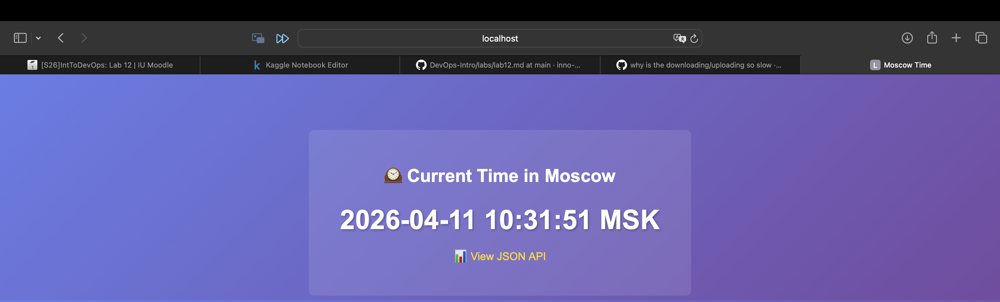

### How one `main.go` supports three execution contexts

The same [`labs/lab12/main.go`](lab12/main.go) file branches at startup based on environment and runtime, so one codebase can target traditional Linux containers, WASI/WASM containers (CLI), and Spin (WAGI) without separate entrypoints.

1. **CLI / benchmark mode (`MODE=once`)**  
   If `os.Getenv("MODE") == "once"`, `main` marshals `getMoscowTime()` to JSON, prints it, and returns. No HTTP server is started, which matches WASI Preview1 constraints for container benchmarks.

2. **Spin WAGI mode**  
   If `MODE` is not `once` and `isWagi()` is true (it checks for a non-empty `REQUEST_METHOD`, which Spin’s WAGI executor sets), `runWagiOnce()` runs. That function reads `PATH_INFO`, writes HTTP status/headers and a blank line to **stdout**, then writes HTML or JSON—CGI/WAGI style—so Spin can treat stdout as the HTTP response without `net/http` listening on a port inside the guest.

3. **Traditional `net/http` server**  
   If neither of the above applies, the program registers `/` and `/api/time` handlers and calls `http.ListenAndServe(":8080", nil)`. This is the path used for local `go run` and for the standard Docker image described in Task 2.

**Supporting details in code:** Moscow time uses `time.FixedZone("MSK", …)` instead of `time.LoadLocation` so minimal WASM/WASI images are not assumed to ship a full timezone database.

Together, these branches implement “write once, compile anywhere”: the same source can be built with the Go toolchain for Linux, with TinyGo for `wasi`, and executed under Spin with the existing WASM binary in WAGI mode.

---

## Task 2 — Build Traditional Docker Container

Work continued in [`labs/lab12/`](lab12/) using the provided multi-stage [`Dockerfile`](lab12/Dockerfile): build stage on `golang:1.21-alpine` with a static Linux binary, run stage `FROM scratch` copying only `/app/moscow-time`.

### Image build

Optional cleanup (`docker rm`, `docker image prune`) was run, then the image was built with:

`docker build -t moscow-time-traditional -f Dockerfile .`

The build completed successfully (multi-stage: builder compiling `main.go`, final stage copying the binary into the scratch-based image).

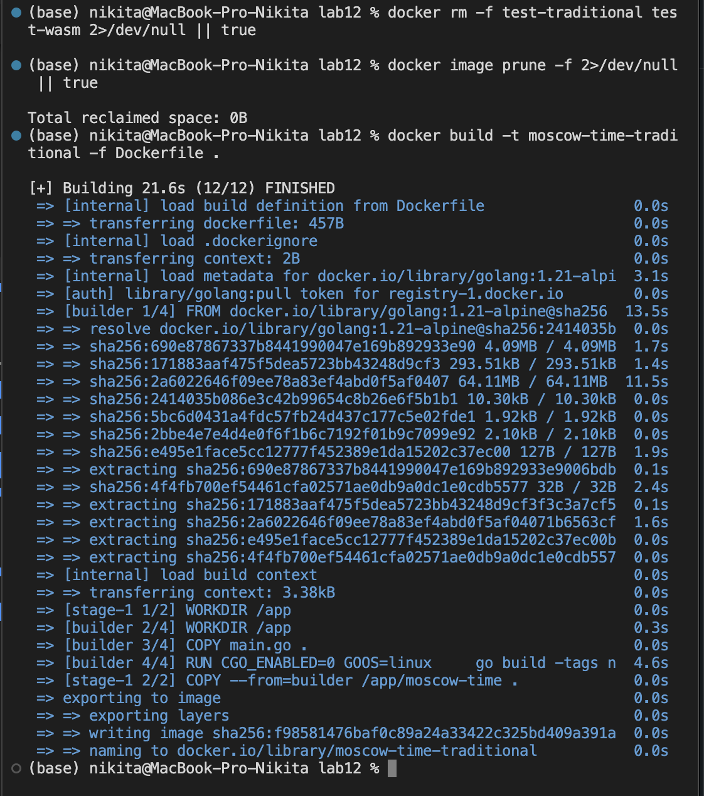

### CLI mode inside the container

`docker run --rm -e MODE=once moscow-time-traditional` prints the same JSON shape as local `MODE=once`, confirming the image runs the intended one-shot path.

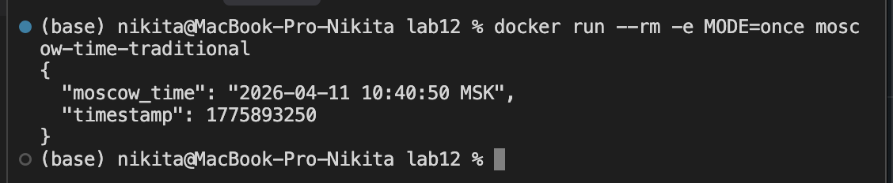

### Binary size (extracted binary)

Following the lab steps, a temporary container was used to copy `/app/moscow-time` to the host, then `ls -lh moscow-time-traditional` was run.

| Metric | Value (from screenshot) |
|--------|-------------------------|
| Host file | `moscow-time-traditional` |
| Size | **4.4M** |

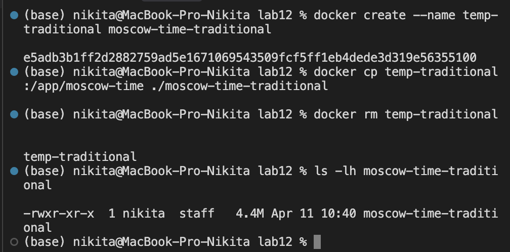

### Image size (`docker images` and `docker image inspect`)

| Source | Value |
|--------|--------|
| `docker images moscow-time-traditional` (SIZE column) | **4.59MB** |
| `docker image inspect … --format '{{.Size}}'` then awk to MB | **4.375 MB** |

The table value is what Docker CLI shows for humans; `inspect` prints exact bytes converted here to mebibytes/binary MB, so the two figures differ slightly in presentation.

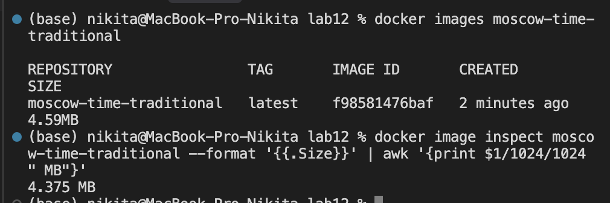

### Startup time (CLI, five runs)

The prescribed loop timed five runs of `docker run --rm -e MODE=once moscow-time-traditional` with `/usr/bin/time -f "%e"` and averaged the last line of each run:

**Reported average:** `Average: 0 seconds` (see terminal capture).

On this machine the printed aggregate rounded to zero; each `docker run` still incurs image/container startup, but wall times were short enough that this particular pipeline printed `0` as the mean.

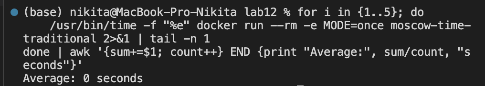

### Memory usage (server mode)

With the server container running:

`docker run --rm --name test-traditional -p 8080:8080 moscow-time-traditional`

a one-shot stats snapshot was taken:

`docker stats test-traditional --no-stream`

| Field | Value |
|--------|--------|
| **MEM USAGE / LIMIT** | **1.309MiB / 19.52GiB** |
| MEM % | 0.01% |
| PIDs | 5 |

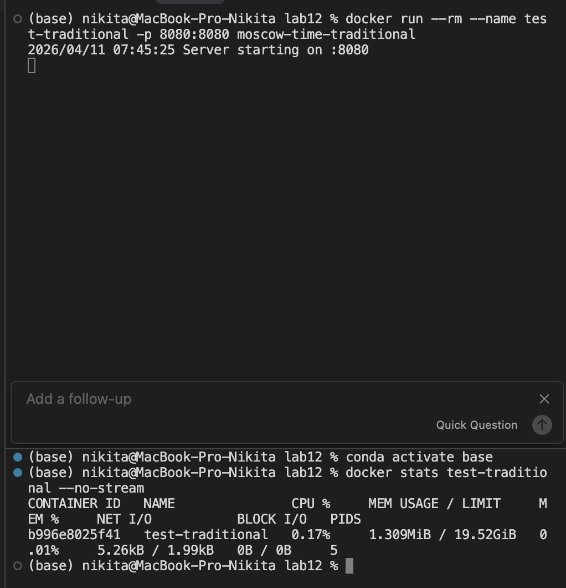

### Server mode (HTTP from container)

Server mode was exercised with port publish and a request from the host:

`docker run --rm -p 8080:8080 moscow-time-traditional`  
`curl http://localhost:8080`

The log line `Server starting on :8080` and the returned HTML (including `<title>Moscow Time</title>` and the same styled shell as local runs) confirm the traditional container serves the app on **8080**.

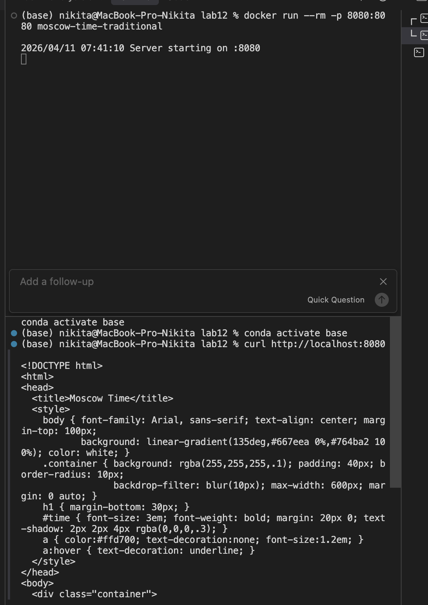

Opening `http://localhost:8080` in a browser while this container is running shows the same Moscow Time UI as in Task 1; the captures above focus on terminal evidence for the containerized server.

---

## Task 3 — Build WASM Container (`ctr` + Wasmtime)

Task 3 uses the **same** [`labs/lab12/main.go`](lab12/main.go) as Tasks 1–2, compiled with **TinyGo** to **`main.wasm`**, packaged with [`Dockerfile.wasm`](lab12/Dockerfile.wasm) into an **OCI layout** (`moscow-time-wasm.oci`), imported into **containerd**, and executed with **`sudo ctr`** and runtime **`io.containerd.wasmtime.v1`**.

### macOS and Colima: issues encountered and how they were resolved

The lab assumes a **Linux** host with a single coherent **containerd + `ctr`** stack. On **macOS**, several friction points showed up in practice:

1. **Docker Buildx OCI export** — With the default Buildx **docker** driver, `--output=type=oci,dest=...` fails (“OCI exporter … not supported for docker driver”). **Fix:** create/use a Buildx builder with the **`docker-container`** driver (`docker buildx create --driver docker-container --bootstrap --use`), then run the `docker buildx build --platform=wasi/wasm …` command again on the **Mac** (where Docker runs).

2. **`ctr` on the Mac vs `ctr` inside Colima** — Running **`sudo ctr` on macOS** often attached to the **wrong or incomplete** `containerd`, producing **`unknown service … Transfer`** or **`… Diff`** during import/unpack. **Fix:** use a **Colima** profile with **`--runtime containerd`**, then run **all** `sudo ctr images import` / `sudo ctr run` commands **only after** `colima ssh -p <profile>` (Linux VM), not from a `MacBook-Pro-…` shell.

3. **No `docker` inside the containerd-only VM** — Inside `colima ssh` with the **containerd** runtime, **`docker` is not installed**. **Fix (split workflow):** build the **OCI archive on the Mac** with Buildx; **import and run WASM** only **inside** the Colima Linux environment (shared mount to `labs/lab12`).

4. **Missing Wasmtime shim** — `ctr run` failed until **`containerd-shim-wasmtime-v1`** was installed under **`/usr/local/bin`** **inside the VM** and **`wasmtime`** was registered in **`/etc/containerd/config.toml`**. The lab’s **Rust-in-Docker** build can take a long time with **little console output** (release builds are CPU-heavy); a **prebuilt** `containerd-shim-wasmtime-*-linux-musl.tar.gz` from the **runwasi** releases is a faster alternative on **aarch64** Colima.

The screenshots below mix **Mac** (TinyGo compile, shim build finish, optional host checks) and **Colima** (`colima-wasm-lab`) where **`ctr`** matches the daemon.

### TinyGo build environment

Compiler image and version (from the lab command line):

| Item | Value |
|------|--------|
| TinyGo image / version | **`tinygo/tinygo:0.39.0`** |

`docker run … tinygo/tinygo:0.39.0 tinygo build -o main.wasm -target=wasi main.go` was used on the Mac; `ls -lh` and `file` confirm the artifact.

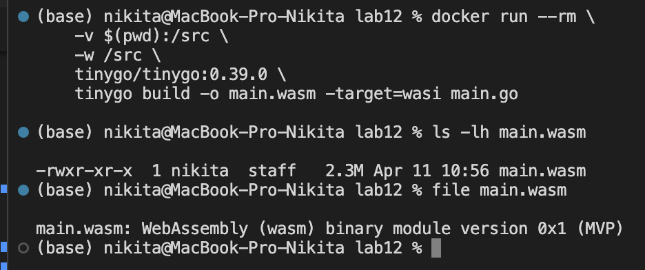

### WASM binary and imported image size

Inside the Colima Linux environment (`colima-wasm-lab`), **`main.wasm`** size and the **`ctr`** image listing (filtered for `moscow-time-wasm`) were captured:

| Artifact | Size (from screenshot) |
|----------|-------------------------|
| `main.wasm` (`ls -lh`) | **2.4M** |
| `docker.io/library/moscow-time-wasm:latest` (`ctr images ls` …) | **819.9** (KiB in `ctr`’s size column; matches ~820 KiB OCI image footprint) |

*(An earlier Mac-only `ls` in another capture showed **2.3M** for the same build pipeline—small differences can come from rebuild timing or rounding in `ls -h`.)*

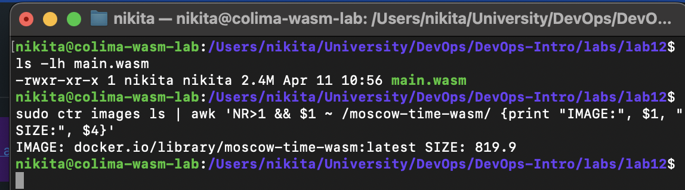

### Wasmtime shim build (Docker / Rust on Mac)

The runwasi **`containerd-shim-wasmtime`** release build completed in **`4m 08s`** in the lab’s `rust:slim-bookworm` container, then the binary was copied to the host tree for installation into the VM.

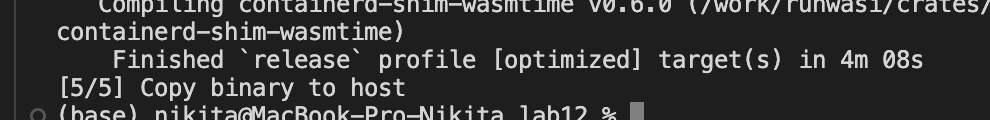

### containerd configuration (wasmtime runtime)

The active config includes a **`wasmtime`** runtime next to **`runc`**, with **`BinaryName = '/usr/local/bin/containerd-shim-wasmtime-v1'`** (screenshot taken on the **Mac** while inspecting config; the **same** pattern was applied inside Colima where **`ctr run`** actually executes).

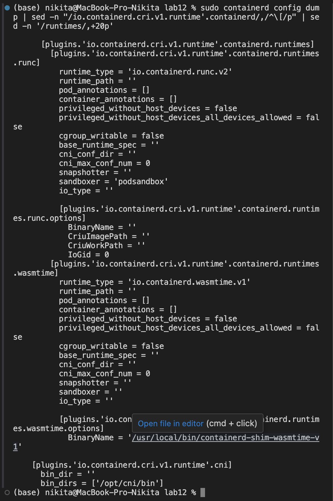

### Shim on disk and `ctr` / containerd version (host check)

The shim was verified under **`/usr/local/bin`**, and **`sudo ctr version`** reported **Client** and **Server** at **2.2.2** on the machine where that command was run (host verification capture).

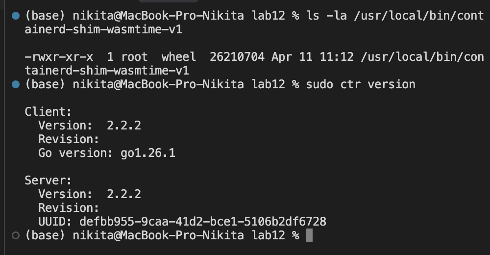

Additional host check of the installed shim path:

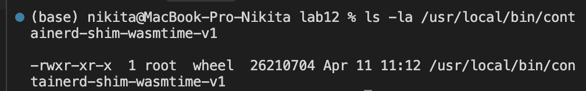

### Running the WASM image with `ctr` (Colima)

Inside **`colima ssh`**, the shim from the mounted repo was installed to **`/usr/local/bin`**, then:

```bash
sudo ctr run --rm \
  --runtime io.containerd.wasmtime.v1 \
  --platform wasi/wasm \
  --env MODE=once \
  docker.io/library/moscow-time-wasm:latest wasi-once
```

returned JSON with **`moscow_time`** and **`timestamp`**, confirming **CLI mode** under WASI.

Running **without** `MODE=once` shows the expected **WASI Preview1** limitation: the app prints **`Server starting on :8080`** then **`Netdev not set`** — no TCP listener inside plain WASI under `ctr`.

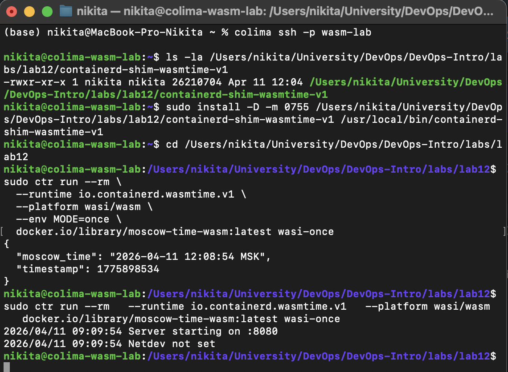

### Startup time benchmark (CLI, five runs)

The lab’s five-run loop with unique container names was executed on **`colima-wasm-lab`**. The captured aggregate line is:

**`Average: 0.0000 seconds`**

As with Task 2’s Docker timing, sub-second runs and how **`/usr/bin/time`** output is piped can collapse to a printed zero average; the important evidence is that **five successful `ctr run` invocations** completed and the script produced this mean.

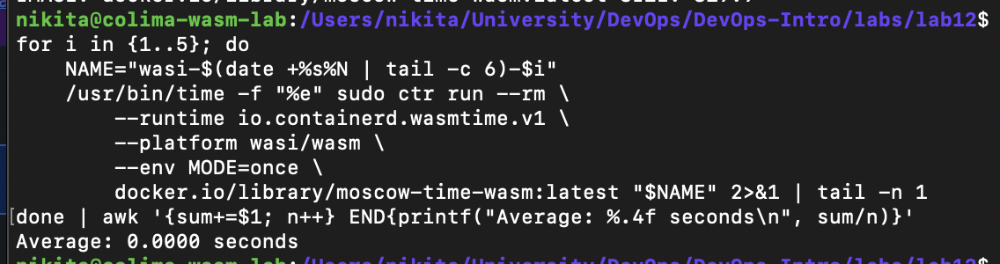

### Memory usage via `ctr`

**N/A — not meaningfully exposed through `ctr` for this WASM path.** Wasmtime manages guest memory inside the runtime; unlike a Linux **`runc`** container, **`docker stats` / cgroup-style MEM USAGE** does not apply in the same way, so the lab’s “document N/A” guidance is followed here.

---

## Task 4 — Performance Comparison & Analysis

All numbers below come from **Tasks 2–3** of this submission unless noted. Both targets were built from the **same** [`labs/lab12/main.go`](lab12/main.go).

### Comparison table

| Metric | Traditional container | WASM container | Improvement | Notes |
|--------|----------------------|----------------|-------------|-------|
| **Binary size** | **4.4 MiB** (`ls -lh moscow-time-traditional`) | **2.4 MiB** (`ls -lh main.wasm` on `colima-wasm-lab`) | **~45% smaller** | `((4.4 - 2.4) / 4.4) × 100 ≈ 45%` using the rounded `ls -h` figures from screenshots. |
| **Image size** | **4.375 MiB** (`docker image inspect` → MB) | **~0.80 MiB** (819.9 KiB from `ctr images ls` for `moscow-time-wasm:latest`) | **~82% smaller** | `((4.375 - 0.8007) / 4.375) × 100 ≈ 82%` with `819.9 KiB ≈ 0.8007 MiB`. |
| **Startup time (CLI)** | **~0 s printed** (5× `docker run … MODE=once`; see Task 2) | **0.0000 s printed** (5× `ctr run … MODE=once`; see Task 3) | **Not quantified** | Both averages **rounded to zero** in the captured shell pipelines, so a numeric **speed factor** (traditional ÷ WASM) cannot be claimed from these logs alone. Qualitatively, WASM + Wasmtime is expected to be light vs full `docker run` + `runc` + overlay setup. |
| **Memory usage** | **1.309 MiB** (`docker stats`, server mode) | **N/A** (`ctr` / Wasmtime path) | **N/A** | No comparable cgroup **MEM USAGE** for the WASM run as documented in Task 3. |
| **Base image** | `scratch` | `scratch` | Same | Both images are minimal OCI layers around a single artifact. |
| **Source code** | `main.go` | `main.go` | Identical | Same file; different toolchains (`go build` vs TinyGo `wasi`). |
| **Server mode** | Works (`net/http` on `:8080`) | Not under plain `ctr` / WASI Preview1; **Spin (WAGI)** can reuse `main.wasm` | N/A | WASM capture shows **`Netdev not set`** when binding a TCP port under WASI. |

**Figures behind the table:** binary and image evidence in `img/binary_sizes.png`, `img/docker_sizes.png`, `img/wasm_size.png`; startup in `img/startup_time.png`, `img/wasm_runtime.png`; memory in `img/memory_usage.png`; WASM server limitation in `img/wasm_colima_run.png`.

### Improvement calculations (lab formulas)

- **Binary size reduction:** `((4.4 - 2.4) / 4.4) × 100 ≈ 45.5%` → reported **~45%** (rounded `ls -h` values).
- **Image size reduction:** `((4.375 - (819.9 / 1024)) / 4.375) × 100 ≈ 81.7%` → reported **~82%** (819.9 KiB converted to MiB for the denominator).
- **Speed factor:** not computed — **both** measured averages appeared as **zero** in the lab scripts; a fair ratio needs per-run times (for example `%.3f` from `time` or logging each run).
- **Memory reduction %:** not computed — WASM side **N/A** in `docker stats` sense.

### 4.2 — Analysis questions

#### 1. Binary size comparison

**Why is the WASM binary much smaller than the traditional Go binary?**  
The traditional image uses the **standard Go** toolchain (`CGO_ENABLED=0`, static `linux` build with the full runtime and a large slice of **`net/http`**, reflection, scheduler, and GC metadata). **TinyGo** targets **WASI** with a **much smaller** runtime: a reduced standard library surface, aggressive **dead-code elimination**, and a compilation model suited to **embedded / WASM** rather than a full server-class `cmd/compile` binary. The WASM module only needs what the program actually uses for the **`MODE=once`** path and minimal WASI imports, not an entire native networking stack linked for Linux.

**What did TinyGo “optimize away”?**  
In practice: unused packages and functions, large parts of the **full** Go runtime that are irrelevant on WASI, and much of the **native** `net/http` server stack when only CLI-style output is required. Debug/DWARF bulk is also lower in typical TinyGo release builds compared to an un-stripped mental picture of a full Go binary (your traditional build still uses `-ldflags="-s -w"` etc., but the **remaining** native binary is inherently larger than a WASI module for this app).

#### 2. Startup performance

**Why can WASM start faster (in general)?**  
A WASI workload is a **compact module** loaded by a **Wasmtime** shim: less work than unpacking a full **OCI rootfs**, configuring **overlay** mounts, and starting a **`runc`** container lifecycle for a Linux process. The “unit of work” for one CLI invocation is closer to **spawn shim → load WASM → run `_start` → exit** than **full container create**.

**What initialization overhead exists for traditional containers?**  
`docker run` pulls client-side state, talks to **containerd**, creates **namespaces**, mounts **layers**, sets up **cgroups** (where applicable), starts **`containerd-shim-runc-v2`**, execs the binary in a **namespaced** Linux environment, then tears it down on `--rm`. Each step adds latency compared to a short-lived WASM task, even when wall-clock time is hard to see in coarse `time` output.

#### 3. Use case decision matrix

**When to prefer WASM (e.g. TinyGo + WASI + Wasmtime / Spin):**

- **Strong isolation** and **small blast radius** (guest is a module, not a full Linux userland).
- **Tiny artifacts** and **fast cold starts** matter (edge, high churn, per-request workers).
- **Policy** or **multi-tenant** environments that want sandboxed extensions (no arbitrary syscalls by default).
- **HTTP at the edge** via a platform that supplies networking (**Spin / WAGI**), not raw TCP inside WASI Preview1.

**When to stay with traditional containers:**

- You need **full Linux**: arbitrary syscalls, **native** TCP/UDP servers, **many** databases/drivers, **cgo**, or **long-lived** processes with familiar **observability** (`docker stats`, standard agents).
- **Mature** ecosystem requirements (sidecars, volume plugins, privileged caps) map more naturally to **OCI + runc** than to **WASI Preview1**.

**Recommendation:** treat **WASM + containerd/Spin** as a **specialized** runtime for **small, portable, sandboxed** workloads; keep **Docker + runc** as the default for **general server** and **legacy** stacks. This lab’s **same `main.go`** shows where the boundary lies: **CLI** works everywhere; **raw TCP server** under `ctr` does not, while **Spin** can reuse the **same WASM** with an external HTTP front end.
