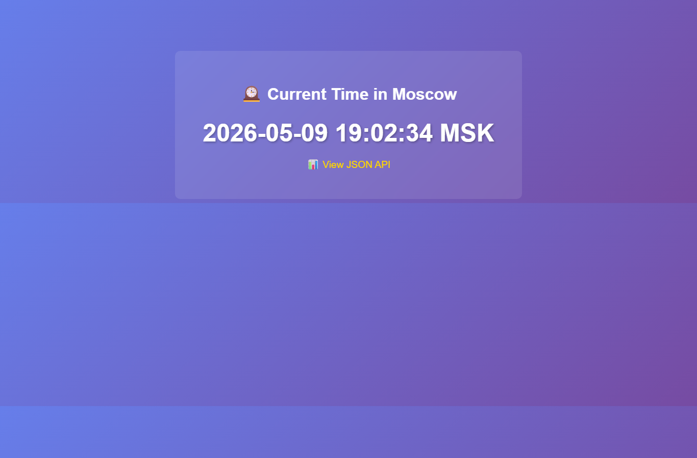
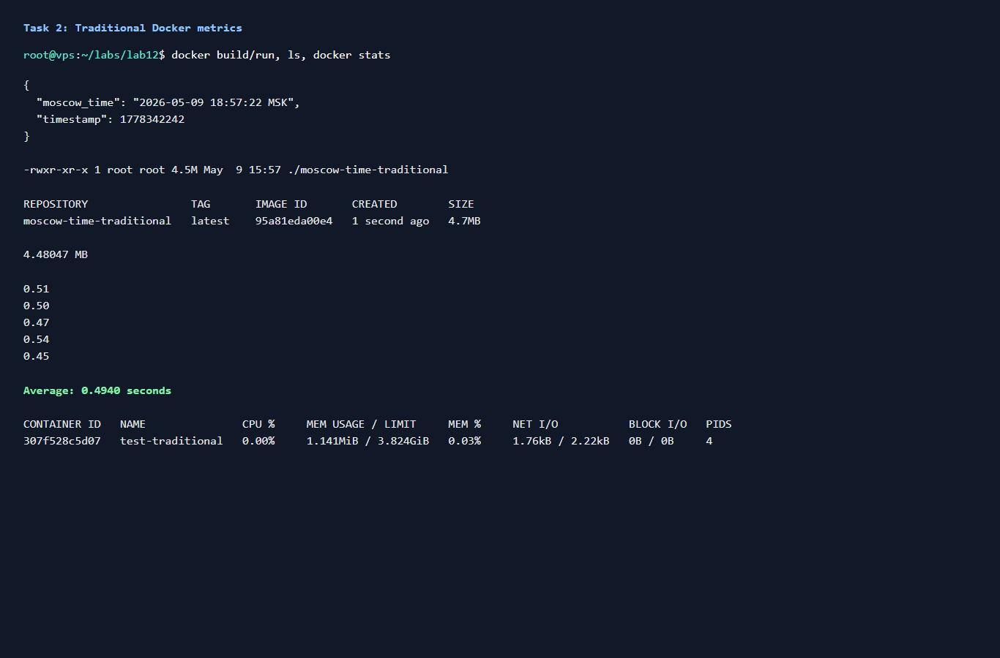
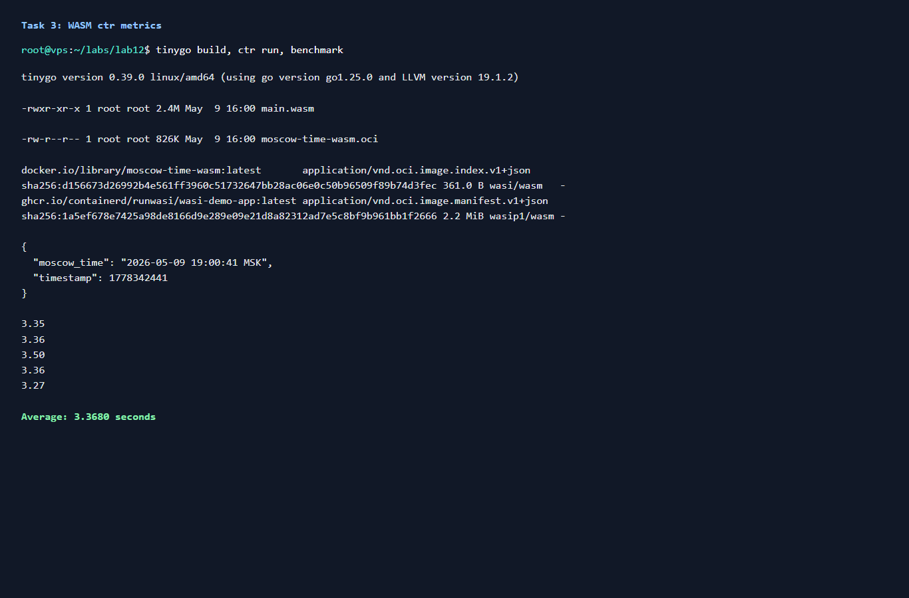

# Lab 12 — WebAssembly Containers vs Traditional Containers

## Task 1 — Create the Moscow Time Application

### Рабочая директория

Я работала в директории `labs/lab12/`. В ней уже были нужные файлы:

```text
Dockerfile
Dockerfile.wasm
main.go
spin.toml
```

### Как один `main.go` работает в разных режимах

В `main.go` есть три сценария выполнения:

- `MODE=once` — CLI mode: программа один раз печатает JSON с московским временем и завершает работу.
- обычный server mode — если `MODE=once` не задан и нет WAGI-переменных, запускается `net/http` сервер на `:8080`.
- WAGI mode для Spin — если есть `REQUEST_METHOD`, программа отвечает через stdout в CGI/WAGI-формате.

Для WASM-окружения важно, что код использует:

```go
time.FixedZone("MSK", 3*60*60)
```

Так приложение не зависит от timezone database внутри минимального WASM runtime.

### CLI mode

Команда:

```bash
MODE=once go run main.go
```

Вывод:

```json
{
  "moscow_time": "2026-05-09 18:56:46 MSK",
  "timestamp": 1778342206
}
```


### Server mode

Server mode проверяла через HTTP-запросы к приложению. Эндпоинт `/api/time` вернул JSON:

```text
HTTP/1.1 200 OK
Content-Type: application/json

{"moscow_time":"2026-05-09 18:56:49 MSK","timestamp":1778342209}
```

Браузерный скриншот приложения я сделала уже на traditional Docker container в Task 2, потому что это тот же `main.go`, тот же `net/http` server mode и тот же HTML.

## Task 2 — Build Traditional Docker Container

### Dockerfile

В `labs/lab12/Dockerfile` используется multi-stage build:

```dockerfile
FROM golang:1.21-alpine AS builder

WORKDIR /app
COPY main.go .

RUN CGO_ENABLED=0 GOOS=linux \
    go build -tags netgo -trimpath \
    -ldflags="-s -w -extldflags=-static" \
    -o moscow-time main.go

FROM scratch

WORKDIR /app
COPY --from=builder /app/moscow-time .

EXPOSE 8080
ENTRYPOINT ["/app/moscow-time"]
```

Смысл такой: сначала Go собирает статический бинарник, потом в финальном image остается только этот бинарник на базе `scratch`.

### Сборка и CLI test

Команды:

```bash
docker build -t moscow-time-traditional -f Dockerfile .
docker run --rm -e MODE=once moscow-time-traditional
```

Вывод CLI mode внутри контейнера:

```json
{
  "moscow_time": "2026-05-09 18:57:22 MSK",
  "timestamp": 1778342242
}
```

### Binary size

Я достала бинарник из image и проверила размер:

```bash
docker create --name temp-traditional moscow-time-traditional
docker cp temp-traditional:/app/moscow-time ./moscow-time-traditional
docker rm temp-traditional
ls -lh ./moscow-time-traditional
file ./moscow-time-traditional
```

Вывод:

```text
-rwxr-xr-x 1 root root 4.5M May  9 15:57 ./moscow-time-traditional
./moscow-time-traditional: ELF 64-bit LSB executable, x86-64, statically linked, stripped
```

Traditional binary size: **4.5 MB**.

### Image size

Команды:

```bash
docker images moscow-time-traditional
docker image inspect moscow-time-traditional --format '{{.Size}}' | awk '{print $1/1024/1024 " MB"}'
```

Вывод:

```text
REPOSITORY                TAG       IMAGE ID       CREATED        SIZE
moscow-time-traditional   latest    95a81eda00e4   1 second ago   4.7MB

4.48047 MB
```

Traditional image size: **4.7 MB** по `docker images`, точнее **4.48047 MB** через `docker image inspect`.

### Startup time

Команда benchmark:

```bash
for i in 1 2 3 4 5; do
  /usr/bin/time -f "%e" sh -c 'docker run --rm -e MODE=once moscow-time-traditional >/dev/null' 2>&1
done | awk '{sum+=$1; count++} END {printf("Average: %.4f seconds\n", sum/count)}'
```

Результаты пяти запусков:

```text
0.51
0.50
0.47
0.54
0.45
Average: 0.4940 seconds
```

Average startup time: **0.4940 s**.

### Server mode и memory usage

Я запустила traditional container как HTTP server:

```bash
docker run -d --rm --name test-traditional -p 18080:8080 moscow-time-traditional
curl -i http://127.0.0.1:18080/api/time
docker stats test-traditional --no-stream
```

JSON API ответил:

```text
HTTP/1.1 200 OK
Content-Type: application/json

{"moscow_time":"2026-05-09 18:57:29 MSK","timestamp":1778342249}
```

Memory usage:

```text
CONTAINER ID   NAME               CPU %     MEM USAGE / LIMIT     MEM %     NET I/O           BLOCK I/O   PIDS
307f528c5d07   test-traditional   0.00%     1.141MiB / 3.824GiB   0.03%     1.76kB / 2.22kB   0B / 0B     4
```

Memory usage: **1.141 MiB**.





## Task 3 — Build WASM Container with ctr

### TinyGo version

Команда:

```bash
docker run --rm tinygo/tinygo:0.39.0 tinygo version
```

Вывод:

```text
tinygo version 0.39.0 linux/amd64 (using go version go1.25.0 and LLVM version 19.1.2)
```

### WASM build из того же `main.go`

Для WASM я использовала тот же самый `main.go`, без изменений:

```bash
docker run --rm \
  --user 0:0 \
  -e TMPDIR=/tmp \
  -v "$PWD:/src" \
  -w /src \
  tinygo/tinygo:0.39.0 \
  tinygo build -o main.wasm -target=wasi main.go
```

Проверка бинарника:

```bash
ls -lh main.wasm
file main.wasm
```

Вывод:

```text
-rwxr-xr-x 1 root root 2.4M May  9 16:00 main.wasm
main.wasm: WebAssembly (wasm) binary module version 0x1 (MVP)
```

WASM binary size: **2.4 MB**.

### Dockerfile.wasm

Файл `labs/lab12/Dockerfile.wasm`:

```dockerfile
FROM scratch
COPY main.wasm /main.wasm
EXPOSE 8080
ENTRYPOINT ["/main.wasm"]
```

Здесь image содержит только `main.wasm`. `EXPOSE 8080` остается информационным, потому что plain WASI Preview1 не дает обычный TCP socket.

### Build OCI archive и import в containerd

Команды:

```bash
docker buildx build \
  --builder lab12builder \
  --platform=wasi/wasm \
  --provenance=false \
  -f Dockerfile.wasm \
  --output type=oci,dest=moscow-time-wasm.oci \
  .

ctr images import --all-platforms \
  --index-name docker.io/library/moscow-time-wasm:latest \
  moscow-time-wasm.oci

ctr images ls | grep -E 'moscow-time-wasm|wasi|wasm'
```

OCI archive:

```text
-rw-r--r-- 1 root root 826K May  9 16:00 moscow-time-wasm.oci
moscow-time-wasm.oci: POSIX tar archive
```

Containerd image entry:

```text
docker.io/library/moscow-time-wasm:latest application/vnd.oci.image.index.v1+json sha256:d156673d26992b4e561ff3960c51732647bb28ac06e0c50b96509f89b74d3fec 361.0 B wasi/wasm -
```

В отчете я использую два значения:

- practical artifact size: **826 KB** для `moscow-time-wasm.oci`;
- `ctr images ls` entry size: **361.0 B**, потому что containerd показывает размер index metadata, а не всего tar artifact.

### Запуск WASM container через ctr

Команда:

```bash
ctr run --rm \
  --runtime io.containerd.wasmtime.v1 \
  --platform wasi/wasm \
  --env MODE=once \
  docker.io/library/moscow-time-wasm:latest wasi-once
```

Вывод:

```json
{
  "moscow_time": "2026-05-09 19:00:41 MSK",
  "timestamp": 1778342441
}
```

Это подтверждает, что WASM container был запущен именно через `ctr` и runtime `io.containerd.wasmtime.v1`.

### WASM startup benchmark

Команда:

```bash
for i in 1 2 3 4 5; do
  NAME="wasi-$(date +%s%N)-$i"
  /usr/bin/time -f "%e" sh -c "ctr run --rm --runtime io.containerd.wasmtime.v1 --platform wasi/wasm --env MODE=once docker.io/library/moscow-time-wasm:latest $NAME >/dev/null" 2>&1
done | awk '{sum+=$1; n++} END {printf("Average: %.4f seconds\n", sum/n)}'
```

Результаты:

```text
3.35
3.36
3.50
3.36
3.27
Average: 3.3680 seconds
```

Average WASM startup time: **3.3680 s**.



### Почему server mode не работает через plain ctr

Я запустила WASM image без `MODE=once`:

```bash
ctr run --rm \
  --runtime io.containerd.wasmtime.v1 \
  --platform wasi/wasm \
  docker.io/library/moscow-time-wasm:latest wasi-server
```

Вывод:

```text
2026/05/09 16:01:01 Server starting on :8080
2026/05/09 16:01:01 Netdev not set
```

Причина: WASI Preview1 не предоставляет обычные TCP sockets. Поэтому `net/http` server path из `main.go` не может открыть порт под plain `ctr` + Wasmtime runtime. Это ожидаемое ограничение.

HTTP server mode для того же WASM binary можно запускать через Spin/WAGI, потому что Spin сам предоставляет HTTP layer и передает запрос в программу через CGI-style environment variables. Spin Cloud bonus я не выполняла, но код и `spin.toml` уже готовы для такого режима.

Memory usage для WASM через `ctr`: **N/A**. В этом запуске нет обычного `docker stats`-style accounting, потому что WASM выполняется через runtime shim и Wasmtime управляет памятью модуля иначе.


## Task 4 — Performance Comparison & Analysis

### Comparison table

| Metric | Traditional Container | WASM Container | Result | Notes |
| --- | --- | --- | --- | --- |
| Binary size | 4.5 MB | 2.4 MB | WASM на 46.67% меньше | `ls -lh` |
| Image/artifact size | 4.48047 MB | 826 KB OCI archive | WASM artifact примерно на 82.0% меньше | `docker image inspect` vs `moscow-time-wasm.oci` |
| Startup time CLI | 0.4940 s | 3.3680 s | Traditional примерно в 6.82x быстрее | average of 5 runs |
| Memory usage | 1.141 MiB | N/A via `ctr` | N/A | `docker stats` есть для Docker, но не в том же виде для `ctr` WASM |
| Base image | `scratch` | `scratch` | одинаково | оба минимальные |
| Source code | `main.go` | `main.go` | одинаково | один и тот же файл |
| Server mode | works via `net/http` | not via plain `ctr`; possible via Spin/WAGI | limitation | WASI Preview1 lacks sockets |

### Calculations

Binary size reduction:

```text
((4.5 - 2.4) / 4.5) * 100 = 46.67%
```

WASM binary получился примерно на **46.67% меньше**.

Image/artifact size reduction:

```text
826 KB = 0.8066 MB
((4.48047 - 0.8066) / 4.48047) * 100 ≈ 82.0%
```

WASM OCI artifact получился примерно на **82.0% меньше**.

Startup comparison:

```text
3.3680 / 0.4940 ≈ 6.82
```

В моем окружении WASM container через `ctr` стартовал медленнее, а traditional container был примерно в **6.82 раза быстрее**.

### 1. Почему WASM binary меньше

WASM binary меньше, потому что TinyGo использует более легкий runtime и агрессивнее выкидывает неиспользуемые части стандартной библиотеки. Обычный Go binary — это полноценный Linux ELF со стандартным Go runtime, даже если он stripped и static. TinyGo под WASI оставляет только то, что нужно для этой программы.

Для этого приложения TinyGo фактически убрал много лишнего runtime-кода, который нужен обычным Go-приложениям, но не нужен простому JSON output и WAGI-style handling.

### 2. Почему startup получился таким

Ожидание у WASM часто такое: маленький artifact и быстрый startup. Но в моем конкретном запуске WASM оказался медленнее.

Причина в измеряемом пути:

- `ctr` создает запуск через containerd;
- подключается `containerd-shim-wasmtime-v1`;
- Wasmtime инстанцирует WASM module;
- после этого уже выполняется CLI mode.

Traditional container был очень минимальным: static Go binary, `scratch`, без shell и package manager. Поэтому overhead обычного Docker container здесь оказался меньше, чем overhead `ctr` + shim + Wasmtime.

### 3. Когда выбрать WASM, а когда traditional containers

Я бы выбрала WASM, если:

- нужен маленький переносимый artifact;
- приложение хорошо работает как short-lived CLI/job;
- нужен sandbox с более жесткими ограничениями;
- runtime предоставляет HTTP abstraction, например Spin/WAGI;
- важна переносимость между WASI-compatible runtimes.

Я бы выбрала traditional container, если:

- нужен обычный `net/http` server с TCP sockets;
- нужна привычная observability: `docker logs`, `docker stats`, стандартные probes;
- приложение идет в обычный Docker/Kubernetes deployment;
- важнее предсказуемый runtime behavior, чем минимальный artifact size.

### Итог

Главный результат: один и тот же `main.go` был использован для обоих target:

- traditional Docker: native Linux binary + `net/http`;
- WASM container: TinyGo WASI module + CLI mode через `ctr`;
- Spin/WAGI support уже заложен в код, но cloud bonus не выполнялся.
