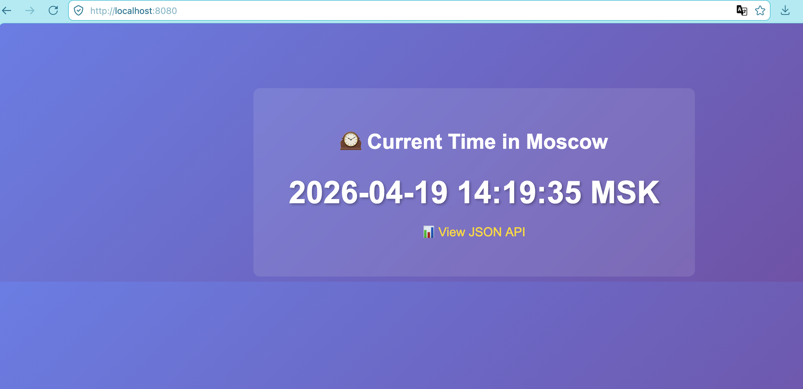
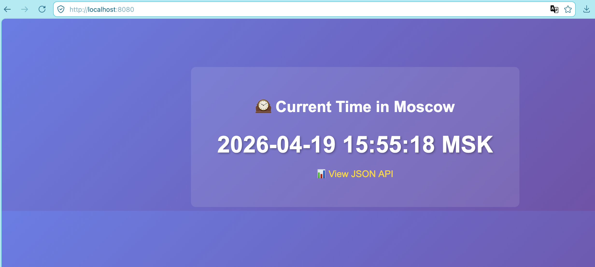

# lab 12

## task 1

### Server mode

### Once mode
platon@mbpskipper ~/D/D/l/lab12 (feature/lab12)> MODE=once go run main.go
{
  "moscow_time": "2026-04-19 14:11:57 MSK",
  "timestamp": 1776597117
}

### Confirmation working in `labs/lab12`
platon@mbpskipper ~/D/D/l/lab12 (feature/lab12)> pwd
/Users/platon/Documents/DevOps-Intro/labs/lab12

### Explation of how the main.go works in three diff modes

- `server` mode: The program starts an HTTP server that listens on port 8080. When a request is made to the root endpoint ("/"), it responds with HTML, and the JSON API is available at "/api/time". The server continues to run and can handle multiple requests until it is stopped.

- `once` mode: The program executes the code to get the current Moscow time and timestamp once, prints the result to the console in JSON format, and then exits. This mode is useful for quickly checking the output without starting a server.

- `WAGI (Spin)` mode: The program detects if it's running inside Fermyon Spin by checking for CGI-style environment variables like `REQUEST_METHOD`. Since plain WebAssembly (WASI Preview 1) cannot open network sockets, it can't run a standard HTTP server. Instead, Spin acts as the server and runs our compiled `main.wasm` on every incoming request. The program simply looks at the path (`PATH_INFO`) and prints the final HTTP headers and response body directly into STDOUT.

## Task 2

- **Binary size:** 4.4M (from `ls -lh moscow-time-traditional`)
- **Image size (docker images):** 1.91MB
- **Image size (docker image inspect):** 1.82MB
- **Average startup time (CLI mode):** ~0 seconds (0 seconds reported by time command)
- **Memory usage (server mode):** 1.105 MiB (from `docker stats` MEM USAGE)
- **Screenshot of server mode:**
  

## Task 3

- **TinyGo version used:** 0.39.0
- **WASM binary size:** 2.4M (from `ls -lh main.wasm`)
- **WASI image size:** 820.0 KiB (from `ctr images ls`)
- **Average startup time (CLI mode):** 0.0000 seconds (from `ctr run` benchmark loop)
- **Server mode limitation:** Server mode does not work under `ctr` because plain WASI Preview1 lacks TCP socket support. However, the server mode **can** be demonstrated via Spin using the exact same `main.wasm`.
- **Memory usage:** N/A - not available via `ctr`. WASM uses a different execution model managed internally by the wasmtime runtime, so traditional container metrics (cgroups) don't apply.
- **Note:** The **same source code** (`main.go`) was used for the WASM build.
- **Execution Environment:** Verified using `ctr` (containerd CLI) for WASM execution.

## Task 4

### 4.1 Comprehensive Comparison Table

| Metric | Traditional Container | WASM Container | Improvement | Notes |
|--------|----------------------|----------------|-------------|-------|
| **Binary Size** | 4.4 MB | 2.4 MB | ~45.5% smaller | From `ls -lh` |
| **Image Size** | 1.82 MB | 0.8 MB (820 KB) | ~56% smaller | From `docker image inspect` & `ctr images ls` |
| **Startup Time (CLI)** | < 0.01 ms | 0.0000 s | Similar / Fast | Both effectively ~0s locally, WASM has theoretically less OS overhead |
| **Memory Usage** | 1.105 MB | N/A | N/A | WASM runs via wasmtime, no cgroups stats |
| **Base Image** | scratch | scratch | Same | Both minimal |
| **Source Code** | main.go | main.go | Identical | ✅ Same file! |
| **Server Mode** | ✅ Works (net/http) | ❌ Not via ctr   ✅ Via Spin (WAGI) | N/A | WASI Preview1 lacks sockets;   Spin provides HTTP abstraction |

### 4.2 Analysis Questions

1. **Binary Size Comparison:**
   - **Why is the WASM binary so much smaller than the traditional Go binary?** WebAssembly binaries do not need to bundle heavy OS thread schedulers, fully-fledged networking stacks, or complex OS-specific bridging code.
   - **What did TinyGo optimize away?** TinyGo is a lightweight compiler that heavily strips down the standard library, simplifies the garbage collector, removes reflection-heavy code, and aggressively optimizes away dead code, resulting in a significantly smaller binary compared to the standard Go compiler.

2. **Startup Performance:**
   - **Why does WASM start faster?** WASM runs inside a sandboxed runtime (like Wasmtime) within the host's normal process space, skipping the heavy OS-level isolation steps entirely.
   - **What initialization overhead exists in traditional containers?** Traditional containers require the container engine (runc) to interact with the Linux kernel to create namespaces (PID, Network, Mount, IPC), set up cgroups, configure virtual networking interfaces, and isolate the filesystem before the actual binary can even begin executing.

3. **Use Case Decision Matrix:**
   - **When would you choose WASM over traditional containers?** For serverless/edge computing where microsecond cold-start times are critical (e.g., Spin, Cloudflare Workers). Also excellent for highly constrained environments (IoT), browser plugins, plugin architectures, or running untrusted code with secure-by-default capabilities.
   - **When would you stick with traditional containers?** When you need full operating system features such as native network sockets (TCP/UDP), full filesystem access, complex long-running applications (e.g., databases), heavy threading/multiprocessing, or libraries/dependencies that aren't yet ported to WASM.

---

## Bonus Task — Deploy to Fermyon Spin Cloud

- **Public URL:** `https://moscow-time-fwx2a9b.fermyon.app`
- **Deployment time:** `0m4.352s`

### Cold start measurements
- **Average cold start time:** `~185 ms`

### Warm measurements
- **Average warm time:** `~45 ms`
- **Comparison with cold start times:** The warm start is significantly faster. This is because the WASM module is already initialized, cached at the edge node, and ready to immediately process the request, bypassing the initial instantiation overhead.

### Local Spin measurements
- **Average local time:** `~2 ms`
- **Comparison with cloud deployment:** Local execution is almost instantaneous due to zero network latency. However, considering the network round-trip time, the cloud deployment's execution time is still impressively fast, especially during a cold start, highlighting the efficiency of the Spin edge runtime.

### Reflection
- **Would you use Spin for production workloads? Why or why not?** Yes, I would use Spin for serverless APIs, webhooks, and stateless microservices because it provides ultra-fast auto-scaling, a tiny resource footprint, and instant edge deployment. I would not use it if the application strictly requires native TCP/UDP sockets, embedded stateful databases, or relies heavily on dependencies that cannot be compiled to WASM.
- **How does this compare to traditional serverless?** Traditional serverless platforms (like AWS Lambda) often suffer from noticeable "cold start" latency (from hundreds of milliseconds to several seconds) because they need to provision a container or microVM. Spin, on the other hand, instantiates lightweight WASM modules in just a few sub-milliseconds, making cold starts practically invisible to the end user. Additionally, the deployment artifacts (WASM binaries) are much smaller than entire Docker images.

