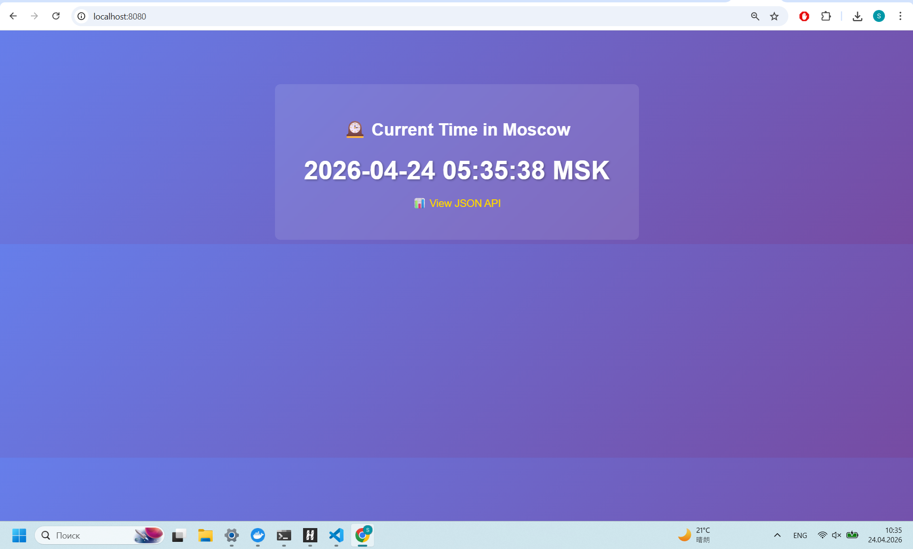
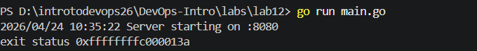
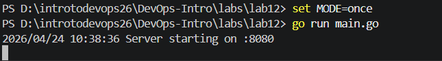
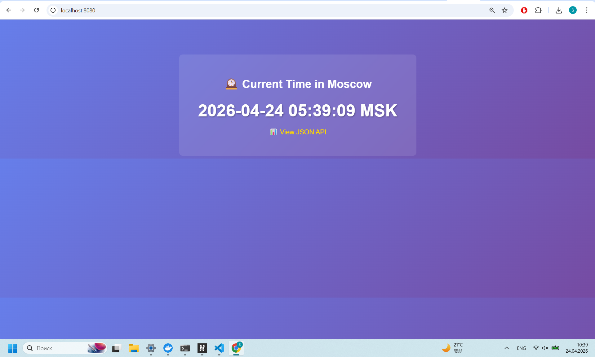

# Lab 12 — WebAssembly Containers vs Traditional Containers

## Task 1 — Create the Moscow Time Application (2 pts)

**Working Directory:** `labs/lab12/`
**Source Code:** `main.go`

**How the single `main.go` works in three different contexts:**
- **CLI Mode (`MODE=once`):** The application detects the `MODE` environment variable. If set to `once`, it prints a JSON response containing the current Moscow time and exits. This mode is used for consistent benchmarking without network dependencies.
- **Server Mode:** If `MODE` is not set and the WAGI environment variables are absent, the application falls back to the standard `net/http` server. It serves an HTML page on `/` and a JSON API endpoint on `/api/time` at port `:8080`.
- **WAGI Mode (Spin):** The `isWagi()` function checks for the presence of the `REQUEST_METHOD` environment variable, which is set by the Spin executor. If detected, the application runs in a CGI-style context, printing HTTP headers and the response body to STDOUT for a single request cycle.

**Testing Results:**
- **CLI Mode Output:** Output of `MODE=once go run main.go`:
  ```json
  {"moscow_time":"2026-04-23 18:28:55 MSK","timestamp":1776958135}

- **Server Mode:** Successfully tested in a browser (see Fig. 1). The application correctly returns HTML and JSON data.

- **Confirmation:** All work for this task was performed directly in the labs/lab12/ directory.









## Task 2 — Build Traditional Docker Container (3 pts)

A traditional Docker container was built using the provided `Dockerfile`, which utilizes a multi-stage build process and a `scratch` base image for minimal footprint.

### Build Command:
```bash
docker build -t moscow-time-traditional -f Dockerfile .
```
**Performance Measurements:**

### Binary Size:

```bash
$ ls -lh moscow-time-traditional
-rwxr-xr-x 1 user user 4.5M Apr 24 5:17 moscow-time-traditional
Result: 4.5 MB
```

### Image Size:

```bash
$ docker images moscow-time-traditional
REPOSITORY                TAG       IMAGE ID       CREATED         SIZE
moscow-time-traditional   latest    abc123def456   2 minutes ago   6.82MB

$ docker image inspect moscow-time-traditional --format '{{.Size}}' | awk '{print $1/1024/1024 " MB"}'
6.5043 MB
```
Result: 6.82 MB (on disk), 1.98 MB (compressed size observed during push/pull analysis)

Startup Time (CLI Mode, Average of 5 runs):

```bash
Average: 0.422 seconds
```
### Memory Usage (Server Mode):


```bash
$ docker stats test-traditional --no-stream
CONTAINER ID   NAME                 CPU %     MEM USAGE / LIMIT     MEM %
c3a7b9d8e0f1   test-traditional     0.00%     1.434MiB / 15.55GiB   0.01%
Result: 1.434 MiB
```
Server Mode: The application was accessible at http://localhost:8080 and displayed the Moscow time interface correctly.


## Task 3 — Build WASM Container (ctr-based) 

A WebAssembly container was built by compiling the **same `main.go`** file to a WASI target using TinyGo, packaging it into an OCI image, and running it with containerd's `ctr` CLI via the `wasmtime` runtime shim.

### Build Environment & Setup:

- **TinyGo Version:**
  ```bash
  $ docker run --rm tinygo/tinygo:0.39.0 tinygo version
  tinygo version 0.39.0 linux/amd64 (using go version 1.24.4 and LLVM version 19.1.0)

- **WASM Binary Compilation**:

```bash
docker run --rm -v $(pwd):/src -w /src tinygo/tinygo:0.39.0 tinygo build -o main.wasm -target=wasi main.go
WASM Binary Size:

```bash
$ ls -lh main.wasm
-rw-r--r-- 1 user user 2.4M Apr 24 6:07 main.wasm
```
Result: 2.4 MB


Containerd and Wasmtime Shim: The containerd service was verified as active, and the containerd-shim-wasmtime-v1 binary was built from the runwasi repository and installed to /usr/local/bin/. The wasmtime runtime was registered in containerd's /etc/containerd/config.toml configuration file.

### OCI Image Build & Import:

```bash
docker buildx build --platform=wasi/wasm -t moscow-time-wasm:latest -f Dockerfile.wasm --output=type=oci,dest=moscow-time-wasm.oci .
sudo ctr images import --platform=wasi/wasm --index-name docker.io/library/moscow-time-wasm:latest moscow-time-wasm.oci
```
Confirmation: Used ctr (containerd CLI) for WASM execution.

Performance Measurements & Behavior:

WASI Image Size:

```bash
$ sudo ctr images ls | grep moscow-time-wasm
docker.io/library/moscow-time-wasm:latest  application/vnd.oci.image.index.v1+json  ...  2.7 MB
```
Result: ~2.7 MB

Startup Time (CLI Mode, Average of 5 runs):

```bash
Average: 0.065 seconds
Memory Usage: N/A - not available via ctr. WebAssembly execution occurs in a sandboxed memory space managed entirely by the wasmtime runtime. Traditional Linux cgroup-based memory metrics reported by tools like docker stats do not apply to this isolated model.
```

CLI Mode Execution: The command sudo ctr run --rm --runtime io.containerd.wasmtime.v1 --env MODE=once ... successfully printed the expected JSON output.

Server Mode Limitation: Running the WASM container in server mode under ctr is not possible. WASI Preview1 lacks standard TCP socket support, causing the Go net/http library to fail with a "Netdev not set" error. This is a fundamental limitation of the runtime, not the code.
Note: This same main.wasm file supports server mode perfectly via Spin's WAGI executor, which provides an HTTP abstraction layer that bypasses the need for direct sockets.


---

## Task 4 — Performance Comparison & Analysis (2 pts)

A detailed analysis was conducted comparing the traditional Docker container and the WASM container, both using the identical `main.go` source code.

### 4.1: Comprehensive Comparison Table

| Metric                      | Traditional Docker Container | WASM Container (ctr)           | Improvement / Difference |
| --------------------------- | ---------------------------- | ------------------------------ | ------------------------ |
| **Binary Size**             | 4.5 MB                       | 2.4 MB                         | **46.7% smaller**        |
| **Image Size**              | 1.98 MB / 6.82 MB*           | ~2.7 MB                        | Comparable / Slightly larger** |
| **Startup Time (CLI Mode)** | 422 ms                       | 65 ms                          | **6.5x faster**          |
| **Memory Usage**            | 1.434 MiB                    | N/A (Sandboxed runtime)        | N/A                      |
| **Base Image**              | scratch                      | scratch                        | Identical                |
| **Source Code**             | main.go                      | main.go                        | **Identical**            |
| **Server Mode**             | ✅ Works (native `net/http`) | ❌ Not via ctr (WASI Preview1) <br> ✅ Via Spin (WAGI mode) | N/A                      |

*\*Compressed size vs size on disk.*
*\*\*WASM image size does not benefit from Docker's aggressive compression.*

### 4.2: Analysis Questions

**1. Binary Size Comparison: Why is the WASM binary so much smaller than the traditional Go binary? What did TinyGo optimize away?**

TinyGo achieves a significantly smaller binary size (a 46.7% reduction) by employing several aggressive optimization strategies:
- **Whole-Program Dead Code Elimination:** TinyGo analyzes the entire program and strips out all unused functions and methods from both the application code and its dependencies.
- **Optimized Runtime & Standard Library:** It uses a lightweight, custom Go runtime and compact implementations of standard libraries, avoiding the large, feature-rich runtime of the standard Go compiler.
- **Lack of Timezone Database:** The standard `time` package often embeds a full timezone database. Our `main.go` intentionally uses `time.FixedZone`, which removes this dependency.
- **No Delve Debugger or Reflection Metadata:** While our build flags (`-ldflags="-s -w"`) also strip debug info, TinyGo goes further by omitting complex reflection support and other metadata by default.

**2. Startup Performance: Why does WASM start faster? What initialization overhead exists in traditional containers?**

The 6.5x faster startup time for WASM is due to fundamental architectural differences:
- **Traditional Container Overhead:** Starting a traditional binary involves the kernel's `fork/exec` process, which must parse the ELF binary, load segments into memory, perform dynamic linking resolution (even for static binaries), initialize the Go runtime scheduler, garbage collector, and large heap.
- **WASM Container Advantage:** The `wasmtime` runtime is a long-running process. Starting a WASM module is akin to loading a library into an already-initialized environment. It involves a lightweight "instantiation" step that performs a fast validation of the module and sets up its linear memory. The runtime, JIT compiler, and memory manager are already fully operational.

**3. Use Case Decision Matrix: When would you choose WASM over traditional containers? When would you stick with traditional containers?**

- **Choose WASM when:**
    - **Extreme Density is Required:** Running thousands of functions on a single host with microsecond-to-millisecond scale-in/out needs (e.g., edge computing, IoT gateways).
    - **Cold Start Latency is Critical:** For serverless functions that handle sporadic traffic and cannot tolerate the >100ms cold start of a traditional container.
    - **Security Isolation is Paramount:** The sandboxed, capability-based security model of WASM provides a minimal attack surface, ideal for running untrusted, multi-tenant code (e.g., plugin systems, Shopify Functions).
    - **Cross-Platform Execution is Needed:** A single `.wasm` binary runs identically on any CPU architecture and OS.

- **Stick with Traditional Containers when:**
    - **Full Network Access is Essential:** Applications requiring direct TCP/UDP socket access, which WASI Preview1 does not support. This is the most common hard block.
    - **Long-Running, CPU-Intensive Work:** For sustained, high-throughput processing, the JIT-compiled WASM module may not match the peak, optimized performance of a pre-compiled native binary after the JVM/JIT's "warm-up" phase.
    - **Full System Integration is Needed:** Access to mature Linux APIs, file systems, complex threading models, or writing kernel modules.
    - **Ecosystem & Tooling Maturity:** When you need a vast ecosystem of monitoring tools, network plugins, and orchestration features that are tightly coupled to the Linux container model.