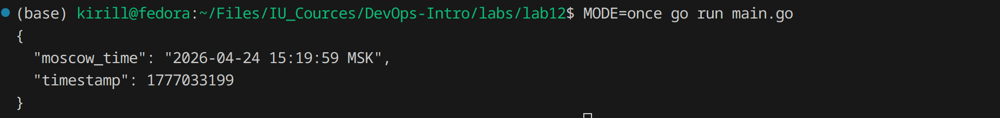
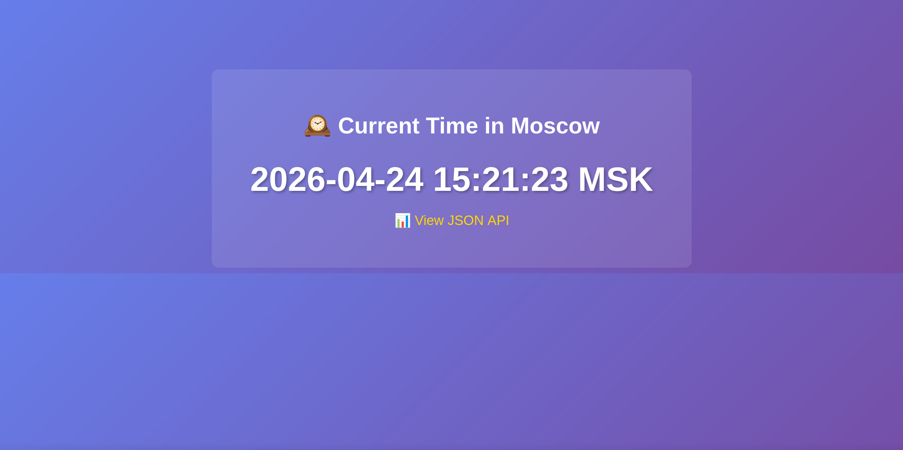
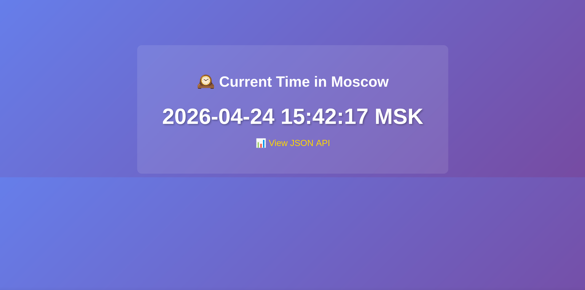

# Task 1

## Screenshot of CLI mode output (MODE=once)



## Screenshot of server mode running in browser (if tested)



## Confirmation that you're working directly in labs/lab12/ directory

In screenshot of CLI mode there is the line confirming the fact:

`kirill@fedora:~/Files/IU_Cources/DevOps-Intro/labs/lab12$`

## Explanation of how the single main.go works in three different contexts

1. CLI mode

If env var `MODE=once`, app generates single json response prints it, then exits 

2. WAGI/Spin mode

`isWagi()` detects Spin by checking CGI-style env (mainly REQUEST_METHOD)

In this mode, runWagiOnce() handles exactly one request:
+ reads CGI env like method/path,
+ writes HTTP-style headers to STDOUT (Content-Type, status),
+ writes body JSON
+ exits.

3. Docker server mode

If above conditions are false, app starts regular http server and handles requests continuously on a port


# Task 2

## Binary size from ls -lh moscow-time-traditional

`ls -lh moscow-time-traditional`

`-rwxr-xr-x. 1 root root 4.5M Apr 24 15:41 moscow-time-traditional`

Bin size is `4.5MB`

## Image size from both docker images and docker image inspect

Docker images size: `4.7MB`

Docker image inspect: `4.48047 MB`

## Average startup time across 5 CLI mode runs

`Average: 0.684 seconds`

## Memory usage from docker stats (MEM USAGE column)

```
MEM USAGE / LIMIT

1.789MiB / 15.35GiB

```

## Screenshot of application running in browser (server mode)



# Task 3


# Task 4