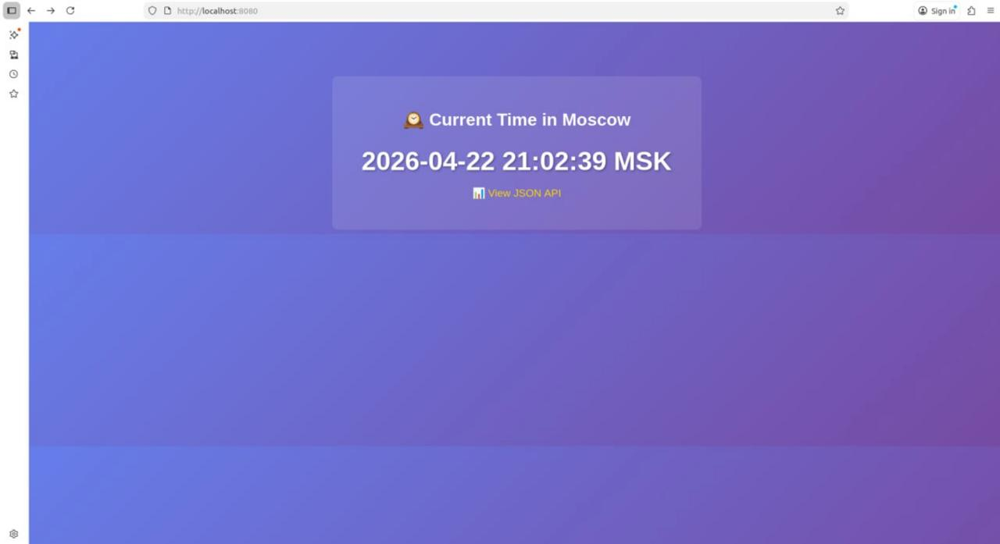
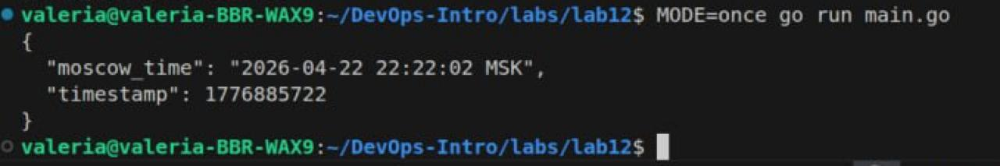
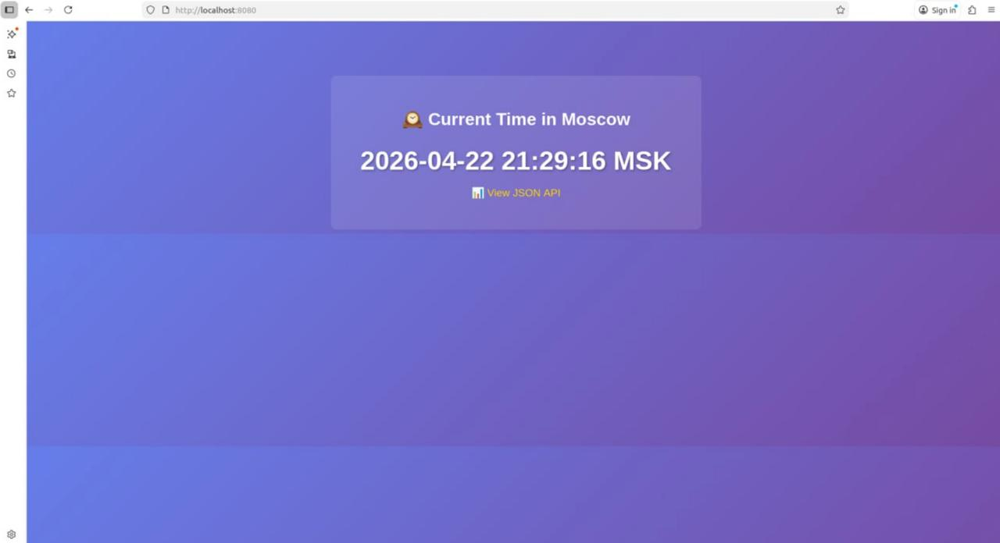

# Lab 12 Submission

## Task 1 — Create the Moscow Time Application

I worked directly in the labs/lab12/ directory, as required by the assignment.

The provided main.go uses the same source code in three different execution contexts:

1. CLI mode (`MODE=once`)  
   In this mode, the program prints JSON once and exits. This mode is used for benchmarking because it provides a simple one-shot execution path without running a long-lived server.

2. Traditional server mode (`net/http`)  
   In this mode, the application starts a standard Go HTTP server on port 8080. The root endpoint / serves an HTML page, and /api/time serves JSON.

3. WAGI mode (for Spin)  
   In this mode, the program detects CGI-style environment variables such as REQUEST_METHOD and uses stdout to print an HTTP-style response. This allows the same source file to work in Spin without using the Spin SDK.

### Local verification

I tested the application locally in both main modes.

#### Server mode
Command used:

```bash
go run main.go
```

Then I opened:

```bash
http://localhost:8080
```

The browser page loaded successfully and displayed the current Moscow time.

Local server mode (`go run main.go`) opened in browser.



#### CLI mode

Command used:

```bash
MODE=once go run main.go
```

The application printed JSON once and exited successfully.

```json
{
  "moscow_time": "2026-04-22 21:23:31 MSK",
  "timestamp": 1776882211
}
```




### Why the single-file design is useful

Using one `main.go` file for multiple execution contexts demonstrates the idea of “write once, compile anywhere”. The same logic can be used for:

- local CLI benchmarking,
- a traditional Docker container with a normal HTTP server,
- a WASM/Spin deployment.

## Task 2 — Build Traditional Docker Container

### Build

I built the traditional Docker container from the provided Dockerfile:

```bash
docker build -t moscow-time-traditional -f Dockerfile .
```

### CLI mode test

I tested the container in CLI mode using:

```bash
docker run --rm -e MODE=once moscow-time-traditional
```

The container printed JSON once and exited successfully.

### Server mode test

I tested the container in server mode using:

```bash
docker run --rm --name test-traditional -p 8080:8080 moscow-time-traditional
```

Then I opened the application in the browser at:

```bash
http://localhost:8080
```

The page loaded successfully, which confirmed that the containerized `net/http` server works correctly

### Binary size

I extracted the binary from the container and checked its size using:

```bash
docker create --name temp-traditional moscow-time-traditional
docker cp temp-traditional:/app/moscow-time ./moscow-time-traditional
docker rm temp-traditional
ls -lh moscow-time-traditional
```

#### Result:
- Binary size: `4.5M`

### Image size

I checked the image size using:

```bash
docker images moscow-time-traditional
```

#### Result:

- Image size (docker images): `4.7MB`

I also checked the more precise image size using:

```bash
docker image inspect moscow-time-traditional --format '{{.Size}}' | awk '{print $1/1024/1024 " MB"}'
```

#### Result:

- Image size (docker image inspect): `4.48047 MB`

### Startup time benchmark

I measured the average startup time across 5 runs using:

```bash
for i in {1..5}; do
    /usr/bin/time -f "%e" docker run --rm -e MODE=once moscow-time-traditional 2>&1 | tail -n 1
done | awk '{sum+=$1; count++} END {print "Average:", sum/count, "seconds"}'
```

#### Result:

- Average startup time: `0.222 seconds`
- That is approximately `222 ms`

### Memory usage

I measured memory usage in server mode using:

```bash
docker stats test-traditional --no-stream
```

#### Result:

- Memory usage: `2.512 MiB`

### Notes

The traditional container uses native Go compilation and runs a standard `net/http` server.
The application worked correctly in both:

- CLI mode for one-shot JSON output
- server mode for browser-based access on port `8080`

### Screenshot
Traditional Docker container running in browser

Traditional Docker container server mode (`docker run --rm --name test-traditional -p 8080:8080 moscow-time-traditional`) opened in browser.



## Task 3 — Build WASM Container

### TinyGo version

I used the following TinyGo version:

```bash
tinygo version 0.39.0 linux/amd64 (using go version go1.25.0 and LLVM version 19.1.2)
```

### Build WASM binary

I built the WASM binary from the same main.go source file using TinyGo:

```bash
docker run --rm \
    -v $(pwd):/src \
    -w /src \
    tinygo/tinygo:0.39.0 \
    tinygo build -o main.wasm -target=wasi main.go
```

I verified the result using:

```bash
ls -lh main.wasm
file main.wasm
```

#### Result:

- WASM binary size: `2.4M`
- File type: `WebAssembly (wasm) binary module version 0x1 (MVP)`

### Build OCI image

At first, the OCI export failed because the default Docker Buildx driver (docker) does not support `--output=type=oci`.
To fix this, I created and used a separate Buildx builder with the docker-container driver.

Commands used:

```bash
docker buildx create --name wasm-builder --driver docker-container --use
docker buildx inspect --bootstrap
docker buildx ls
```

Then I built the WASM OCI archive:

```bash
docker buildx build \
   --platform=wasi/wasm \
   -t moscow-time-wasm:latest \
   -f Dockerfile.wasm \
   --output=type=oci,dest=moscow-time-wasm.oci,annotation=index:org.opencontainers.image.ref.name=moscow-time-wasm:latest \
   .
```

I verified the archive using:

```bash
ls -lh moscow-time-wasm.oci
```

#### Result:

- OCI archive size: `826K`

### Import into containerd

Before running the WASM container, I installed the `containerd-shim-wasmtime-v1` runtime shim and configured containerd to register the `wasmtime` runtime.

I then imported the OCI archive into containerd using:

```bash
sudo ctr images import \
   --platform=wasi/wasm \
   --index-name docker.io/library/moscow-time-wasm:latest \
   moscow-time-wasm.oci
```

I verified the imported image:

```bash
sudo ctr images ls | grep -E 'moscow-time-wasm|wasi|wasm'
```

#### Result:

WASM image size (ctr images ls): `819.9 KiB`

### Run WASM container

I ran the WASM container in CLI mode using:

```bash
sudo ctr run --rm \
   --runtime io.containerd.wasmtime.v1 \
   --platform wasi/wasm \
   --env MODE=once \
   docker.io/library/moscow-time-wasm:latest wasi-once
```

The container executed successfully and printed JSON output once.

Example output:
```json

{
  "moscow_time": "2026-04-22 23:13:12 MSK",
  "timestamp": 1776888792
}
```

### Startup time benchmark

I measured the average startup time across 5 CLI runs using:

```bash
for i in {1..5}; do
    NAME="wasi-$(date +%s%N | tail -c 6)-$i"
    /usr/bin/time -f "%e" sudo ctr run --rm \
        --runtime io.containerd.wasmtime.v1 \
        --platform wasi/wasm \
        --env MODE=once \
        docker.io/library/moscow-time-wasm:latest "$NAME" 2>&1 | tail -n 1
done | awk '{sum+=$1; n++} END{printf("Average: %.4f seconds\n", sum/n)}'
```

#### Result:

- Average startup time: `0.4360` seconds

### Server mode limitation

Server mode is not supported in plain WASI execution via ctr, because WASI Preview1 does not provide the normal TCP socket model required by Go’s net/http server.  
Therefore, CLI mode (`MODE=once`) is used for benchmarking.

Server mode can still be demonstrated via Spin using the same main.wasm, because Spin provides an HTTP/WAGI execution model instead of plain WASI socket-based execution.

### Memory usage
Memory usage: N/A - not available via ctr

This is expected because WASM execution through ctr uses a different runtime and does not expose Docker-style memory statistics in the same way.

### Notes

The same `main.go` source file was used for both:

- the traditional Docker container
- the WASM container

This demonstrates the “same source code, different compilation targets” approach required by the lab.

## Task 4 — Performance Comparison & Analysis

### Comparison table

| Metric | Traditional Container | WASM Container | Improvement / Difference | Notes |
|---|---:|---:|---:|---|
| Binary Size | 4.5M | 2.4M | 46.7% smaller | From ls -lh |
| Image Size | 4.48047 MB | 819.9 KiB (~0.8007 MiB) | 82.1% smaller | Traditional from docker image inspect, WASM from ctr images ls |
| Startup Time (CLI) | 0.222 s | 0.4360 s | WASM is ~1.96x slower | Average of 5 runs |
| Memory Usage | 2.512 MiB | N/A | N/A | docker stats available only for traditional container |
| Base Image | scratch | scratch | Same | Both use minimal base images |
| Source Code | main.go | main.go | Identical | Same source file used for both builds |
| Server Mode | Works via net/http | Not supported via plain WASI under ctr | N/A | WASI Preview1 does not provide normal TCP sockets |

### Improvement calculations

I used the following formulas:

- Size reduction % = ((Traditional - WASM) / Traditional) × 100
- Speed ratio = Traditional startup time / WASM startup time

Using the measured results:

- Binary size reduction = ((4.5 - 2.4) / 4.5) × 100 ≈ 46.7%
- Image size reduction = ((4.48047 - 0.8007) / 4.48047) × 100 ≈ 82.1%
- Startup speed ratio = 0.222 / 0.4360 ≈ 0.51x

This means that in my environment the WASM container was much smaller, but the traditional container started faster.

### Analysis

#### 1. Binary Size Comparison

The WASM binary is significantly smaller than the traditional Go binary because TinyGo uses a much smaller runtime and a more size-focused compilation strategy.  
Compared with standard Go compilation, TinyGo removes a large amount of runtime overhead and produces a more compact output for WASI targets.

TinyGo optimizes away or reduces:
- parts of the full Go runtime,
- debug and metadata overhead,
- features that are not needed for this WASI-targeted program,
- some standard-library/runtime complexity that is present in normal native Go binaries.

As a result, the WASM module is much smaller than the traditional native executable.

#### 2. Startup Performance

Even though the WASM container is much smaller, in my measurements it started slower than the traditional container.

A likely reason is that this setup introduces additional runtime overhead:
- the WASM image is executed through containerd + ctr,
- execution goes through the wasmtime shim,
- the WASM runtime must initialize before the module runs.

By contrast, the traditional container runs a native Linux binary directly inside a minimal scratch image.

So in this experiment:
- WASM wins in size
- traditional Docker wins in startup time

This is still a valid and useful result because the lab asks for measurement and comparison, not for a guaranteed speedup.

#### 3. Use Case Decision Matrix

##### When I would choose WASM
I would choose WASM when:
- small binary and image size matter,
- stronger sandboxing and isolation are important,
- I want a portable execution target,
- the workload is simple and does not require full Linux networking behavior,
- the application is more like a short-lived task, function, or serverless-style component.

##### When I would choose traditional containers
I would choose traditional containers when:
- I need full Linux process behavior,
- I need standard TCP networking and a normal HTTP server,
- I want a simpler and more familiar runtime stack,
- I want predictable compatibility with the normal Go runtime,
- startup time in my environment is better with native containers.

### Final conclusion

This experiment demonstrates the main idea of the lab clearly:
- the same `main.go` source code can be compiled for different targets,
- the WASM version is much smaller in both binary and image size,
- the traditional container started faster in this specific environment,
- plain WASI execution via ctr is suitable for CLI benchmarking,
- a normal HTTP server is better supported in the traditional container path, while WASM server mode requires a platform such as Spin.

Overall, WASM provided strong size benefits, while the traditional Docker container provided better startup performance and broader runtime compatibility in this setup.