# Lab 2 Submission

## Task 1

### Finding Object Hashes

First, I retrieved the commit hash and inspected the commit object to find the tree and blob hashes (I've blurred SSH key in the screenshot):

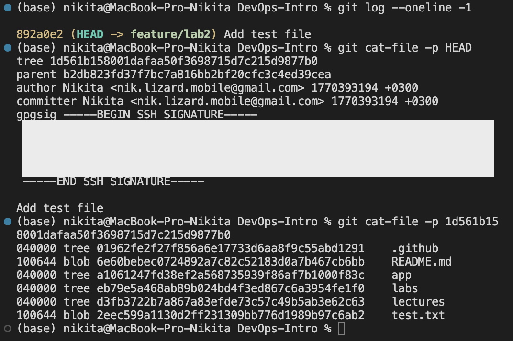

### Inspecting Git Objects

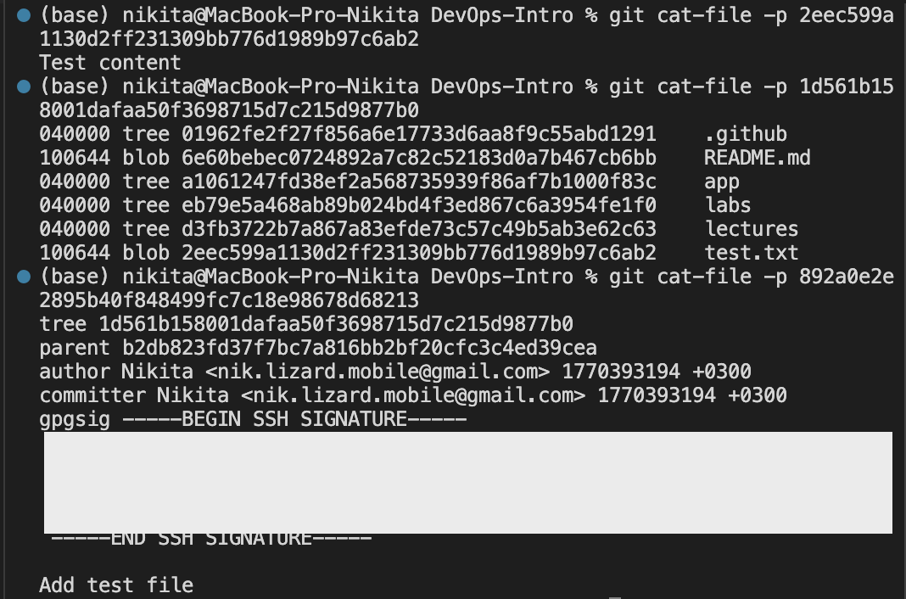

A blob (Binary Large Object) stores the raw content of a file without any metadata like filename or permissions. It represents a snapshot of file contents at a specific point in time.

A tree object represents a directory snapshot. It contains entries with file mode, object type (blob or tree), SHA-1 hash, and filename — essentially mapping names to blobs (files) or other trees (subdirectories).

A commit object contains a pointer to the root tree (project snapshot), parent commit(s), author/committer metadata with timestamps, an optional GPG/SSH signature, and the commit message.

### Analysis: How Git Stores Data

Git uses a content-addressable filesystem based on SHA-1 hashes. The storage model consists of three core object types:

1. Blobs — store file contents only (no filenames)
2. Trees — store directory structure, mapping names to blobs and subtrees
3. Commits — store metadata and point to a tree representing the project state

This design enables:
- Deduplication: Identical file contents share the same blob hash
- Integrity: Any change produces a completely different hash
- Efficient storage: Objects are compressed and stored in `.git/objects/`

## Task 2

### Creating Practice Branch

I created a new branch and made three commits to practice reset operations:

**Commits created:**
- `8007b92` — First commit
- `3f43a54` — Second commit
- `18903b4` — Third commit

### Exploring Reset Modes

#### Soft Reset

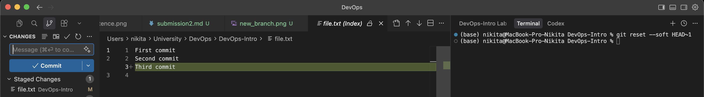

What changed:
- HEAD: Moved back one commit (from Third to Second commit)
- Index (staging area): Unchanged — "Third commit" changes remain staged
- Working tree: Unchanged — file.txt still contains all three lines

The soft reset is useful when you want to undo a commit but keep all changes staged for recommitting (e.g., to amend the commit message or combine with other changes).

#### Hard Reset

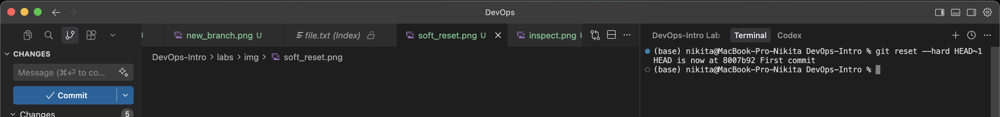

What changed:
- HEAD: Moved back one commit (to First commit `8007b92`)
- Index (staging area): Reset to match the target commit
- Working tree: Reset to match the target commit — all changes discarded

The hard reset completely discards all changes after the target commit. This is destructive and should be used with caution.

### Recovery with Reflog

After the hard reset, the commits appeared "lost." I used `git reflog` to find the previous HEAD positions:

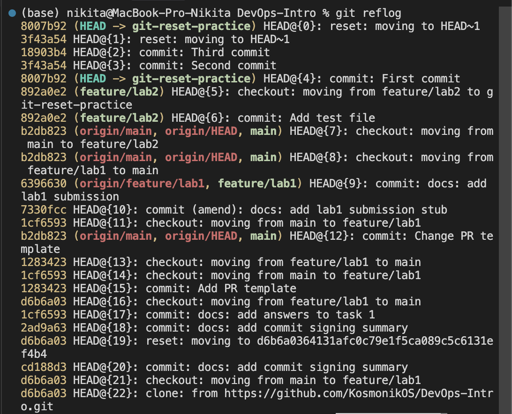

The reflog shows every HEAD movement including:
- `HEAD@{0}`: reset: moving to HEAD~1
- `HEAD@{1}`: reset: moving to HEAD~1  
- `HEAD@{2}`: commit: Third commit
- `HEAD@{3}`: commit: Second commit
- `HEAD@{4}`: commit: First commit

#### Recovering Lost Commits

Using the reflog hash, I recovered to the original state:

Result: HEAD is now at `892a0e2` (Add test file) — successfully recovered to feature/lab2 branch state.

### Git Log After Operations

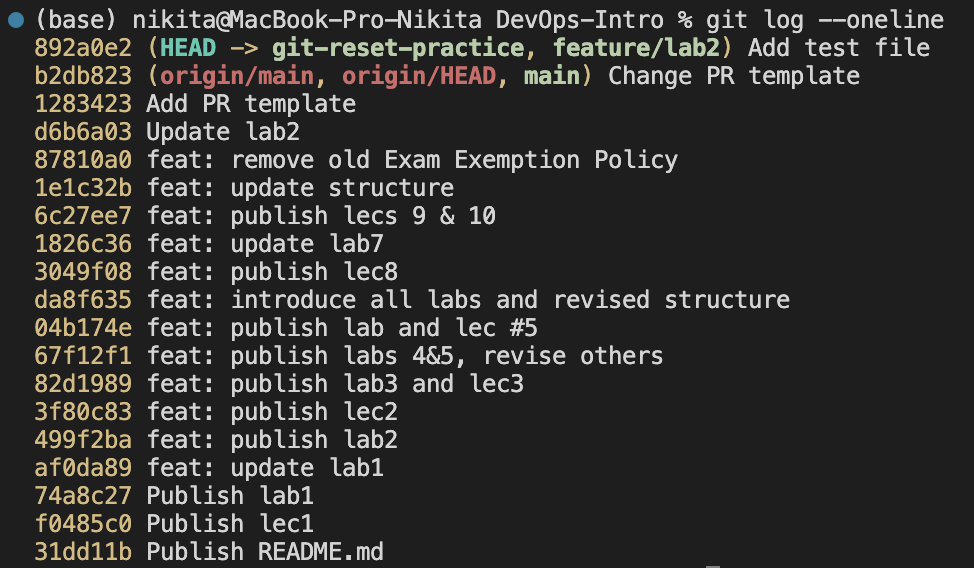

### Analysis

| Reset Mode | HEAD | Index | Working Tree | Use Case |
|------------|------|-------|--------------|----------|
| `--soft`   | Moves | Unchanged | Unchanged | Redo commit message, combine commits |
| `--mixed` (default) | Moves | Resets | Unchanged | Unstage changes, keep edits |
| `--hard`   | Moves | Resets | Resets | Completely discard changes |

Key takeaway: `git reflog` is a safety net that tracks all HEAD movements, allowing recovery even after destructive operations like `git reset --hard`.

## Task 3

I created a short-lived branch, made a commit, and then visualized the graph:

### Commit Messages

| Hash | Branch | Message |
|------|--------|---------|
| `d1d8916` | side-branch | Side branch commit |
| `7328901` | feature/lab2 (HEAD) | Add task 2 |
| `ff06357` | feature/lab2 | Add task 1 |
| `892a0e2` | git-reset-practice | Add test file |
| `b2db823` | origin/main, main | Change PR template |
| `6396630` | feature/lab1 | docs: add lab1 submission |

### Reflection

The `git log --graph --all` visualization clearly shows how branches diverge and where they originate. The asterisks (`*`) represent commits, and the lines show parent-child relationships. This view is invaluable for understanding parallel development, identifying merge points, and tracking which commits belong to which branch — especially in collaborative projects with multiple contributors.

## Task 4

I have created a tag and pushed it to the remote repository:

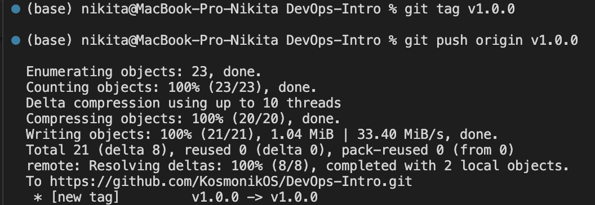

### Tag Details

| Tag | Commit Hash | Command |
|-----|-------------|---------|
| `v1.0.0` | HEAD (current commit) | `git tag v1.0.0` |

The tag was successfully pushed to `https://github.com/KosmonikOS/DevOps-Intro.git`.

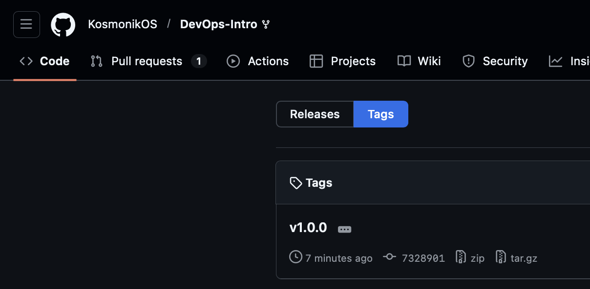

### Why Tags Matter

Tags provide stable, human-readable references to specific commits. They are essential for:

- Versioning: Marking release points (v1.0.0, v2.1.3) following semantic versioning
- CI/CD triggers: Pipelines can trigger deployments when tags matching patterns (e.g., `v*`) are pushed
- Release notes: GitHub automatically creates release pages from tags, making it easy to document changes
- Reproducibility: Teams can always check out exact release versions for debugging or rollbacks

## Task 5 — git switch vs git checkout vs git restore

### git switch (Modern — Branch Operations)

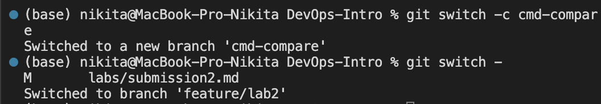

**Purpose:** Branch switching only. Clean, focused command introduced in Git 2.23.

### git checkout (Legacy — Overloaded)

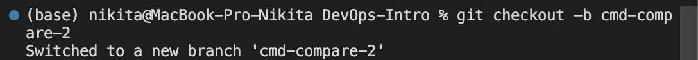

**Problem:** `git checkout` does too many things — it switches branches AND restores files. This is confusing because:
- `git checkout branch-name` -> switches branch
- `git checkout -- file.txt` -> discards file changes (completely different operation!)

### git restore (Modern — File Operations)

I've noticed that steps to demonstrate `git restore` aren't complete in lab2.md as demo.txt isn't tracked by Git.
Hence, I've added the steps to track the file and demonstrate the restore operations.

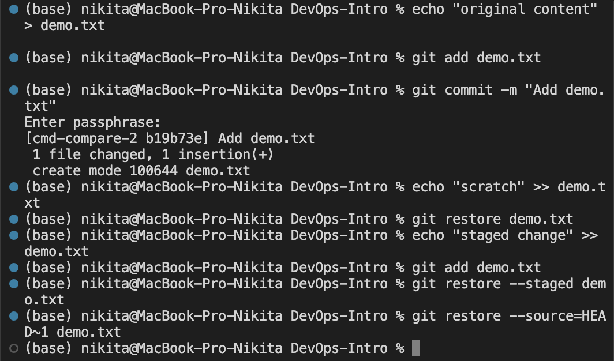

Here is a sequence of file states during the restore operations.

Before the restore operations:
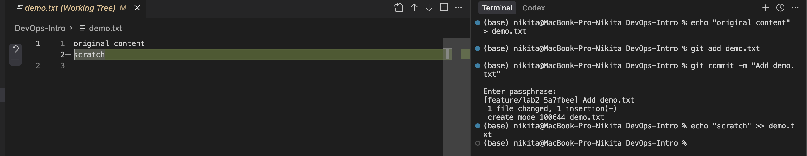

After the restore operations:
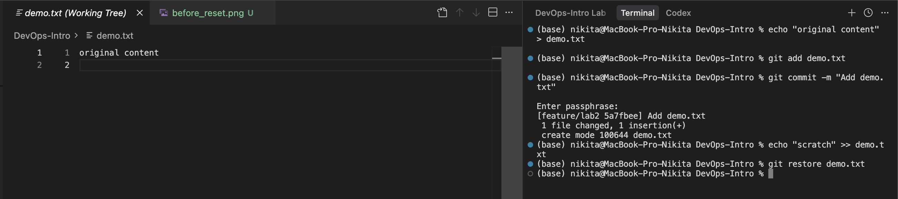

After the restore operations with preserving staged changes:

Purpose: File restoration only. Replaces the file-restoring functionality of `git checkout`. Note that `git restore` only works on tracked files — files that have been committed at least once.

### Command Comparison

| Command | Purpose | Introduced |
|---------|---------|------------|
| `git switch` | Branch operations only | Git 2.23 (2019) |
| `git restore` | File operations only | Git 2.23 (2019) |
| `git checkout` | Both branches AND files | Legacy (confusing) |

### When to Use Each

- **Use `git switch`** when changing branches — it's explicit and won't accidentally overwrite files
- **Use `git restore`** when discarding changes or restoring files from other commits — clear intent
- **Avoid `git checkout`** for new workflows — it's ambiguous; prefer the modern alternatives for clarity and safety

## Task 6 — GitHub Community Engagement

### Starred Repositories

I starred the course repository and the simple-container-com/api project:

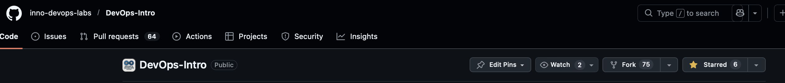

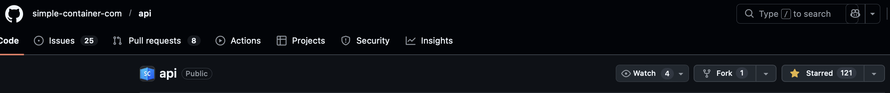

### Following Developers

I followed the professor, TAs, and classmates:

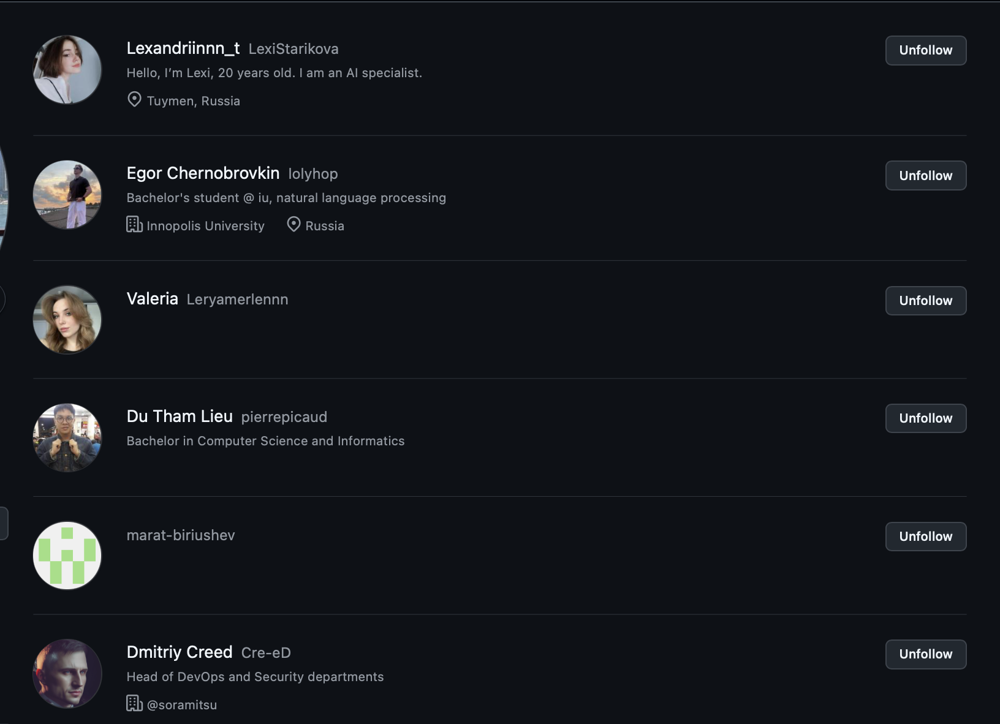

### Why GitHub Social Features Matter

Starring repositories helps bookmark useful projects for future reference and shows appreciation to maintainers. High star counts signal project quality and attract more contributors, making stars a form of community endorsement in open source.

Following developers enables learning from others' activity, discovering new projects through their contributions, and building professional connections. In team settings, it keeps you updated on classmates' work and facilitates collaboration beyond the classroom.

