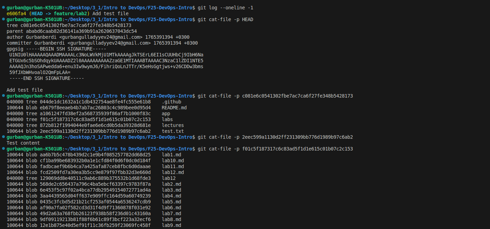
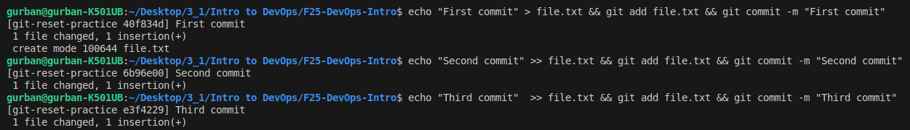
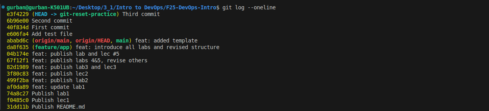
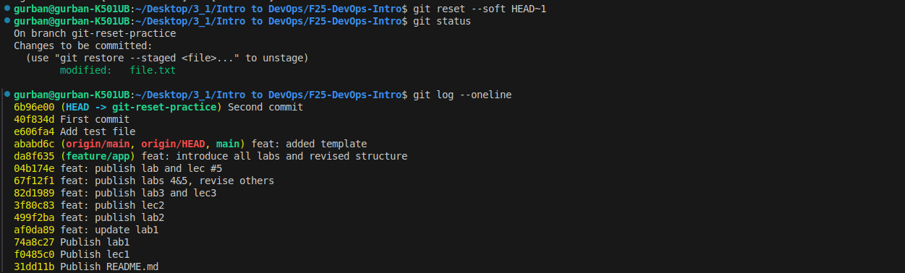
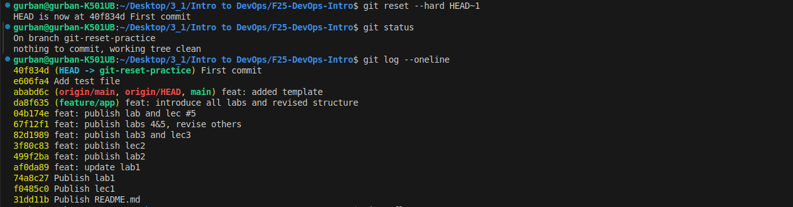
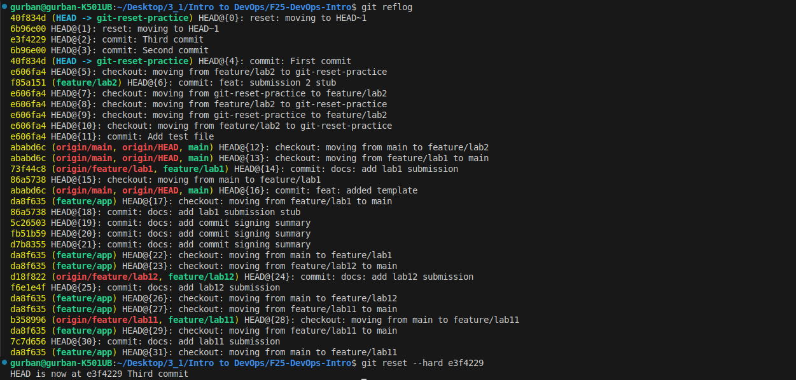

# Version Control & Advanced Git
## 1. Git Object Model Exploration
### 1. All command outputs for object inspection.
- 
### 2. A 1–2 sentence explanation of what each object type represents.
- **Blob stores the contents of a file. It contains only raw data.**
- **Tree represents a directory. It contains filenames, permissions, pointers to blobs and other trees.**
- **Commit represents a snapshot of the repository at a specific time. It stores metadata and points to the root tree.**
### 3. Analysis of how Git stores repository data.
**Git stores data as content-addressed objects identified by SHA-1 hashes. Files are blobs, directories are trees and commits link to trees. Each commit forms a node in a graph, creating Git’s version history.**
### 4. Example of blob, tree, and commit object content.
**Blob:**
```
Test content
```
**Tree:**
```
100644 blob aa6b7b5c478b439d2c1e9b4f085257782dd68d25    lab1.md
100644 blob cf1ba99be683932b0a1e1cfd84f0d6f0dc0d184f    lab10.md
100644 blob fadbcaef9b6b4ca7a425afa87ceb8fbc6d0daaae    lab11.md
100644 blob fcd2509fd7a30ea3b5cc9e879f97fbb32d3e660d    lab12.md
040000 tree 129069dd8e40511c9ab6c889b375532b1d68fde3    lab12
100644 blob 568de2c656437a796c4ba5ebcf63397c9783f87a    lab2.md
100644 blob 6e453f5c97f02a4bca77db29549154072771ad4a    lab3.md
100644 blob 3aa4439565d04ff637e909ffc164d59a60749239    lab4.md
100644 blob 0435c3fcbd5d21b21cf253af0544a6536247cdb9    lab5.md
100644 blob af90a7fa02f582cd3d31f4d9f71360878f031e92    lab6.md
100644 blob 49d2a63a768fbb26123f938b58f236d01c43160a    lab7.md
100644 blob 9df09119213b81f88f6b61c89f3bcf223a32ecf6    lab8.md
100644 blob 12e1b875e40d5ef91f11c36fb259f23069fc458f    lab9.md
```
Commit:
```
tree c081e6c0541302fbe7ac7ca6f27fe348b5428173
parent ababd6caab82d36141a369b91a2620637043dc54
author Gurbanberdi <gurbangulladyyev24@gmail.com> 1765391394 +0300
committer Gurbanberdi <gurbangulladyyev24@gmail.com> 1765391394 +0300
gpgsig -----BEGIN SSH SIGNATURE-----
 U1NIU0lHAAAAAQAAADMAAAALc3NoLWVkMjU1MTkAAAAgJkTSErL6EI1sCUUHbCj9IbH6Na
 ETGUx6c5bSOhdqykUAAAADZ2l0AAAAAAAAAAZzaGE1MTIAAABTAAAAC3NzaC1lZDI1NTE5
 AAAAQJn3hoSAPwedda6+enu3Iw9wymJ6/FihriQoLnJTTr/K5eHsGgtjws+v26CDDw3bms
 59fJXbWHvoalO2QmFpLAA=
 -----END SSH SIGNATURE-----

Add test file
```

## 2. Reset and Reflog Recovery
### Commands that were run, why and what they do.
1. Set Up Practice Environment:
- 
2. Initial `git log --oneline` to see current state of HEAD
- 
3. Soft reset: `git reset --soft HEAD~1`
- It moves HEAD back one commit
- Index still contains the changes from Third commit, but they are staged.
- Working directory doesn't change.
- 
4. Hard reset: `git reset --hard HEAD~1`
- It moves HEAD back one commit
- Index is reset.
- Working directory is changed to last commit's state, meaning file contents are reverted.
- 
5. `git reflog` to see how HEAD moved and `git reset hard ...` to move back to Third commit.
- 

## 3. Visualize Commit History
### 1. A snippet/screenshot of the graph.
- 
### 2. Commit messages list
- Side branch commit (side-branch)
- Third commit, Second commit, First commit (git-reset-practice)
- feat: added template (main)

### 3. A 1–2 sentence reflection on how the graph aids understanding.
The graph visualization makes it easy to see where branches diverge and merge, showing the structure of the repository's history.

## 4. Tagging Commits
### 1. Tag names and commands used.

```bash
git tag v1.0.0
git push origin v1.0.0
```

### 2. Associated commit hashes.
**Output from `git show-ref --tags`. First one is commit hash.**
```bash
f85a151e6790fc54e7cfc1594faa0b0e414896e8 refs/tags/v1.0.0
```

### 3. A short note on why tags matter (versioning, CI/CD triggers, release notes).
**Tags provide fixed, human-readable identifiers for specific commits, making it easy to mark releases, generate release notes, and trigger CI/CD pipelines.**

## 5. `git switch` vs `git checkout` vs `git restore`
### 1. `git switch`
**Command:**
```bash
git switch -c demo-switch
```
**Output:**
```bash
Switched to a new branch 'demo-switch'
```
### 2. `git checkout`
**Command:**
```bash
git checkout feature/lab2
```
**Output:**
```bash
M       labs/submission2.md
Switched to branch 'feature/lab2'
```