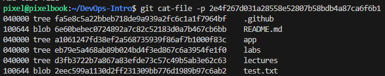
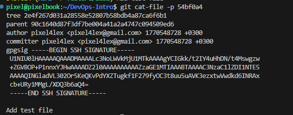
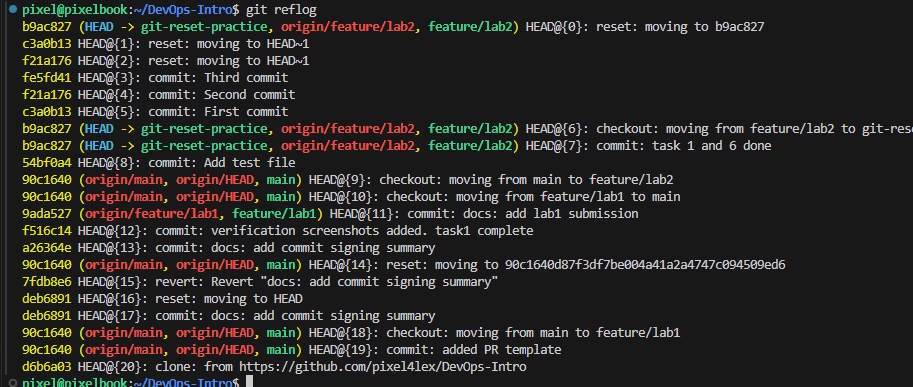
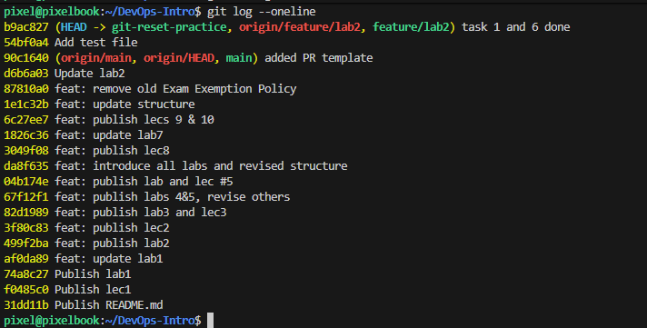
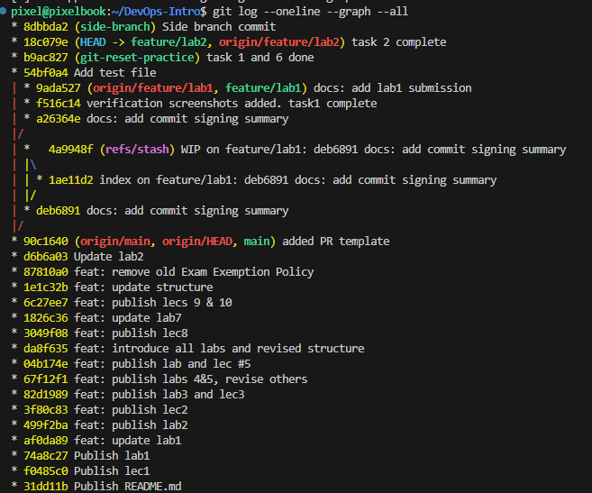

# Task 1 — Git Object Model Exploration


## Examining Git objects: command outputs

### Blob hash


### Tree hash


### Commit hash



## Explanations on objects
### Blob
A blob stores the contents of a file exactly as-is, with no filename or directory information. If two files have identical contents, Git stores only one blob and reuses it.

### Tree
A tree represents a directory, mapping filenames to blobs (files) and other trees (subdirectories), along with their permissions. It captures the structure of a snapshot.

### Commit
A commit records a snapshot of the project by pointing to a root tree, plus metadata like author, message, and parent commit(s). It forms the history by chaining commits together.


## Storing repository data

### Content-addressable object database
Git stores all repository data as objects in a content-addressable database under .git/objects. Each object is identified by a cryptographic hash, computed from the object’s type, size, and contents. This makes data immutable and ensures integrity: any change produces a new object with a new hash.

### Core object types and snapshot model
Repository state is represented using four object types: blobs (file contents), trees (directory structure), commits (snapshots + metadata), and tags (named references). A commit points to a single root tree, which recursively references blobs and subtrees. This means Git stores snapshots, not diffs—history emerges by linking snapshots via parent commits.

### Deduplication and storage efficiency
Because objects are keyed by content hash, identical data is stored only once. If two files or versions have the same contents, they reference the same blob.

### References and reachability
Branches, tags, and HEAD are lightweight references that store hashes pointing to commits. These refs define which objects are reachable. Git’s garbage collection periodically removes unreachable objects, keeping the repository compact without risking data loss for referenced history.

### Performance implications
This design enables fast operations: checking out a commit is just reading a tree, branching is creating a new reference, and merging is graph analysis over commits. The object graph plus content addressing gives Git both strong consistency guarantees and high performance at scale.


## Example of blob, tree and commit object content
Screenshots were attached in the first subparagraph.


# Task 2 — Reset and Reflog Recovery

## What commmand I ran
According to the task I ran these commands:
```bash
git switch -c git-reset-practice
echo "First commit" > file.txt && git add file.txt && git commit -m "First commit"
echo "Second commit" >> file.txt && git add file.txt && git commit -m "Second commit"
echo "Third commit"  >> file.txt && git add file.txt && git commit -m "Third commit"

git reset --soft HEAD~1
git reset --hard HEAD~1
git reflog
git reset --hard b9ac827

git log --oneline
```

## Snippets of log and reflog
### Reflog


### Log --oneline



## Changes in working tree, index, and history for each reset

### git reset --soft HEAD~1
- **History (HEAD / branch):** Moves HEAD back by one commit.
- **Index (staging area):** Unchanged; still reflects the newer commit.
- **Working tree:** Unchanged.

**Effect:** The last commit is undone, but its changes remain staged. We now at commit "commit: Second commit".


### git reset --hard HEAD~1
- **History (HEAD / branch):** Moves HEAD back by one commit.
- **Index (staging area):** Reset to match the target commit.
- **Working tree:** Reset to match the target commit.

**Effect:** The last commit and all associated changes are permanently discarded from the working tree and index. We now at commit #commit: First commit#


### git reset --hard b9ac827
- **History (HEAD / branch):** Moves HEAD directly to commit `b9ac827`.
- **Index (staging area):** Reset to exactly match `b9ac827`.
- **Working tree:** Reset to exactly match `b9ac827`.

**Effect:** The branch, staging area, and working directory are all restored to the state of commit `b9ac827`; later commits are removed from the branch (recoverable via reflog if needed). We now at commit "b9ac827 (HEAD -> git-reset-practice, origin/feature/lab2, feature/lab2) task 1 and 6 done" 


## Analysis on recovery via reflog
In Git, reflog records every position HEAD has pointed to, even after history-rewriting operations like reset. When commits are removed from a branch, they are not deleted immediately; reflog preserves references to them so they can be restored.

Recovery consists of locating the desired past HEAD position in the reflog and moving the branch pointer back to it. This works as long as the commits have not yet been garbage-collected, making reflog a temporary safety net for undoing destructive changes.


# Task 3: Visualize Commit History

## Graph and commit messages


## Reflection on graphs
The commit graph makes the project history easier to understand by visually showing how commits relate through branching and merging, rather than as a flat list. This helps quickly identify where changes originated, diverged, and were integrated back together.


# Task 4: Tagging Commits

## Tag names and commands
For the tag name I choose 'v1.0.0'. For creating a tag I use these commands:
```bash
git tag v1.0.0
git push origin v1.0.0
```

This tag points to my commit "18c079e task 2 complete".


## Why tags matter?
Tags matter because they mark stable, meaningful points in history—such as releases—making versioning explicit and reproducible. They are commonly used to trigger CI/CD pipelines and to anchor release notes, ensuring builds, deployments, and documentation all reference the same immutable commit.


# Task 6: GitHub Community

Starring repositories on GitHub signals appreciation to maintainers, increases project visibility, and helps others discover high-quality open-source work. Following developers makes it easier to track relevant projects, learn best practices from peers, and build professional connections that support effective teamwork and long-term career growth.