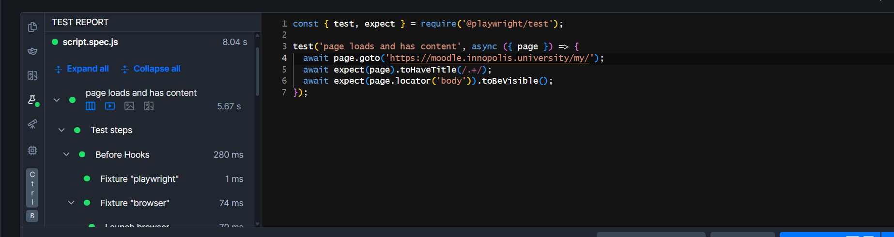
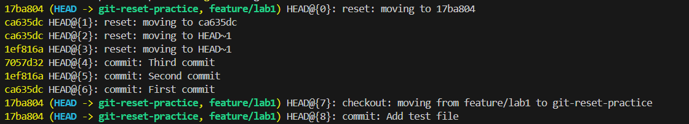
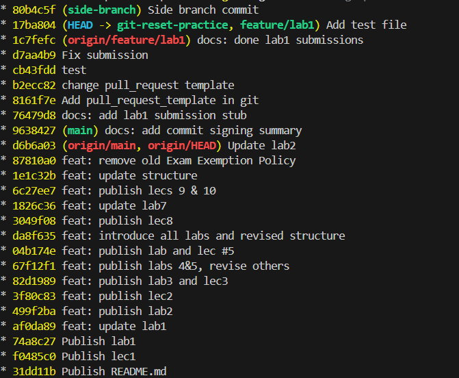

### Task 1 

blob - 38e739694be035dc31fcbea00e9151dab938dbe6    test.txt (  any single file changed)

tree - tree 1da10c0dfa022559f46478f9684228d99f64a341    labs (  and any folder)

commit ojbect content - " tree c79f51b057b9701a598453e063ca55cc84e5e19b
parent 1c7fefcaae674f36b4a1bfd187eb9b82ddfcc067
author Nikita Stepankov <gfnmjg@gmail.com> 1770788139 +0300
committer Nikita Stepankov <gfnmjg@gmail.com> 1770788139 +0300 "

### Task 2
after reset --soft ,  back to second, third removed
log --oneline

reflog

after --hard

log --oneline

reflog

after back
outline 

reflog

| Reset Type | HEAD Moves | Index Changes | Working Tree Changes | Best For                       |
|------------|------------|---------------|----------------------|--------------------------------|
| --soft     | ✓ Yes      | ✗ Kept        | ✗ Kept               | Edit commit message/reorganize |
| --hard     | ✓ Yes      | ✓ Discarded   | ✓ Discarded          | Discard all changes completely |

### Task 3
graph snippet

commit messaeg list
Side branch commit

Add test file

docs: done lab1 submissions

Fix submission

test

change pull_request template

Add pull_request_template in git

docs: add lab1 submission stub

docs: add commit signing summary

it clearly show structure of the repo with all commits

### Task 4

tag

hash

Tags imporatnt for versioning, CI/CD triggers, documentation and stability. It improves realization of thise feature of repo

### Task 5
commands

git status 

gir branch

Git status shows file that are not added to next commit, so it show whats file are can be added to save last changes of this file
Gir branch show on what branch you are and all structure of repo with all branches in

### GitHub Community

Starring repositories helps maintainers gauge interest and impact, while giving you a bookmark to revisit useful code, learn patterns, and track influential projects. Following developers builds professional networks, keeps you aware of best practices and emerging tools, and fosters mentorship opportunities within your team and the broader community.