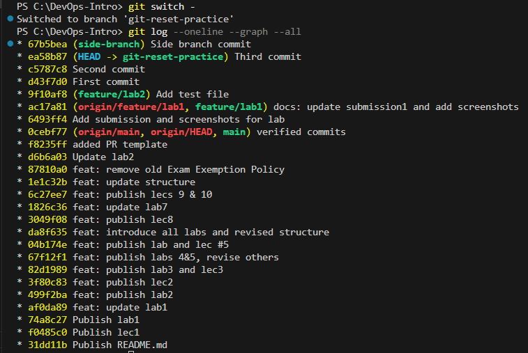

# TASK 1 

## 1) Creating a Sample Commit

Commands used:

```bash
git switch -c feature/lab2
echo "Test content" > test.txt
git add test.txt
git commit -m "Add test file"
```

Latest commit hash:

```
9f10af8
```

---

## 2) Inspecting Git Objects

### Commit Object

Command:

```bash
git cat-file -p 9f10af8
```

Output:

```
tree 49330cbf6540e12e1becc64681b35cd65f2a4b80
parent ac17a81f2b22267657999b9ce0f2348a9bfc449
author jiji-f <berdnikova_valeria06@mail.ru> 1770897205 +0300
committer jiji-f <berdnikova_valeria06@mail.ru> 1770897205 +0300

Add test file
```

Explanation:

A commit object stores:
- a reference to a tree object
- parent commit
- author and committer information
- commit message

---

### Tree Object

Command:

```bash
git cat-file -p 49330cbf6540e12e1becc64681b35cd65f2a4b80
```

Output:

```
040000 tree 058f94cbdd5b10aef0b41c41a205ef1985d156a8 .github
100644 blob 6e60bebc0724892a7c82c52183d0a7b467cb6bb README.md
040000 tree a1061247fd38ef2a568735939f86af7b1000f83c app
040000 tree 3707359ab7e80a058f993ba04e374cde46e5c40b labs
040000 tree d3fb3722b7a867a83efde73c57c49b5ab3e626c3 lectures
100644 blob 418a98ced2ac70b5bdee0be9732ecdaae7264515 test.txt
```

Explanation:

A tree object represents a directory structure.
It contains:
- blob objects (files)
- tree objects (subdirectories)

---

### Blob Object

Command:

```bash
git cat-file -p 418a98ced2ac70b5bdee0be9732ecdaae7264515
```

Output:

```
Test content
```

Explanation:

A blob object stores the contents of a file.
It does not contain filename or metadata — only raw file data.

---

## 3) How Git Stores Repository Data

Git stores repository data as objects inside the `.git/objects` directory.

There are three main object types:

- **Blob** — stores file contents.
- **Tree** — stores directory structure and references to blobs.
- **Commit** — stores metadata and points to a tree.

Relationship between objects:

Commit → Tree → Blob

Each object is identified by a unique SHA-1 hash.
___

# TASK 2


## 1) The exact commands I ran and why

### Create practice branch
```bash
git switch -c git-reset-practice
```
Created a separate branch to safely test reset commands.

---

### Create three commits
```bash
echo "First commit" > file.txt
git add file.txt
git commit -m "First commit"

echo "Second commit" >> file.txt
git add file.txt
git commit -m "Second commit"

echo "Third commit" >> file.txt
git add file.txt
git commit -m "Third commit"
```

Purpose: to generate commit history for experimenting with reset.

---

### Test soft reset
```bash
git reset --soft HEAD~1
git status
```

Purpose: to observe how `--soft` affects HEAD, index, and working tree.

---

### Test hard reset
```bash
git reset --hard HEAD~1
git log --oneline
```

Purpose: to observe how `--hard` removes commits and resets working directory.

---

### View reflog
```bash
git reflog
```

Purpose: to inspect HEAD movement and find lost commits.

---

### Recover lost commit
```bash
git reset --hard ea58b87
git log --oneline
```

Purpose: to restore the deleted commit using reflog hash.

---

---

## 2) Snippets of `git log --oneline` and `git reflog`

### git log --oneline (after three commits)

```
ea58b87 Third commit
c5787c8 Second commit
d43f7d0 First commit
```

---

### git log --oneline (after hard reset)

```
d43f7d0 First commit
```

---

### git reflog snippet

```
d43f7d0 HEAD@{0}: reset: moving to HEAD~1
c5787c8 HEAD@{1}: reset: moving to HEAD~1
ea58b87 HEAD@{2}: commit: Third commit
c5787c8 HEAD@{3}: commit: Second commit
d43f7d0 HEAD@{4}: commit: First commit
```

---

---

## 3) What changed in the working tree, index, and history for each reset

### After `git reset --soft HEAD~1`

- HEAD moved from **Third commit** to **Second commit**
- Commit history removed the Third commit
- Changes from Third commit remained **staged**
- Working directory was unchanged

---

### After `git reset --hard HEAD~1`

- HEAD moved to **First commit**
- Commit history removed Second and Third commits
- Index was reset
- Working directory was reset
- All changes from removed commits disappeared

---

---

## 4) Analysis of recovery process using reflog

Even after `git reset --hard`, the commits were not permanently deleted.

`git reflog` recorded every HEAD movement, including:
- commits
- resets
- checkouts

Using the reflog entry:

```
ea58b87 HEAD@{2}: commit: Third commit
```

I restored the commit with:

```bash
git reset --hard ea58b87
```

After recovery:

```
ea58b87 Third commit
c5787c8 Second commit
d43f7d0 First commit
```

### Conclusion

- `git reset --soft` moves HEAD but keeps staged changes.
- `git reset --hard` resets HEAD, index, and working directory.
- `git reflog` allows recovery of commits even after destructive resets.
- Git keeps unreachable commits until garbage collection runs.

___
# TASK 3
## 1) A screenshot of the graph

## 2) Commit messages list.
```
67b5bea Side branch commit  
ea58b87 Third commit  
c5787c8 Second commit  
d43f7d0 First commit 
```
## 3) Reflection

The commit graph clearly shows branch pointers and commit history.
It helps visualize how branches diverge and how HEAD moves between commits.

---

# TASK 4 

## 1) Tag names and commands used

### Tag name
- v1.0.0

### Commands executed
```bash
git tag v1.0.0
git push origin v1.0.0
```
### (Optoinal additiinal tag)
```
git tag v1.1.0
git push origin v1.1.0
```

## 2) Associated commit hashes
### To check which commit each tag points to, I used:
```
git show-ref --tags
```
### Tag → Commit mapping:

- v1.0.0 → ea58b8741c8bcc2df376b17915c5c61221dabd7f

- v1.1.0 → 791977ea56a71ad4e7a6fa935f1eac642a3de3c1
## 3) Why tags matter
### Explanation

Tags mark specific points in the repository history as versions or releases (for example, v1.0.0).
They allow developers to reference a stable state of the project at any time.

### Tags are important because they:

- Enable proper versioning of software.

- Can trigger CI/CD pipelines for release builds.

- Help organize and generate release notes.

- Allow teams to roll back to known stable versions if needed.
___
# TASK 5 
---

## 1) Commands executed and their outputs

### Creating a new branch using modern command

```bash
git switch -c test-switch
```

Output:
```
Switched to a new branch 'test-switch'
```

Checking branches:

```bash
git branch
```

Output:
```
feature/lab1
feature/lab2
git-reset-practice
main
side-branch
* test-switch
```

---

### Switching back using legacy command

```bash
git checkout git-reset-practice
```

Output:
```
Switched to branch 'git-reset-practice'
```

Checking branches again:

```bash
git branch
```

Output:
```
feature/lab1
feature/lab2
* git-reset-practice
main
side-branch
test-switch
```

---

### Modifying and restoring a file

Modifying file:

```bash
echo "Temporary change" >> file.txt
git status
```

Output:
```
On branch git-reset-practice

Changes not staged for commit:
  modified: file.txt
```

Restoring file:

```bash
git restore file.txt
git status
```

Output:
```
nothing added to commit but untracked files present
```

---

## 2) When to use each command

### git switch
Used for switching branches or creating new ones.  
It is the modern and recommended command for branch-related operations.

### git checkout
Legacy command that can switch branches or restore files.  
It is overloaded and less clear compared to modern Git commands.

### git restore
Used specifically to restore files in the working directory or index.  
It is safer and clearer when undoing file changes.

---

## 3) Summary

Modern Git separates responsibilities between commands:

- `git switch` → branch operations  
- `git restore` → file restoration  
- `git checkout` → legacy all-in-one command  

This improves clarity and reduces the risk of mistakes.
___
# TASK 6
## GitHub Community

Starring repositories helps highlight useful and high-quality open-source projects, increases their visibility, and supports maintainers by showing community interest.

Following developers helps track their activity, learn from their work, improve collaboration in team projects, and support professional networking and growth.
