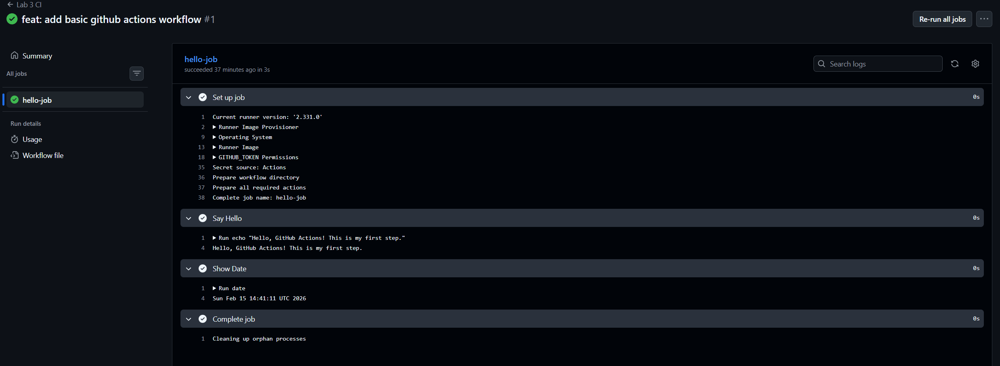
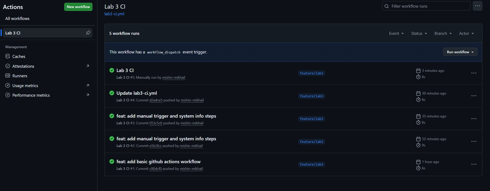
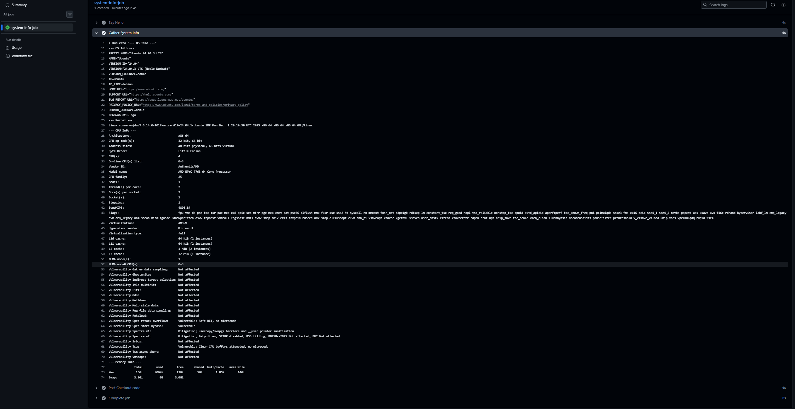

# Lab 3 Submission (GitHub Actions)

## Task 1: First Workflow

I created a workflow file `.github/workflows/lab3-ci.yml`. It runs automatically when I push code.

**Link to successful run:** 

https://github.com/mishin-mikhail/DevOps-Intro/actions/runs/22037526290

**Observations:**
The workflow consists of jobs and steps. I learned that `runs-on` specifies the OS (Ubuntu), and `run` executes shell commands.

## Task 2: Manual Trigger & System Info

**Changes made:**
1. Added `workflow_dispatch:` to the `on:` section to enable manual trigger.
2. Added commands like `lscpu`, `free -h`, and `uname -a` to inspect the runner.

**Link to successful run:** 

https://github.com/mishin-mikhail/DevOps-Intro/actions/runs/22038317262

**System info**

Based on the logs, the runner specifications are:
*   **OS:** Ubuntu 22.04.3 LTS
*   **Kernel:** Linux 6.14.0
*   **CPU:** AMD EPYC 7763
*   **RAM:** 16 GB

**Analysis of runner environment and capabilities.(all system info on screenshot)**

The GitHub-hosted Ubuntu runner provides a stable, cloud-based virtual environment with moderate computational resources. It is well-suited for continuous integration tasks, automated testing, and general development workflows, while maintaining isolation and reproducibility.

**Manual vs Automatic:**
Automatic triggers happen on `git push`. Manual triggers allow me to run the pipeline anytime via the GitHub UI ("Run workflow" button) without changing code.
