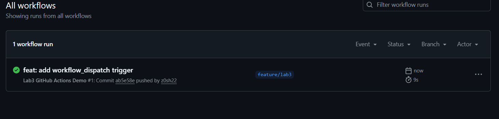

## Task 1 — First GitHub Actions Workflow

### 1.1 Quickstart workflow

- Я создал файл `.github/workflows/lab3-demo.yml`.
- Workflow содержит:
  - **job** `explore-github-actions`, который запускается на `ubuntu-latest`.
  - Несколько **steps**: вывод информации, `actions/checkout`, `ls` репозитория и т. д. [web:1]

Ключевые концепции:
- **Jobs** — независимые единицы работы, которые могут идти параллельно (в YAML — секция `jobs:`, внутри `explore-github-actions:`). [web:1]
- **Steps** — последовательные шаги внутри job (каждый `- run:` или `- uses:`). [web:1]
- **Runners** — виртуальные машины, на которых выполняются jobs (здесь `runs-on: ubuntu-latest`). [web:1]
- **Triggers** — события, которые запускают workflow, в данном случае `on: push`. [web:1]

### 1.2 Trigger и анализ выполнения

- Workflow запускается при каждом `git push` в репозиторий, потому что в `on` указано событие `push`. [web:1]
- Ссылка на успешный run: https://github.com/z0sh22/DevOps-Intro/actions/runs/22187270097/job/64164528087.





## Task 2 — Manual trigger + System Info

### 2.1 Changes to workflow

https://github.com/z0sh22/DevOps-Intro/actions/runs/22187742506/job/64167020774

- В секции `on` добавил событие `workflow_dispatch`, чтобы можно было запускать workflow вручную из UI (кнопка **Run workflow** в Actions). 
- Добавлен шаг `Show system information`, который выполняет `uname -a`, `lscpu`, `free -h` для получения OS/CPU/RAM. 

Фрагмент YAML:

```yaml
on:
  push:
  workflow_dispatch:

jobs:
  explore-github-actions:
    runs-on: ubuntu-latest
    steps:
      - name: Show system information
        run: |
          echo "=== uname -a ==="
          uname -a
          echo "=== lscpu ==="
          lscpu
          echo "=== free -h ==="
          free -h


