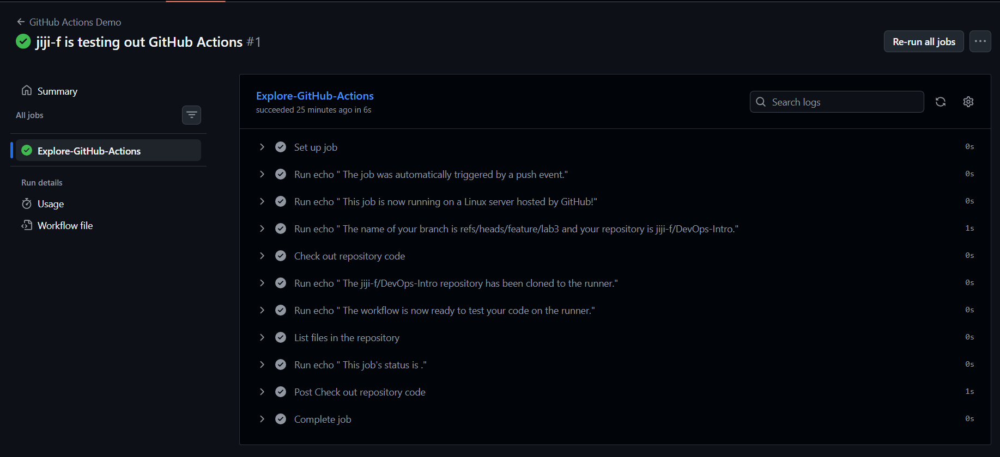

# TASK 1
## 1) Link to the successful run (or screenshots).

Workflow run: [GitHub Actions Run](https://github.com/jiji-f/DevOps-Intro/actions/runs/22185288354/job/64157179565)
## 2) Key concepts learned

**Trigger** — defines when a workflow runs. In this lab the workflow is triggered on `push`.

**Job** — a set of steps executed on the same runner. The workflow contains one job called `Explore-GitHub-Actions`.

**Step** — an individual task inside a job. Steps execute commands like `echo` or use actions such as `actions/checkout`.

**Runner** — a virtual machine provided by GitHub that executes workflow jobs. This workflow runs on `ubuntu-latest`.

---

## 3) What caused the run to trigger

The workflow was triggered automatically after pushing commits to the repository on branch `feature/lab3`.

GitHub detected changes in the repository and started the workflow because the YAML file specifies:

```
on: push
```
## 4) Analysis of workflow execution

The workflow executed successfully on a GitHub-hosted runner (`ubuntu-latest`).  
After the push event, GitHub Actions automatically started the job defined in the workflow file.

The job performed the following sequence:
- Set up the runner environment
- Checked out the repository code
- Executed multiple `echo` steps defined in the workflow
- Completed without errors

The logs show that all steps finished successfully and the job duration was about 11 seconds.  
This confirms that the workflow trigger, job configuration, and runner execution were correctly set up and functioning as expected.
___
# TASK 2
## 1) Changes made to the workflow file

I extended the workflow triggers by adding a manual trigger:

```
on:
  push:
  workflow_dispatch:
  ```
I also added an additional step to collect system information from the runner:
```
- name: Show runner system info
  run: |
    echo "=== OS ==="
    uname -a
    echo "=== CPU ==="
    lscpu
    echo "=== Memory ==="
    free -h
    echo "=== Disk ==="
    df -h
    echo "=== GitHub runner env ==="
    echo "Runner OS: $RUNNER_OS"
    echo "Workflow: $GITHUB_WORKFLOW"
    echo "Repository: $GITHUB_REPOSITORY"
    echo "Ref: $GITHUB_REF"
```
## 2) The gathered system information from runner

System information was collected from the GitHub-hosted runner during workflow execution.

- **Operating system**: Ubuntu Linux (ubuntu-latest)

- **CPU**: Virtual CPU provided by GitHub runner environment

- **Memory**: Runner memory information collected via free -h

- **Disk**: Disk space information collected via df -h

- **GitHub runner environment**:

     - Runner OS: Linux

     - Workflow: GitHub Actions Demo

     - Repository: jiji-f/DevOps-Intro

     - Ref: refs/heads/feature/lab3

## 3) Comparison of manual vs automatic workflow triggers

- **Automatic trigger** (`push`) runs every time code is pushed to the repository.
This enables continuous integration and automatic testing after each commit.

- **Manual trigger** (`workflow_dispatch`) allows starting the workflow manually from the GitHub Actions UI.
This is useful for debugging, rerunning workflows, or executing tasks on demand without new commits.

## 4) Analysis of runner environment and capabilities

GitHub-hosted runners provide a preconfigured virtual machine with common development tools installed.
This allows workflows to run without manual environment setup.

The collected system information confirms that the workflow executed on a Linux environment (`ubuntu-latest`) with standard CPU, memory, and disk resources provided by GitHub.

Such an environment is suitable for typical CI/CD tasks including building, testing, automation, and system inspection.