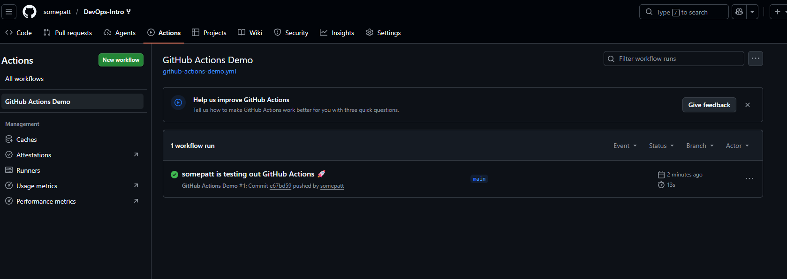
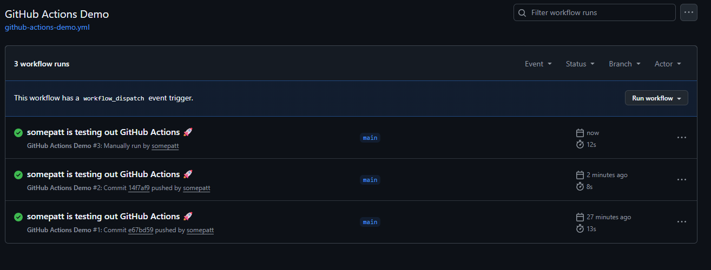

1) Сделал все по инструкции, получилось так: 

https://github.com/somepatt/DevOps-Intro/actions/runs/22054694226

Actions нужны, чтобы автоматизировать проверку PR, который вносится в main ветку. Через них можно настроить автоматические тесты, которые необходимы для проверки корректности кода, автоматический  деплой

2) Manunal trigger

Run echo "=== System Information ==="
=== System Information ===
Linux runnervmjduv7 6.14.0-1017-azure #17~24.04.1-Ubuntu SMP Mon Dec  1 20:10:50 UTC 2025 x86_64 x86_64 x86_64 GNU/Linux

=== CPU Information ===
Architecture:                            x86_64
CPU op-mode(s):                          32-bit, 64-bit
Address sizes:                           48 bits physical, 48 bits virtual
Byte Order:                              Little Endian
CPU(s):                                  4
On-line CPU(s) list:                     0-3
Vendor ID:                               AuthenticAMD
Model name:                              AMD EPYC 7763 64-Core Processor
CPU family:                              25
Model:                                   1
Thread(s) per core:                      2
Core(s) per socket:                      2
Socket(s):                               1
Stepping:                                1
BogoMIPS:                                4890.85
Flags:                                   fpu vme de pse tsc msr pae mce cx8 apic sep mtrr pge mca cmov pat pse36 clflush mmx fxsr sse sse2 ht syscall nx mmxext fxsr_opt pdpe1gb rdtscp lm constant_tsc rep_good nopl tsc_reliable nonstop_tsc cpuid extd_apicid aperfmperf tsc_known_freq pni pclmulqdq ssse3 fma cx16 pcid sse4_1 sse4_2 movbe popcnt aes xsave avx f16c rdrand hypervisor lahf_lm cmp_legacy svm cr8_legacy abm sse4a misalignsse 3dnowprefetch osvw topoext vmmcall fsgsbase bmi1 avx2 smep bmi2 erms invpcid rdseed adx smap clflushopt clwb sha_ni xsaveopt xsavec xgetbv1 xsaves user_shstk clzero xsaveerptr rdpru arat npt nrip_save tsc_scale vmcb_clean flushbyasid decodeassists pausefilter pfthreshold v_vmsave_vmload umip vaes vpclmulqdq rdpid fsrm
Virtualization:                          AMD-V
Hypervisor vendor:                       Microsoft
Virtualization type:                     full
L1d cache:                               64 KiB (2 instances)
L1i cache:                               64 KiB (2 instances)
L2 cache:                                1 MiB (2 instances)
L3 cache:                                32 MiB (1 instance)
NUMA node(s):                            1
NUMA node0 CPU(s):                       0-3
Vulnerability Gather data sampling:      Not affected
Vulnerability Ghostwrite:                Not affected
Vulnerability Indirect target selection: Not affected
Vulnerability Itlb multihit:             Not affected
Vulnerability L1tf:                      Not affected
Vulnerability Mds:                       Not affected
Vulnerability Meltdown:                  Not affected
Vulnerability Mmio stale data:           Not affected
Vulnerability Reg file data sampling:    Not affected
Vulnerability Retbleed:                  Not affected
Vulnerability Spec rstack overflow:      Vulnerable: Safe RET, no microcode
Vulnerability Spec store bypass:         Vulnerable
Vulnerability Spectre v1:                Mitigation; usercopy/swapgs barriers and __user pointer sanitization
Vulnerability Spectre v2:                Mitigation; Retpolines; STIBP disabled; RSB filling; PBRSB-eIBRS Not affected; BHI Not affected
Vulnerability Srbds:                     Not affected
Vulnerability Tsa:                       Vulnerable: Clear CPU buffers attempted, no microcode
Vulnerability Tsx async abort:           Not affected
Vulnerability Vmscape:                   Not affected

=== Memory Information ===
               total        used        free      shared  buff/cache   available
Mem:            15Gi       1.2Gi        12Gi        38Mi       1.8Gi        14Gi
Swap:          3.0Gi          0B       3.0Gi

=== Disk Space ===
Filesystem      Size  Used Avail Use% Mounted on
/dev/root       145G   53G   92G  37% /
tmpfs           7.9G   84K  7.9G   1% /dev/shm
tmpfs           3.2G 1004K  3.2G   1% /run
tmpfs           5.0M     0  5.0M   0% /run/lock
efivarfs        128M   32K  128M   1% /sys/firmware/efi/efivars
/dev/sda16      881M   63M  757M   8% /boot
/dev/sda15      105M  6.2M   99M   6% /boot/efi
tmpfs           1.6G   12K  1.6G   1% /run/user/1001

=== Environment Variables ===
RUNNER_NAME=GitHub Actions 1000000003
ACTIONS_RUNNER_ACTION_ARCHIVE_CACHE=/opt/actionarchivecache
RUNNER_ENVIRONMENT=github-hosted
RUNNER_OS=Linux
RUNNER_TRACKING_ID=github_0693c1ba-0006-4b99-987e-93555d6e0a72
RUNNER_ARCH=X64
RUNNER_TEMP=/home/runner/work/_temp
RUNNER_TOOL_CACHE=/opt/hostedtoolcache
RUNNER_WORKSPACE=/home/runner/work/DevOps-Intro
ENABLE_RUNNER_TRACING=true

Было добавлено: manual trigger, сбор информации о системе.

Выбор manual vs automatic triggers зависит от задачи. Иногда быстрее просто запушить в main код, и автоматически все проверится. Когда не нужно при каждом push запускать тесты, тогда можно вручную запускать при необходимости. 

Запуск был на Linux, процессор AMD, оперативной память 15gb, на диске примерно 160gb