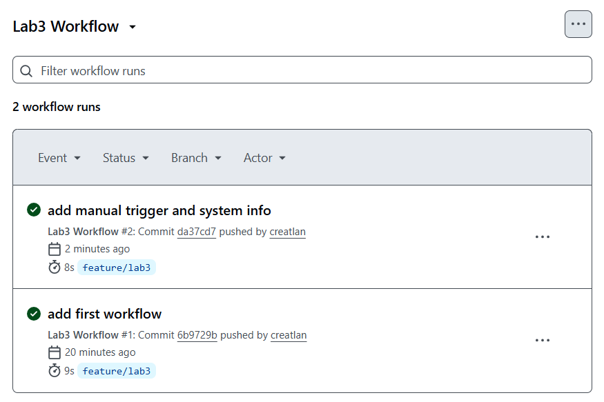

Task 1 — First Workflow

Run link:
https://github.com/creatlan/DevOps-Intro/actions/runs/22232302208

The workflow was triggered automatically by a push to the feature/lab3 branch because on: push is defined in the YAML file.

The pipeline contains one job running on ubuntu-latest.
Inside the job, steps are executed sequentially (checkout + basic commands).

The runner is a GitHub-hosted virtual machine that executes the workflow in an isolated environment.

The green status confirms successful execution.

Task 2 — Manual Trigger + System Info

I extended the workflow by adding workflow_dispatch, which allows manual запуск from the Actions tab.

Now the workflow can be triggered:

automatically (push)

manually (Run workflow button)

I also added system commands (uname, nproc, free, df) to collect information about:

OS

CPU cores

Memory

Disk space

This shows that the runner is a Linux-based VM with predefined resources provided by GitHub.

Manual trigger gives more control, while push trigger runs automatically after code changes.

Below is a screenshot of the GitHub Actions page showing two successful workflow runs (initial workflow and extended version with manual trigger and system info)

