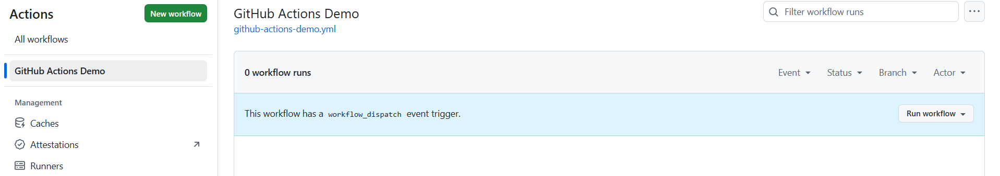
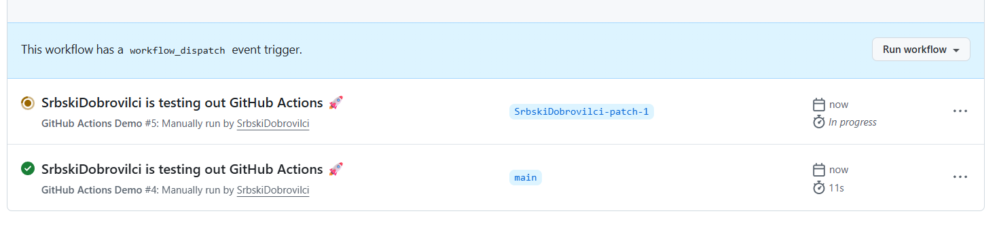
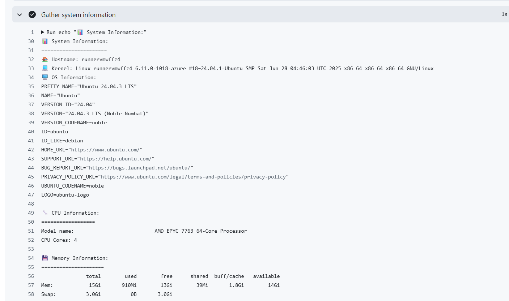
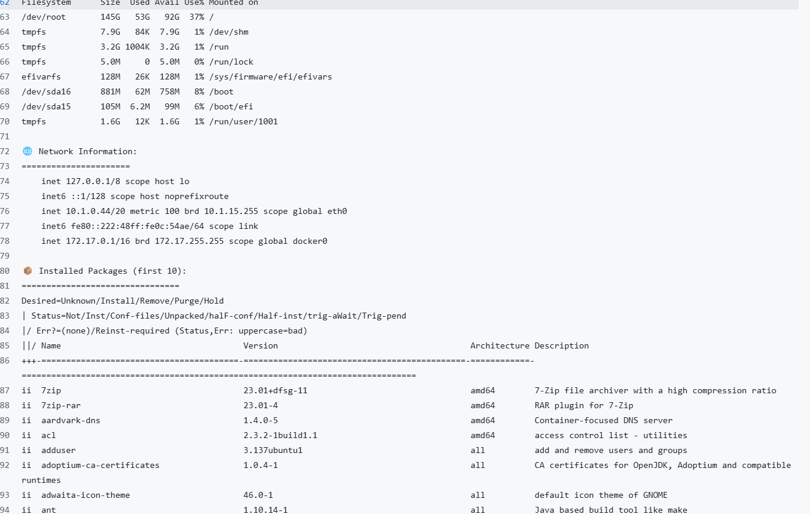

#  Task 1
Worflow run succefully

Logs of worflow

In GitHub Actions, there are several key components:

Jobs - a collection of sequential steps executed by a runner

Steps - individual tasks within a job

Runners - virtual machines responsible for running workflows

Triggers - events that initiate workflow execution (e.g., push operations)

The workflow was initiated following a git push command, as specified in the configuration with "on: [push]".

Upon receiving a push event, GitHub validates the workflow configuration files and provisions a virtual machine to carry out the steps defined in the YAML file.

# Task 2
Add manual worflow runner 

Gathering information wtih github workflow

Automatic triggers (push) occur whenever changes are submitted to the repository.
Manual triggers (workflow_dispatch) are initiated by users through the "Run workflow" button in the GitHub interface. Manual execution is particularly useful for testing purposes, as it eliminates the need to create a new commit.

The workflow runs on a GitHub-hosted runner using the Ubuntu operating system. This runner provides a standard Linux environment equipped with pre-installed tools such as Git, Python, Node.js, and others. This setup is well-suited for automated builds, testing procedures, and script execution.