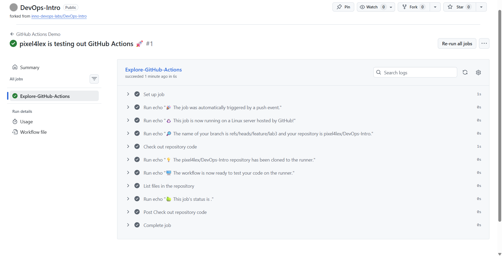

# Submission 3 Notes

## Task 1 — First GitHub Actions Workflow

### Link to the successful run (or screenshots)
Screenshot:

Link:
https://github.com/pixel4lex/DevOps-Intro/actions/runs/22037748808/job/63673423412

### Key concepts learned
**Jobs** — A job is a set of steps that run together on the same runner within a workflow. Jobs can run in parallel by default or be configured with dependencies to run sequentially.

**Steps** — Steps are individual tasks inside a job, such as running a command or using an action. They execute in order and share the same environment within that job.

**Runners** — Runners are the machines (virtual or self-hosted) that execute jobs. GitHub provides hosted runners (e.g., Ubuntu, Windows, macOS), or you can use your own infrastructure.

**Triggers** — Triggers define the events that start a workflow, such as pushes, pull requests, schedules, or manual dispatch. They determine when the automation runs.

### What caused the run to trigger
The workflow run was triggered automatically by a push event to the repository, because the configuration specifies on: [push]. Any commit pushed to any branch starts the workflow, which then executes the defined job on a GitHub-hosted Ubuntu runner.

### Analysis of workflow execution process
1. **Trigger Activation (`on: [push]`)**  
   Any push to the repository triggers the workflow automatically. GitHub creates a new run with the specified workflow name and a dynamic run name showing the user who pushed the changes.

2. **Job Queuing and Runner Provisioning**  
   The workflow contains a single job (`Explore-GitHub-Actions`) configured to run on `ubuntu-latest`. GitHub provisions a hosted Ubuntu virtual machine and prepares the workspace directory for the job.

3. **Sequential Step Execution**  
   All steps execute in order on the same runner and share the same filesystem and environment variables.

4. **Step Details**  
   - `echo` steps print contextual information such as the triggering event (`push`), runner OS, branch reference, and repository name.  
   - `actions/checkout@v5` clones the repository into the runner workspace so subsequent steps can access the code.  
   - Additional `echo` commands confirm readiness and provide status messages.  
   - The `ls ${{ github.workspace }}` command lists repository files, verifying the checkout succeeded.  
   - The final step prints the job status (typically `success` if no errors occurred).

5. **Completion and Result**  
   If all steps succeed (exit code 0), the job and workflow run are marked as successful. If any step fails, the job stops and the run is marked as failed.

## Task 2 — Manual Trigger + System Information

