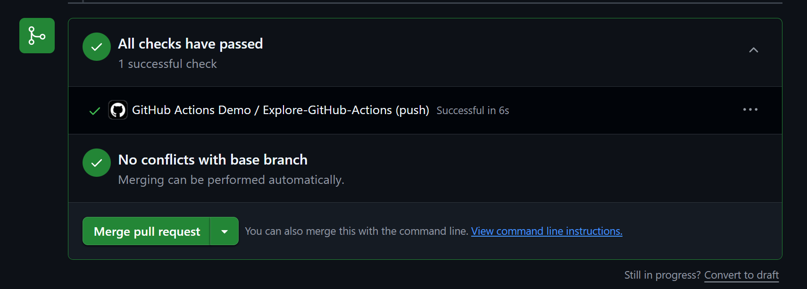
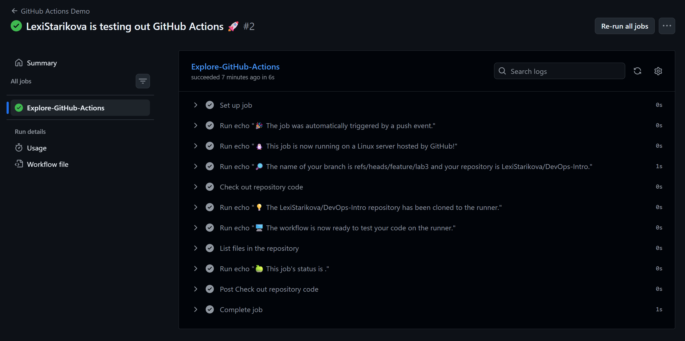

# Lab 3 Submission

## Task 1 - First GitHub Actions Workflow

### 1.1 Quickstart implementation

I followed the GitHub Actions quickstart and created a workflow file:

- Workflow path: `.github/workflows/github-actions-demo.yml`
- Workflow name: `GitHub Actions Demo`
- Trigger configured: `on: [push]`
- Runner configured: `runs-on: ubuntu-latest`

The workflow contains one job (`Explore-GitHub-Actions`) and multiple steps that:

- print event/context information (`github.event_name`, `github.ref`, `github.repository`)
- print runner information (`runner.os`)
- check out repository code with `actions/checkout@v5`
- list files in `${{ github.workspace }}`
- print final job status (`job.status`)

### 1.2 Workflow trigger test

I pushed a commit to the repository, and this push event automatically triggered the workflow in the GitHub Actions tab.

### Evidence (run/screenshots)

Screenshots of successful workflow executions:





### Key concepts learned

- **Workflow**: automation defined in YAML under `.github/workflows/`.
- **Event trigger**: `push` starts the workflow automatically after each commit push.
- **Job**: a group of steps running in the same runner environment.
- **Step**: one command/action in a job.
- **Runner**: GitHub-hosted VM (`ubuntu-latest`) that executes the job.

### What caused the run to trigger

The run was triggered by a `push` event after committing and pushing changes to the repository branch.

### Workflow execution analysis

1. GitHub receives a push to the repository.
2. GitHub detects a matching trigger in `github-actions-demo.yml`.
3. A new workflow run starts with one job on `ubuntu-latest`.
4. Steps execute sequentially: print context -> checkout -> list files -> print status.
5. The run completes successfully and logs are available in the Actions tab.

---

## Task 2 - Manual Trigger + System Information

### 2.1 Changes made to workflow file

I updated `.github/workflows/github-actions-demo.yml` with:

- manual trigger: `workflow_dispatch`
- existing automatic trigger kept: `push`
- new step: `Gather runner system information`

Updated trigger section:

```yaml
on:
  push:
  workflow_dispatch:
```

### 2.2 Manual dispatch test

I ran the workflow manually from GitHub UI:

`Actions -> GitHub Actions Demo -> Run workflow`

This created a workflow run with event type `workflow_dispatch`.

### 2.3 Gathered runner system information

The added step prints environment details using `uname -a`, `lscpu`, `free -h`, and `df -h`.

System information captured in logs includes:

- OS and kernel information (Linux on GitHub-hosted Ubuntu runner)
- CPU architecture and core/thread information
- memory totals/usage (`free -h`)
- disk layout and available storage (`df -h`)

### Manual vs automatic trigger comparison

- **Automatic (`push`)**: runs after commits are pushed; good for continuous validation.
- **Manual (`workflow_dispatch`)**: runs on demand from UI; good for ad-hoc checks and demos.
- **Both use same workflow/jobs**: only the triggering event differs (`github.event_name`).

### Runner environment analysis

- Runner is ephemeral (fresh VM for each run), which improves reproducibility.
- Environment is consistent (`ubuntu-latest`) and suitable for standard CI tasks.
- Available resources are enough for typical build/test tasks in this lab.
