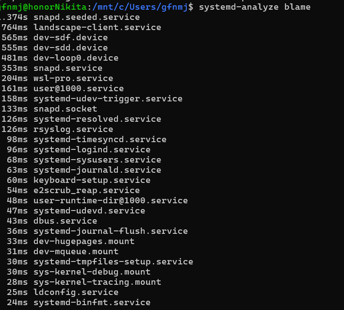
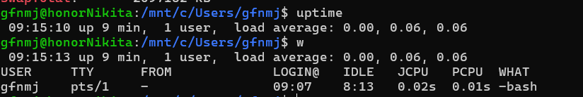
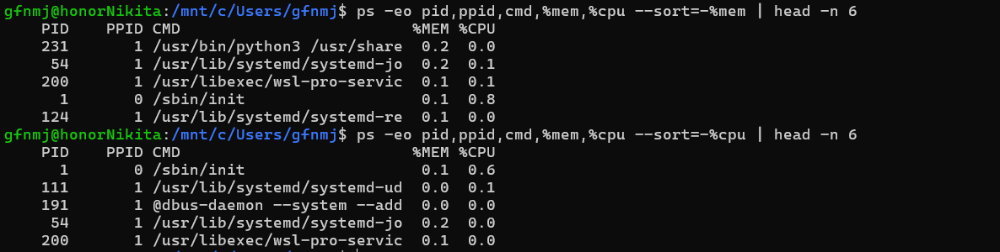
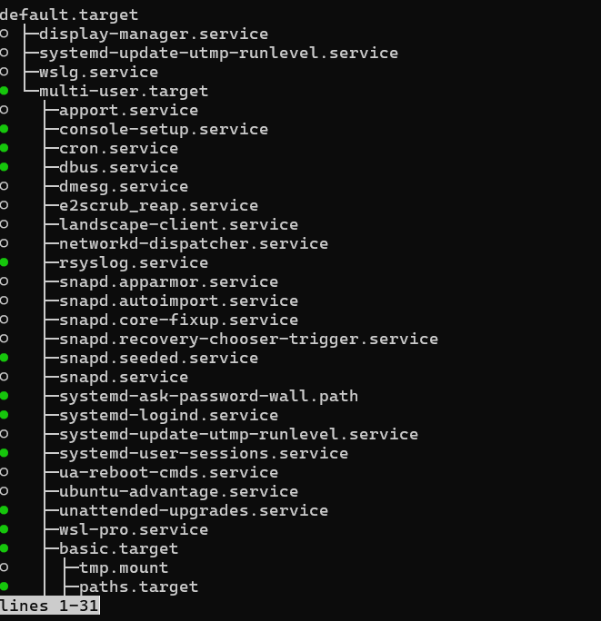
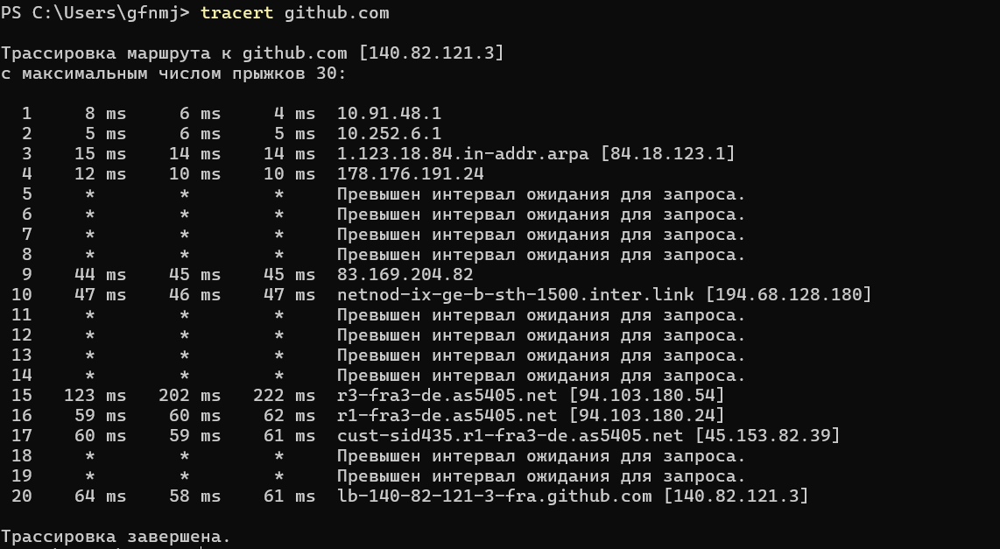
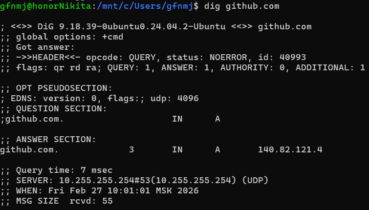
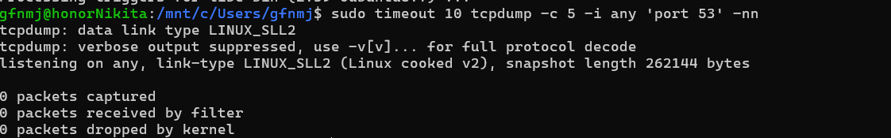
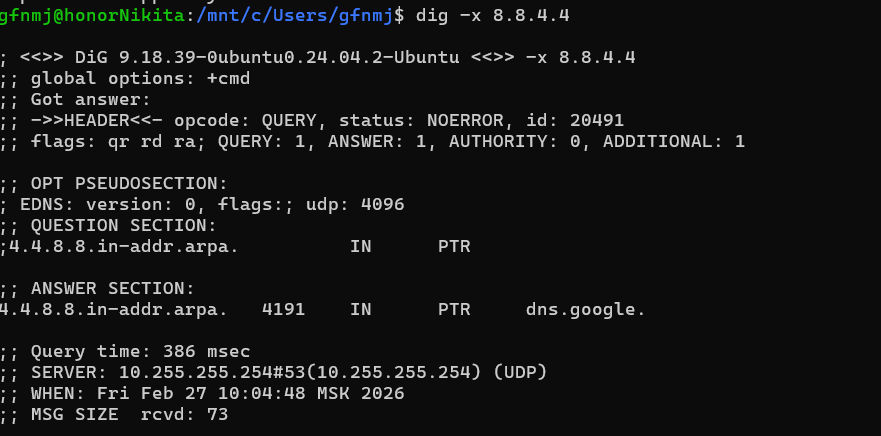
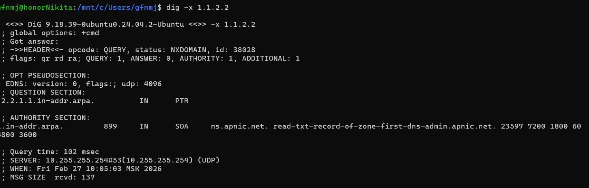

## Task 1.1 
systemd-analyze

systemmd-analyze blame

Checked System Load:

## Task 1.2
Identify Resource-Intensive Processes:

### Answers and observation
Top memory consuming is PID 231       1 /usr/bin/python3 /usr/share  0.2  0.0 = 0.2. 
Top cpu consumption is     1       0 /sbin/init                   0.1  0.6

Basic ones just system proccess that needs to run fot system

## Task 1.3
Map Service Relationships:

## Task 1.4
Audit Login Activity:

### Obseration
I entered the system with name gfnmj

## Task 1.5
Inspect Memory Allocation:

### Obseration

Have a lot of free memery to use, no additional files used to extend memory load

## Task 2.1

traceroute

### insights
The traceroute shows your traffic takes a path from Russia through Sweden to Germany before reaching GitHub, with multiple timeouts suggesting routers configured to not respond to ICMP requests rather than actual connectivity issues. Despite these timeouts, the connection works with reasonable latency (~60ms) to GitHub's servers, though the routing path appears somewhat indirect.
Dig 

### insights
This dig output shows a successful DNS lookup for github.com resolving to IP address 140.82.121.4 in just 7 milliseconds. Your DNS server at 10.255.255.254 responded quickly with the correct GitHub address, and the short TTL (Time-To-Live) of 3 seconds indicates this record expires very quickly.

## Task 2.2
No captureed  traffic 

### example of dns query
Example DNS query: Out IP 172.17.222.XXX.44383 > 8.8.8.8.53: 17629+ [1au] A? gith, teub.com.
This shows my local WSL machine, with its IP address partially redacted, initiating a DNS resolution. It forwards a request to Google's public DNS server at 8.8.8.8, specifically asking for the IPv4 address (an 'A' record) associated with github.com.

Example response: In IP 8.8.8.8.53 > 172.17.222.XXX.44383: ... A 20.205.243.166
The public DNS server replies, providing the resolved information. The query is successful, returning the specific IP address 20.205.243.166 for the requested domain.

## Task 2.3
8.8.4.4

1.1.2.2

Comparison of reverse lookup results: The reverse lookup for 8.8.4.4 successfully resolved to dns.google., confirming that Google has configured a valid PTR record for this IP. On the other hand, the lookup for 1.1.2.2 timed out and returned NXDOMAIN (non-existent domain), indicating that there is no reverse DNS (PTR) record associated with this IP address.

