# Task 1
Installed succes,  without any issues
Platfrom : Windows 11 Home
Version of VM box :  7.2.4 r17099
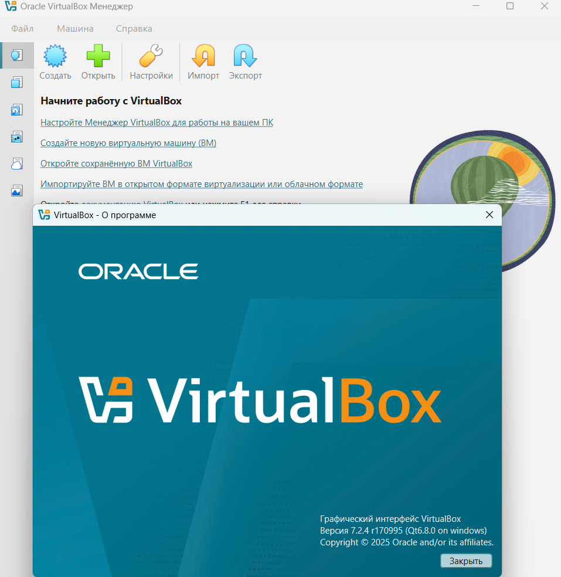

# Task 2
## VM config:
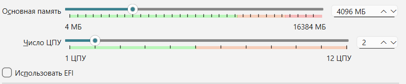

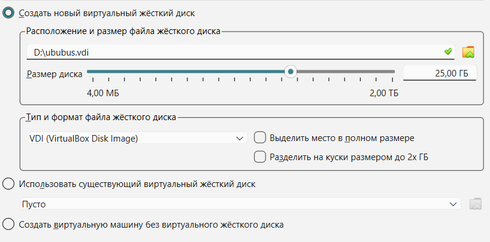

## CPU info: 
### tools:
lscpu
### used command:
lscpu
cat /proc/cpuinfo | grep -E "model name|cpu MHz|cpu cores|siblings"
### output
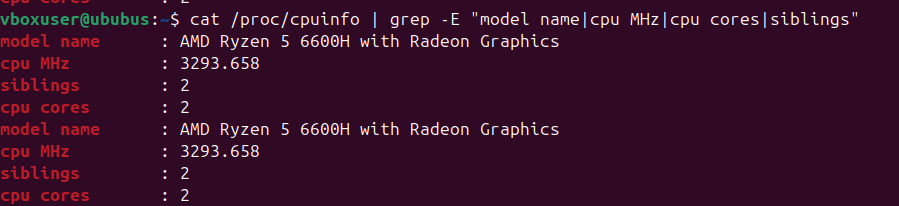

## Memory infomation
### tools:
free
### used command:
free -h
### output

## Network Configuration

used command
ip addr show
hostname -I
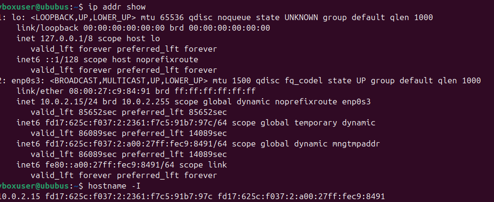

## Storage Information
### tools :
df
lsblk
fdisk
### used command:
df -h
lsblk
sudo fdisk -l
### output
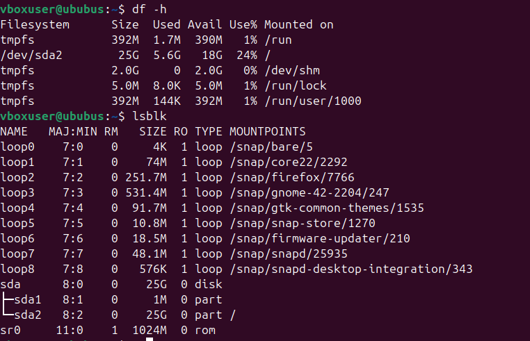

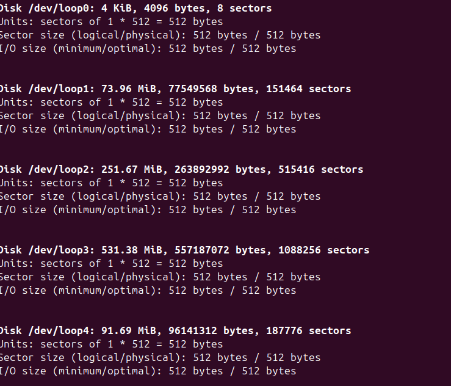
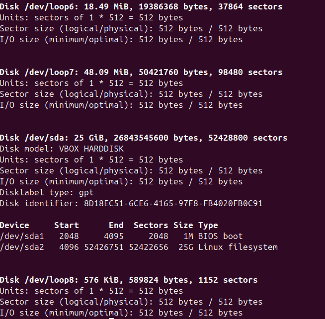
## Operating System
### tools : 
lsb_release
uname
hostnamectl

### used commands :  
lsb_release -a
cat /etc/os-release
uname -a
hostnamectl
### output
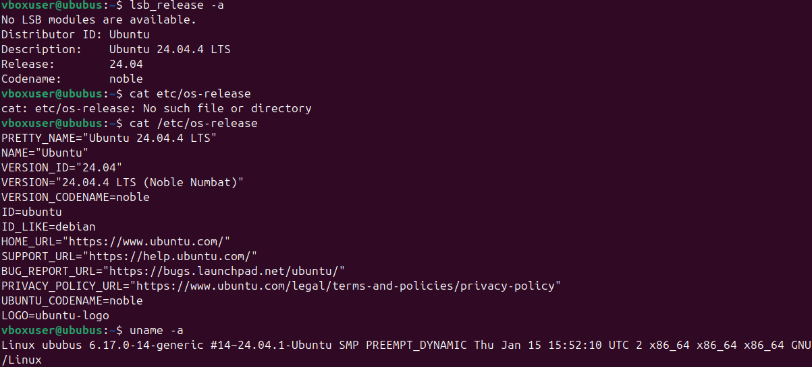
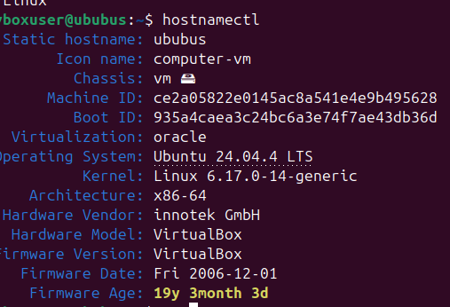

## Virtualization Detection
tools: 
systemd-detect-virt
lscpu
dmesg
dmidecode
### command used: 
systemd-detect-virt
lscpu | grep Hypervisor
dmesg | grep -i virtual
dmidecode -s system-manufacturer  
### output
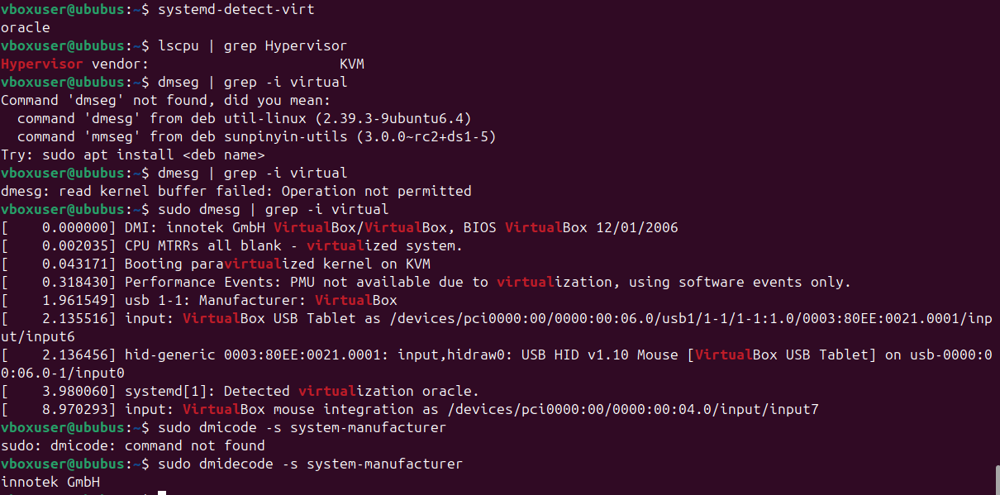

## Analyze
Most useful lscpu, shows a lot of useful info about cpu frequnecy nad hypervisor. And fdisk -l, showed whole segmentation of memory disk.