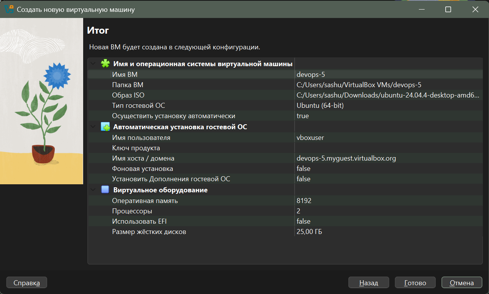
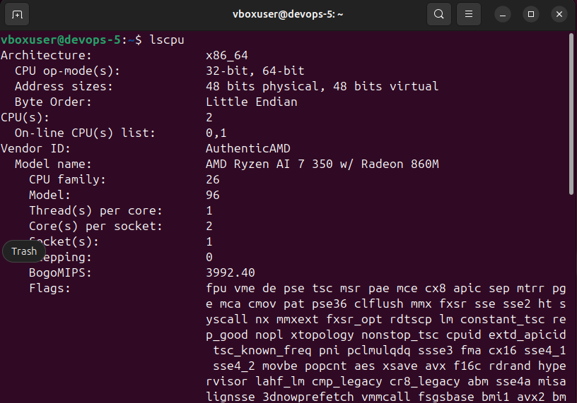
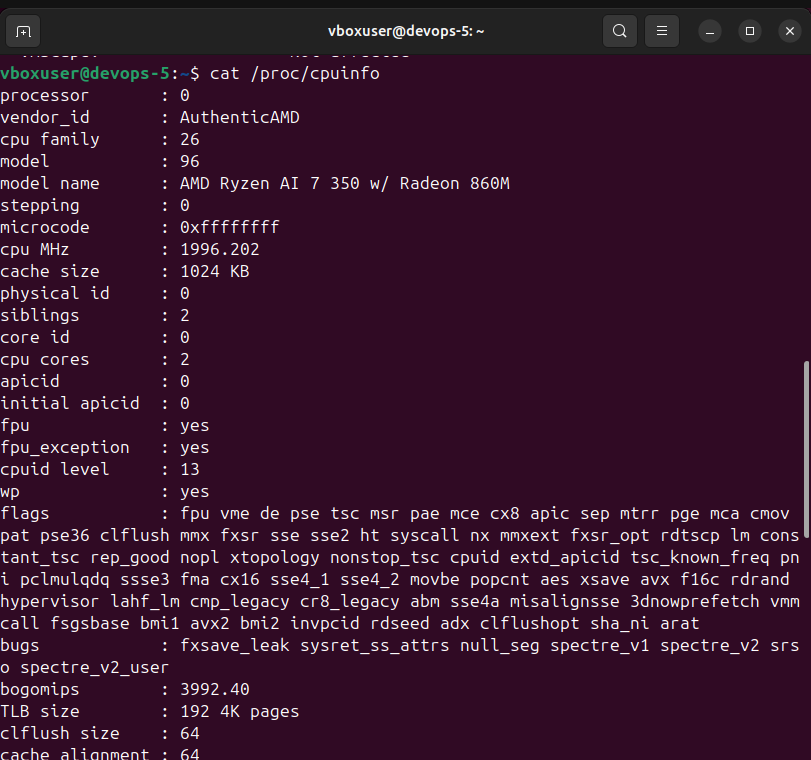
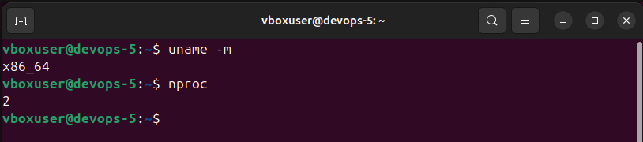
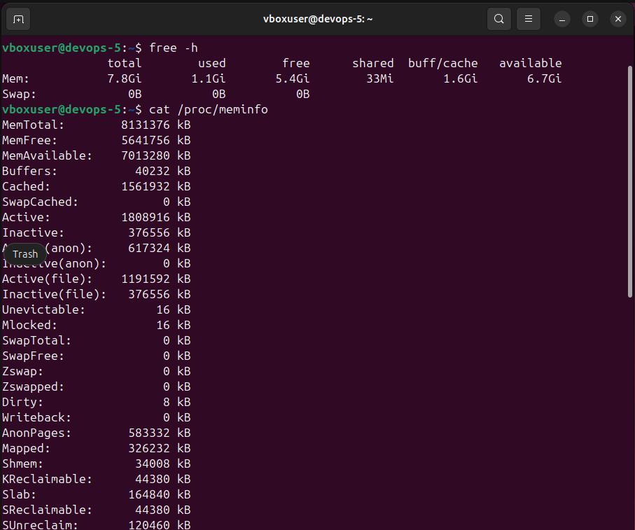
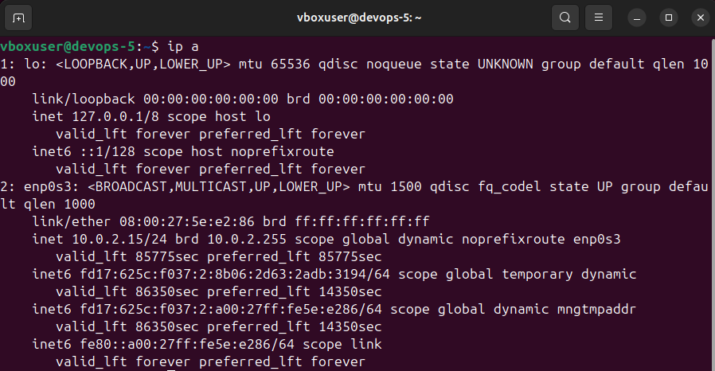
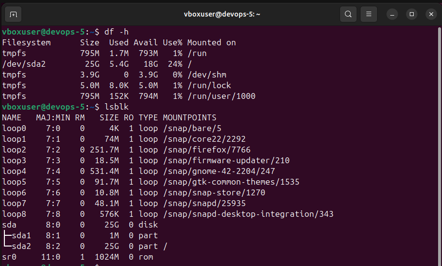
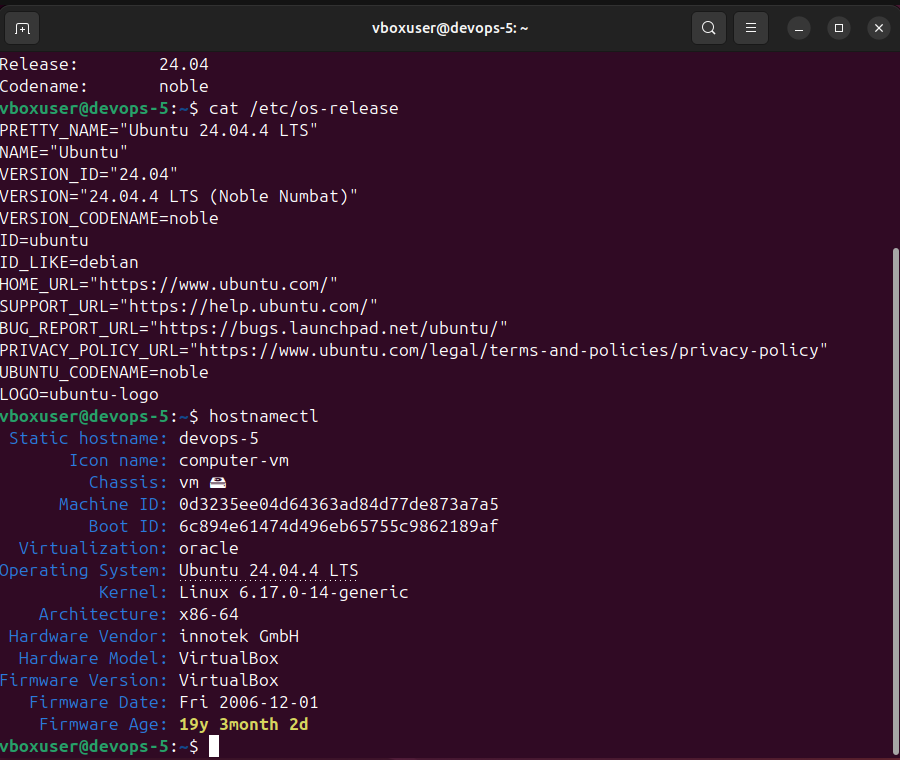
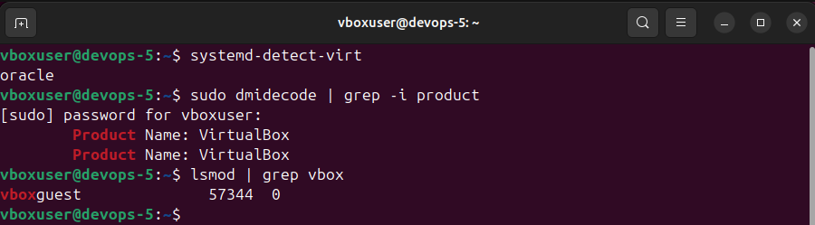

# Lab 5 — Virtualization & System Analysis

## Task 1

- Windows 11 (64-bit)
- Version 7.2.6 (amd64)
- No installation issues

## Task 2

### Commands & Outputs

- CPU Details

- Memory Information

- Network Configuration

- Storage Information

- Operating System Information

- Virtualization Detection

## Summary  

From my point of view, the most useful tools were `lscpu`, `free -h`, `ip a`, `df -h`, `lsb_release -a`, and `systemd-detect-virt` as they provide clear and concise information. Also, most of them are pretty short and easy for use.
