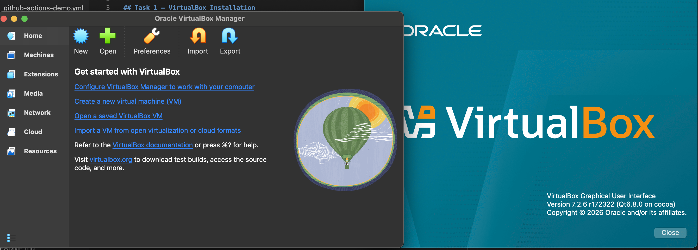
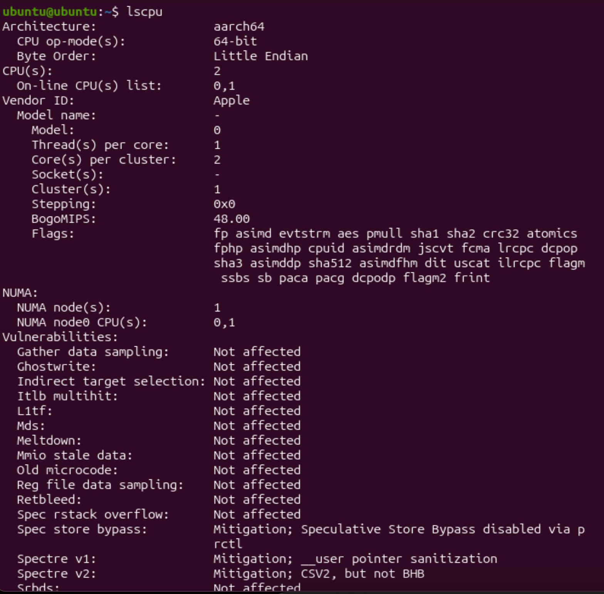
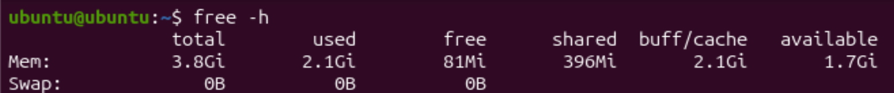
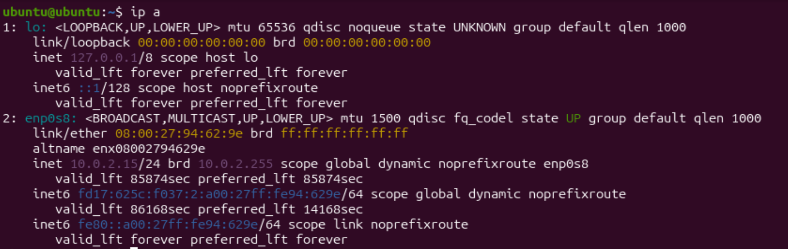
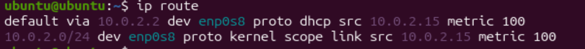
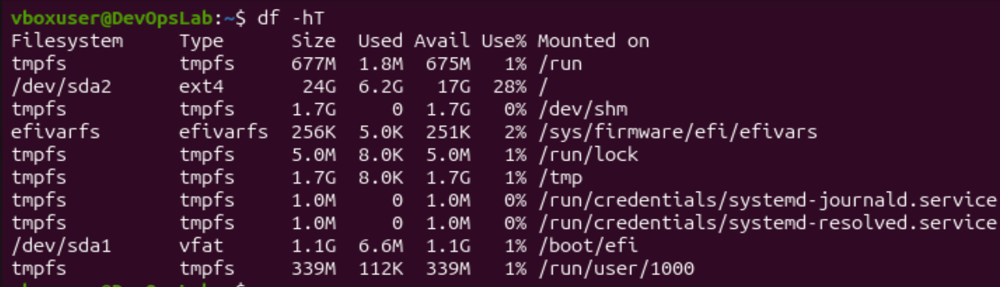
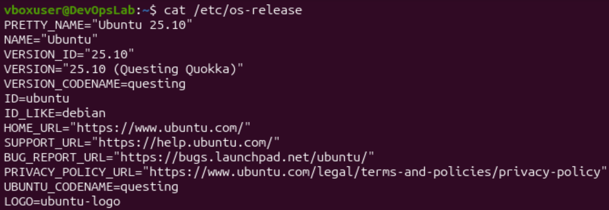
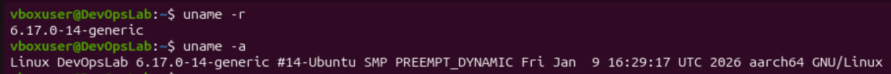
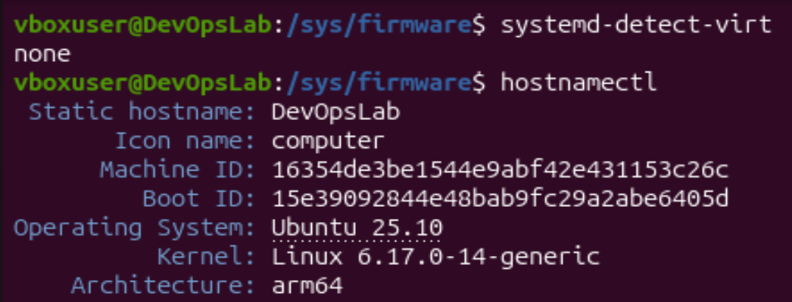

# Lab 5 Submission

## Task 1 — VirtualBox Installation 

Host operating system: macOS Sonoma 14.4
VirtualBox version: Version 7.2.6 r172322

Below you could see image that proves that VirtualBox with specified version is installed:

No issues were encountered during installation.

## Task 2 — Ubuntu VM and System Analysis

### 2.0 VM Configuration 

VM configuration:
- RAM: 4GB
- Storage: 25GB
- CPU: 2 cores
- OS Version: Ubuntu 25.10 (ARM 64-bit)

### 2.1 CPU details
Command used: `lscpu`  
Why: Displays CPU architecture, CPU count, vendor, core/thread topology, and low-level processor details in one command.  
Result:  
- Architecture: `aarch64` (64-bit)  
- CPU(s): `2`  
- Vendor ID: `Apple`  
- Threads per core: `1`, cores per cluster: `2`  
- Confirms ARM-based virtual machine CPU characteristics.  

### 2.2 Memory information
Command used: `free -h`  
Why: Shows total, used, free, and available RAM in human-readable units.  
Result:  
- Total RAM: `3.8Gi`  
- Used RAM: `2.1Gi`  
- Free RAM: `81Mi`  
- Available RAM: `1.7Gi`  
- Swap: `0B`  

### 2.3 Network configuration
Commands used: `ip a`, `ip route`  
Why:  
- `ip a` lists interfaces and assigned IP addresses.  
- `ip route` shows routing table and default gateway.  
Result:  
- Active interface: `enp0s8`  
- IPv4 address: `10.0.2.15/24`  
- Loopback interface `lo` is present  
- Default gateway: `10.0.2.2` via `enp0s8`  

### 2.4 Storage information
Command used: `df -hT`  
Why: Reports mounted filesystems, filesystem types, size, used/free space, and mount points.  
Result:  
- Main root filesystem: `/dev/sda2` (`ext4`)  
- Root size: `24G`, used: `6.2G`, available: `17G` (`28%` used)  
- EFI partition: `/dev/sda1` (`vfat`) mounted on `/boot/efi`  

### 2.5 Operating system
Commands used: `cat /etc/os-release`, `uname -r`, `uname -a`  
Why:  
- `/etc/os-release` provides distribution/version identity.  
- `uname -r` shows kernel release.  
- `uname -a` shows full kernel/system/architecture string.  
Result:  
- Distribution: `Ubuntu 25.10 (Questing Quokka)`  
- Kernel version: `6.17.0-14-generic`  
- Architecture in kernel output: `aarch64` / `arm64`  

### 2.6 Virtualization detection
Commands used: `systemd-detect-virt`, `hostnamectl`  
Why:  
- `systemd-detect-virt` attempts to detect known virtualization providers.  
- `hostnamectl` can show virtualization information on many setups.  
Result:  
- `systemd-detect-virt` returned `none`.  
- `hostnamectl` showed OS/kernel/architecture, but no explicit virtualization field in this output.  

Why virtualization was not detected in this VM:  
1. ARM64 vs x86_64 discovery path  
   Traditional VM detection tools often depend on DMI/SMBIOS metadata commonly available on x86_64 platforms. On ARM64 systems (like Apple Silicon), hardware discovery is often exposed differently, so those legacy identifiers may be absent.  
2. VirtualBox behavior on Apple Silicon  
   On M1/M2 Macs, VirtualBox integrates with Apple’s hypervisor stack and may not expose the same classic VirtualBox signatures (for example, `VBOX` DMI strings) that Linux detection tools commonly match.

The only evidence of virtualization that I could present is that Vendor ID of CPU is `Apple`. And as Apple hardware is proprietary, the only way to observe such Vendor ID on Ubuntu is via virtualization.

### 2.7 Reflection
The most useful tools in this lab were:

- `lscpu` — best single command for CPU analysis because it summarizes architecture, core count, and processor topology clearly.
- `free -h` — fastest way to understand memory state in human-readable units without extra parsing.
- `ip a` + `ip route` — most practical networking pair: first shows interface/IP assignment, second confirms gateway and actual routing behavior.
- `df -hT` — very useful for storage checks because it combines capacity, usage, filesystem type, and mount point in one output.
- `/etc/os-release` + `uname` — reliable combination to separate distribution-level information from kernel-level details.

For virtualization detection in this specific ARM VirtualBox-on-macOS setup, `systemd-detect-virt` was still useful even though it returned `none`, because it confirmed that standard Linux detection signatures were not exposed and required architecture/platform-specific interpretation.