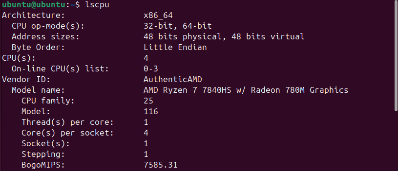
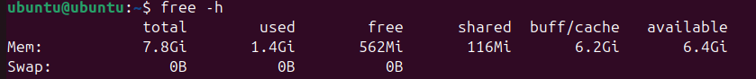
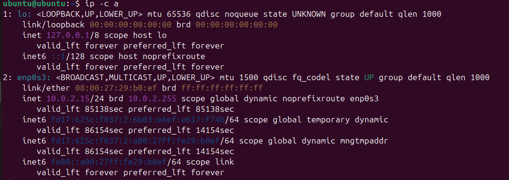
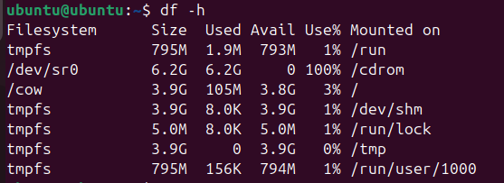

# Lab 5 Submission

## Task 1: VirtualBox Installation

- **Host OS:** (Windows 11 Pro 25H2)
- **VirtualBox Version:** (7.2.4)
- **Installation Issues:** (None)

```
Графический интерфейс VirtualBox
Версия 7.2.4 r170995 (Qt6.8.0 on windows)
Copyright © 2025 Oracle and/or its affiliates
```

## Task 2: Ubuntu VM and System Analysis

### VM Specifications
- **RAM:** 8 GB 
- **Storage:** 30 GB
- **CPU Cores:** 4

**Command: lscpu**




**Command free -h**




**Command ip -c a**




**Command df -h**




**Command hostnamectl**


**Command systemd-detect-virt**


```
The lscpu command was most useful for CPU details because it summarizes the architecture clearly. free -h is great for memory status as it converts bytes to GB. systemd-detect-virt quickly confirmed the VM environment.
```