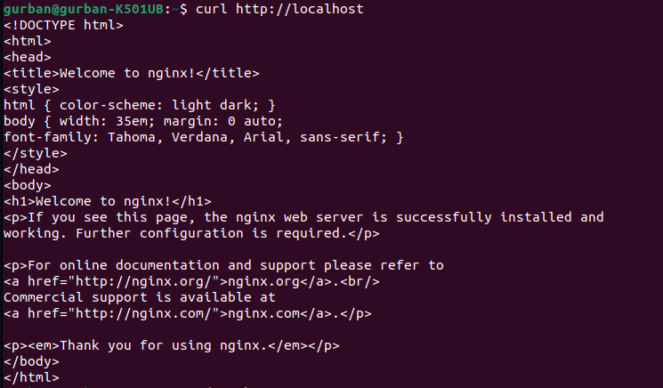
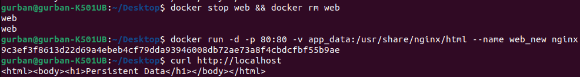

# 1. Container Fundamentals with Docker
## 1. Container Lifecycle & Image Management
### 1. Output of `docker ps -a` and `docker images`
- I didn't have any existing containers so `docker ps -a` was empty.
- Output of `docker images`:
```bash
                                                                                                                  i Info →   U  In Use
IMAGE           ID             DISK USAGE   CONTENT SIZE   EXTRA
ubuntu:latest   c35e29c94501        117MB         29.7MB    U  
```

### 2. Image size and layer count
- Image size: 29.7MB
- Layer count: 6

### 3. Tar file size comparison with image size
File size: 29MB
Image size: 29.7MB

Almost identical.

### 4. Error message from the first removal attempt
```bash
Error response from daemon: conflict: unable to delete ubuntu:latest (must be forced) - container c2b38fff8dbe is using its referenced image c35e29c9450
```

### 5. Analysis: Why does image removal fail when a container exists? Explain the dependency relationship.
Containers are instances of images. If a container exists, Docker cannot remove the image because the container depends on it.

### 6. Explanation: What is included in the exported tar file?
- All layers of the image
- Metadata (manifest, configuration)
- History of commands used to build the image

## 2. Custom Image Creation & Analysis
### 1. Screenshot or output of original Nginx welcome page
- 
### 2. Custom HTML content and verification via curl
` 
### 3. Output of docker diff my_website_container
```bash
C /etc
C /etc/nginx
C /etc/nginx/conf.d
C /etc/nginx/conf.d/default.conf
C /run
C /run/nginx.pid
```

### 4. Analysis: Explain the diff output (A=Added, C=Changed, D=Deleted)
**The docker diff shows changes inside the container’s filesystem**

### 5. Reflection: What are the advantages and disadvantages of docker commit vs Dockerfile for image creation?

- `docker commit` quickly saves a container’s current state as a new image.  
- Advantage: fast for experiments.  
- Disadvantage: not easily reproducible or version-controlled compared to a Dockerfile.

## 3. Container Networking & Service Discovery

### 1. Output of ping command showing successful connectivity
```bash
PING container2 (172.18.0.3): 56 data bytes
64 bytes from 172.18.0.3: seq=0 ttl=64 time=0.104 ms
64 bytes from 172.18.0.3: seq=1 ttl=64 time=0.423 ms
64 bytes from 172.18.0.3: seq=2 ttl=64 time=0.112 ms

--- container2 ping statistics ---
3 packets transmitted, 3 packets received, 0% packet loss
round-trip min/avg/max = 0.104/0.213/0.423 ms
```

### 2. Network inspection output showing both containers' IP addresses
```bash
[
    {
        "Name": "lab_network",
        "Id": "c120bfdaa8871b26b02cdbab099224fdb7cbdd012477a32df15eb39e7dcea776",
        "Created": "2025-12-11T04:50:47.084849179Z",
        "Scope": "local",
        "Driver": "bridge",
        "EnableIPv4": true,
        "EnableIPv6": false,
        "IPAM": {
            "Driver": "default",
            "Options": {},
            "Config": [
                {
                    "Subnet": "172.18.0.0/16",
                    "Gateway": "172.18.0.1"
                }
            ]
        },
        "Internal": false,
        "Attachable": false,
        "Ingress": false,
        "ConfigFrom": {
            "Network": ""
        },
        "ConfigOnly": false,
        "Containers": {
            "b18e418929a6294354b4fed147cec9371df14fa4c60d43df5a4040c740627d2c": {
                "Name": "container1",
                "EndpointID": "5e34bb9b623f2cd3bded3c85f156982da79eaf93a1161e81ffcd024710b4e3a1",
                "MacAddress": "a6:f5:78:a7:f2:f8",
                "IPv4Address": "172.18.0.2/16",
                "IPv6Address": ""
            },
            "f83c6bb9f3454ef560ca06011dd0b69eb33847d7dbd6fd29c45cf781945e5d96": {
                "Name": "container2",
                "EndpointID": "73890742d4a29b0e4ea75ee310daacc1592034937343feb1040370fdc7ab1c8a",
                "MacAddress": "36:ef:c3:bd:a8:ba",
                "IPv4Address": "172.18.0.3/16",
                "IPv6Address": ""
            }
        },
        "Options": {
            "com.docker.network.enable_ipv4": "true",
            "com.docker.network.enable_ipv6": "false"
        },
        "Labels": {}
    }
]
```

### 3. DNS resolution output
```bash
Server:		127.0.0.11
Address:	127.0.0.11:53

Non-authoritative answer:

Non-authoritative answer:
Name:	container2
Address: 172.18.0.3
```

### 4. Analysis: How does Docker's internal DNS enable container-to-container communication by name?
**Each user-defined bridge network has an embedded DNS server. Containers register their names with this DNS. Other containers can communicate by container name instead of IP.**

### 5. Comparison: What advantages does user-defined bridge networks provide over the default bridge network?
**User-defined bridge networks allow containers to communicate by name, provide better isolation, and support customizable subnets and network settings, unlike the default bridge which has minimal configuration and uses IP-based communication.**

## 4. Data Persistence with Volumes
### 1. Custom HTML content used
```bash
<html><body><h1>Persistent Data</h1></body></html>
```
### 2. Output of curl showing content persists after container recreation
- 

### 3. Volume inspection output showing mount point
```bash
[
    {
        "CreatedAt": "2025-12-11T04:48:43Z",
        "Driver": "local",
        "Labels": null,
        "Mountpoint": "/var/lib/docker/volumes/app_data/_data",
        "Name": "app_data",
        "Options": null,
        "Scope": "local"
    }
]
```

### 4. Analysis: Why is data persistence important in containerized applications?
**Without volumes, data is lost when containers are removed. Volumes ensure critical application data persists across container lifecycles.**

### 5. Comparison: Explain the differences between volumes, bind mounts, and container storage. When would you use each?

**Volumes are Docker-managed storage for persistent data across containers, bind mounts map host directories for direct access or development, and container storage is temporary, disappearing when the container is removed.**
