# Task 1
## Task 1.1
### Task 1.1.1
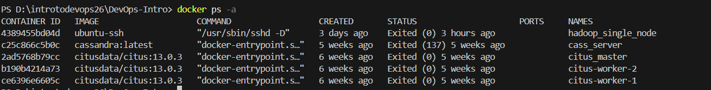
### Task 1.1.2
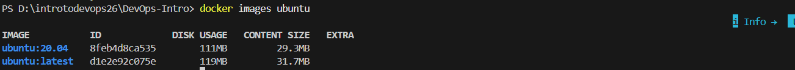

### Task 1.1.3
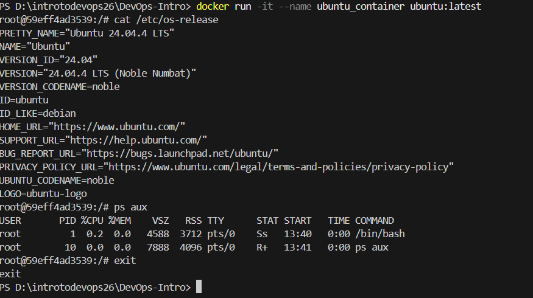

## Task 1.2

### Task 1.2.1
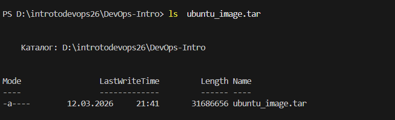

### Task 1.2.2  
Error response from daemon: conflict: unable to delete ubuntu:latest (must be forced) - container 59eff4ad3539 is using its referenced image d1e2e92c075e

### Task 1.2.3  
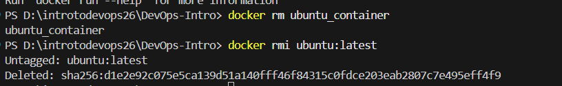

**Answer:** Image removal fails when a container exists because containers are dependent instances of an image. An image serves as the read-only template or blueprint, while a container is a readable/writable layer added on top of that image. Docker enforces this dependency to prevent accidental deletion of images that are currently being used by running or stopped containers. You must remove the dependent containers first (`docker rm`) before you can remove the underlying image.

**Answer:** The exported tar file (`ubuntu_image.tar`) created by `docker save` contains:
1. **All image layers** - Every filesystem layer that makes up the Ubuntu image
2. **Image metadata** - JSON configuration files describing the image, including environment variables, default commands, and layer relationships
3. **Manifest file** - A list of all layers and their order for proper image reconstruction
4. **The complete image tree** - All parent images and dependencies needed to fully recreate the image on another system

# Task 2

## Task 2.1

### Task 2.1.3

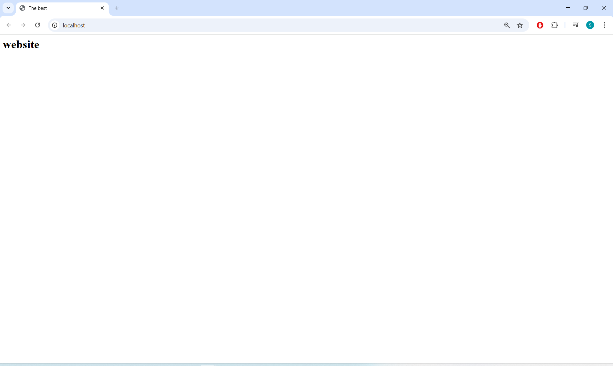

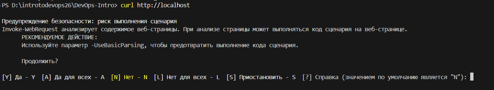

## Task 2.2

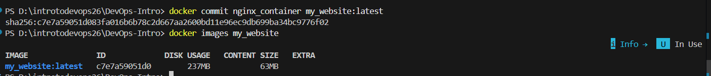
docker diff my_website_container
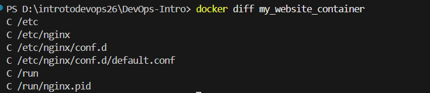

**Answer:** The diff tool compares two files or file systems line by line. When viewing the output:
- **A (Added):** Lines that exist in the new file but not in the old one.
- **C (Changed):** Lines that exist in both files but have been altered.
- **D (Deleted):** Lines that existed in the old file but were removed in the new one.

**Reflection**:
- **docker commit** is quick for creating a snapshot of a running container (good for debugging or saving a temporary state), but it creates "black box" images—it's non-reproducible and hard to version control.
- **Dockerfile** is declarative and automates builds. Its main advantage is **traceability** (every layer is defined) and **repeatability** (CI/CD can rebuild the exact same image). The disadvantage is the slight learning curve for syntax and best practices.

# Task 3
## Task 3.1
### Task 3.1.1
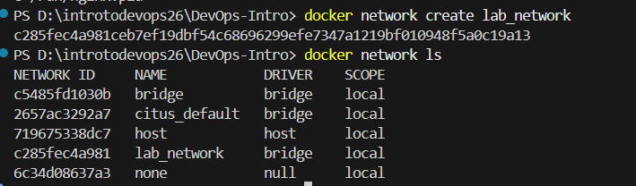

### Task 3.2
### Task 3.2.1
docker exec container1 ping -c 3 container2 
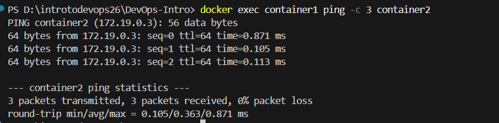
### Task 3.2.2

docker network inspect lab_network
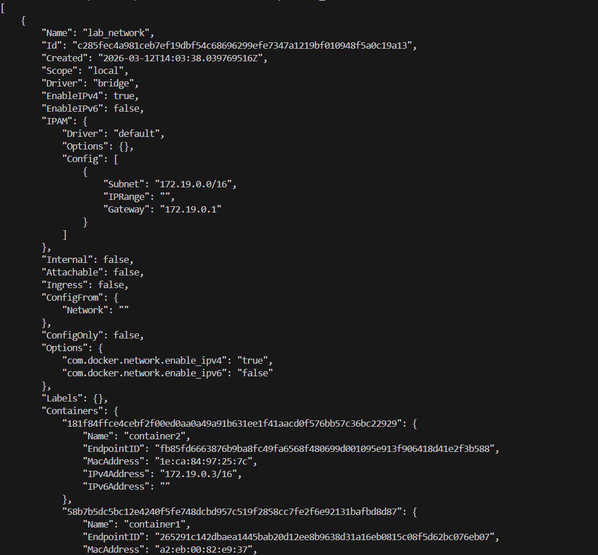
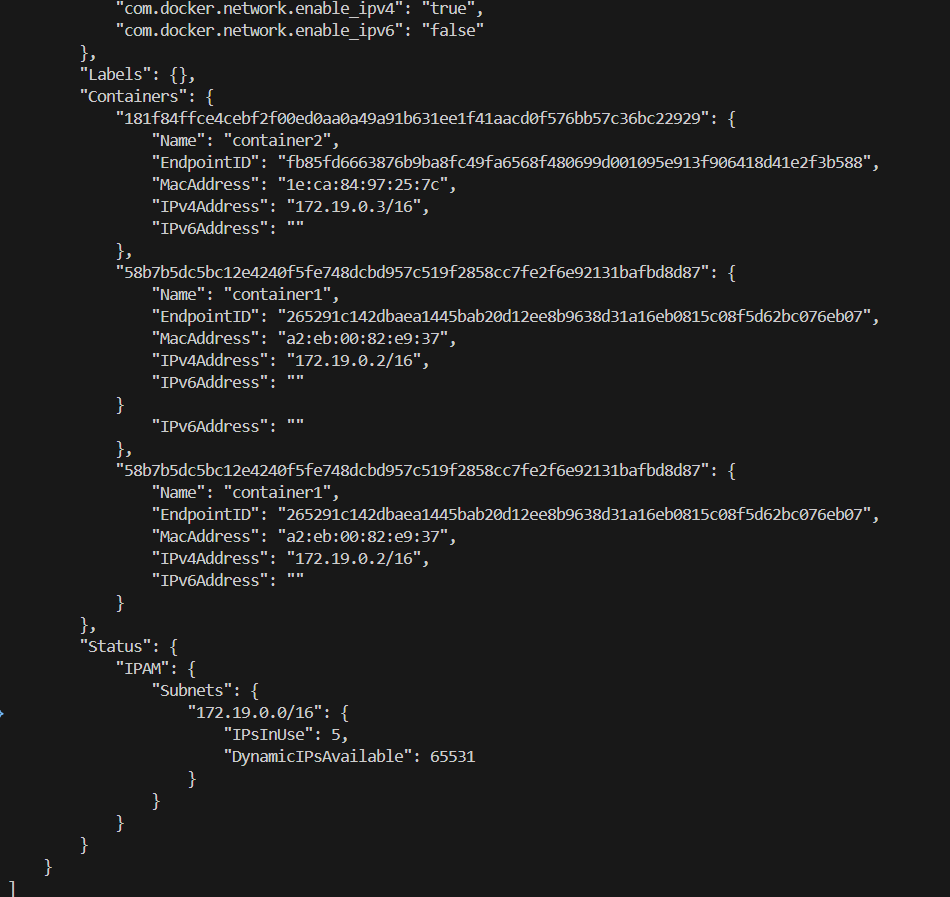

### Task 3.2.3
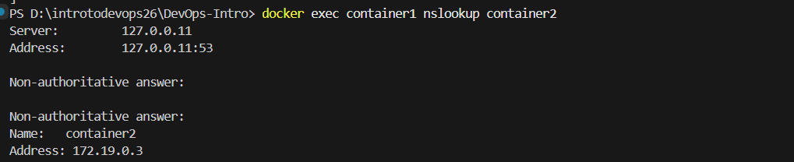

**Answer:** Docker embeds a DNS server at the `127.0.0.11` IP address inside containers. When a container tries to reach another container by its name (e.g., `ping database`), the container's resolver queries this embedded DNS server. Docker then resolves that name to the correct container IP address, provided both containers are on the same user-defined network.

**Answer:** User-defined bridges offer:
1.  **Automatic DNS resolution:** Containers can resolve each other by name (the default bridge requires `--link`, which is legacy).
2.  **Better isolation:** You can group related containers (e.g., a "frontend" network vs a "backend" network) and control which containers can communicate.
3.  **Dynamic attachment:** Containers can be connected/disconnected on the fly without restarting.

**Reflection:** In short, user-defined bridges provide service discovery out of the box and a more secure, manageable network topology for multi-container applications.
# Task 4

## Task 4.1

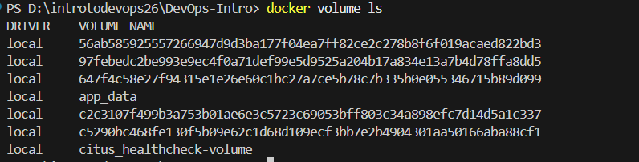

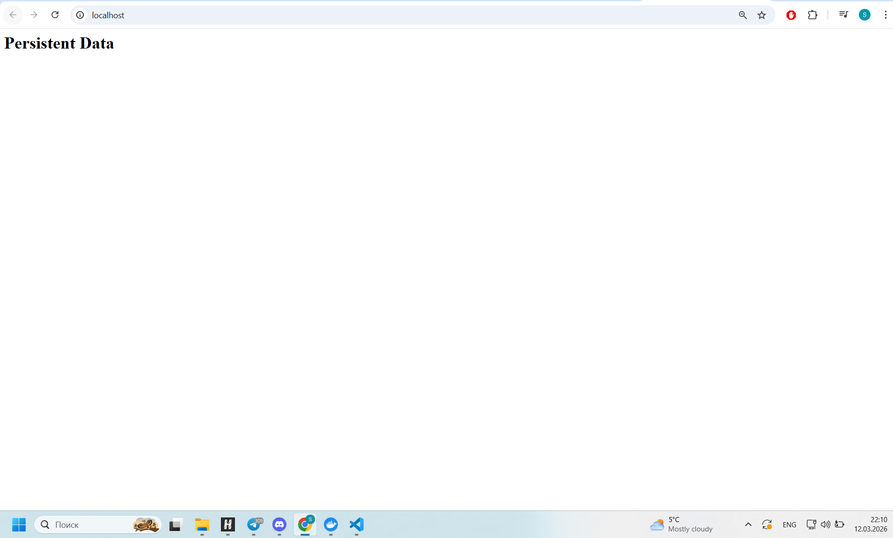

## Task 4.2
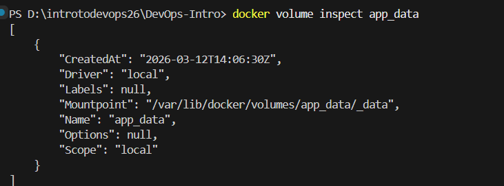

**Answer:** Containers are ephemeral by design—when a container is removed, all data written to its writable layer is deleted. Data persistence is important for stateful applications (like databases) to ensure that data survives container restarts, updates, or crashes.

**Answer:**
- **Container Storage (Writable Layer):** Exists inside the container. Fast but ephemeral. **Use for:** Temporary cache files or scratch space.
- **Volumes:** Managed by Docker (`/var/lib/docker/volumes/...`). Completely isolated from the host's directory structure. **Use for:** Production databases and persistent application data (safest and most portable option).
- **Bind Mounts:** Maps a specific host file/directory into the container. **Use for:** Development (hot-reloading code) or mounting configuration files (like `nginx.conf`) from the host.