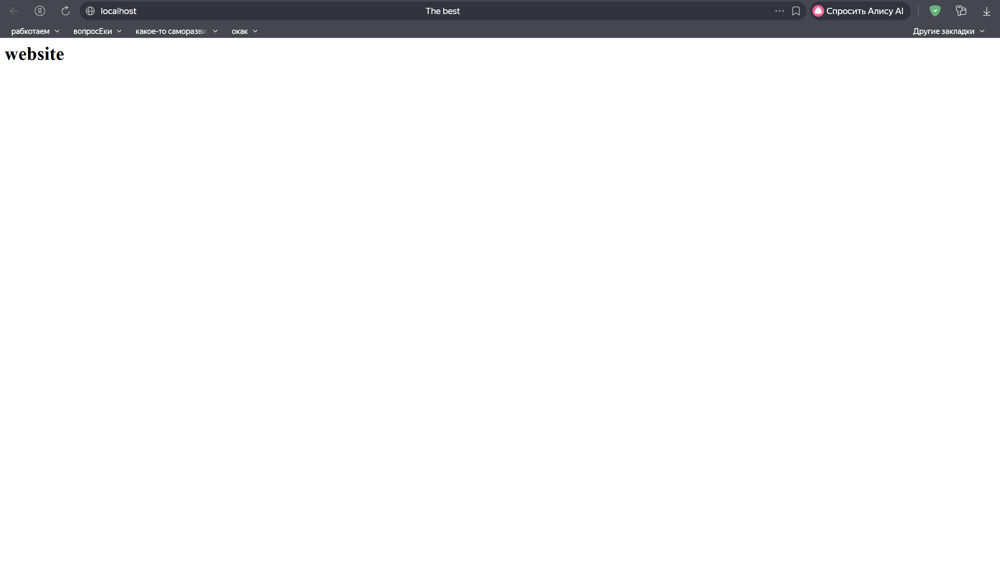

# Lab 6

## Task 1

**Outputs:**

```sh
(base) lexi@lexandrinnnt:~/DevOps-Intro$ sudo docker ps -a
CONTAINER ID   IMAGE                  COMMAND                  CREATED      STATUS                    PORTS                                         NAMES
faf17b70d961   citusdata/citus:12.1   "docker-entrypoint.s…"   8 days ago   Exited (255) 2 days ago   5432/tcp                                      big_data-worker1-1
f512fd48aece   citusdata/citus:12.1   "docker-entrypoint.s…"   8 days ago   Exited (255) 2 days ago   5432/tcp                                      big_data-worker2-1
f4227b7f8653   citusdata/citus:12.1   "docker-entrypoint.s…"   8 days ago   Exited (255) 2 days ago   0.0.0.0:5433->5432/tcp, [::]:5433->5432/tcp   big_data-master-1
(base) lexi@lexandrinnnt:~/DevOps-Intro$ docker pull ubuntu:latest
latest: Pulling from library/ubuntu
01d7766a2e4a: Pull complete 
Digest: sha256:d1e2e92c075e5ca139d51a140fff46f84315c0fdce203eab2807c7e495eff4f9
Status: Downloaded newer image for ubuntu:latest
docker.io/library/ubuntu:latest
(base) lexi@lexandrinnnt:~/DevOps-Intro$ docker images ubuntu
REPOSITORY   TAG       IMAGE ID       CREATED       SIZE
ubuntu       latest    bbdabce66f1b   3 weeks ago   78.1MB
(base) lexi@lexandrinnnt:~/DevOps-Intro$ docker run -it --name ubuntu_container ubuntu:latest
root@060d8be20cd6:/# cat /etc/os-release
PRETTY_NAME="Ubuntu 24.04.4 LTS"
NAME="Ubuntu"
VERSION_ID="24.04"
VERSION="24.04.4 LTS (Noble Numbat)"
VERSION_CODENAME=noble
ID=ubuntu
ID_LIKE=debian
HOME_URL="https://www.ubuntu.com/"
SUPPORT_URL="https://help.ubuntu.com/"
BUG_REPORT_URL="https://bugs.launchpad.net/ubuntu/"
PRIVACY_POLICY_URL="https://www.ubuntu.com/legal/terms-and-policies/privacy-policy"
UBUNTU_CODENAME=noble
LOGO=ubuntu-logo
root@060d8be20cd6:/# ps aux
USER         PID %CPU %MEM    VSZ   RSS TTY      STAT START   TIME COMMAND
root           1  0.0  0.0   4588  3840 pts/0    Ss   11:48   0:00 /bin/bash
root          10  0.0  0.0   7888  3840 pts/0    R+   11:49   0:00 ps aux
root@060d8be20cd6:/# exit
exit
(base) lexi@lexandrinnnt:~/DevOps-Intro$ docker save -o ubuntu_image.tar ubuntu:latest
(base) lexi@lexandrinnnt:~/DevOps-Intro$ ls -lh ubuntu_image.tar
-rw------- 1 lexi docker 77M Mar 10 14:49 ubuntu_image.tar
(base) lexi@lexandrinnnt:~/DevOps-Intro$ docker rmi ubuntu:latest
Error response from daemon: conflict: unable to remove repository reference "ubuntu:latest" (must force) - container 060d8be20cd6 is using its referenced image bbdabce66f1b
(base) lexi@lexandrinnnt:~/DevOps-Intro$ docker rm ubuntu_container
docker rmi ubuntu:latest
ubuntu_container
Untagged: ubuntu:latest
Untagged: ubuntu@sha256:d1e2e92c075e5ca139d51a140fff46f84315c0fdce203eab2807c7e495eff4f9
Deleted: sha256:bbdabce66f1b7dde0c081a6b4536d837cd81dd322dd8c99edd68860baf3b2db3
Deleted: sha256:efafae78d70c98626c521c246827389128e7d7ea442db31bc433934647f0c791
```

**Image size and layer count:** The image weighs about 78.1 MB. During the pull we can see it downloaded just one layer, though there could be more under the hood (you'd see them with `docker history`).

**Tar vs image size:** The tar came out to 77 MB while Docker reports the image at 78.1 MB — basically the same thing. The tiny gap is probably just a rounding or reporting difference since the tar packs the exact same layers plus some JSON metadata.

**Why image removal failed at first:** When I first tried `docker rmi`, Docker refused because `ubuntu_container` still existed and depended on that image. Even though the container was stopped, Docker won't let you delete an image while any container (running or not) is linked to it. Once I removed the container with `docker rm`, the image had nothing depending on it anymore, so deletion went through.

**What is in the exported tar:** It's essentially a portable snapshot of the whole image — all the filesystem layers bundled together along with config and tag info. You could take this file to a completely different machine and load it with `docker load` without needing to pull from a registry.

---

## Task 2

**Outputs:**

```sh
(base) lexi@lexandrinnnt:~/DevOps-Intro$ docker run -d -p 80:80 --name nginx_container nginx
Unable to find image 'nginx:latest' locally
latest: Pulling from library/nginx
206356c42440: Pull complete 
b47f187216b6: Pull complete 
1ad233904a11: Pull complete 
eedda9fd8786: Pull complete 
35ff83c394d6: Pull complete 
17d0911eaf62: Pull complete 
df0b66c867e4: Pull complete 
Digest: sha256:0236ee02dcbce00b9bd83e0f5fbc51069e7e1161bd59d99885b3ae1734f3392e
Status: Downloaded newer image for nginx:latest
1f3b289fdbc0dddd7dc7d0927446e39ac86bc99bd5662e0652731ba0def9f65b
(base) lexi@lexandrinnnt:~/DevOps-Intro$ curl http://localhost
<!DOCTYPE html>
<html>
<head>
<title>Welcome to nginx!</title>
<style>
html { color-scheme: light dark; }
body { width: 35em; margin: 0 auto;
font-family: Tahoma, Verdana, Arial, sans-serif; }
</style>
</head>
<body>
<h1>Welcome to nginx!</h1>
<p>If you see this page, the nginx web server is successfully installed and
working. Further configuration is required.</p>

<p>For online documentation and support please refer to
<a href="http://nginx.org/">nginx.org</a>.<br/>
Commercial support is available at
<a href="http://nginx.com/">nginx.com</a>.</p>

<p><em>Thank you for using nginx.</em></p>
</body>
</html>
(base) lexi@lexandrinnnt:~/DevOps-Intro$ docker cp index.html nginx_container:/usr/share/nginx/html/
Successfully copied 2.05kB to nginx_container:/usr/share/nginx/html/
(base) lexi@lexandrinnnt:~/DevOps-Intro$ curl http://localhost
<html>
<head>
<title>The best</title>
</head>
<body>
<h1>website</h1>
</body>
</html>(base) lexi@lexandrinnnt:~/DevOps-Intro$docker commit nginx_container my_website:latestt
sha256:ccc309f9279eb8bc9cee143c4d1699f34dec7a9bcb1df2a65048a102ed5c8fe1
(base) lexi@lexandrinnnt:~/DevOps-Intro$ docker images my_website
REPOSITORY   TAG       IMAGE ID       CREATED         SIZE
my_website   latest    ccc309f9279e   5 seconds ago   161MB
(base) lexi@lexandrinnnt:~/DevOps-Intro$ docker rm -f nginx_container
nginx_container
(base) lexi@lexandrinnnt:~/DevOps-Intro$ docker run -d -p 80:80 --name my_website_container my_website:latest
4174264db2b3482150b435d83ba9a05f03b2a25c9007417069f39537ac2c7f64
(base) lexi@lexandrinnnt:~/DevOps-Intro$ curl http://localhost
<html>
<head>
<title>The best</title>
</head>
<body>
<h1>website</h1>
</body>
</html>(base) lexi@lexandrinnnt:~/DevOps-Intro$ docker diff my_website_container
C /run
C /run/nginx.pid
C /etc
C /etc/nginx
C /etc/nginx/conf.d
C /etc/nginx/conf.d/default.conf
```



**Diff output analysis:** The diff only shows `C` (Changed) entries — things like `/run/nginx.pid` and nginx config files. These get modified when the container starts up (the PID file is created at launch, configs get touched). I didn't see my `index.html` in this diff because it was already baked into the committed image. As a reminder: `A` means a file was added, `C` means it was changed compared to the original image, and `D` would mean deleted.

**docker commit vs Dockerfile:** Using `docker commit` is handy when you just want to quickly save what you've done inside a container, but the downside is there's no history of what steps you took — it's kind of a black box. A Dockerfile, on the other hand, is like a recipe: every step is written down, you can version it with git, and anyone on your team can rebuild the same image. So for anything serious or team-based, Dockerfiles are the way to go. I'd only use `commit` for quick throwaway experiments.

---

## Task 3

**Outputs:**

```sh
(base) lexi@lexandrinnnt:~/DevOps-Intro$ docker network create lab_network
38dce5fd7d6fbd6645f89414a5828643d207761fd0e87a9856012452222e628d
(base) lexi@lexandrinnnt:~/DevOps-Intro$ docker network ls
NETWORK ID     NAME               DRIVER    SCOPE
dee5aab01bf6   big_data_default   bridge    local
c1ccda142871   bridge             bridge    local
c9a985425a25   host               host      local
38dce5fd7d6f   lab_network        bridge    local
001ac98fc045   none               null      local
(base) lexi@lexandrinnnt:~/DevOps-Intro$ docker run -dit --network lab_network --name container1 alpine ash
Unable to find image 'alpine:latest' locally
latest: Pulling from library/alpine
589002ba0eae: Pull complete 
Digest: sha256:25109184c71bdad752c8312a8623239686a9a2071e8825f20acb8f2198c3f659
Status: Downloaded newer image for alpine:latest
e13ddb2fbf6a4d3e68726d53c850738b93d8981b5dd9be4474998bb955dfc67c
(base) lexi@lexandrinnnt:~/DevOps-Intro$ docker run -dit --network lab_network --name container2 alpine ash
53b9c1aa21530814d42c1aef7f2bdaba39f1d341fc1c020a72a215d8e9218be1
(base) lexi@lexandrinnnt:~/DevOps-Intro$ docker exec container1 ping -c 3 container2
PING container2 (172.20.0.3): 56 data bytes
64 bytes from 172.20.0.3: seq=0 ttl=64 time=0.546 ms
64 bytes from 172.20.0.3: seq=1 ttl=64 time=0.144 ms
64 bytes from 172.20.0.3: seq=2 ttl=64 time=0.122 ms

--- container2 ping statistics ---
3 packets transmitted, 3 packets received, 0% packet loss
round-trip min/avg/max = 0.122/0.270/0.546 ms
(base) lexi@lexandrinnnt:~/DevOps-Intro$ docker network inspect lab_network
[
    {
        "Name": "lab_network",
        "Id": "38dce5fd7d6fbd6645f89414a5828643d207761fd0e87a9856012452222e628d",
        "Created": "2026-03-10T14:59:50.492146392+03:00",
        "Scope": "local",
        "Driver": "bridge",
        "EnableIPv4": true,
        "EnableIPv6": false,
        "IPAM": {
            "Driver": "default",
            "Options": {},
            "Config": [
                {
                    "Subnet": "172.20.0.0/16",
                    "Gateway": "172.20.0.1"
                }
            ]
        },
        "Internal": false,
        "Attachable": false,
        "Ingress": false,
        "ConfigFrom": {
            "Network": ""
        },
        "ConfigOnly": false,
        "Containers": {
            "53b9c1aa21530814d42c1aef7f2bdaba39f1d341fc1c020a72a215d8e9218be1": {
                "Name": "container2",
                "EndpointID": "adb858ca7c735768db9717ba8e24e1c191893a7ab19552837e0a598641d06b2b",
                "MacAddress": "fa:17:8e:b5:ac:21",
                "IPv4Address": "172.20.0.3/16",
                "IPv6Address": ""
            },
            "e13ddb2fbf6a4d3e68726d53c850738b93d8981b5dd9be4474998bb955dfc67c": {
                "Name": "container1",
                "EndpointID": "48314292390fdabba86a212c24487fb0ee696300813af86f6d65950df48c90fc",
                "MacAddress": "16:14:af:bd:35:db",
                "IPv4Address": "172.20.0.2/16",
                "IPv6Address": ""
            }
        },
        "Options": {},
        "Labels": {}
    }
]
(base) lexi@lexandrinnnt:~/DevOps-Intro$ docker exec container1 nslookup container2
Server:         127.0.0.11
Address:        127.0.0.11:53

Non-authoritative answer:

Non-authoritative answer:
Name:   container2
Address: 172.20.0.3
```

**How Docker DNS works:** When you create a custom network, Docker spins up its own little DNS server at 127.0.0.11. So instead of memorizing container IPs, I can just ping `container2` by name and Docker figures out the right IP for me. That's why `nslookup container2` returned 172.20.0.3 — the DNS resolved the name automatically.

**User-defined bridge vs default bridge:** The biggest difference I noticed is that on a custom bridge like `lab_network`, containers can find each other by name right away — no extra setup needed. On the default bridge, that doesn't work; you'd have to use raw IP addresses or manually link containers, which is annoying. Also, with custom networks you get better isolation: only the containers you explicitly put on that network can talk to each other, whereas the default bridge is shared by everything.

---

## Task 4

**Outputs:**

```sh
(base) lexi@lexandrinnnt:~/DevOps-Intro$ docker volume create app_data
app_data
(base) lexi@lexandrinnnt:~/DevOps-Intro$ docker volume ls
DRIVER    VOLUME NAME
local     1afbe13e41a20a0c77c4e17d4a87781d3c97ee400084a85add7febd9d7ae52f3
local     5700b1385627a616d1ef3882ba5cfc4045ebb16bc08434e6e5903b3c7663747e
local     app_data
local     ff5ed8216353ca2a7a0ef914af8dea2fac7dc0ea6dfe869f47e457b7c0bb2ec5
(base) lexi@lexandrinnnt:~/DevOps-Intro$ docker run -d -p 80:80 -v app_data:/usr/share/nginx/html --name web nginx
9e3f29e988598651dc09e3297f9ce50d5ad880a475ca728be9dfc14ad9493437
(base) lexi@lexandrinnnt:~/DevOps-Intro$ docker cp index.html web:/usr/share/nginx/html/
Successfully copied 2.05kB to web:/usr/share/nginx/html/
(base) lexi@lexandrinnnt:~/DevOps-Intro$ curl http://localhost
<html><body><h1>Persistent Data</h1></body></html>(base) lexi@lexandrinnnt:~/DevOps-Intro$ docker stop docker stop web && docker rm web
web
web
(base) lexi@lexandrinnnt:~/DevOps-Intro$ docker run -d -p 80:80 -v app_data:/usr/share/nginx/html --name web_new nginx
b7c38cb7f745af05ad48278a1bcc01e43da95a100a26a32a477219cd99af917d
(base) lexi@lexandrinnnt:~/DevOps-Intro$ curl http://localhost
<html><body><h1>Persistent Data</h1></body></html>(base) lexi@lexandrinnnt:~/DevOps-Intro$ docker volumdocker volume inspect app_data
[
    {
        "CreatedAt": "2026-03-10T15:24:29+03:00",
        "Driver": "local",
        "Labels": null,
        "Mountpoint": "/var/snap/docker/common/var-lib-docker/volumes/app_data/_data",
        "Name": "app_data",
        "Options": null,
        "Scope": "local"
    }
]
```

**Why data persistence matters:** As we saw, I deleted the `web` container and started a fresh `web_new` one, but the page still showed "Persistent Data" because the volume kept it. Without volumes, all that content would be gone the moment the container is removed. This is really important for stuff like databases or uploaded files — you don't want to lose all your data just because you restarted a container.

**Volumes vs bind mounts vs container storage:** **Volumes** are managed by Docker itself and stored somewhere on the host (like we saw in `docker volume inspect` — it's under `/var/snap/docker/.../app_data/_data`). They stick around even after containers are gone, so they're great for anything you need to keep. **Bind mounts** let you map a specific folder from your host into a container — handy during development when you want live code changes to show up inside the container. **Container storage** is just the writable layer inside the container itself; it disappears when the container is deleted. Bottom line: use volumes for data you care about, bind mounts for development convenience, and don't rely on container storage for anything permanent.
