# Lab 6 Submission

## Task 1 — Container Lifecycle & Image Management

### 1.1. Basic Container Operations

At the start, there were no containers.

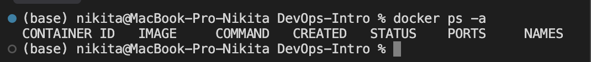

Ubuntu image was downloaded successfully.

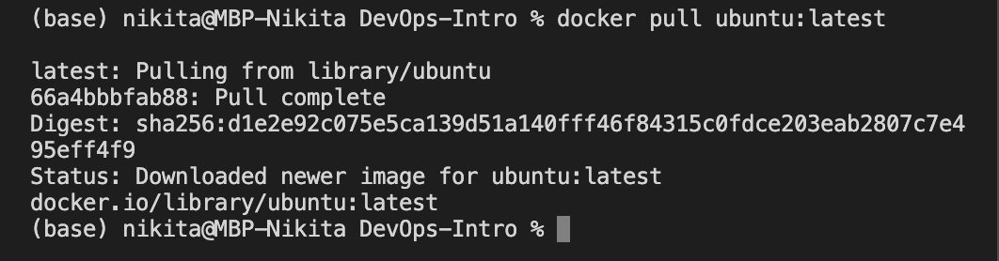

The local image list shows:
- Repository: `ubuntu`
- Tag: `latest`
- Image ID: `350d40843c24`
- Size: 101MB

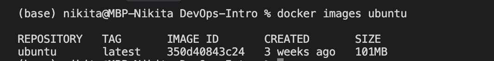

Container `ubuntu_container` was started in interactive mode.  
Inside the container:
- `cat /etc/os-release` confirmed Ubuntu 24.04.4 LTS
- `ps aux` showed running processes in the container namespace
- `exit` stopped interactive session

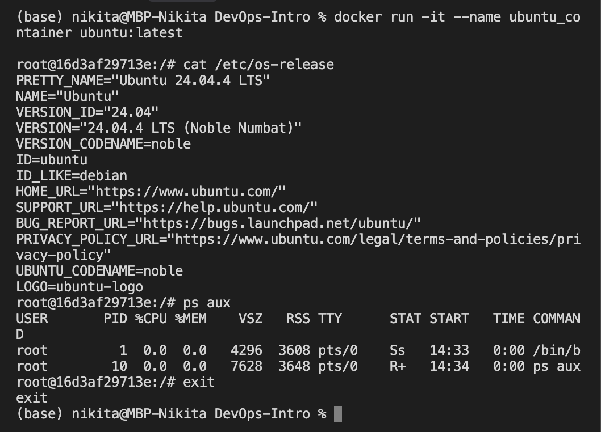

#### 1.2.  Image Export and Dependency Analysis

Command used:
- `docker save -o ubuntu_image.tar ubuntu:latest`

Observed archive size:
- `ubuntu_image.tar`: 98M (`ls -lh`)

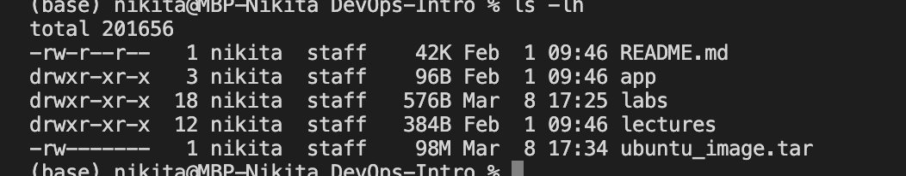


First removal attempt failed with dependency conflict:

> `Error response from daemon: conflict: unable to remove repository reference "ubuntu:latest" (must force) - container 16d3af29713e is using its referenced image 350d40843c24`

After `docker rm ubuntu_container`, image removal succeeded (`Untagged` + `Deleted` entries).

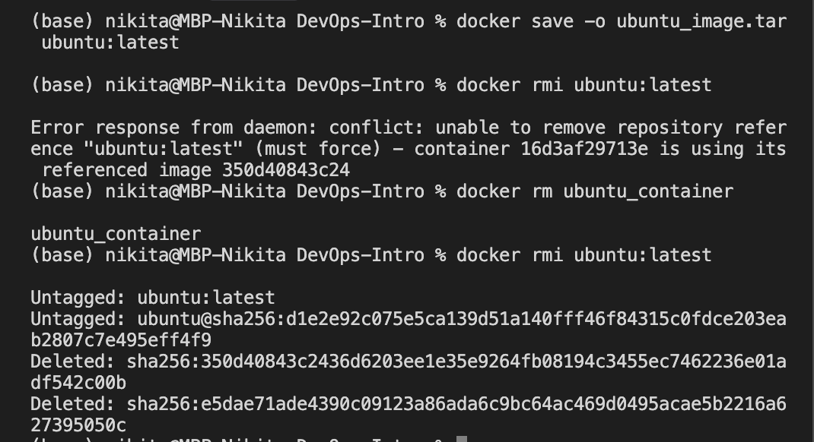

#### Analysis

- Image size and layer count: image size is 101MB; exported archive contains 1 filesystem layer (`layer.tar` count in archive).
- Tar vs image size: tar file size (98M) is close to image size (101MB); small differences come from archive/compression/metadata representation.
- Why removal fails when container exists: a container references the image as its immutable base. Docker prevents deleting a referenced image to avoid breaking container metadata and restartability.
- What is inside exported tar file: Docker image manifest/config JSON, repository tag metadata, and layer data (`layer.tar`) that reconstruct the image on `docker load`.

## Task 2 — Custom Image Creation & Analysis

### 2.1. Deploy and Customize Nginx

Nginx container was started with port mapping `80:80`.  
`curl http://localhost` returned the default Nginx welcome page HTML.

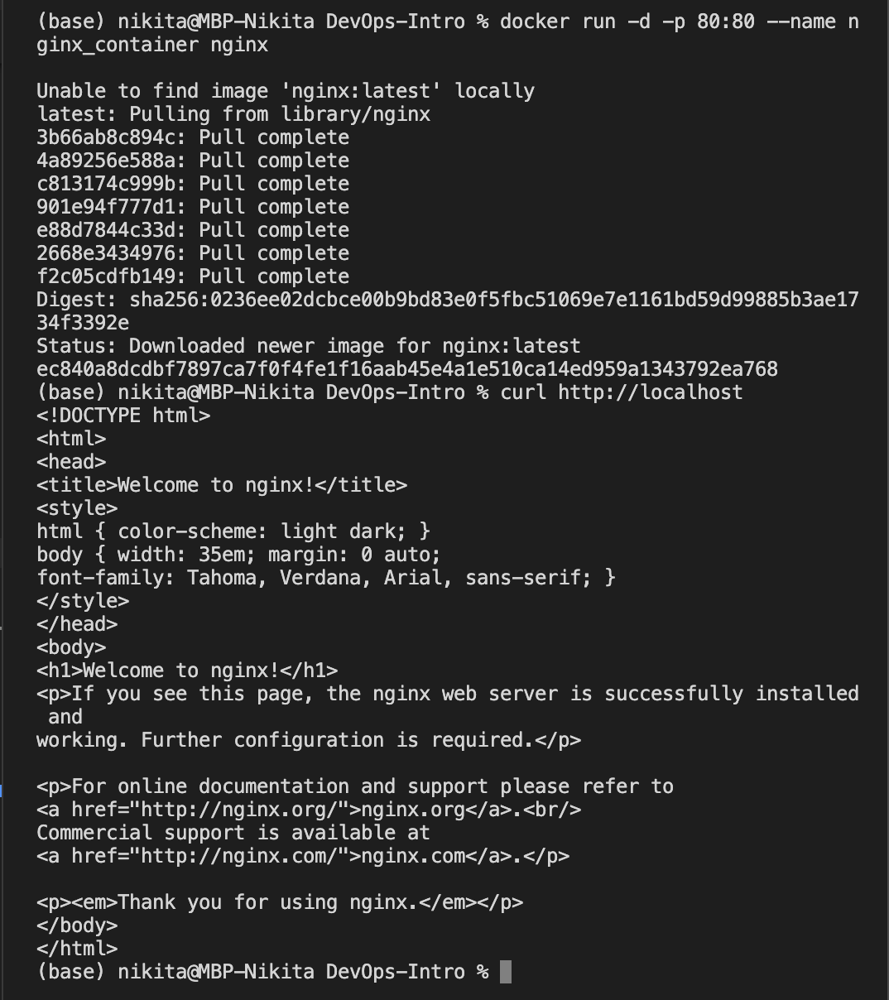

Custom `index.html` content:

```html
<html>
<head>
<title>The best</title>
</head>
<body>
<h1>website</h1>
</body>
</html>
```

After copying custom file into the container (`docker cp index.html nginx_container:/usr/share/nginx/html/`), curl output confirmed updated content.

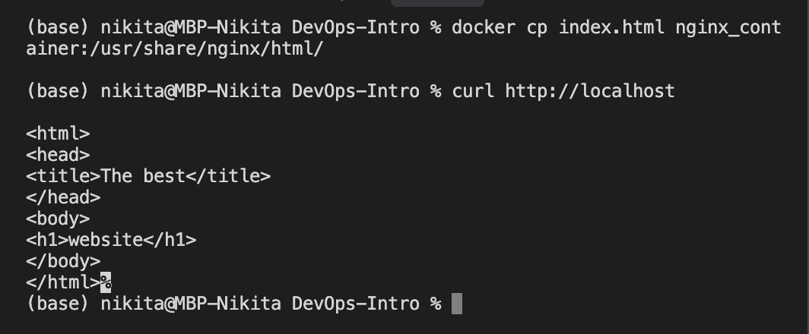

### 2.2. Create and Test Custom Image

Container was committed into a new image:
- `docker commit nginx_container my_website:latest`
- `docker images my_website` shows image size 181MB

Original container was removed and replaced by a new container from `my_website:latest`.  
`curl http://localhost` still returned the custom page (`The best` / `website`), confirming changes are preserved in the new image.

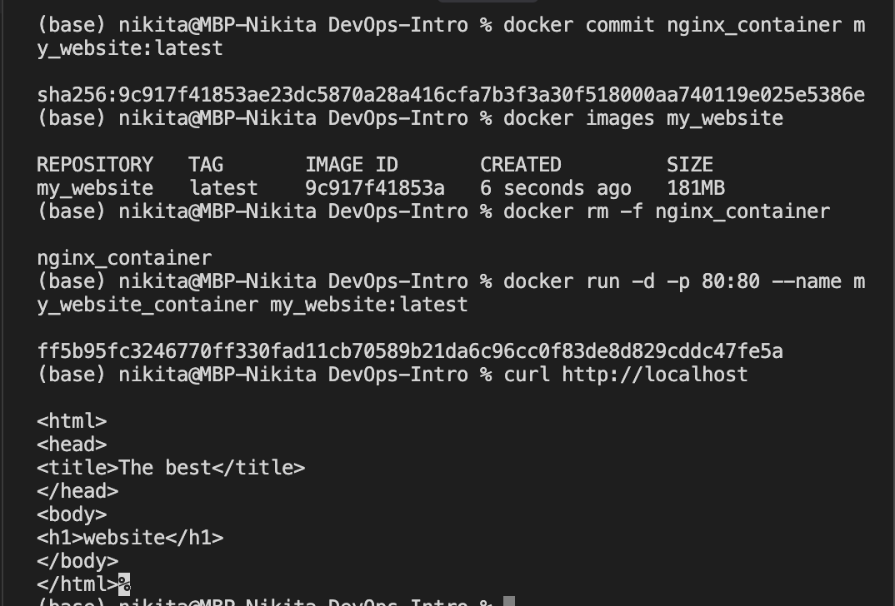

Filesystem diff of the running custom container:

```text
C /etc
C /etc/nginx
C /etc/nginx/conf.d
C /etc/nginx/conf.d/default.conf
C /run
C /run/nginx.pid
```

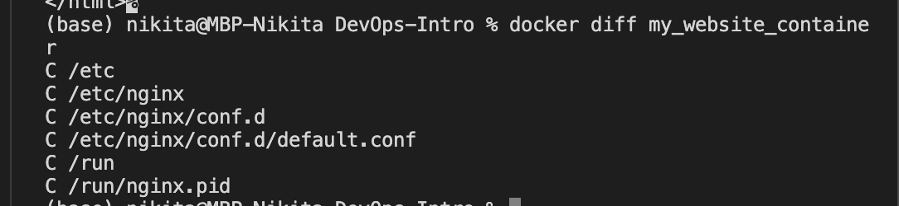

#### Analysis

- `docker diff` meaning: `A` = Added, `C` = Changed, `D` = Deleted.
- In this run, only `C` entries are shown. That means existing paths were modified during container runtime (for example Nginx runtime/config state such as `/run/nginx.pid` and configuration-related paths).
- No `A` or `D` lines in the captured output means no tracked paths were reported as newly created or deleted at that moment.

#### Reflection

- `docker commit` advantages: very fast for experiments, easy snapshot of a live container state, useful for quick prototyping/debugging.
- `docker commit` disadvantages: weak reproducibility, poor traceability of how image was built, harder for team collaboration/CI automation.
- Dockerfile advantages: declarative, version-controlled, reproducible builds, easier to review/audit, better long-term DevOps practice.
- Dockerfile disadvantages: slightly slower initial setup and requires writing build instructions explicitly.

## Task 3 — Container Networking & Service Discovery

### 3.1. Create Custom Network

Custom bridge network `lab_network` was created successfully.  
`docker network ls` shows `lab_network` in the local networks list.

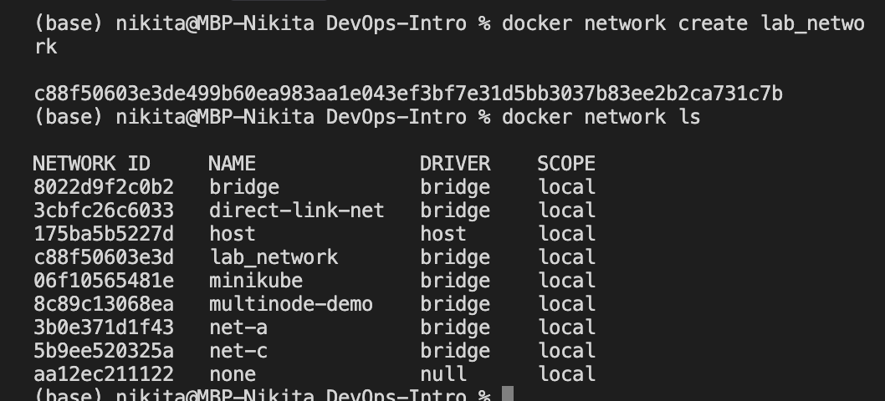

Two Alpine containers (`container1` and `container2`) were started in this user-defined network and used for connectivity tests.

### 3.2. Test Connectivity and DNS

From `container1`, ping to `container2` succeeded:
- 3 packets transmitted
- 3 packets received
- 0% packet loss

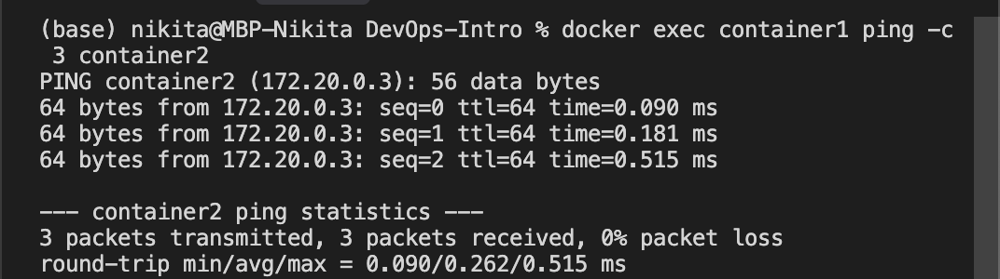

`docker network inspect lab_network` confirms both containers are attached and shows their IP addresses:
- `container1`: `172.20.0.2/16`
- `container2`: `172.20.0.3/16`

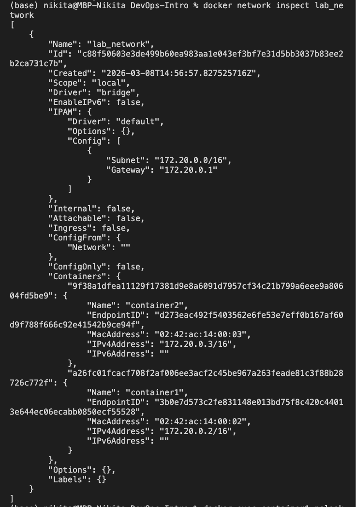

DNS lookup from `container1` to `container2` resolved correctly via Docker internal DNS:
- DNS server inside container: `127.0.0.11`
- Resolved address: `172.20.0.3`

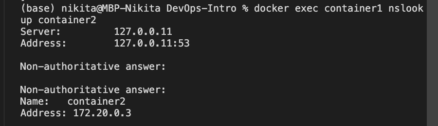

#### Analysis

- Docker provides an embedded DNS server (`127.0.0.11`) on user-defined networks.
- When `container1` asks for `container2`, Docker resolves the container name to its current container IP in that same network.
- This enables service-to-service communication by name instead of hardcoded IP addresses, which is more stable when containers are recreated.

#### Comparison

- User-defined bridge network advantages over default bridge:
  - Automatic DNS-based name resolution between containers.
  - Better isolation by grouping only related containers in one network.
  - Cleaner multi-container setups and easier service discovery.
  - More explicit network control (connect/disconnect/inspect per application scope).

## Task 4 — Data Persistence with Volumes

### 4.1. Create and Use Volume

Named volume `app_data` was created successfully.  

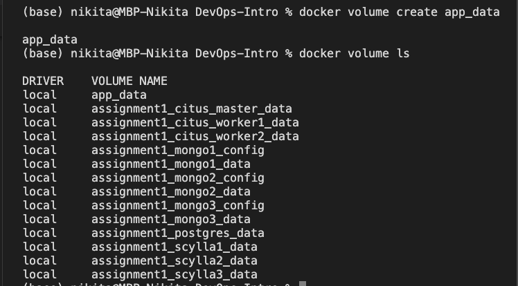

Custom HTML used for persistence test:

```html
<html><body><h1>Persistent Data</h1></body></html>
```

After running Nginx with `-v app_data:/usr/share/nginx/html` and copying `index.html` into the container, `curl http://localhost` returned the custom page.

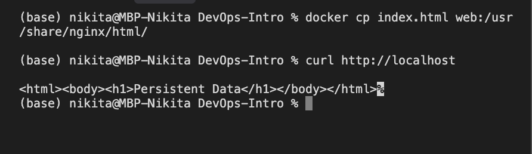

### 4.2. Verify Persistence

Container `web` was stopped and removed, then recreated as `web_new` with the same named volume mount:
- `docker stop web && docker rm web`
- `docker run -d -p 80:80 -v app_data:/usr/share/nginx/html --name web_new nginx`

`curl http://localhost` still returned `Persistent Data`, confirming data survived container recreation.

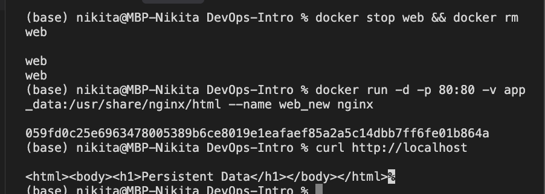

Volume inspection confirms the volume mount point:
- Name: `app_data`
- Driver: `local`
- Mountpoint: `/var/lib/docker/volumes/app_data/_data`

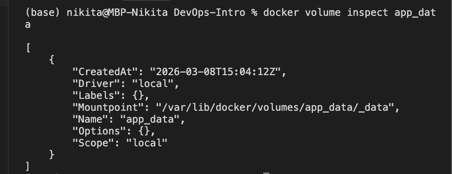

#### Analysis

- Data persistence is critical because containers are ephemeral by design: deleting/recreating a container can remove writable-layer data.
- Volumes decouple application data from container lifecycle, so state survives restarts, replacements, and image updates.
- This is essential for databases, uploaded files, generated reports, and any stateful workloads in containerized systems.

#### Comparison

- Volumes: Docker-managed storage, portable across container recreations, preferred for persistent application data in production.
- Bind mounts: direct host path mapping, convenient for local development and live code sync, but less portable and more host-dependent.
- Container writable layer (container storage): ephemeral per-container filesystem changes, suitable only for temporary runtime data.