# Lab 6 Submission


## Task 1

*Command: docker ps -a*
```
(state before the export process)
```

```
This command shows all containers, both running and stopped.
```


*Command: docker images*
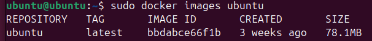 
```
This shows the target image is present locally, along with its size as reported by Docker.
```


*Command: docker history*


```
The image consists of 6 layers. The output below shows a summary of the layers and their individual sizes.
```

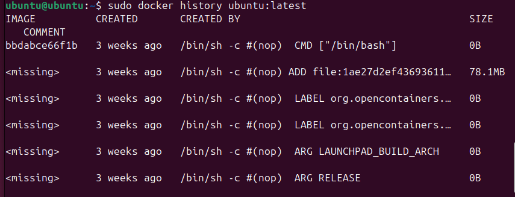


*Tar file size comparison*

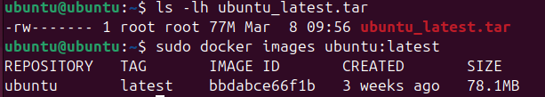

```
Image size: 78.1 MB
Tar file size: 77 MB
```

```
The exported tar file is an archive that contains all the necessary components to completely recreate the Docker image.
```

*Explanation: What is included in the exported tar file?*

```
The exported tar file contains all image layers (each as a separate tar archive), a manifest.json file describing layer order and structure, a configuration JSON with image metadata (CMD, ENV, etc.), and a repositories file mapping tags to image IDs. It's essentially a complete backup of the image as Docker stores it locally.
```

*Command: docker rmi ubuntu:latest*

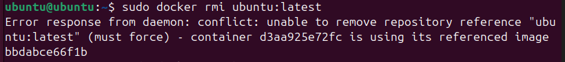

```
The image removal fails because of a fundamental dependency relationship in Docker's architecture: Containers are instantiated from Images.

To successfully remove the image, the dependency must first be broken. This requires deleting the container. Once the container is removed, the image is no longer in use and can be safely deleted.
```

## Task 2

*Original Nginx Welcome Page(curl output)*

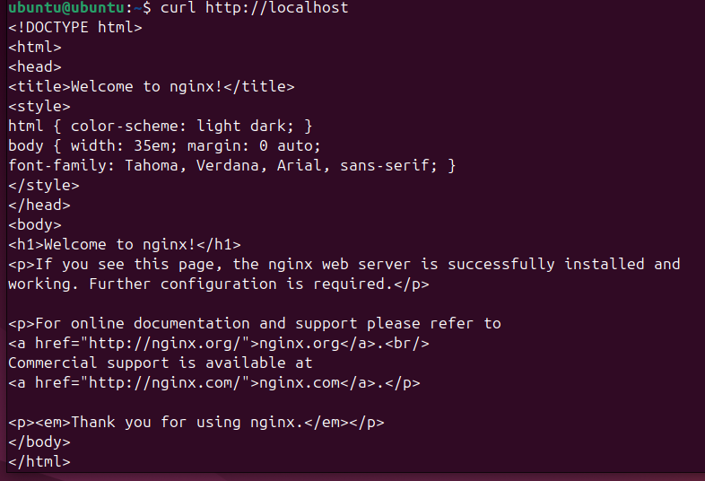


*Custom index.html content:*

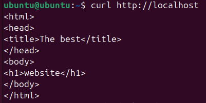


*Command: docker diff my_website_container*

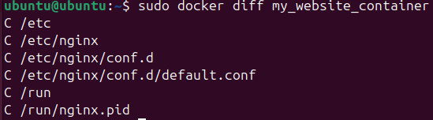

```
The docker diff output shows that changes were made to the Nginx configuration rather than the web content. The main modification is indicated by C /etc/nginx/conf.d/default.conf, which means the default Nginx configuration file was changed. Additionally, C /run/nginx.pid shows that the Nginx process started, creating its process ID file. The parent directories (/etc, /etc/nginx, etc.) are marked as changed because their timestamps updated automatically when the files inside them were modified.
```


*Reflection: What are the advantages and disadvantages of docker commit vs Dockerfile for image creation?*

```
docker commit is quick for saving a container's state but creates non-reproducible, opaque images that may include unnecessary files. Dockerfile provides a transparent, version-controllable recipe for building images, ensuring reproducibility and smaller image sizes, though it requires more initial setup.
```


## Task 3


*Ping test*

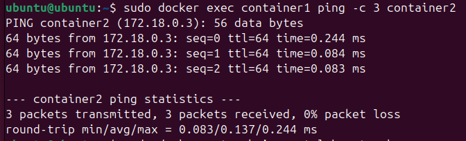


*Network inspect*

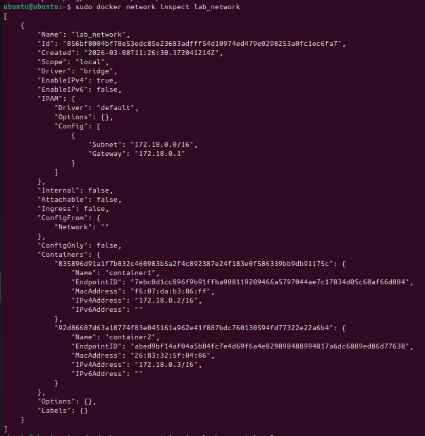


*Command: nslookup*

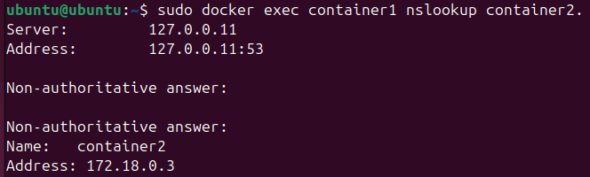


*Analysis: How does Docker's internal DNS enable container-to-container communication by name?*

```
Docker has an internal DNS server embedded in its daemon, which runs inside each container. When containers are on the same user-defined network, they automatically register their container names and any custom network aliases with this server, allowing other containers to resolve and connect to them using those names instead of their dynamic IP addresses.
```

*Comparison: What advantages does user-defined bridge networks provide over the default bridge network?*

```
User-defined bridge networks provide automatic DNS resolution between containers, allowing them to communicate using container names instead of IP addresses, which the default bridge does not support. They also offer better isolation by allowing you to selectively attach containers only to the networks they need, and they apply all network rules immediately without requiring a container restart.
```


## Task 4

*Custom HTML*

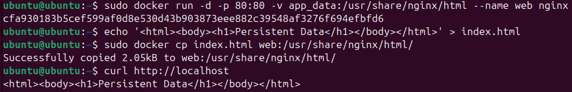


*After container recreation*

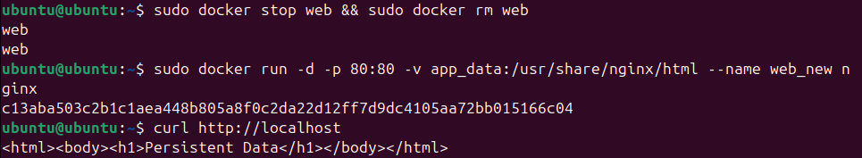

*Inspection output*

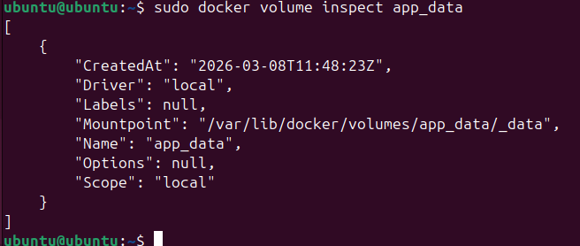

*Analysis: Why is data persistence important in containerized applications?*

```
Data persistence is crucial in containerized applications because containers are ephemeral by design—they can be stopped, deleted, or replaced at any time. Without persistence, all data generated or used by the application would be lost upon container termination. Persistence ensures that critical data (like databases, user uploads, or logs) survives beyond the container's lifecycle, enabling stateful applications to run reliably in dynamic orchestration environments like Kubernetes.
```


*Comparison: Explain the differences between volumes, bind mounts, and container storage. When would you use each?*

```
Volumes are the preferred method for production and databases. They are completely managed by Docker, isolated from the host's core functionality, and are safe to share between containers.

Bind Mounts map a specific host file or directory into the container. They are ideal for development but are less secure for production because the container can modify the host filesystem.

Container Storage (the writable layer) is temporary. It is best for ephemeral, stateless applications where data does not need to persist after the container stops.
```