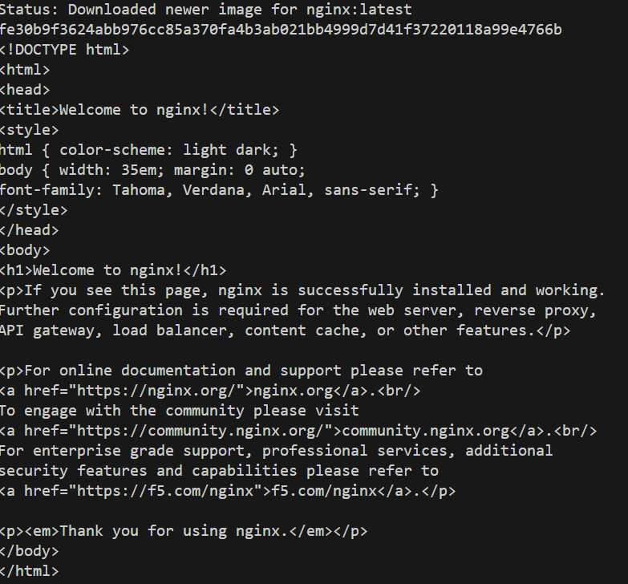

# TASK 1

I have no running containers, so the output of the first command is empty

```bash
> docker ps -a
CONTAINER ID   IMAGE     COMMAND   CREATED   STATUS    PORTS     NAMES
```

```bash
> docker images ubuntu
latest: Pulling from library/ubuntu
01d7766a2e4a: Pull complete
fd8cda969ed2: Download complete
Digest: sha256:d1e2e92c075e5ca139d51a140fff46f84315c0fdce203eab2807c7e495eff4f9
Status: Downloaded newer image for ubuntu:latest
docker.io/library/ubuntu:latest
                                                            
IMAGE           ID             DISK USAGE   CONTENT SIZE   EXTRA
ubuntu:latest   d1e2e92c075e        119MB         31.7MB
```

From docker desktop: size is 119.26 MB, layer count -- 6

Tar file size: 31686656

```bash
> docker rmi ubuntu:latest
Error response from daemon: conflict: unable to delete ubuntu:latest (must be forced) - container 35924a6762d5 is using its referenced image d1e2e92c075e
```

When a container is created from an image, it establishes a runtime dependency where the container's filesystem and processes rely on that image's layers to function. Docker prevents image removal while containers exist because it would orphan those containers, causing them to lose access to their required files and potentially crash.

A tar file from `docker save` contains all the image's layers, metadata, and the manifest that reconstructs the complete image, including its tags and configuration. This packaged format preserves the full image history and structure, allowing it to be completely restored with docker load on any Docker system.

# TASK 2



```bash
> curl http://localhost
Successfully copied 2.05kB to nginx_container:/usr/share/nginx/html/
<html>
<head>
<title>The best</title>
</head>
<body>
<h1>website</h1>
</body>
</html>
```

```bash
> docker diff my_website_container
C /run
C /run/nginx.pid
C /etc
C /etc/nginx
C /etc/nginx/conf.d
C /etc/nginx/conf.d/default.conf
```

The docker diff output shows configuration file modifications made by Nginx during startup (like creating PID files and updating default.conf), which are runtime changes that occur regardless of custom content. Added `index.html` file isn't displayed because docker diff only shows changes to the container's writable layer relative to the image, and static content in standard locations may not appear as modified unless explicitly changed from the base image version.

Docker commit offers quick, interactive snapshot creation for experimentation but produces non-reproducible, "black box" images with no build history or automation. Dockerfile provides version-controlled, automated, and reproducible builds with clear documentation of each layer, though it requires more initial setup and scripting knowledge.

# TASK 3

```bash
> docker exec container1 ping -c 3 container2
PING container2 (172.18.0.3): 56 data bytes
64 bytes from 172.18.0.3: seq=0 ttl=64 time=0.117 ms
64 bytes from 172.18.0.3: seq=1 ttl=64 time=0.142 ms
64 bytes from 172.18.0.3: seq=2 ttl=64 time=0.102 ms

--- container2 ping statistics ---
3 packets transmitted, 3 packets received, 0% packet loss
round-trip min/avg/max = 0.102/0.120/0.142 ms
```

```bash
> docker network inspect lab_network
[
    {
        "Name": "lab_network",
        "Id": "f21da6a6870df61aadc347b9b80695afe0aca34c597d0f4bd1fee177f9e0e257",
        "Created": "2026-03-13T19:13:00.588375441Z",
        "Scope": "local",
        "Driver": "bridge",
        "EnableIPv4": true,
        "EnableIPv6": false,
        "IPAM": {
            "Driver": "default",
            "Options": {},
            "Config": [
                {
                    "Subnet": "172.18.0.0/16",
                    "IPRange": "",
                    "Gateway": "172.18.0.1"
                }
            ]
        },
        "Internal": false,
        "Attachable": false,
        "Ingress": false,
        "ConfigFrom": {
            "Network": ""
        },
        "ConfigOnly": false,
        "Options": {
            "com.docker.network.enable_ipv4": "true",
            "com.docker.network.enable_ipv6": "false"
        },
        "Labels": {},
        "Containers": {
            "6abdc74455e788e53df4bc1ca6ecb20cbcbffa1992966b9c7262e8765b8aa8b9": {
                "Name": "container2",
                "EndpointID": "28bafaf60de263cd93726a573f95fd3308f0ec87e2e00462fd060f6f0f5f7a91",
                "MacAddress": "06:2a:ba:60:c8:4d",
                "IPv4Address": "172.18.0.3/16",
                "IPv6Address": ""
            },
            "b11ce26f137336c13cc5b1b217ed0dd1e02f6602317ee2c833376a4c44d98344": {
                "Name": "container1",
                "EndpointID": "c24b06cf2d15207ebb17649b4a97ebdaff984b3e82e8cdf00690627317ddf776",
                "MacAddress": "7a:ff:0a:2a:0d:1a",
                "IPv4Address": "172.18.0.2/16",
                "IPv6Address": ""
            }
        },
        "Status": {
            "IPAM": {
                "Subnets": {
                    "172.18.0.0/16": {
                        "IPsInUse": 5,
                        "DynamicIPsAvailable": 65531
                    }
                }
            }
        }
    }
]
```

```bash
> docker exec container1 nslookup container2
Server:         127.0.0.11
Address:        127.0.0.11:53

Non-authoritative answer:

Non-authoritative answer:
Name:   container2
Address: 172.18.0.3
```

Docker's internal DNS server automatically resolves container names to their IP addresses when containers are on the same user-defined network, allowing containers to communicate using friendly names instead of hard-to-track IP addresses. This built-in service discovery eliminates the need for manual IP management by dynamically updating DNS records as containers are created, stopped, or moved across the network.

User-defined bridge networks provide automatic DNS resolution between containers, allowing them to communicate by container name rather than IP address, which isn't available on the default bridge. They also offer better isolation by allowing you to selectively attach containers only to the networks they need, and can be dynamically connected and disconnected from running containers without restarting them.

# TASK 4

```html
<html><body><h1>Persistent Data</h1></body></html>
```

```bash
> docker cp index.html web:/usr/share/nginx/html/
>> curl http://localhost
Successfully copied 2.05kB to web:/usr/share/nginx/html/
<html><body><h1>Persistent Data</h1></body></html>
```

```bash
> docker volume inspect app_data
[
    {
        "CreatedAt": "2026-03-13T19:15:15Z",
        "Driver": "local",
        "Labels": null,
        "Mountpoint": "/var/lib/docker/volumes/app_data/_data",
        "Name": "app_data",
        "Options": null,
        "Scope": "local"
    }
]
```

Data persistence is crucial because containers are ephemeral by design—they can be stopped, deleted, or recreated at any moment, which would result in permanent data loss without persistent storage. By using volumes or bind mounts, data survives container lifecycle events and can be shared across containers, ensuring critical information like databases, user uploads, and application state remains available and durable.

Volumes are completely managed by Docker and stored in its dedicated directory on the host, making them the preferred choice for production data that needs backup, migration, or management through Docker CLI. Bind mounts map any host directory into a container, ideal for development when you need live code syncing or to share specific host files, while container storage (the writable layer) is temporary and should only be used for ephemeral, non-persistent data since it disappears when the container is removed.
