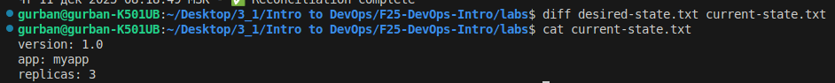

# GitOps Fundamentals

## 1. Git State Reconciliation
### 1. Initial desired-state.txt and current-state.txt contents
**desired-state.txt**
```bash
version: 1.0
app: myapp
replicas: 3
```
**current-state.txt**
```bash
version: 1.0
app: myapp
replicas: 3
```

### 2. Screenshot or output of drift detection and reconciliation
```bash
Чт 11 дек 2025 08:18:49 MSK - ⚠️  DRIFT DETECTED!
Reconciling current state with desired state...
Чт 11 дек 2025 08:18:49 MSK - ✅ Reconciliation complete
```

### 3. Output showing synchronized state after reconciliation
- 

### 4. Output from continuous reconciliation loop detecting auto-healing
```bash
Every 5,0s: ./reconcile.sh                      gurban-K501UB: Thu Dec 11 08:21:58 2025

Чт 11 дек 2025 08:21:58 MSK - ⚠️  DRIFT DETECTED!
Reconciling current state with desired state...
Чт 11 дек 2025 08:21:58 MSK - ✅ Reconciliation complete
```

### 5. Analysis: Explain the GitOps reconciliation loop. How does this prevent configuration drift?

**The GitOps reconciliation loop continuously compares the current cluster state with the desired state in Git. Any drift is automatically detected and corrected. This ensures the system always matches the desired state.**

### 6. Reflection: What advantages does declarative configuration have over imperative commands in production?

**Declarative configuration defines what the desired state should be, not how to achieve it. This approach prevents configuration drift.**

## 2. GitOps Health Monitoring

### 1. Contents of healthcheck.sh script
```bash
#!/bin/bash
# healthcheck.sh - Monitor GitOps sync health

DESIRED_MD5=$(md5sum desired-state.txt | awk '{print $1}')
CURRENT_MD5=$(md5sum current-state.txt | awk '{print $1}')

if [ "$DESIRED_MD5" != "$CURRENT_MD5" ]; then
    echo "$(date) - ❌ CRITICAL: State mismatch detected!" | tee -a health.log
    echo "  Desired MD5: $DESIRED_MD5" | tee -a health.log
    echo "  Current MD5: $CURRENT_MD5" | tee -a health.log
else
    echo "$(date) - ✅ OK: States synchronized" | tee -a health.log
fi
```

### 2. Output showing "OK" status when states match
```bash
Чт 11 дек 2025 08:31:54 MSK - ✅ OK: States synchronized
```

### 3. Output showing "CRITICAL" status when drift is detected
```bash
Чт 11 дек 2025 08:32:34 MSK - ❌ CRITICAL: State mismatch detected!
  Desired MD5: a15a1a4f965ecd8f9e23a33a6b543155
  Current MD5: 48168ff3ab5ffc0214e81c7e2ee356f5
```

### 4. Complete health.log file showing multiple checks
```bash
Чт 11 дек 2025 08:28:02 MSK - ✅ OK: States synchronized
Чт 11 дек 2025 08:28:48 MSK - ❌ CRITICAL: State mismatch detected!
  Desired MD5: a15a1a4f965ecd8f9e23a33a6b543155
  Current MD5: 48168ff3ab5ffc0214e81c7e2ee356f5
Чт 11 дек 2025 08:29:17 MSK - ✅ OK: States synchronized
Чт 11 дек 2025 08:29:56 MSK - ✅ OK: States synchronized
Чт 11 дек 2025 08:29:59 MSK - ✅ OK: States synchronized
Чт 11 дек 2025 08:30:02 MSK - ✅ OK: States synchronized
Чт 11 дек 2025 08:30:05 MSK - ✅ OK: States synchronized
Чт 11 дек 2025 08:30:09 MSK - ✅ OK: States synchronized
Чт 11 дек 2025 08:30:12 MSK - ✅ OK: States synchronized
Чт 11 дек 2025 08:30:15 MSK - ✅ OK: States synchronized
Чт 11 дек 2025 08:30:18 MSK - ✅ OK: States synchronized
Чт 11 дек 2025 08:30:21 MSK - ✅ OK: States synchronized
Чт 11 дек 2025 08:30:24 MSK - ✅ OK: States synchronized
Чт 11 дек 2025 08:30:45 MSK - ❌ CRITICAL: State mismatch detected!
  Desired MD5: a15a1a4f965ecd8f9e23a33a6b543155
  Current MD5: 48168ff3ab5ffc0214e81c7e2ee356f5
Чт 11 дек 2025 08:30:48 MSK - ✅ OK: States synchronized
Чт 11 дек 2025 08:30:51 MSK - ✅ OK: States synchronized
Чт 11 дек 2025 08:30:54 MSK - ✅ OK: States synchronized
Чт 11 дек 2025 08:30:57 MSK - ✅ OK: States synchronized
Чт 11 дек 2025 08:31:00 MSK - ✅ OK: States synchronized
Чт 11 дек 2025 08:31:03 MSK - ✅ OK: States synchronized
Чт 11 дек 2025 08:31:06 MSK - ✅ OK: States synchronized
Чт 11 дек 2025 08:31:09 MSK - ✅ OK: States synchronized
Чт 11 дек 2025 08:31:12 MSK - ✅ OK: States synchronized
Чт 11 дек 2025 08:31:54 MSK - ✅ OK: States synchronized
Чт 11 дек 2025 08:32:34 MSK - ❌ CRITICAL: State mismatch detected!
  Desired MD5: a15a1a4f965ecd8f9e23a33a6b543155
  Current MD5: 48168ff3ab5ffc0214e81c7e2ee356f5
```

### 5. Output from monitor.sh showing continuous monitoring
```bash
Starting GitOps monitoring...
\n--- Check #1 ---
Чт 11 дек 2025 08:30:45 MSK - ❌ CRITICAL: State mismatch detected!
  Desired MD5: a15a1a4f965ecd8f9e23a33a6b543155
  Current MD5: 48168ff3ab5ffc0214e81c7e2ee356f5
Чт 11 дек 2025 08:30:45 MSK - ⚠️  DRIFT DETECTED!
Reconciling current state with desired state...
Чт 11 дек 2025 08:30:45 MSK - ✅ Reconciliation complete
\n--- Check #2 ---
Чт 11 дек 2025 08:30:48 MSK - ✅ OK: States synchronized
Чт 11 дек 2025 08:30:48 MSK - ✅ States synchronized
\n--- Check #3 ---
Чт 11 дек 2025 08:30:51 MSK - ✅ OK: States synchronized
Чт 11 дек 2025 08:30:51 MSK - ✅ States synchronized
\n--- Check #4 ---
Чт 11 дек 2025 08:30:54 MSK - ✅ OK: States synchronized
Чт 11 дек 2025 08:30:54 MSK - ✅ States synchronized
\n--- Check #5 ---
Чт 11 дек 2025 08:30:57 MSK - ✅ OK: States synchronized
Чт 11 дек 2025 08:30:57 MSK - ✅ States synchronized
\n--- Check #6 ---
Чт 11 дек 2025 08:31:00 MSK - ✅ OK: States synchronized
Чт 11 дек 2025 08:31:00 MSK - ✅ States synchronized
\n--- Check #7 ---
Чт 11 дек 2025 08:31:03 MSK - ✅ OK: States synchronized
Чт 11 дек 2025 08:31:03 MSK - ✅ States synchronized
\n--- Check #8 ---
Чт 11 дек 2025 08:31:06 MSK - ✅ OK: States synchronized
Чт 11 дек 2025 08:31:06 MSK - ✅ States synchronized
\n--- Check #9 ---
Чт 11 дек 2025 08:31:09 MSK - ✅ OK: States synchronized
Чт 11 дек 2025 08:31:09 MSK - ✅ States synchronized
\n--- Check #10 ---
Чт 11 дек 2025 08:31:12 MSK - ✅ OK: States synchronized
Чт 11 дек 2025 08:31:12 MSK - ✅ States synchronized
```

### 6. Analysis: How do checksums (MD5) help detect configuration changes?
**Using checksums (MD5) allows detecting any change in configuration files, even a single character. This prevents any drifts early on.**

### 7. Comparison: How does this relate to GitOps tools like ArgoCD's "Sync Status"?
**GitOps tools like ArgoCD or Flux use a similar approach: they continuously compare the desired state in Git with the actual cluster state and show a “Sync Status.”**