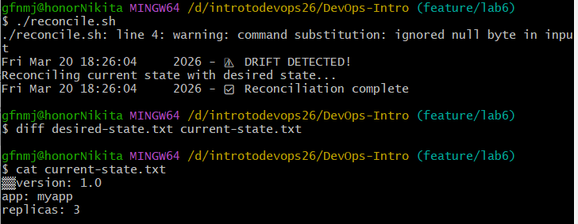
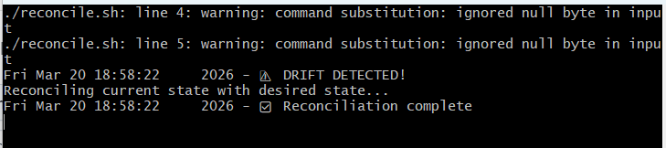
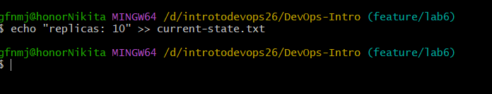
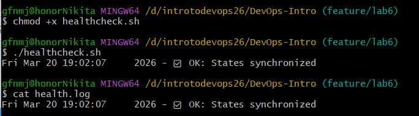
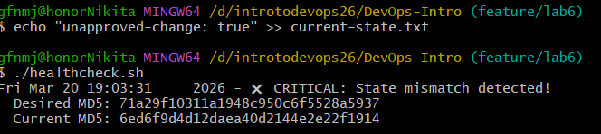
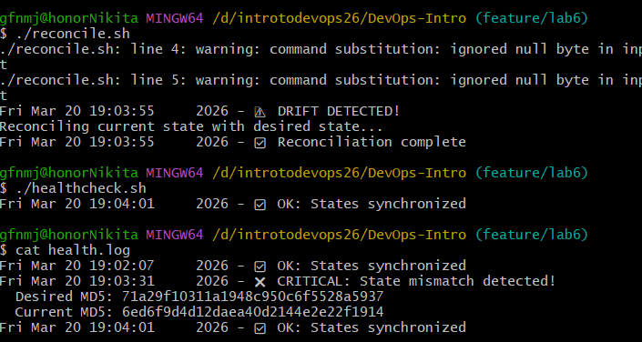
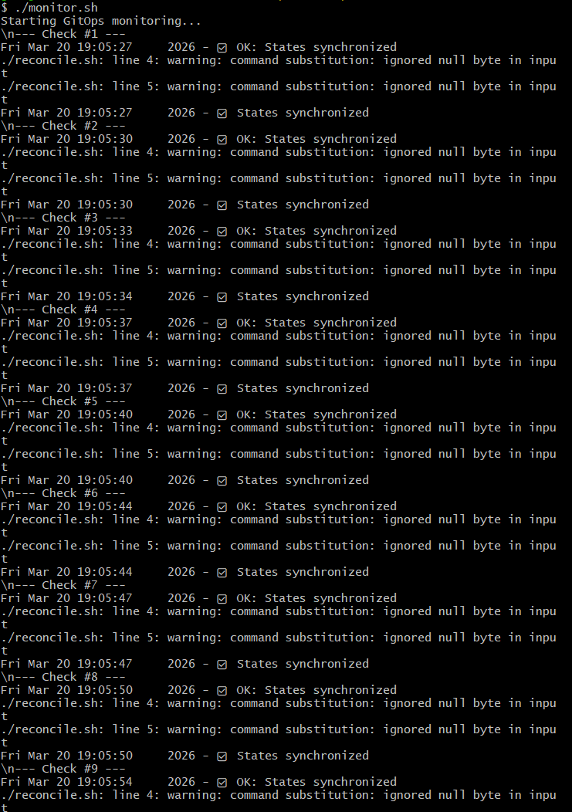
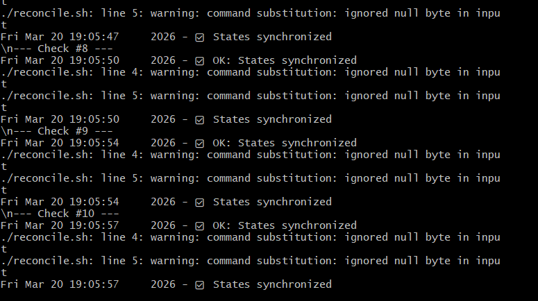
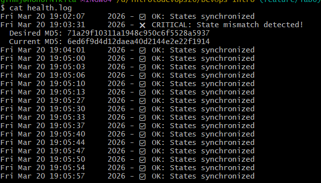

# task 1

## task 1.1 / 1.2
starting files

desired-state.txt
```text
version: 1.0
app: myapp
replicas: 3
```

current-state.txt
```text
version: 1.0
app: myapp
replicas: 3
```
## task 1.3
output of script


## task 1.4 
drift detected after changing 





## task 1 Analysis

The GitOps reconciliation loop continuously compares the actual state of the system against the desired state defined in Git (the desired-state file in this lab). Git serves as the single source of truth. If someone makes manual changes to the live environment, the system detects this configuration drift and automatically restores the correct configuration. This approach helps teams prevent long-term inconsistencies across their infrastructure.

## task 1 Reflection

Declarative configuration is better suited for production environments because:

- **Clear intent** — it explicitly defines the desired final state
- **Auditable** — changes can be easily reviewed through Git
- **Consistent and safe** — the process is repeatable and reduces human error
- **Fast recovery** — the system can automatically reapply the correct state without manual intervention

While imperative commands are useful for ad-hoc tasks or troubleshooting, they can introduce hidden inconsistencies between environments if not carefully managed.


# task 2
## task 2.1-2.2

inital health.log


after defecte


restoring after reconicle


output of monitor




log 


### Task 2 Analysis

MD5 generates a unique hash value for each file. Even a minor modification to the file results in a completely different hash. This makes checksum comparison an efficient method for detecting configuration changes and identifying drift.

### Comparison with ArgoCD Sync Status

- In this lab, configuration files are compared, and the result is displayed as either OK or CRITICAL.
- In ArgoCD, Sync Status compares the current state of the live cluster against the state defined in Git.
- The underlying concept is the same: detect discrepancies, indicate the status, and then proceed to synchronize or reconcile the differences.