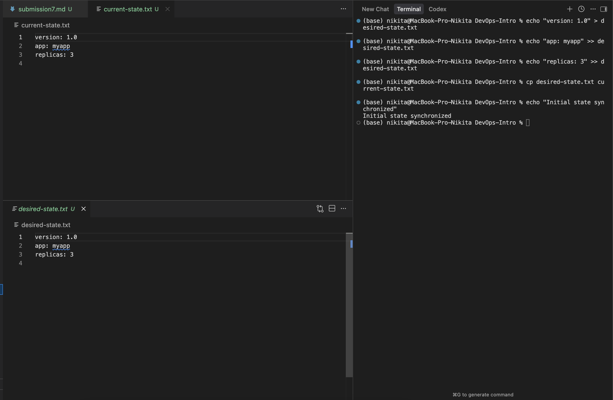
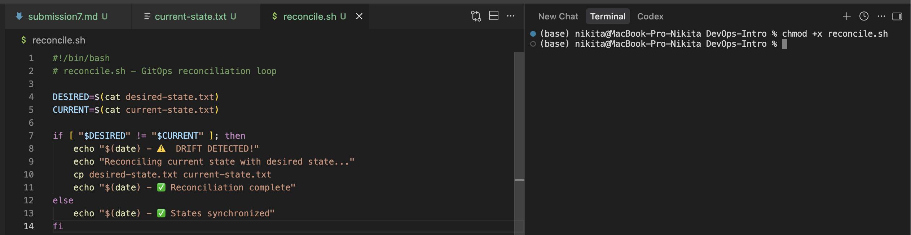
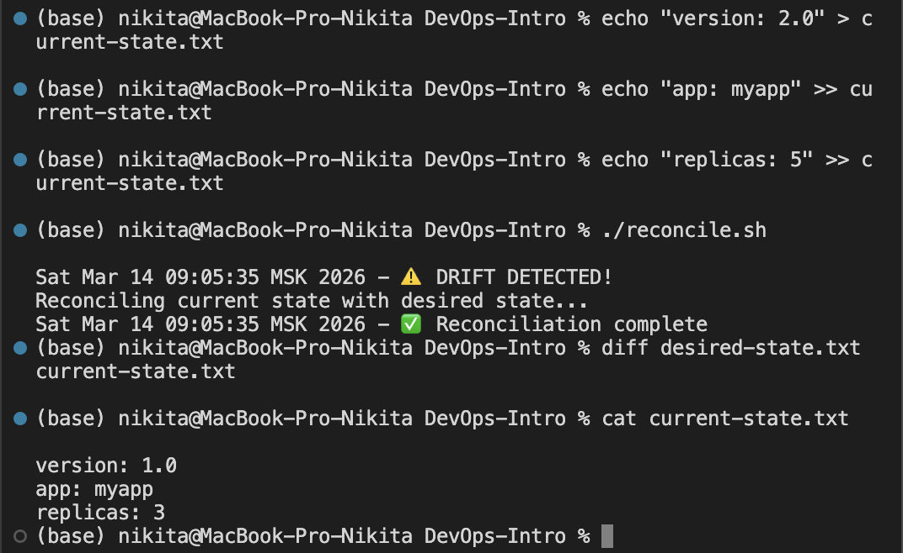
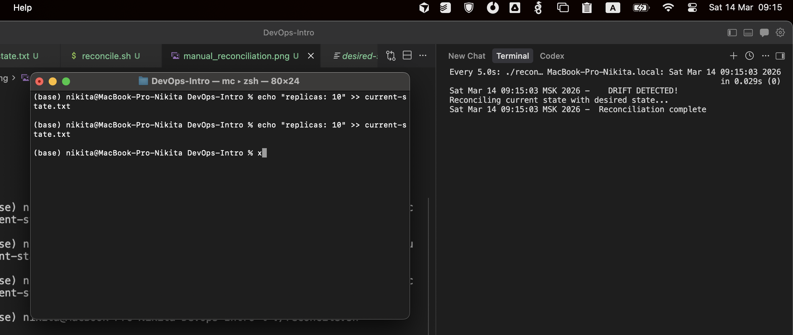
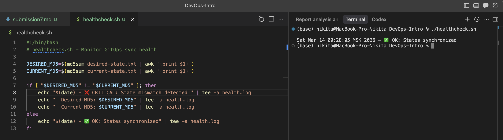
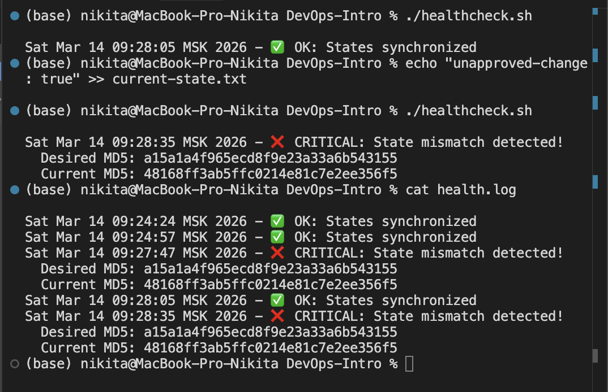
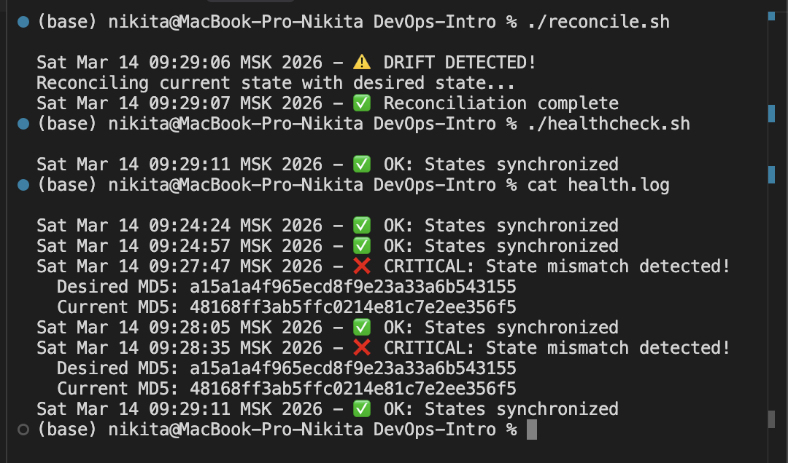
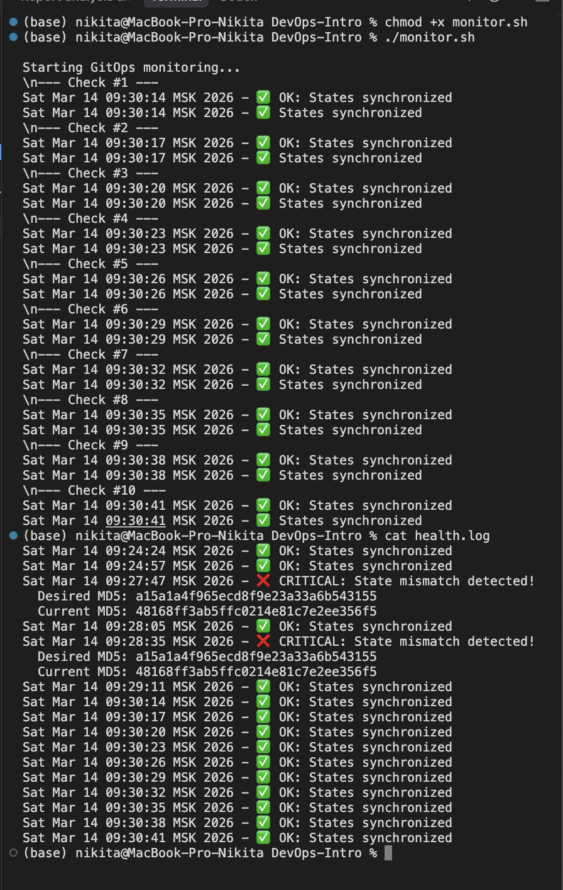

# Lab 7 Submission

## Task 1 - Git State Reconciliation

### 1.1 Setup Desired State Configuration

I've created initial declarative configuration and simulated cluster state.



### 1.2 Reconciliation Script

Then I've added a reconciliation script to detect and fix drift.



### 1.3 Manual Drift Detection and Recovery

Manual drift was introduced by changing `current-state.txt` values:
- `version: 2.0`
- `replicas: 5`

Then `./reconcile.sh` was executed and reported:
- `DRIFT DETECTED`
- `Reconciliation complete`

Validation commands:
- `diff desired-state.txt current-state.txt` (no output, files match)
- `cat current-state.txt` (restored to desired state)



### 1.4 Automated Continuous Reconciliation (Self-Healing)

Continuous reconciliation loop was running and detected drift automatically after a manual change (`echo "replicas: 10" >> current-state.txt`), then corrected state without manual fix.

Observed behavior:
- drift appears in current state
- reconciliation loop detects mismatch
- loop restores `current-state.txt` to desired state



### Analysis

The script models the GitOps reconciliation loop by continuously comparing actual state (`current-state.txt`) to desired state (`desired-state.txt`). When they differ, the controller logic declares drift and forces actual state back to the declared source of truth. This prevents long-lived configuration drift because unauthorized or ad-hoc changes are overwritten on the next reconciliation cycle.

In real platforms (ArgoCD/Flux), this loop runs against Kubernetes manifests in Git and cluster resources, but the principle is the same: detect drift, reconcile automatically, and keep runtime state aligned with version-controlled intent.

### Reflection

Declarative configuration is safer and more scalable than imperative commands because:
- desired end-state is explicit and versioned in Git
- reconciliation is repeatable and automated
- rollback is easier (revert commit instead of manually undoing commands)
- auditability improves through commit history and PR review
- human error is reduced because systems self-correct drift

## Task 2 - GitOps Health Monitoring

### 2.1 Health Check Script

Implemented `healthcheck.sh` to compare `desired-state.txt` and `current-state.txt` using MD5 checksums and append status to `health.log`:

Below is the script and the output when the state is OK.


### 2.2 Test Health Monitoring

#### Healthy state (OK)

When desired and current state match, `./healthcheck.sh` returns:
- `✅ OK: States synchronized`

#### Drifted state (CRITICAL)

After simulating drift with:

```bash
echo "unapproved-change: true" >> current-state.txt
```

`./healthcheck.sh` reports:
- `❌ CRITICAL: State mismatch detected!`
- shows both desired and current MD5 values for diagnosis

Evidence of both OK and CRITICAL states and partial log:



#### Reconciliation then health verification

After running:

```bash
./reconcile.sh
./healthcheck.sh
cat health.log
```

The status returns to:
- `✅ OK: States synchronized`

Below is the output when the state is OK.



### 2.3 Continuous Health Monitoring

Combined monitoring script (`monitor.sh`):

```bash
#!/bin/bash
# monitor.sh - Combined reconciliation and health monitoring

echo "Starting GitOps monitoring..."
for i in {1..10}; do
    echo "\n Check #$i "
    ./healthcheck.sh
    ./reconcile.sh
    sleep 3
done
```

Running `./monitor.sh` performs repeated health checks and reconciliation cycles, producing continuous synchronization output and expanding `health.log` with multiple entries.

Below is the output when the state is OK.



### Analysis

MD5 checksums provide a lightweight integrity fingerprint of file contents. If even one character changes, the checksum changes, so the health check can detect hidden or unauthorized configuration drift quickly without parsing every field semantically.

This is conceptually similar to ArgoCD Sync Status:
- **Synced/Healthy** in ArgoCD corresponds to matching desired and live state (`OK` in this lab)
- **OutOfSync/Degraded** corresponds to checksum mismatch (`CRITICAL` in this lab)
- Reconciliation action restores desired state and brings status back to healthy

In both cases, the key idea is continuous comparison of declared intent (Git/desired state) against runtime reality, with fast feedback and automatic correction.
