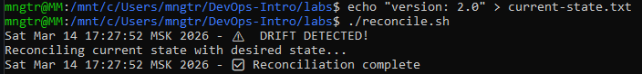
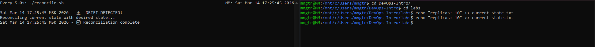
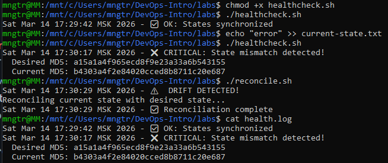
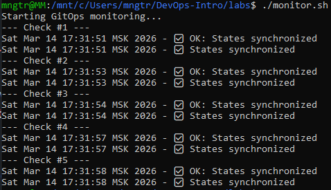

# Task 1 — Git State Reconciliation

*Initial desired-state.txt*

```
version: 1.0
app: myapp
replicas: 3
```

*Initial current-state.txt*

```
version: 1.0
app: myapp
replicas: 3
```

*Configuration  drift detection and reconciliation*



*Continuous reconciliation loop detecting auto-healing*



*Analysis: Explain the GitOps reconciliation loop. How does this prevent configuration drift?*
```
The GitOps reconciliation loop is a process where an operator constantly compares the live state of a system with the desired state defined in Git. If it finds any difference-such as a manual change to a pod-it automatically overwrites the live state to match the Git configuration. By continuously correcting these differences, the loop ensures the environment always reflects the configuration in Git, effectively preventing configuration drift.
```


*Reflection: What advantages does declarative configuration have over imperative commands in production?*
```
Declarative configuration provides a single, version-controlled source of truth for your entire system, making deployments repeatable and auditable. Unlike imperative commands, which are executed manually and can be lost, declarative files allow for easy rollbacks and quick disaster recovery by simply reapplying the configuration. This approach also enables self-healing systems, as the cluster can automatically correct any drift without manual intervention.
```


# Task 2 — GitOps Health Monitoring


*Contents of healthcheck.sh script*

```
#!/bin/bash
# healthcheck.sh - Monitor GitOps sync health

DESIRED_MD5=$(md5sum desired-state.txt | awk "{print \$1}")
CURRENT_MD5=$(md5sum current-state.txt | awk "{print \$1}")

if [ "$DESIRED_MD5" != "$CURRENT_MD5" ]; then
    echo "$(date) - ❌ CRITICAL: State mismatch detected!" | tee -a health.log
    echo "  Desired MD5: $DESIRED_MD5" | tee -a health.log
    echo "  Current MD5: $CURRENT_MD5" | tee -a health.log
else
    echo "$(date) - ✅ OK: States synchronized" | tee -a health.log
fi
```


*Output showing "OK" status when states match/Output showing "CRITICAL" status when drift is detected*




*Complete health.log file showing multiple checks*

```
Sat Mar 14 17:29:42 MSK 2026 - ✅ OK: States synchronized
Sat Mar 14 17:30:17 MSK 2026 - ❌ CRITICAL: State mismatch detected!
  Desired MD5: a15a1a4f965ecd8f9e23a33a6b543155
  Current MD5: b4303a4f2e84020cced8b8711c20e687
Sat Mar 14 17:31:51 MSK 2026 - ✅ OK: States synchronized
Sat Mar 14 17:31:53 MSK 2026 - ✅ OK: States synchronized
Sat Mar 14 17:31:54 MSK 2026 - ✅ OK: States synchronized
Sat Mar 14 17:31:57 MSK 2026 - ✅ OK: States synchronized
Sat Mar 14 17:31:58 MSK 2026 - ✅ OK: States synchronized
```


*Output from monitor.sh showing continuous monitoring*




*Analysis: How do checksums (MD5) help detect configuration changes?*

```
A checksum acts as a unique fingerprint for a file. If a configuration file is altered, its MD5 hash value will change completely, even with a minor edit. By comparing the current hash to a previously stored "golden" hash, systems can instantly and reliably detect unauthorized or accidental configuration drift.
```

*Comparison: How does this relate to GitOps tools like ArgoCD's "Sync Status"?*

```
ArgoCD applies the same comparison logic but at the application level. It continuously compares the live state of a cluster against the desired state defined in Git. The "Sync Status" (Synced/OutOfSync) is the result of this comparison—a mismatch indicates configuration drift, similar to a failed checksum test. While checksums verify file integrity, ArgoCD's status enables automated reconciliation to restore the desired state.
```