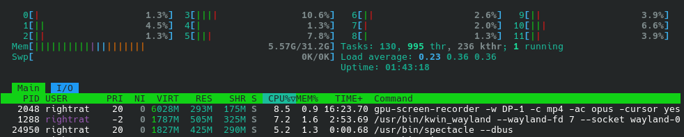
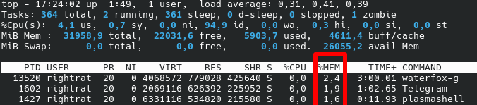
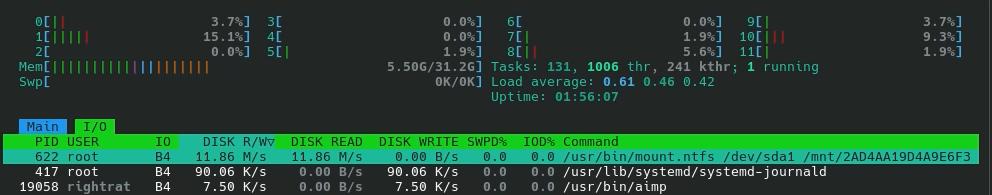
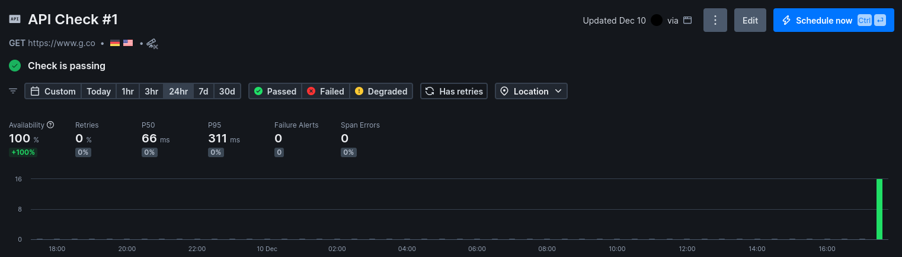
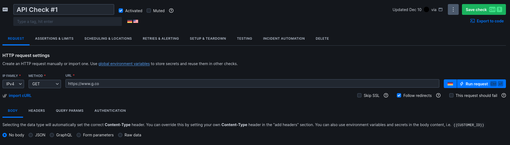
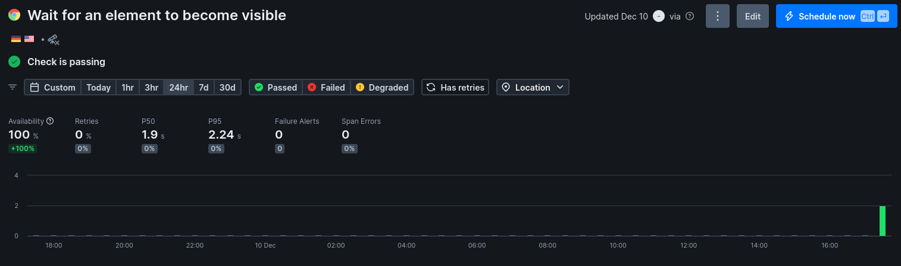

## Task 1
Top 3 on CPU (via htop): 

As expected, the instant replay app, window manager and screenshot manager are the top 3

Top 3 on RAM% (via top):

Browser, Telegram and Desktop session. No surprises.

Top 3 on IO R/W (via htop):

Mounted drive, systemd-journald and a music player. No surprises again.

```sh
[RatPC|rightrat ~] df -h          
Filesystem      Size  Used Avail Use% Mounted on
/dev/nvme0n1p2  914G  356G  512G  42% /
devtmpfs         16G     0   16G   0% /dev
tmpfs            16G   29M   16G   1% /dev/shm
efivarfs        256K  111K  141K  44% /sys/firmware/efi/efivars
tmpfs           6,3G  2,0M  6,3G   1% /run
tmpfs           1,0M     0  1,0M   0% /run/credentials/systemd-journald.service
tmpfs            16G  996K   16G   1% /tmp
/dev/nvme0n1p1  2,0G  328K  2,0G   1% /boot/efi
/dev/sda1       224G  140G   84G  63% /mnt/2AD4AA19D4A9E6F3
tmpfs           3,2G  224K  3,2G   1% /run/user/1000
```

```sh
[RatPC|rightrat ~] sudo du -h /var | sort -rh | head -n 10
3,3G    /var
1,3G    /var/tmp/.guestfs-1000/appliance.d
1,3G    /var/tmp/.guestfs-1000
1,3G    /var/tmp
919M    /var/cache
906M    /var/cache/pacman/pkg
906M    /var/cache/pacman
839M    /var/lib
762M    /var/lib/systemd/coredump
762M    /var/lib/systemd
```

```sh
[RatPC|rightrat ~] sudo find /var -type f -exec du -h {} + | sort -rh | head -n 3
[sudo] password for rightrat: 
1,3G    /var/tmp/.guestfs-1000/appliance.d/root
118M    /var/cache/pacman/pkg/chromium-143.0.7499.40-1-x86_64.pkg.tar.zst
110M    /var/cache/pacman/pkg/dotnet-sdk-10.0.0.sdk100-1-x86_64.pkg.tar.zst
```
 Overall the best optimization would be to uninstall chromiun from my pc, unfortunately my mouse configuration app and Discord both require it. Jokes aside probably nothing to be done of significance.

 ## Task 2
I decided to use my beloved *g.co* website.

Checking for 200 response from g.co

Config:


Checking for loading Google's logo

Playwright config:
```js
const { expect, test } = require('@playwright/test')

// Configure the Playwright Test timeout to 210 seconds,
// ensuring that longer tests conclude before Checkly's browser check timeout of 240 seconds.
test.setTimeout(210000)

// Set the action timeout to 10 seconds to quickly identify failing actions.
test.use({ actionTimeout: 10000 })

test('wait for an element to become visible', async ({ page }) => {
  await page.goto(process.env.ENVIRONMENT_URL || 'https://www.g.co')

  // Locate the logo and check if it's visible
  const companyLogo = page.getByAltText("Google")
  await expect(companyLogo).toBeVisible()

  // Take a screenshot of the current page
  await page.screenshot({ path: 'screenshot.jpg' })
})
```

Alerts config:


I used simple checks for a simple website (definetly slacking off).
Monitoring is crucial for modern web service model, since downtime = less money. If a website is down, its owner must be notified ASAP to get it back up.