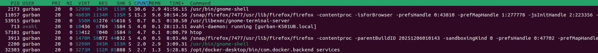
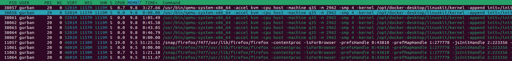
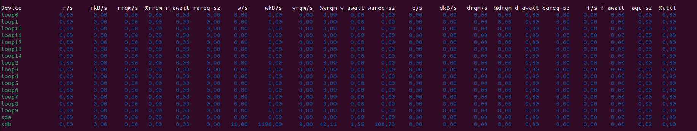
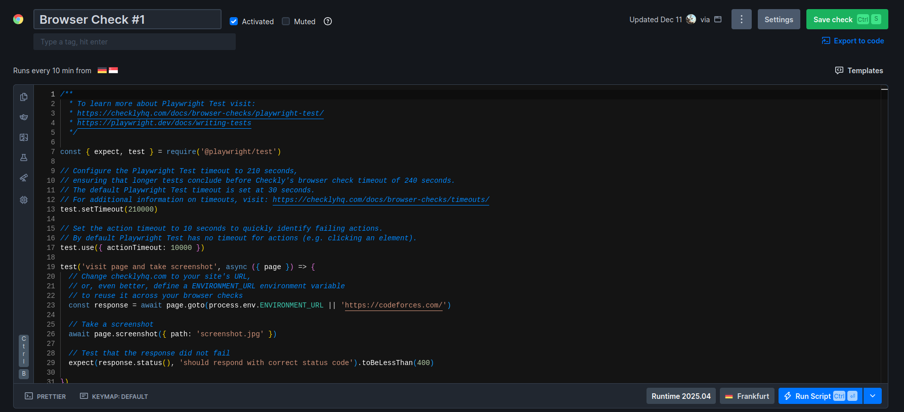
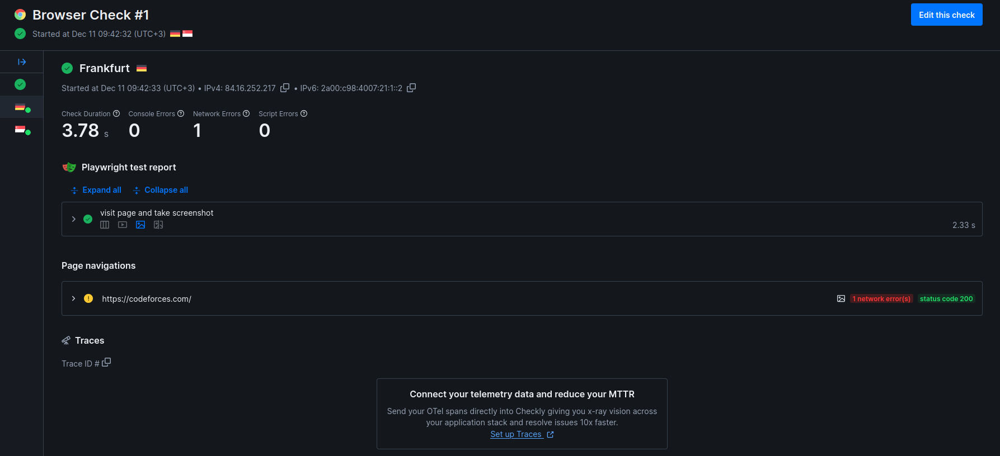
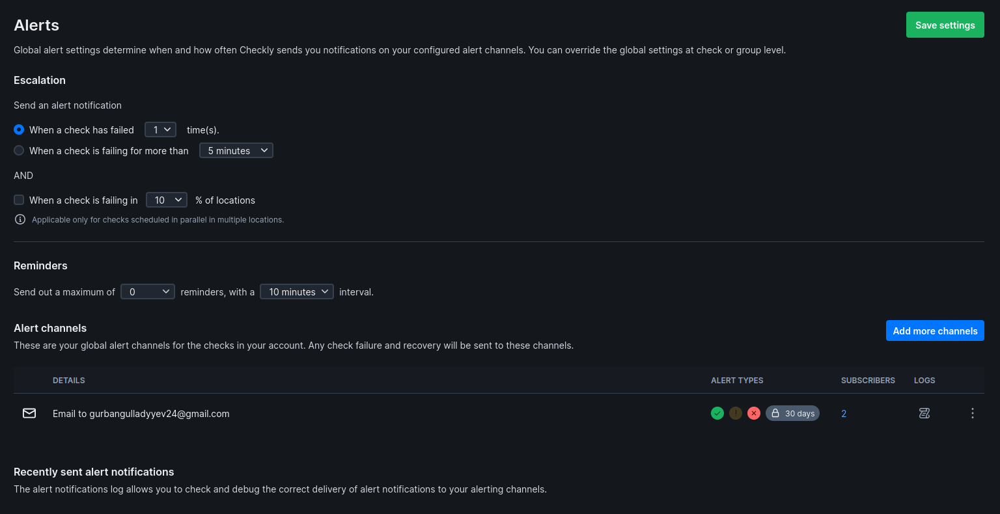

# Site Reliability Engineering

## 1. Key Metrics for SRE and System Analysis

### 1. Top 3 most consuming applications for CPU, memory, and I/O usage
- CPU usage
    - firefox
    - gnome shell
    - avahi-daemon

- Memory usage
    - docker-desktop
    - firefox
    - vscode

- I/O usage
    - docker-desktop
    - firefox
    - vscode

### 2. Command outputs showing resource consumption
- 
- 
- 

### 3. Top 3 largest files in the `/var` directory
```bash
517M	/var/lib/snapd/snaps/gnome-42-2204_226.snap
506M	/var/lib/snapd/snaps/gnome-42-2204_176.snap
506M	/var/lib/snapd/seed/snaps/gnome-42-2204_176.snap
```

### 4. Analysis: What patterns do you observe in resource utilization?
There is no single process dominating CPU. Firefox, gnome shell, avahi-daemon consume the most.

Docker-desktop get 9.8% of memory and firefox get 9.5%. 

There is very little I/O consumption.

### 5. Reflection: How would you optimize resource usage based on your findings?

- CPU: Stop unnecessary services, optimize heavy applications
- Memory: terminate idle processes
- Disk space: clear caches.

## 2. Practical Website Monitoring Setup

### 1. Website URL you chose to monitor
- https://codeforces.com/
### 2. Screenshots of browser check configuration
- 
### 3. Screenshots of successful check results
- 
### 4. Screenshots of alert settings
- 

### 5. Analysis: Why did you choose these specific checks and thresholds?
- I chose an browser check to ensure quick detection of downtime.
- Thresholds were selected to balance sensitivity and avoiding false alarms.

### 6. Reflection: How does this monitoring setup help maintain website reliability?
- These checks detect failures before users report them.
- Browser checks ensure important content loads, not just server response.