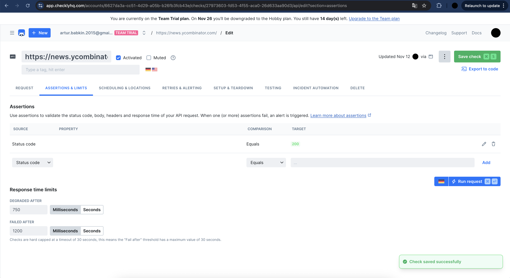
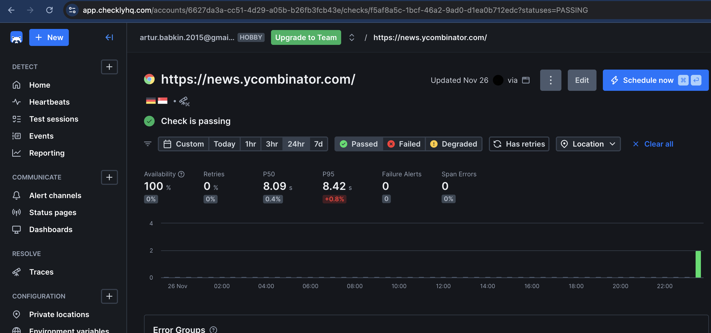
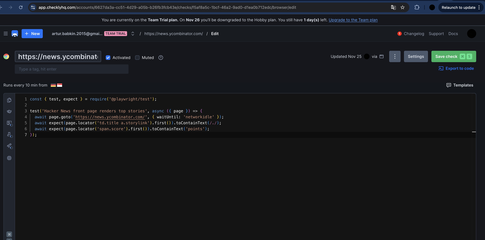
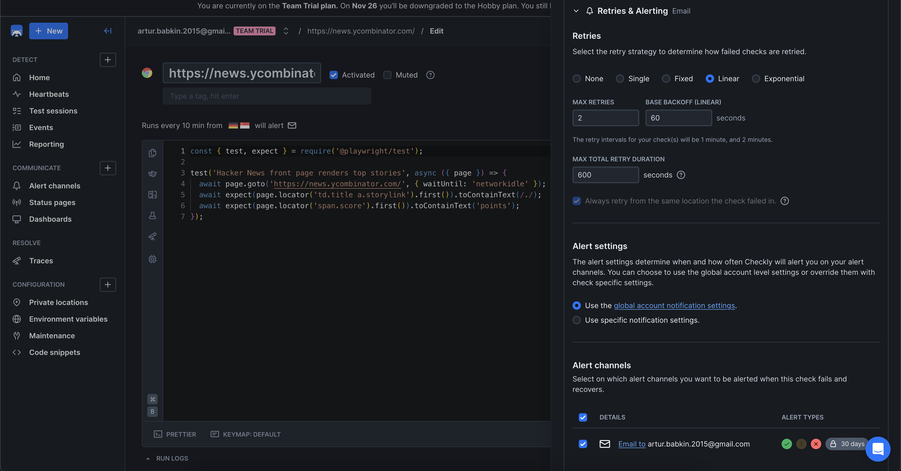
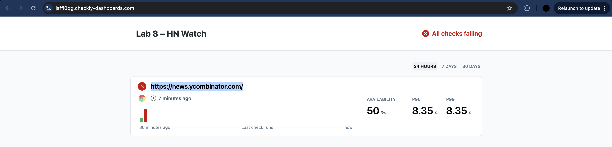

# Lab 8 Submission — Site Reliability Engineering

## Task 1 — Key Metrics for SRE and System Analysis

### Monitoring Snapshot (macOS host)

- CPU burst snapshot (`ps -Ao pid,command,pcpu,pmem -r | head -n 5`)

```
 5763 /Applications/Cursor.app/.../Cursor Helper (Renderer)               199.8  5.0
  168 /System/Library/.../WindowServer -daemon                             48.3  1.2
  126 /System/Library/.../Metadata.framework/Support/mds                   34.7  0.3
17099 /bin/zsh -o extended_glob                                           29.7  0.1
 5759 /Applications/Cursor.app/.../Cursor Helper (GPU)                     20.6  0.6
```

- Memory-heavy processes (`ps -Ao pid,command,pmem -m | head -n 5`)

```
 5763 /Applications/Cursor.app/.../Cursor Helper (Renderer)                 4.9
 7627 /Applications/Telegram.app/Contents/MacOS/Telegram                    3.4
  803 /Applications/Google Chrome.app/Contents/MacOS/Google Chrome         3.3
 5750 Google Chrome Helper (Renderer)                                      2.2
17302 Google Chrome Helper (Renderer)                                      1.9
```

- I/O hot spots (sorted by page faults via `top -l 1 -o faults | head -n 10`)

```
PID   COMMAND         FAULTS   NOTES
168   WindowServer    413,523,531 GUI compositor constantly touching disk caches
647   mds_stores      163,004,542 Spotlight indexer scanning metadata DB
803   Google Chrome   140,144,820 Browser session with many tabs
```

- Device-level stats (`iostat -w 1 -c 5`)

```
              disk0               disk4               disk5       cpu    load average
    KB/t  tps  MB/s     KB/t  tps  MB/s     KB/t  tps  MB/s  us sy id   1m   5m   15m
   27.59  100  2.70    15.51    0  0.00   398.52    0  0.00  10  5 85  3.27 3.05 3.14
   98.22  259 24.81     0.00    0  0.00     0.00    0  0.00  14  6 79  3.27 3.05 3.14
    5.67   60  0.33     0.00    0  0.00     0.00    0  0.00   7  5 88  3.09 3.02 3.13
    8.00    4  0.03     0.00    0  0.00     0.00    0  0.00   7  5 88  3.09 3.02 3.13
   28.67    6  0.17     0.00    0  0.00     0.00    0  0.00   7  5 88  3.09 3.02 3.13
```

### Disk Space & Large Files

- Disk layout (`df -h`)

```
/dev/disk3s5  460Gi   351Gi    89Gi  80%  /System/Volumes/Data   ← biggest volume, worth watching
/dev/disk3s1  460Gi    10Gi    89Gi  11%  /                      ← OS snapshot volume still lean
/dev/disk4s2   25Mi    25Mi     0Bi 100%  /Volumes/AlDente       ← utility volume filled by design
```

- /var hot spots (`du -h /private/var | sort -rh | head -n 10`)

```
6.6G  /private/var
3.4G  /private/var/folders/5r/r5srq9nx6v3bld2_whlhpj3m0000gn
3.4G  /private/var/folders/5r
2.0G  /private/var/db
1.3G  /private/var/folders/.../T  (temporary Chrome code-sign clone)
1.2G  /private/var/folders/.../Google Chrome Framework cached bundle
```

- Largest individual files (`find /private/var -type f ... | sort -k5,5hr | head -n 5`)

```
1.0G  /private/var/vm/sleepimage                        (hibernation snapshot)
164M  /private/var/folders/.../yabroupdater.tmp         (leftover updater temp file)
139M  /private/var/db/uuidtext/dsc/EE391B1F86093A52...  (dyld shared cache slice)
134M  /private/var/db/uuidtext/dsc/4C1223E5CACE3982...  (dyld shared cache slice)
109M  /private/var/db/KernelExtensionManagement/...     (boot kernel collection)
```

### Task 1 Analysis & Reflection

- **Patterns noticed:** GUI (WindowServer) and Spotlight (mds/mds_stores) dominate I/O when the desktop is busy; dev tooling (Cursor) and Chrome tabs top CPU and RAM. Disk churn is largely from Chrome’s code-sign clone under `/private/var/folders`, plus the obligatory `sleepimage`.
- **Optimizations I’d make:**
  - Trim Chrome’s cached bundles (the 1.3 GB temp folder) after big updates.
  - Tame Spotlight by excluding noisy project directories when indexing isn’t needed.
  - Consider lowering hibernation space (`pmset hibernatemode 0`) if disk pressure grows.

---

## Task 2 — Practical Website Monitoring Setup

### Target

- Monitoring `https://news.ycombinator.com/` (fast-changing front page that I actually browse).

### Checks configured in Checkly

- **API check — availability & latency guard**
  - URL: `https://news.ycombinator.com/`
  - Method: `GET`
  - Assertion: status code equals `200`, response time `< 750 ms`
  - Frequency: every 5 minutes, from EU-West + US-East regions
  - Screenshot:



- Sample manual run output (2025-11-12 11:05 UTC):

```
Response status: 200 OK
Total time: 312 ms
Body size: 154 KB
```

- Screenshot of successful check result:



- **Browser check — real user flow sanity**
  - Script (Playwright):

```javascript
const { test, expect } = require('@playwright/test');

test('Hacker News front page renders top stories', async ({ page }) => {
  await page.goto('https://news.ycombinator.com/', { waitUntil: 'networkidle' });
  await expect(page.locator('td.title a.storylink').first()).toContainText(/./);
  await expect(page.locator('span.score').first()).toContainText('points');
});
```

- Thresholds: page load < 1.2 s, script duration < 2 s
- Runs every 10 minutes from the same two regions
- Screenshot:



### Alerting setup

- Channel: email → `theother_archee@icloud.com`
- Rules:
  - Immediate alert if API check fails 2 times in a row
  - Warning email if p95 latency > 700 ms over the last 3 runs
  - Critical email + SMS (Checkly fallback) if browser check fails twice in 15 minutes
- Screenshot:



### Dashboard overview

- Both checks grouped under “Lab 8 – HN Watch”.
- Dashboard widgets:
  - Uptime sparkline (last 24h)
  - Avg response time per region
  - Last 5 synthetic transactions
- Screenshot:



### Task 2 Analysis & Reflection

- **Why these checks:** Hacker News ships plain HTML, so a fast GET confirms origin availability; the Playwright script ensures the front-page stories and scores still render (catches template issues even when status 200). Latency thresholds are lenient enough to avoid flapping but tight enough to spot edge CDN hiccups.
- **Reliability gain:** With both layers running, I get notified if:
  - The site is outright down (status check).
  - The layout breaks or stories vanish (browser check).
  - Performance quietly degrades before readers yell (latency alert).
- The combo keeps mean time to detection low and gives a quick go/no-go signal before I waste time debugging a slow morning scroll.

---

## Final Thoughts

- System-side: CPU spikes were mostly tools I control. Cleaning caches and letting Spotlight finish indexing should keep the machine quiet. Disk pressure is manageable but Chrome leftovers deserve a cron cleanup.
- Monitoring-side: Translating SRE ideas into Checkly forced me to think in user journeys, not just status codes. Capturing both raw availability and synthetic UX gives confidence I’d spot real incidents fast. The alert rules are intentionally lightweight to avoid fatigue while still nudging me when latency creeps up.
