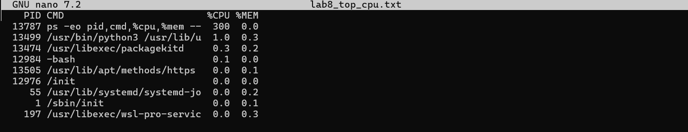
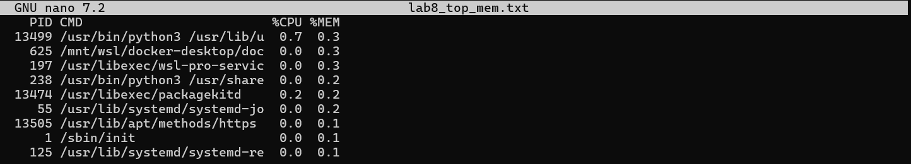
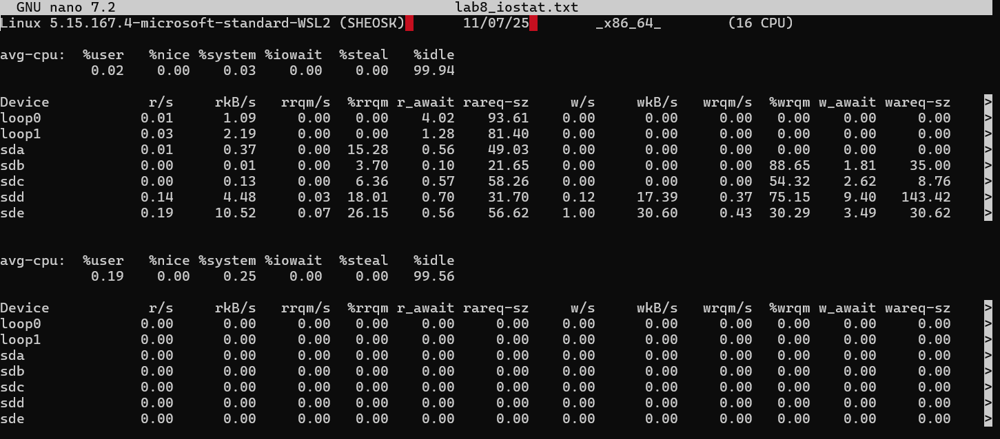
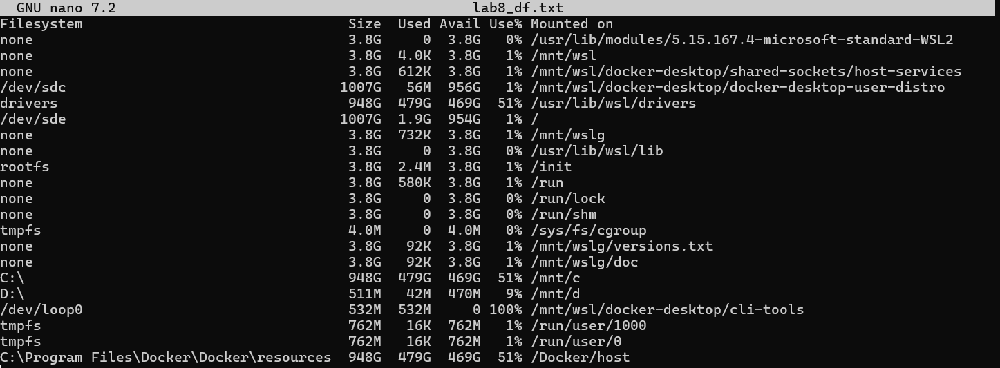
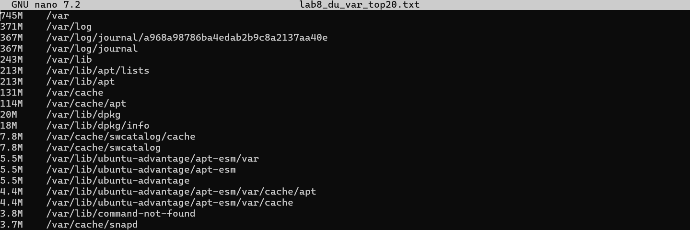
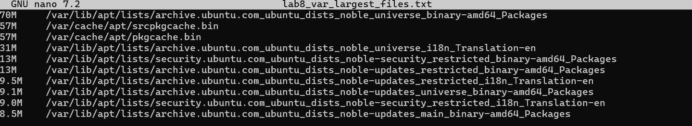
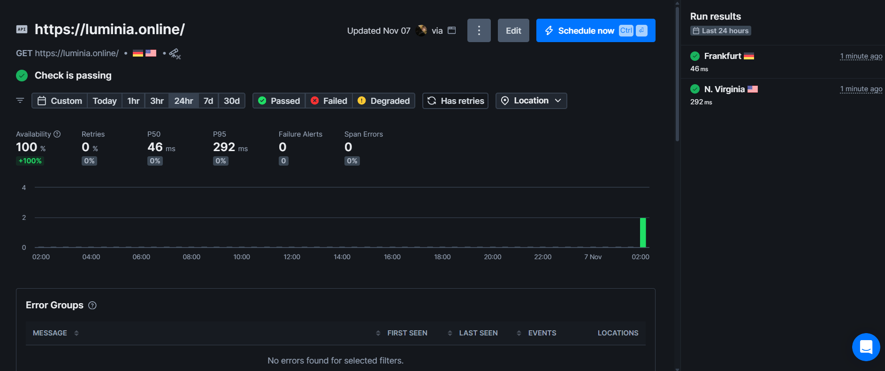
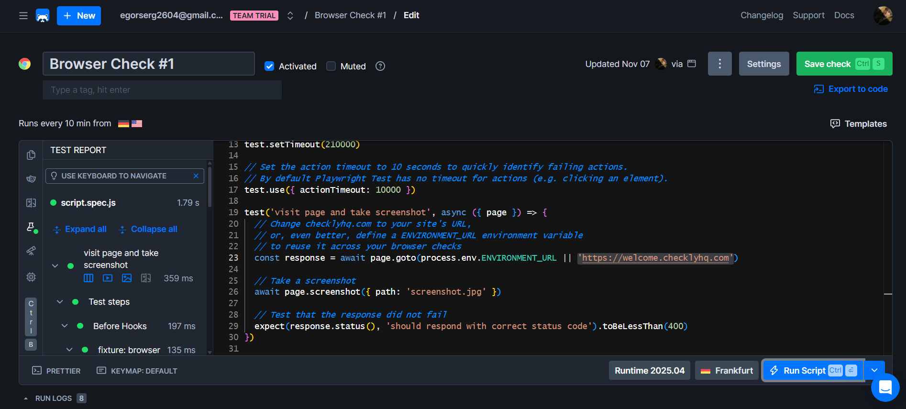

df -h > lab8_df.txt
iostat -x 1 5 > lab8_iostat.txt
## Lab 8 — Site Reliability Engineering (SRE) Report

Date: 2025-11-07

Summary
-------
This report documents the work performed for Lab 8: collecting host resource metrics (CPU, memory, I/O, disk usage) and configuring external site monitoring with Checkly. The file contains the methods used, collected evidence (screenshots), analysis (top consumers and largest files), and remediation recommendations.

Environment
-----------
- Repository: F25-DevOps-Intro
- Branch: feature/lab8
- Files with screenshots and logs used as evidence are stored under `labs/` (see image links below).

Task 1 — Host metrics collection and analysis
--------------------------------------------
Objective
: Identify the top resource consumers on the host and locate the largest files under `/var` that may impact disk usage.

Method
: I collected process and system metrics using standard Linux tools and saved outputs to text files for traceability. Commands used (examples):

```bash
sudo apt update && sudo apt install -y htop sysstat
ps -eo pid,cmd,%cpu,%mem --sort=-%cpu | head -n 10 > ~/lab8_top_cpu.txt
ps -eo pid,cmd,%cpu,%mem --sort=-%mem | head -n 10 > ~/lab8_top_mem.txt
iostat -x 1 5 > ~/lab8_iostat.txt
df -h > ~/lab8_df.txt
du -h /var | sort -rh | head -n 20 > ~/lab8_du_var_top20.txt
sudo find /var -type f -exec du -h {} + | sort -rh | head -n 10 > ~/lab8_var_largest_files.txt
```

Evidence (screenshots)
: The following screenshots were captured during the investigation and are included as evidence:

- Top CPU processes: 
- Top memory processes: 
- I/O snapshot (iostat): 
- Disk usage summary (df): 
- Top directories in /var (du): 
- Largest files under /var: 


Task 2 — External site monitoring with Checkly
---------------------------------------------
- API Check: 
- Browser Check

Conclusion
----------
Sorry for late submission...