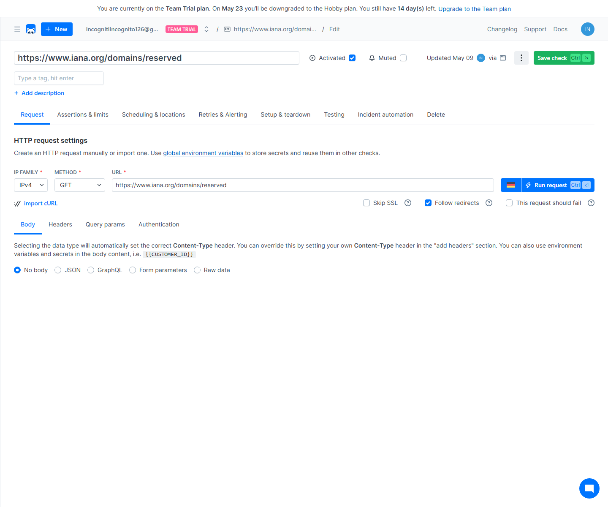
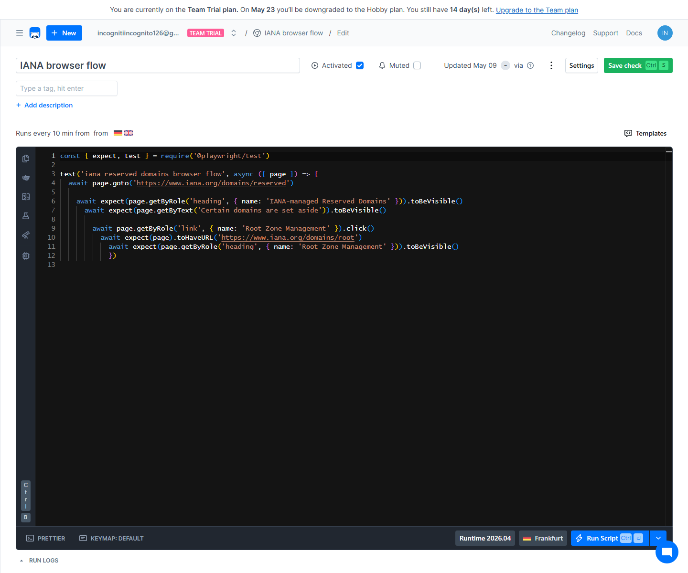
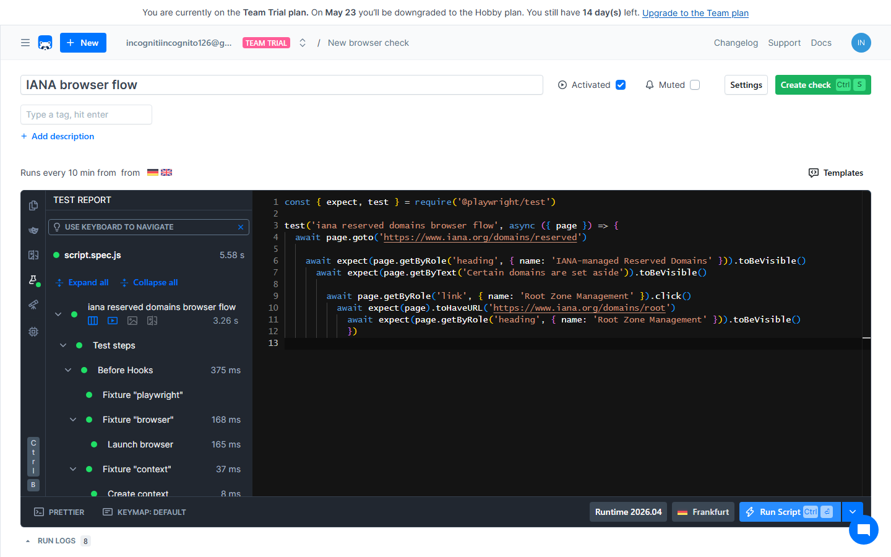
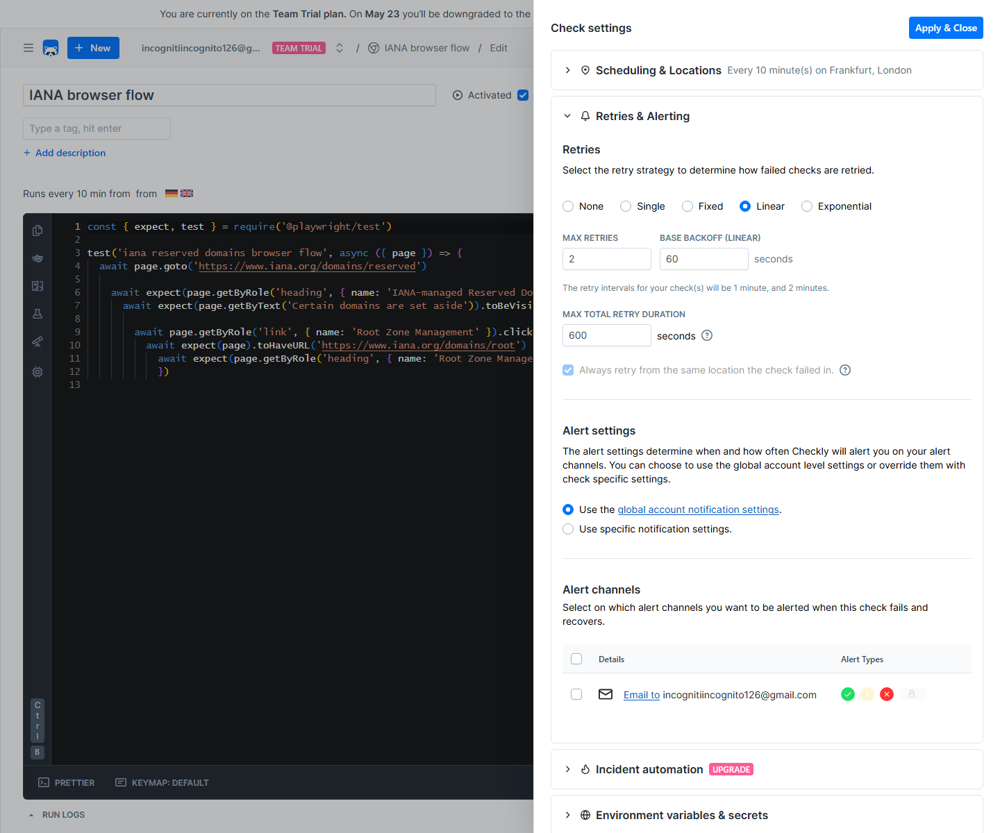
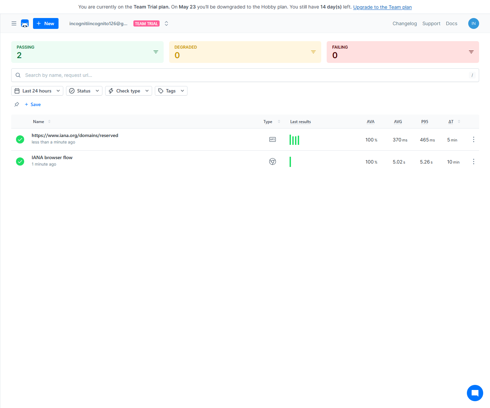

# Lab 8 - Site Reliability Engineering (SRE)

## Task 1 - Key Metrics for SRE and System Analysis

Для первой части я использовала VPS на Ubuntu. Сначала поставила нужные утилиты:

```bash
sudo apt install htop sysstat iotop -y
```

После этого сняла состояние системы через `top`, `ps`, `iostat`, `pidstat`, `df`, `du` и `find`.

### CPU, memory и общая нагрузка

```bash
Sat May  9 10:55:57 UTC 2026
10:55:57 up 3 days, 16:44,  2 users,  load average: 0.10, 0.05, 0.05

Tasks: 145 total,   1 running, 144 sleeping,   0 stopped,   0 zombie
%Cpu(s):  4.3 us,  4.3 sy,  0.0 ni, 91.3 id,  0.0 wa,  0.0 hi,  0.0 si,  0.0 st
MiB Mem :   3915.9 total,   1659.6 free,    530.2 used,   1949.2 buff/cache
MiB Swap:      0.0 total,      0.0 free,      0.0 used.   3385.7 avail Mem
```

По этим цифрам видно, что сервер почти не загружен: `load average` низкий, CPU idle около `91%`, swap не используется.

### Top CPU consumers

```bash
PID     USER     COMMAND         %CPU %MEM
1361    root     amneziawg-go     2.8  1.2
264745  root     sshd             2.1  0.2
264755  root     bash             0.7  0.0
1332    root     xray             0.3  0.8
583     root     containerd       0.2  1.3
556     root     fail2ban-server  0.2  2.5
609     root     dockerd          0.1  1.9
```

Мой top-3 по CPU:

1. `amneziawg-go` - `2.8%`
2. `sshd` - `2.1%`
3. `bash` - `0.7%`

`sshd` и `bash` попали в список из-за моей SSH-сессии, поэтому из постоянных сервисов заметнее всего `amneziawg-go`, `xray`, Docker и `fail2ban`.

### Top memory consumers

```bash
PID     USER     COMMAND          %CPU %MEM
226     root     systemd-journal   0.0  3.8
556     root     fail2ban-server   0.2  2.5
609     root     dockerd           0.1  1.9
583     root     containerd        0.2  1.3
1361    root     amneziawg-go      2.8  1.2
1332    root     xray              0.3  0.8
568     root     tuned             0.0  0.7
```

Мой top-3 по памяти:

1. `systemd-journal` - `3.8%`
2. `fail2ban-server` - `2.5%`
3. `dockerd` - `1.9%`

Памяти хватает с запасом: занято около `530 MiB` из `3915.9 MiB`.

### I/O usage

Для диска я посмотрела `iostat -x 1 5`:

```bash
avg-cpu:  %user   %nice %system %iowait  %steal   %idle
           0.87    0.00    0.92    0.01    1.08   97.11

Device     r/s   rkB/s   w/s   wkB/s  w_await  aqu-sz  %util
vda        0.03   4.57   3.50  21.65    0.57    0.00   0.04

avg-cpu:  %user   %nice %system %iowait  %steal   %idle
           0.50    0.00    1.01    0.00    1.51   96.98

Device     r/s   rkB/s   w/s   wkB/s  w_await  aqu-sz  %util
vda        0.00   0.00   1.00   8.00    0.00    0.00   0.00
```

Потом проверила процессы, которые писали на диск:

```bash
Average:      UID       PID   kB_rd/s   kB_wr/s kB_ccwr/s iodelay  Command
Average:        0       164      0.00     15.17      0.00       0  jbd2/vda1-8
Average:        0       226      0.00      7.98      0.00       0  systemd-journal
Average:        0       556      0.00      2.40      0.00       0  fail2ban-server
Average:      102       595      0.00      0.80      0.00       0  rsyslogd
```

Мой top-3 по I/O:

1. `jbd2/vda1-8` - `15.17 kB_wr/s`
2. `systemd-journal` - `7.98 kB_wr/s`
3. `fail2ban-server` - `2.40 kB_wr/s`

Сильной дисковой нагрузки не было. В основном это обычные записи логов и журналирование файловой системы.

### Disk space

```bash
Filesystem      Size  Used Avail Use% Mounted on
tmpfs           392M  1.3M  391M   1% /run
/dev/vda1        38G  5.7G   31G  16% /
tmpfs           2.0G     0  2.0G   0% /dev/shm
tmpfs           5.0M     0  5.0M   0% /run/lock
tmpfs           392M  8.0K  392M   1% /run/user/0
```

Место на диске сейчас не проблема: корневой раздел занят только на `16%`.

Самые большие директории в `/var`:

```bash
4.4G    /var
3.2G    /var/log
2.0G    /var/log/journal/0f005944d3d34ff48780f21b3a552e1a
2.0G    /var/log/journal
1.1G    /var/lib
897M    /var/lib/docker
894M    /var/lib/docker/overlay2
190M    /var/cache
```

Самые большие файлы в `/var`:

```bash
373M    /var/log/btmp
339M    /var/log/auth.log
210M    /var/log/fail2ban.log
84M     /var/log/syslog
82M     /var/log/ufw.log
82M     /var/log/kern.log
70M     /var/lib/apt/lists/nova.clouds.archive.ubuntu.com_ubuntu_dists_noble_universe_binary-amd64_Packages
57M     /var/cache/apt/srcpkgcache.bin
57M     /var/cache/apt/pkgcache.bin
49M     /var/log/journal/0f005944d3d34ff48780f21b3a552e1a/system.journal
```

Top-3 largest files:

1. `/var/log/btmp` - `373M`
2. `/var/log/auth.log` - `339M`
3. `/var/log/fail2ban.log` - `210M`

### Analysis

В момент проверки сервер работал спокойно. CPU, RAM и disk I/O не были близко к лимитам. Больше всего внимания у меня вызвали не процессы, а логи: `/var/log` занимает `3.2G`, а самые большие файлы связаны с авторизацией, `fail2ban`, `ufw` и системными логами.

### Reflection

Я бы сделала такие улучшения:

1. Проверила `logrotate` для `auth.log`, `btmp`, `fail2ban.log`, `ufw.log` и `kern.log`.
2. Поставила лимит для `journald`, например через `SystemMaxUse`.
3. Добавила alert на заполнение `/`, например на `80%` и `90%`.
4. Раз в какое-то время чистила старые Docker layers, если они точно не нужны.
5. Следила бы за количеством failed SSH logins, потому что большие `auth.log` и `btmp` часто связаны с попытками входа.

## Task 2 - Practical Website Monitoring Setup

### Website

Для мониторинга я выбрала сайт:

```text
https://www.iana.org/domains/reserved
```

Я взяла IANA, потому что это публичная страница без логина. На ней удобно проверить и простой HTTP-ответ, и реальный browser flow: открыть страницу, найти заголовок, кликнуть по ссылке и проверить переход.

### API Check

Я создала API Check для URL:

```text
https://www.iana.org/domains/reserved
```

Настройки:

- Method: `GET`
- URL: `https://www.iana.org/domains/reserved`
- Follow redirects: enabled
- Expected result: HTTP `200`
- Interval: `5 minutes`

Скриншот API check:



### Browser Check

Browser Check я назвала `IANA browser flow`. Он проверяет не только доступность, но и поведение страницы.

Сценарий:

```js
const { expect, test } = require('@playwright/test')

test('iana reserved domains browser flow', async ({ page }) => {
  await page.goto('https://www.iana.org/domains/reserved')

  await expect(page.getByRole('heading', { name: 'IANA-managed Reserved Domains' })).toBeVisible()
  await expect(page.getByText('Certain domains are set aside')).toBeVisible()

  await page.getByRole('link', { name: 'Root Zone Management' }).click()
  await expect(page).toHaveURL('https://www.iana.org/domains/root')
  await expect(page.getByRole('heading', { name: 'Root Zone Management' })).toBeVisible()
})
```

Скриншот конфигурации Browser Check:



Успешный ручной запуск Browser Check:



### Alerting

Для alerting я оставила email-канал на эту же почту и включила retry policy.

Настройки retry:

- Strategy: `Linear`
- Max retries: `2`
- Base backoff: `60 seconds`
- Max total retry duration: `600 seconds`
- Location: retry from the same location

Я выбрала retry, потому что один случайный network timeout не должен сразу создавать шумный alert. Если проблема повторяется после retry, тогда это уже больше похоже на настоящий incident.

Скриншот alert settings:



### Dashboard

На dashboard обе проверки находятся в состоянии `PASSING`:

- `https://www.iana.org/domains/reserved` - API check
- `IANA browser flow` - Browser check

Dashboard также показывает availability и latency:

- API check: `100%`, average около `370 ms`
- Browser check: `100%`, average около `5.02 s`



### Analysis

API Check нужен как быстрый сигнал: сайт отвечает или нет. Он дешёвый и простой, но не видит, сломалась ли сама страница.

Browser Check полезнее для пользовательского сценария. В моём случае он проверяет, что страница IANA открылась, нужный текст есть, ссылка `Root Zone Management` работает и после клика открывается правильная страница. Это ближе к реальному поведению пользователя, чем просто HTTP `200`.

Интервал `5 minutes` для API Check и `10 minutes` для Browser Check мне кажется нормальным. API можно проверять чаще, потому что он легче. Browser Check тяжелее, поэтому я оставила его реже, чтобы не создавать лишнюю нагрузку и шум.

### Reflection

Такой мониторинг помогает не смотреть dashboard вручную. Если сайт перестанет отвечать, это поймает API Check. Если страница будет открываться, но сломается важный текст или переход, это поймает Browser Check.

В реальной системе я бы добавила ещё проверку latency threshold и запуск из нескольких регионов. Тогда было бы проще отличить глобальную проблему сайта от локальной сетевой проблемы в одном регионе.
