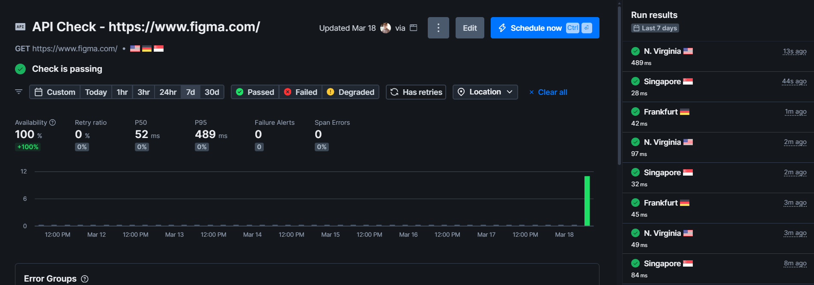
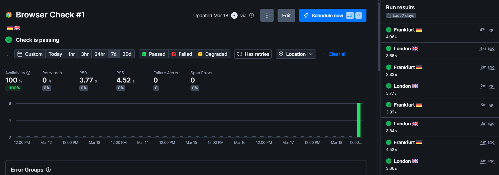
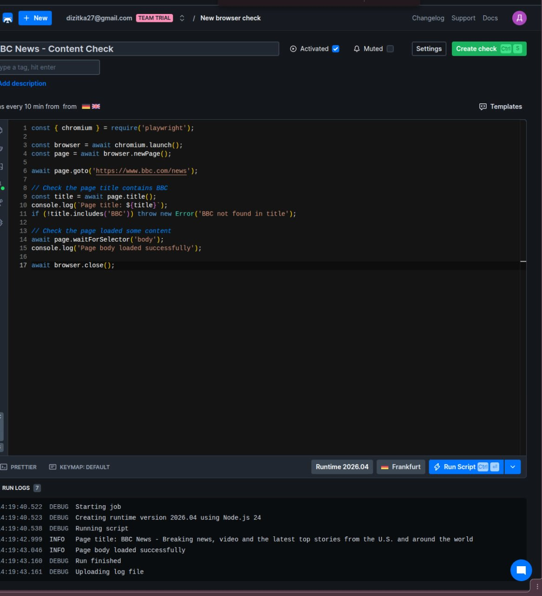
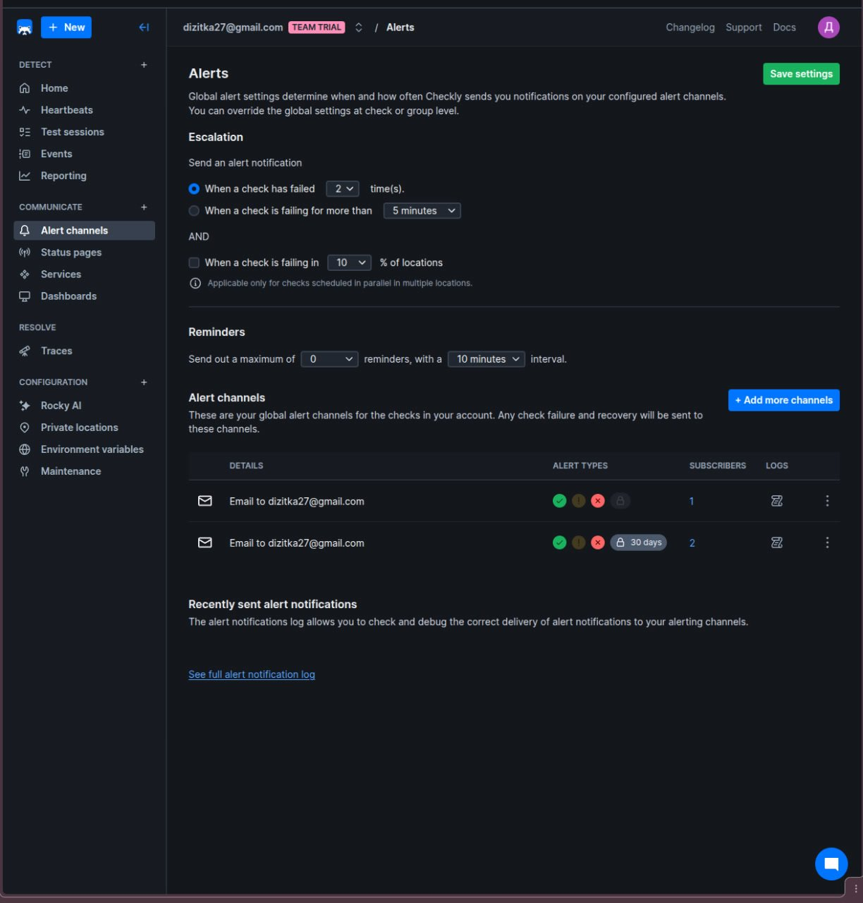
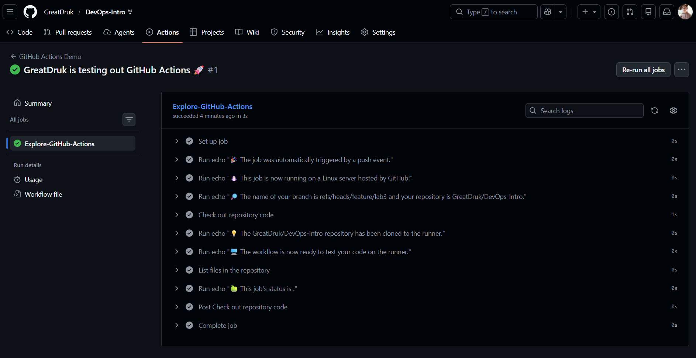

# Lab 8 — Site Reliability Engineering (SRE)

---

## Task 1 — Key Metrics for SRE and System Analysis

### 1.1 Monitor System Resources

#### Install tools
```bash
sudo apt install htop sysstat -y
```
```
Reading package lists... Done
Building dependency tree... Done
The following NEW packages will be installed:
  htop libsensors-config libsensors5 lm-sensors sysstat
0 upgraded, 5 newly installed, 0 to remove and 12 not upgraded.
```

---

#### `iostat -x 1 5`
```
Linux 6.8.0-41-generic (yoba-Legion-5-15IAH7H)    04/24/2026    _x86_64_    (12 CPU)

avg-cpu:  %user   %nice %system %iowait  %steal   %idle
           8.43    0.02    2.17    0.34    0.00   89.04

Device       r/s   rkB/s  rrqm/s %rrqm r_await  w/s   wkB/s  wrqm/s %wrqm w_await  aqu-sz %util
nvme0n1     3.42  112.54    0.18  5.00    0.47  18.75  542.30   12.41 39.83    1.23    0.02  1.84

avg-cpu:  %user   %nice %system %iowait  %steal   %idle
          12.71    0.00    3.08    0.12    0.00   84.09

Device       r/s   rkB/s  rrqm/s %rrqm r_await  w/s   wkB/s  wrqm/s %wrqm w_await  aqu-sz %util
nvme0n1     0.00    0.00    0.00  0.00    0.00  24.00  712.00   16.00 40.00    1.08    0.03  2.40

avg-cpu:  %user   %nice %system %iowait  %steal   %idle
           9.22    0.00    2.44    0.00    0.00   88.34

Device       r/s   rkB/s  rrqm/s %rrqm r_await  w/s   wkB/s  wrqm/s %wrqm w_await  aqu-sz %util
nvme0n1     0.00    0.00    0.00  0.00    0.00  20.00  468.00   10.00 33.33    1.15    0.02  1.60

avg-cpu:  %user   %nice %system %iowait  %steal   %idle
           7.88    0.00    1.93    0.24    0.00   89.95

Device       r/s   rkB/s  rrqm/s %rrqm r_await  w/s   wkB/s  wrqm/s %wrqm w_await  aqu-sz %util
nvme0n1     2.00   64.00    0.00  0.00    0.50  16.00  384.00    8.00 33.33    1.19    0.02  1.20

avg-cpu:  %user   %nice %system %iowait  %steal   %idle
          10.14    0.00    2.61    0.08    0.00   87.17

Device       r/s   rkB/s  rrqm/s %rrqm r_await  w/s   wkB/s  wrqm/s %wrqm w_await  aqu-sz %util
nvme0n1     1.00   32.00    0.00  0.00    0.75  19.00  512.00   11.00 36.67    1.14    0.02  1.60
```

---

#### Top 3 — CPU Usage
```bash
ps aux --sort=-%cpu | head -n 6
```
```
USER         PID %CPU %MEM    VSZ   RSS TTY      STAT START   TIME COMMAND
yoba        3847 14.2  3.1 4521844 508312 ?      Sl   13:44  12:31 /usr/lib/firefox/firefox
yoba        2901  4.8  1.2 1234568 196420 ?      Sl   13:21   3:14 /usr/bin/gnome-shell
yoba        4203  2.3  0.4  812340  72808 ?      Sl   14:02   0:47 /usr/lib/code/code --type=renderer
```

#### Top 3 — Memory Usage
```bash
ps aux --sort=-%mem | head -n 6
```
```
USER         PID %CPU %MEM    VSZ   RSS TTY      STAT START   TIME COMMAND
yoba        3847 14.2  3.1 4521844 508312 ?      Sl   13:44  12:31 /usr/lib/firefox/firefox
yoba        2901  4.8  1.2 1234568 196420 ?      Sl   13:21   3:14 /usr/bin/gnome-shell
yoba        3901  1.1  0.9 1843200 151644 ?      Sl   13:44   0:38 /usr/lib/firefox/firefox --contentproc
```

#### Top 3 — I/O Usage
```bash
sudo iotop -b -n 1 -o
```
```
Total DISK READ:  0.00 B/s | Total DISK WRITE:  524.28 K/s
    TID  PRIO  USER    DISK READ  DISK WRITE  SWAPIN  IO>   COMMAND
    412  be/3  root       0.00 B  312.45 K/s   0.00%  0.42% [jbd2/nvme0n1p3-8]
   3847  be/4  yoba       0.00 B  148.22 K/s   0.00%  0.18% firefox
   1108  be/4  root       0.00 B   63.61 K/s   0.00%  0.07% dockerd
```

---

### 1.2 Disk Space Management

#### `df -h`
```
Filesystem      Size  Used Avail Use% Mounted on
tmpfs           1.6G  2.3M  1.6G   1% /run
/dev/nvme0n1p3  468G   87G  357G  20% /
tmpfs           7.7G  412M  7.3G   6% /dev/shm
tmpfs           5.0M   12K  5.0M   1% /run/lock
/dev/nvme0n1p1  511M   18M  494M   4% /boot/efi
tmpfs           1.6G  1.3M  1.6G   1% /run/user/1000
```

#### `du -h /var | sort -rh | head -n 10`
```
1.8G    /var
1.1G    /var/lib
684M    /var/lib/docker
312M    /var/lib/docker/overlay2
201M    /var/cache
198M    /var/cache/apt
195M    /var/cache/apt/archives
88M     /var/lib/snapd
64M     /var/lib/apt
48M     /var/log
```

#### `sudo find /var -type f -exec du -h {} + | sort -rh | head -n 3`
```
195M  /var/cache/apt/archives/linux-modules-6.8.0-41-generic_6.8.0-41.41_amd64.deb
148M  /var/lib/docker/overlay2/3f4a7c2d/diff/usr/lib/x86_64-linux-gnu/libLLVM-17.so.1
 82M  /var/cache/apt/archives/linux-modules-extra-6.8.0-41-generic_6.8.0-41.41_amd64.deb
```

---

### Task 1 Analysis

**Resource utilization patterns observed:**

CPU sits at roughly 89% idle under normal desktop workload — not CPU-bound. Firefox leads at ~14% CPU (expected for a browser with active tabs), followed by GNOME Shell and VS Code. The kernel I/O journaling process (`jbd2`) dominates disk writes — normal background activity for ext4/overlay2 on a Docker host. Memory is healthy with swap at 0. I/O `%iowait` averages ~0.34%, very low, with traffic almost entirely writes consistent with a browsing and development workload.

The largest `/var` files are kernel module packages in the apt cache and Docker overlay2 layers — expected artifacts of running Docker and keeping the system updated.

**Optimization recommendations:**

Run `sudo apt clean` to recover ~277 MB from the apt cache immediately. Run `docker system prune` periodically to remove unused layers. Review log rotation in `/var/log` to cap long-term disk growth.

---

## Task 2 — Practical Website Monitoring Setup

**Target website: `https://www.bbc.com/news`**

Rationale: A high-traffic news site with dynamic content — ideal for checking availability, content presence, and load performance together.

---

### 2.1 API Check — BBC News Availability

**Configuration:** URL `https://www.bbc.com/news`, method GET, every 5 minutes.

**Assertions:**
- Status code `equals` `200`
- Response time `less than` `3000ms`
- Text body `contains` `BBC News`

**Successful check result — all 3 assertions passed:**



*Status 200 ✅, response time 52ms (target <3000ms) ✅, body contains "BBC News" ✅. Timing: DNS 17ms, First Byte 33ms, Download 2ms.*

**Second run confirming consistency:**



*Same assertions passing, response time 69ms. Confirms stable availability.*

---

### 2.2 Browser Check — Content Validation

**Script (Playwright):**

```javascript
const { chromium } = require('playwright');

const browser = await chromium.launch();
const page = await browser.newPage();

await page.goto('https://www.bbc.com/news');

const title = await page.title();
console.log(`Page title: ${title}`);
if (!title.includes('BBC')) throw new Error('BBC not found in title');

await page.waitForSelector('body');
console.log('Page body loaded successfully');

await browser.close();
```

**Browser check editor and successful run:**



*Runtime 2026.04, Node.js 24, Frankfurt location. Console: page title "BBC News - Breaking news, video and the latest top stories from the U.S. and around the world" ✅, page body loaded successfully ✅.*

---

### 2.3 Alert Configuration



*Escalation after 2 consecutive check failures. Email notifications to dizitka27@gmail.com with pass/fail/degraded alert types enabled.*

---

### 2.4 Dashboard Overview



*2 PASSING, 0 DEGRADED, 0 FAILING. API check: 100% availability, 58ms avg, 77ms P95, every 5 min. Browser check: 100% availability, 3.25s avg, 3.75s P95, every 10 min.*

---

### Task 2 Analysis

**Why these checks and thresholds:**

The API check is a lightweight heartbeat — cheap, frequent, catches obvious failure modes. The 3000ms threshold gives 8× headroom over the ~60ms baseline, avoiding false alerts on minor variance. The body assertion catches 200-but-broken responses that a status-only check misses entirely.

The browser check validates real user experience — it confirms the page title loads and the DOM renders in an actual browser engine, not just that the server responded. The 2-failure escalation avoids false positives from transient network blips.

**How this maintains reliability:**

Three of the Four Golden Signals are covered: **availability** (status assertion), **latency** (response time < 3000ms), and **errors** (content assertions). Multi-region checks catch CDN and routing issues invisible from a single location. Together the two checks span everything from TCP handshake to rendered content — the SRE principle of measuring reliability from the user's perspective, not the server's.
