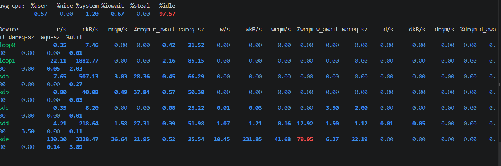
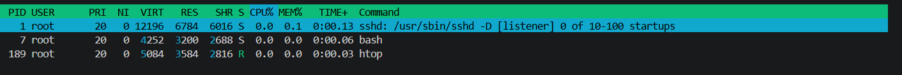
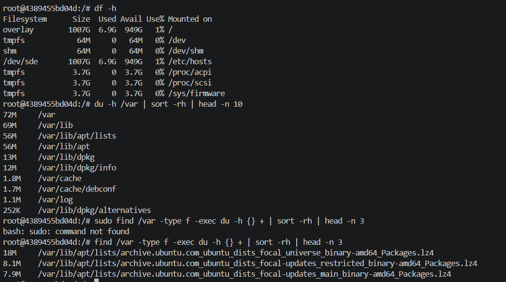
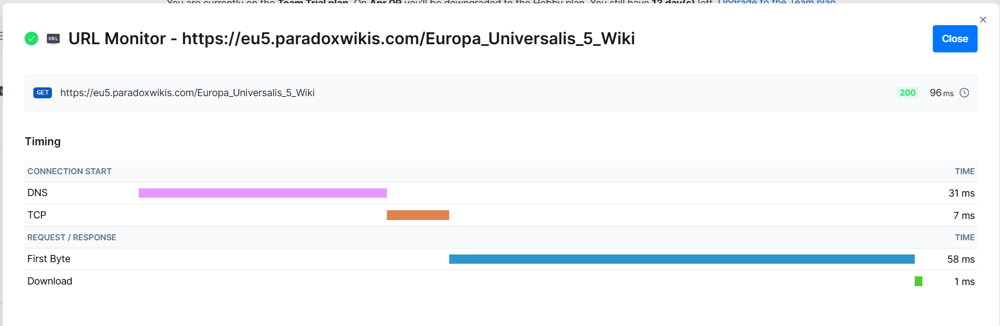
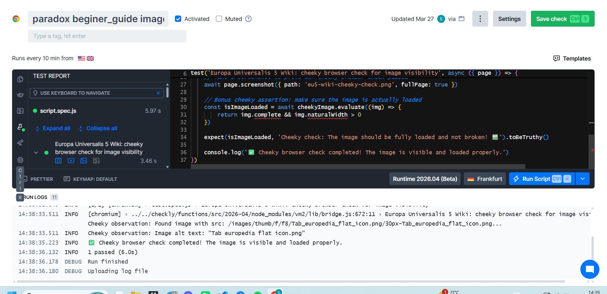
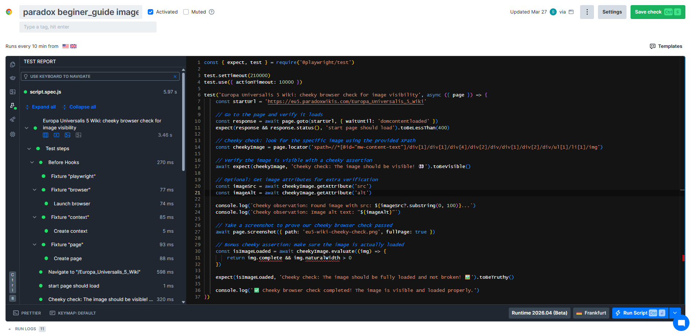
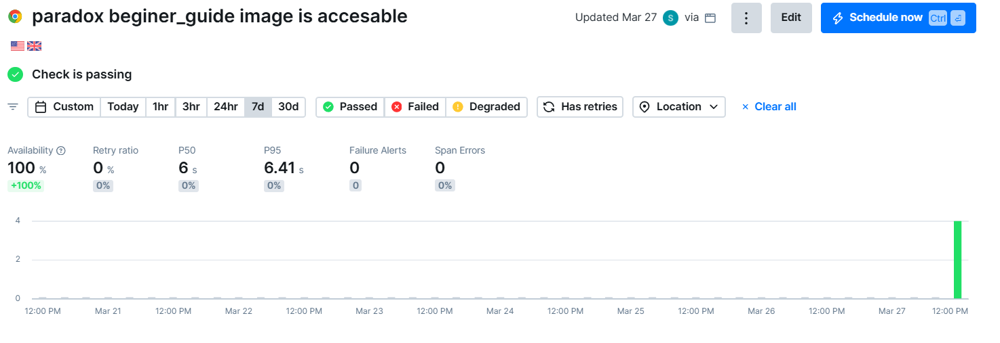
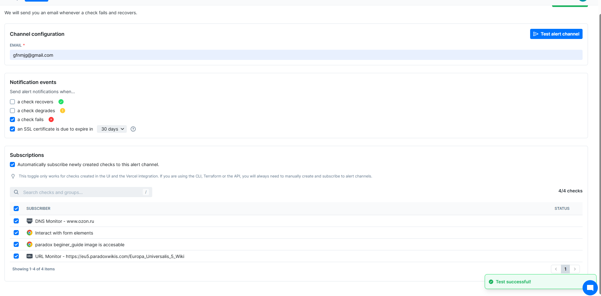

# Task 1
## Task 1.1
top 3 of i/o usage

top 3 of cpu and memory

## Task 1.2
largest files

## Analysis:
 CPU is mostly idle (97.57%), but disk I/O shows heavy reads on /dev/sde (130.30 reads/sec, 3.3 MB/s) with moderate I/O on other devices; memory is lightly used, and storage consumption is dominated by APT package lists under /var/lib/apt/lists.

## Reflection:
 Reduce disk I/O and reclaim space by cleaning unnecessary package lists with apt-get clean and apt-get autoclean, and consider limiting logging or moving /var to a less busy disk if I/O contention persists.

# Task 2
choosed url - https://eu5.paradoxwikis.com/Europa_Universalis_5_Wiki

API check:

URL: `https://eu5.paradoxwikis.com/Europa_Universalis_5_Wiki`
Assertion: status code `200`
Frequency: every 10 minutes

Browser checks:
- Start URL: `https://eu5.paradoxwikis.com/Europa_Universalis_5_Wiki`
- Validate XPath element is assable: '//*[@id="mw-content-text"]/div[1]/div[1]/div[4]/div[2]/div/div[1]/div[2]/div/ul[1]/li[1]/img`
- Click link and verify final URL: `https://eu5.paradoxwikis.com/Europa_Universalis_5_Wiki`
- Verify `Beginner's guide icon` visiable
- Timeout settings: `actionTimeout=10000ms`, test timeout `210000ms`

dashboard 

Alert checks
 Notification channel: Email (`gfnmjg@gmail.com`)
 Triggers: `a check fails`, `an SSL certificate is due to expire in 30 days`

API checks quickly confirm a service is up and responding.

Browser checks go a step further—they simulate actual user behavior, ensuring critical flows like navigation and interactions work as expected.

Failure alerts catch issues the moment they happen, while SSL-expiry notifications help you stay ahead of potential downtime by addressing certificate renewals before they become a problem.

    